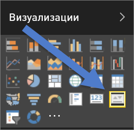
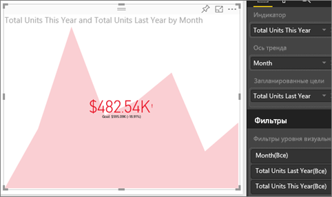

# Визуальные элементы КПЭ (руководство)
Ключевое показатель эффективности (КПЭ) — наглядный индикатор, который позволяет оценить достижение определенной измеримой цели. Дополнительные сведения о ключевых показателях эффективности см. в сети [Microsoft Developer Network](https://msdn.microsoft.com/library/hh272050).

## В каких случаях следует использовать КПЭ
КПЭ отлично подходят для следующих задач:

* оценка хода выполнения (по каким показателям вы опережаете график или отстаете от него);
* определение расстояния до цели (насколько далеко вы от поставленной цели или опережаете график).   

## Требования к визуальным элементам КПЭ
Ключевой показатель эффективности связан с определенной мерой и помогает определить текущее значение и состояние показателя в сравнении с заданной целью. Таким образом, для использования визуального элемента КПЭ необходима *базовая* мера, которая возвращает значение, *целевая* мера или значение, а также порог или цель.

> [!NOTE]
> В настоящее время набор данных КПЭ должен содержать значения целей для КПЭ. Если это не так, можно создать их, добавив лист Excel с целями в модель данных или PBIX-файл.
> 
> 

## Как создать КПЭ
Для выполнения этой процедуры войдите в Power BI и выберите **Получить данные > Примеры > Анализ розничной торговли — пример**. Мы создадим КПЭ, который помогает оценить достижение целевого объема продаж.

В следующем видео Уилл создает метрические визуализации: датчики, карты и КПЭ.

<iframe width="560" height="315" src="https://www.youtube.com/embed/xmja6EpqaO0?list=PL1N57mwBHtN0JFoKSR0n-tBkUJHeMP2cP" frameborder="0" allowfullscreen></iframe>

1. Выберите **Sales > Total Units This Year** (Продажи > Всего единиц за этот год).  Это будет наш индикатор.
2. Добавьте **Time > Month** (Время > Месяц).  Так будет выглядеть наш тренд.
3. ВАЖНО. Отсортируйте данные диаграммы по **месяцам**. Как только вы преобразуете визуализацию в ключевой показатель эффективности, возможность сортировки станет недоступна.
4. Преобразуйте визуальный элемент в КПЭ, выбрав значок КПЭ в области «Визуализация».
   
    
5. Добавьте цель. Добавьте объем продаж за прошлый год в качестве цели. Перетащите элемент **Total Units Last Year** (Всего единиц за прошлый год) в поле **Target goals** (Цели).
   
    
6. Вы также можете настроить формат КПЭ, щелкнув значок валика, чтобы открыть область форматирования.
   
   * **Индикатор**: управление единицами отображения индикатора и количеством знаков после запятой.
   * **Ось тренда**: если этот параметр **включен**, в качестве фона для визуального элемента КПЭ отображается ось тренда.  
   * **Цели**: если этот параметр **включен**, визуальный элемент отображает цель и расстояние от нее в виде процентного значения.
   * **Состояние**: некоторые КПЭ считаются *лучшими* для больших значений, а некоторые — для *малых*. Например, сравните объем прибыли с временем ожидания. Как правило, большая прибыль лучше большого времени ожидания (то есть чем больше время, тем хуже). С помощью этого переключателя можно выбрать режим использования КПЭ. По умолчанию **более высокое значение считается лучшим**.
7. Настроив КПЭ, [закрепите его на панели мониторинга](service-dashboard-pin-tile-from-report.md).

КПЭ также доступны на мобильных устройствах и позволяют вам постоянно контролировать состояние своих дел.

## Рекомендации и устранение неполадок
* Если ключевой показатель эффективности выглядит, как приведенный выше, возможно, требуется отсортировать данные по месяцам. Так как для ключевых показателей эффективности нет возможности сортировки, вам потребуется отсортировать данные по месяцам *перед* тем, как преобразовать визуализацию в ключевой показатель эффективности.

## Дальнейшие действия
[Отчеты в Power BI](service-reports.md)

[Визуализации в отчетах Power BI](power-bi-report-visualizations.md)

[Power BI — основные понятия](service-basic-concepts.md)

Появились дополнительные вопросы? [Ответы на них см. в сообществе Power BI.](http://community.powerbi.com/)

