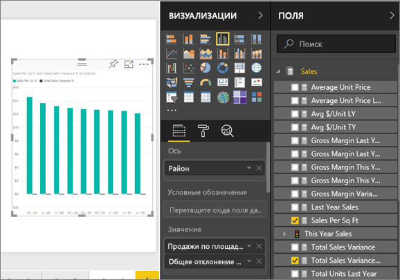
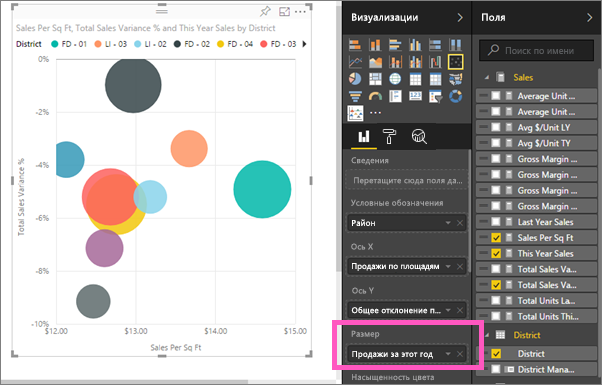
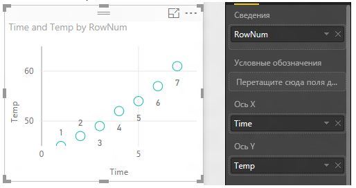
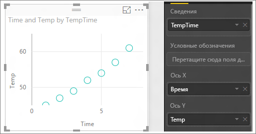

# Точечные и пузырьковые диаграммы в Power BI (руководство)
Точечная диаграмма всегда включает две оси значений: вдоль горизонтальной оси отображается один набор числовых данных, а вдоль вертикальной — другой. На диаграмме отображаются точки пересечения числовых значений X и Y, объединяя их в отдельные точки данных. Точки данных могут распределяться вдоль горизонтальной оси равномерно или неравномерно в зависимости от данных.

В пузырьковой диаграмме точки данных заменяются пузырьками, *размер* которых представляет собой дополнительное измерение данных.

## Выбор точечной или пузырьковой диаграммы
### Точечную диаграмму следует использовать:
* для демонстрации отношений между двумя (точечная диаграмма) или тремя (пузырьковая диаграмма) **числовыми** значениями;
* для отображения на диаграмме двух групп чисел как одной серии координат XY;
* вместо графика, если вам нужно изменить масштаб горизонтальной оси;    
* для включения горизонтальной оси в логарифмическую шкалу;
* для отображения данных листа, содержащих пары или сгруппированные наборы значений. На точечной диаграмме можно изменять масштабы осей и, таким образом, открывать дополнительную информацию о сгруппированных значениях;
* для отображения повторяющихся комбинаций в больших наборах данных, например в виде линейных или нелинейных тенденций, кластеров и выбросов;
* для сравнения большого количества точек данных без учета времени. Чем больше данных включено в точечную диаграмму, тем более точным будет сравнение.

### Пузырьковую диаграмму следует использовать:
* если данные имеют три временных ряда, каждый из которых содержит набор значений;
* для представления финансовых данных.  Разный размер пузырьков привлекает внимание к определенным значениям;
* для использования с квадрантами.

## Создание точечной диаграммы
Просмотрите это видео, в котором Уилл создает точечную диаграмму, а затем выполните следующие действия, чтобы создать ее.

<iframe width="560" height="315" src="https://www.youtube.com/embed/PVcfPoVE3Ys?list=PL1N57mwBHtN0JFoKSR0n-tBkUJHeMP2cP" frameborder="0" allowfullscreen></iframe>

Здесь используется пример "Анализ розничной торговли". Чтобы продолжить работу, [скачайте пример](sample-datasets.md) для службы Power BI (app.powerbi.com) или Power BI Desktop.   

1. Откройте [пустую страницу отчета](power-bi-report-add-page.md) и выберите поля **Продажи**\>**Продажи на квадратный метр** и **Продажи** > **Общий процент расхождения продаж**. Если вы используете службу Power BI, нужно открыть отчет в [режиме правки](service-interact-with-a-report-in-editing-view.md).
 
2. В области "Поля" выберите **District > District** (Округ > Округ).
   
    
4. Преобразуйте данные в точечную диаграмму. На панели «Визуализации» щелкните значок точечной диаграммы.
   .
5. Перетащите поле **District** (Округ) из раздела **Сведения** в раздел **Условные обозначения**.
   
    

Мы получили точечную диаграмму, которая содержит общий процент расхождения продаж по оси Y, а продажи на кв. фут — вдоль оси X.  Цвета точек данных указывают на регионы.  Теперь добавим третье измерение.

## Создание пузырьковой диаграммы
1. В области "Поля" перетащите **Sales** > **This Year Sales** > **Value** (Продажи > Продажи за этот год > Значение) в область **Размер**. 
   
   
2. Наведите указатель мыши на пузырек.  Размер пузырька отражает значение параметра **Продажи за этот год**.
   
    
3. При необходимости [отформатируйте цвета визуализации, метки, заголовки, фон и другие параметры](service-getting-started-with-color-formatting-and-axis-properties.md).

## Рекомендации и устранение неполадок
### **Точечная диаграмма содержит только одну точку данных**
Ваша точечная диаграмма содержит только одну точку данных, представляющую сумму всех значений на осях X и Y?  А может быть, эта точка представляет собой сумму всех значений только по горизонтальной или по вертикальной оси?

Добавьте поле в область **Сведения** , чтобы сообщить Power BI, каким образом нужно группировать значения. Поле должно быть уникальным для каждой точки, которую нужно отобразить.  
Это может быть просто номер строки или поле идентификатора.

Если ваши данные не содержат таких значений, создайте поле, которое объединяет значения X и Y в уникальный атрибут точки:

Для создания нового поля [используйте редактор запросов Power BI Desktop, чтобы добавить столбец индекса](desktop-add-custom-column.md) в свой набор данных.  Затем добавьте этот столбец в область **Сведения** визуализации.

## Дальнейшие действия
 [Типы визуализаций в Power BI](power-bi-visualization-types-for-reports-and-q-and-a.md)

[Бесплатная пробная версия](https://powerbi.com/)  

Появились дополнительные вопросы? [Ответы на них см. в сообществе Power BI.](http://community.powerbi.com/)

