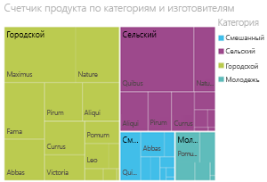
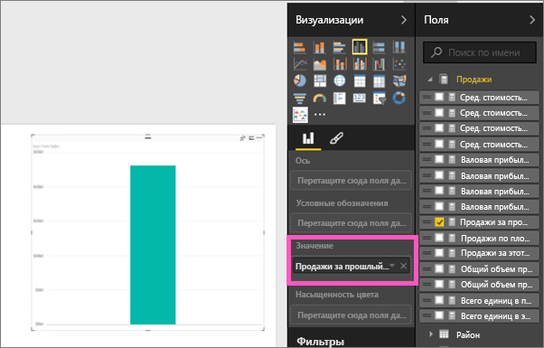
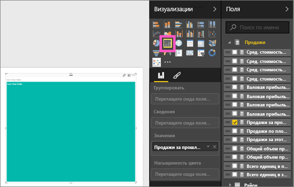
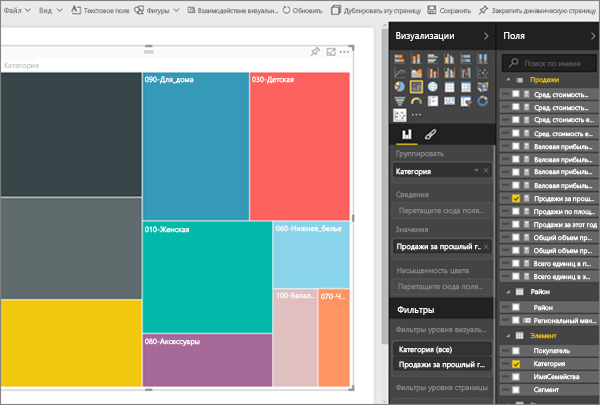
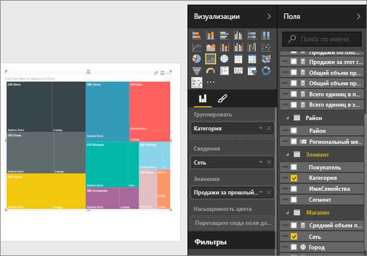
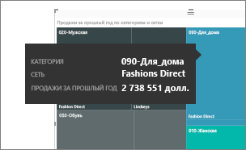
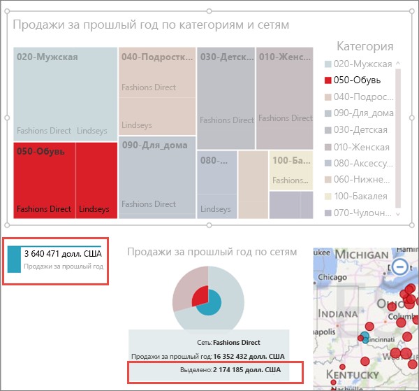

# Диаграммы дерева в Power BI (руководство)
Диаграмма дерево отображает иерархические данные в виде набора вложенных прямоугольников.  Каждый уровень иерархии представлен цветным прямоугольником (часто называемом ветвью), который содержит другие прямоугольники (листья).  Пространство внутри каждого прямоугольника выделяется на основе измеряемого количественного значения. Прямоугольники упорядочиваются по размеру: от верхнего левого (самый большой) до нижнего правого (самый маленький).

Например, при анализе продаж будут создаваться прямоугольники верхнего уровня (ветви) для категорий одежды: **городской стиль**, **деревенский стиль**, **молодежный стиль**и **смешанный стиль**.  Прямоугольники категорий будут содержать прямоугольники меньшего размера (листья) для производителей одежды в рамках категорий, а размер и заливка этих мелких прямоугольников будут основываться на объемах продаж.  В ветви **Urban** (городской стиль) продано много одежды Maximus, меньше Natura и Fama и очень мало Leo.  Таким образом, ветвь **городского стиля** древовидной диаграммы будет содержать самый большой прямоугольник для Maximus (в верхнем левом углу), чуть меньшие прямоугольники для Natura и Fama, много других прямоугольников, представляющих прочие категории, и маленький прямоугольник для Leo.  Итак, мы можем сравнить количество проданных товаров в разных группах, сравнив размер и заливку каждого листового узла: чем больше размер прямоугольника и темнее заливка, тем больше значение.

## Сферы применения диаграмм дерева
Диаграмма дерево отлично подходит:

* для отображения больших объемов иерархических данных;
* когда линейчатая диаграмма не может эффективно обрабатывать большое количество значений;
* для отображения пропорций между каждой частью и целым;
* для отображения шаблонов распределения показателя на каждом уровне категорий в иерархии;
* для отображения атрибутов путем кодирования по размеру и цвету;
* для выделения шаблонов, выпадающих показателей, наиболее важных участников и исключений.

## Создание простой диаграммы дерева
Хотите сначала посмотреть демонстрацию создания диаграммы дерева?  Перейдите к отметке 2:10 в этом видео, чтобы посмотреть, как Аманда создает диаграмму дерева.

<iframe width="560" height="315" src="https://www.youtube.com/embed/IkJda4O7oGs" frameborder="0" allowfullscreen></iframe>

Или создайте собственную диаграмму. Здесь используется пример "Анализ розничной торговли". Для дальнейшей работы [загрузите пример](sample-datasets.md), войдите в Power BI и нажмите **Получить данные \> Книга Excel \> Подключить \> Retail Analysis Sample**.**xlsx**.

1. Запустите [представление редактирования](service-interact-with-a-report-in-editing-view.md) и выберите **Продажи** > **Продажи за последний год**.   
   
2. Преобразуйте диаграмму в диаграмму дерева.  
   
3. Перетащите поле **Item** > **Category** (Элемент > Категория) в область **Группа**. Power BI создаст диаграмму дерева, в которой размер прямоугольников отражает общий объем продаж, а цвет представляет категорию.  По существу, вы создали иерархию, которая визуально описывает относительный размер общего объема продаж по категориям.  Категория мужской одежды **Mens** имеет самый большой объем продаж, а категория трикотажа **Hosiery** — самый маленький.
   
4. Перетащите поле **Store** > **Chain** (Магазин > Сеть) в область **Сведения**, чтобы завершить создание диаграммы. Теперь можно сравнить продажи за прошлый год по категориям и сетям магазинов.   
   
   
   > [!NOTE]
   > Параметры "Насыщенность цвета" и "Сведения" невозможно использовать одновременно.
   > 
   > 
5. Наведите указатель на заголовок **Chain** (Сеть магазинов), чтобы увидеть подсказку для этой части области **Category**(Категория).  Например, при наведении указателя на **Lindseys** в категории **040-Juniors** в прямоугольнике отображается всплывающая подсказка для части Lindsey категории одежды для подростков.  
   
6. [Добавьте диаграмму дерева как плитку на панель мониторинга (закрепите визуальный элемент)](service-dashboard-tiles.md). 
7. [Сохраните отчет](service-report-save.md).

## Выделение и перекрестная фильтрация
Сведения об использовании области "Фильтры" см. в разделе [Добавление фильтра в отчет](power-bi-report-add-filter.md).

Теперь можно выделить категорию или сведения в диаграмме дерева для перекрестного выделения и фильтрации других визуализаций на странице отчета (и наоборот). Теперь можно добавить еще несколько визуальных элементов на ту же страницу либо скопировать и вставить диаграмму дерева на страницу, на которой уже есть другие элементы.

1. На диаграмме дерева выберите категорию или сеть магазинов в категории.  Это приведет к перекрестному выделению других визуализаций на странице. Например, при выборе категории **050-Shoes**(050-обувь) станет ясно, что продажи за последний год в категории "Обувь" составили 3 640 471 долл., а доля Fashions Direct составила 2 174 185 долл.  
   
2. В круговой диаграмме **Last Year Sales by Chain** (Продажи за прошлый год по сети магазинов) выберите сектор **Fashions Direct** .  
   
3. Сведения о том, как настроить параметры перекрестного выделения и фильтрации диаграмм, см. в статье [Visualization interactions in a Power BI report](service-reports-visual-interactions.md) (Взаимодействия визуализаций в отчете Power BI).

## Дальнейшие действия
[Отчеты в Power BI](service-reports.md)  
[Добавление визуализации в отчет](power-bi-report-add-visualizations-i.md)  
[Типы визуализации в Power BI](power-bi-visualization-types-for-reports-and-q-and-a.md)
[ Закрепление визуализации на панели мониторинга](service-dashboard-pin-tile-from-report.md)  
[Power BI — основные понятия](service-basic-concepts.md)  
[Бесплатная пробная версия](https://powerbi.com/)

Появились дополнительные вопросы? [Ответы на них см. в сообществе Power BI.](http://community.powerbi.com/)  

