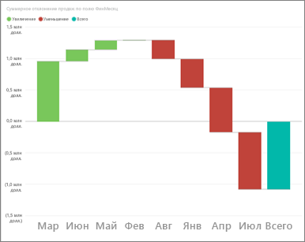
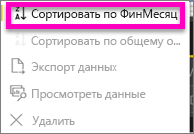
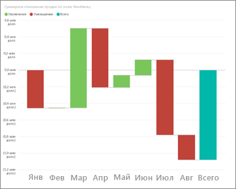
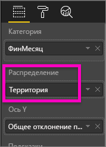
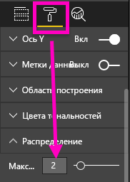
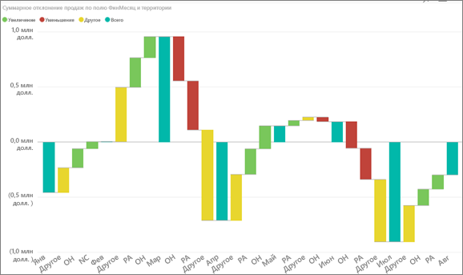

# Каскадные диаграммы в Power BI
Каскадные диаграммы показывают промежуточный итог по мере сложения или вычитания значений. Это удобно для понимания того, как ряд положительных и отрицательных изменений влияет на начальное значение (например, на чистую прибыль).

Столбцы закодированы цветом, поэтому можно быстро определить, увеличивается ли значение или уменьшается. Столбцы начального и конечного значения часто [начинаются на горизонтальной оси](https://support.office.com/article/Create-a-waterfall-chart-in-Office-2016-for-Windows-8de1ece4-ff21-4d37-acd7-546f5527f185#BKMK_Float "начинаются на горизонтальной оси"), тогда как промежуточные значения представлены плавающими столбцами. Из-за такого внешнего вида каскадные диаграммы также называют "мостами".

<iframe width="560" height="315" src="https://www.youtube.com/embed/qKRZPBnaUXM" frameborder="0" allow="autoplay; encrypted-media" allowfullscreen></iframe>

## Сферы применения каскадной диаграммы
Каскадная диаграмма отлично подходит:

* при наличии изменений для показателя по временным рядам или разным категориям;
* для отслеживания основных изменений, влияющих на общее значение;
* для построения графика годовой прибыли компании путем отображения различных источников дохода и достижения общей прибыли (или убытков);
* для демонстрации начального и конечного количества сотрудников компании за год;
* для визуализации поступлений и затрат по месяцам и текущего баланса для вашего счета. 

## Создание каскадной диаграммы
Мы создадим каскадную диаграмму, отображающую расхождение в объемах продаж (оценочный и фактический объем продаж) по месяцам. Для выполнения этой процедуры войдите в Power BI и выберите **Получить данные \> Примеры \> Анализ розничной торговли — пример**. 

1. Выберите вкладку **Наборы данных** и прокрутите страницу до нового набора данных "Анализ розничной торговли — пример".  Щелкните значок **Создать отчет**, чтобы открыть набор данных в режиме правки отчета. 
   
    
2. В области **Поля** выберите **Sales \> Total Sales Variance** (Продажи > Суммарное отклонение продаж). Если **суммарное отклонение продаж** не находится на **оси Y** , перетащите его туда.
3. Преобразуйте диаграмму в **каскадную**. 
   
    
4. Выберите **Time** (Время) \> **Month** (Месяц), чтобы добавить время в качестве **категории**. 
   
    
5. Отсортируйте данные на каскадной диаграмме в хронологическом порядке. В правом верхнем углу диаграммы щелкните многоточие (…) и выберите **ФинМесяц**.
   
    
   
    
6. Подробно изучите данные, чтобы увидеть, что больше всего влияет на изменения по месяцам. Перетащите **Магазин** > **Территория** в контейнер **Распределение**.
   
    
7. По умолчанию в Power BI добавлены 5 факторов, влияющих на увеличение или уменьшение объема продаж по месяцам. Но нам нужно добавить только 2 основных влияющих фактора.  На панели форматирования выберите **Распределение** и задайте для элемента **Максимум** значение "2".
   
    
   
    В кратком обзоре показано, что территории штатов Огайо и Пенсильвания больше всего влияют на положительные и отрицательные изменения на каскадной диаграмме. 
   
    
8. Это интересное открытие. Действительно ли территории Огайо и Пенсильвании значительно влияют на результат, потому что на них объем продаж гораздо больше, чем на других?  Давайте проверим. Создайте карту для отслеживания продаж по территориям.  
   
    
   
    На карте наши предположения подтверждаются.  На ней показано, что на этих двух территориях наибольшее значение продаж за прошлый год (размер пузырьков) и текущий год (заливка пузырьков).

## Выделение и перекрестная фильтрация
Сведения об использовании области "Фильтры" см. в разделе [Добавление фильтра в отчет](power-bi-report-add-filter.md).

Вы можете выделить столбец в каскадной диаграмме для перекрестной фильтрации других визуализаций на странице отчета (и наоборот). При этом столбец итогов не запускает выделение и не реагирует на перекрестную фильтрацию.

## Дальнейшие действия
[Отчеты в Power BI](service-reports.md)

[Типы визуализаций в Power BI](power-bi-visualization-types-for-reports-and-q-and-a.md)

[Визуализации в отчетах Power BI](power-bi-report-visualizations.md)

[Power BI — основные понятия](service-basic-concepts.md)

Появились дополнительные вопросы? [Ответы на них см. в сообществе Power BI.](http://community.powerbi.com/)

