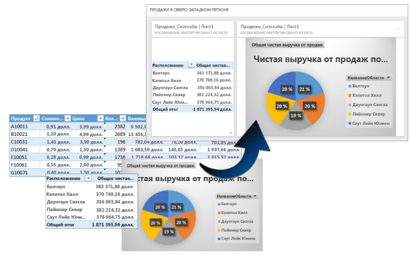
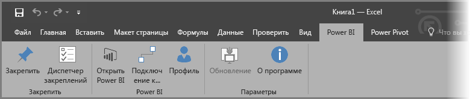
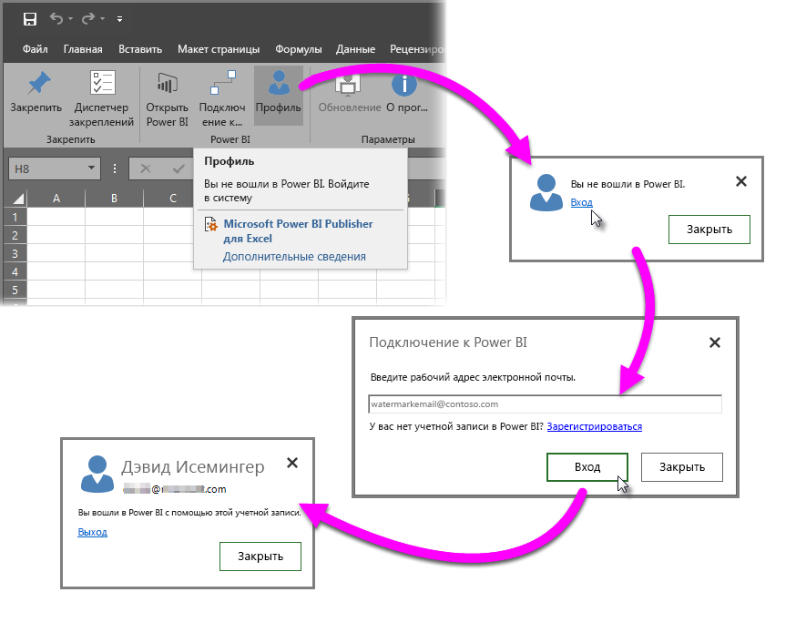
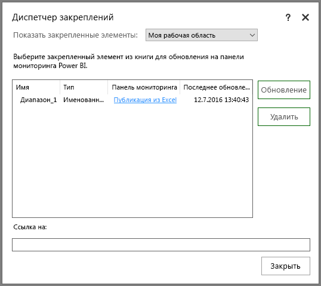
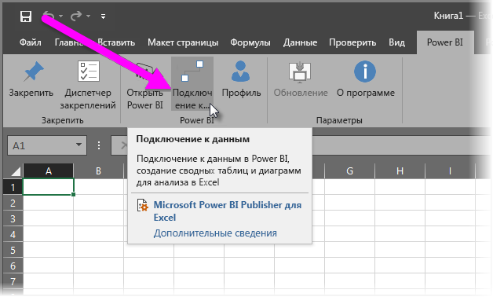
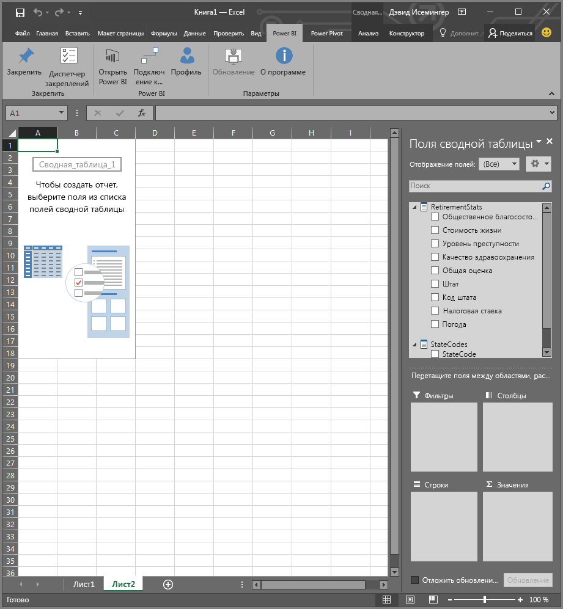

# Издатель Power BI для Excel
С приложением **Power BI Publisher для Excel**вы можете делать моментальные снимки самых важных аналитических данных в Excel, например сводных таблиц, диаграмм и диапазонов, и закреплять их на панелях мониторинга в Power BI.

Что можно закрепить? Практически все, что есть на листе Excel. Вы можете выбрать диапазон ячеек из простого листа или таблицы, сводную таблицу или диаграмму, иллюстрации и изображения, текст.

Что невозможно закрепить: нельзя закреплять трехмерные карты и визуализации на листах Power View. Существуют некоторые элементы, которые можно закрепить, например фильтр среза или временную шкалу, но это не имеет смысла.

При закреплении элемента из Excel новая плитка добавляется на новую или существующую панель мониторинга в Power BI. Новая плитка является моментальным снимком, поэтому она не будет динамической, но вы все равно можете обновить ее. Например, при внесении изменения в сводную таблицу или диаграмму, которую вы уже закрепляли, плитка панели мониторинга в Power BI не обновляется автоматически, но вы можете обновить закрепленные элементы, используя **диспетчер закреплений**. Дополнительные сведения о **диспетчере закреплений** см. в следующих разделах.

## Скачивание и установка
Power BI Publisher для Excel — это надстройка, которую можно скачать и установить в классических приложениях Microsoft Excel 2007 и более поздней версии.

[Скачать Power BI Publisher для Excel](http://go.microsoft.com/fwlink/?LinkId=715729)

После установки издателя вы увидите новую ленту **Power BI** в Excel, на которой можно входить в Power BI и выходить из этой службы, закреплять элементы на панели мониторинга и управлять уже закрепленными элементами.

Надстройка **Power BI Publisher для Excel** включена по умолчанию, но если по какой-то причине вы не видите ленту Power BI в Excel, то вам потребуется включить ее. Щелкните **Файл** > **Параметры** > **Надстройки** > **Надстройки COM**. Выберите **Microsoft Power BI Publisher для Excel**.

## Закрепление диапазона данных на панели мониторинга
Вы можете выбрать на листе любой диапазон ячеек и закрепить моментальный снимок на любом количестве существующих или новых панелей мониторинга в Power BI. Один моментальный снимок также можно закрепить на нескольких панелях.

Для начала необходимо войти в Power BI.

1. На вкладке ленты **Power BI** в Excel выберите **Профиль**. Если вы уже вошли в Power BI, вы увидите диалоговое окно, в котором будет указана учетная запись, с которой выполнен вход. Если это так учетная запись, которая вам нужна, вы можете сразу перейти к инструкциям по закреплению диапазона ячеек. Если вы хотите воспользоваться другой учетной записью Power BI, выберите *Выйти*. Если вы еще не вошли в систему, переходите к следующему шагу (2).
   
   
2. Если вы еще не вошли в систему, щелкните ссылку **Войти**, которая появляется при выборе элемента **Профиль** на вкладке ленты **Power BI** в Excel. Затем в диалоговом окне **Подключение к Power BI** введите адрес электронной почты учетной записи, с которой вы хотите войти, и нажмите **Войти**.
   
   

После входа вы можете закрепить диапазон данных на панели мониторинга с помощью приведенных ниже инструкций.

1. В Excel откройте вкладку ленты **Power BI**, на которой расположена кнопка **Закрепить**.
2. Выделите диапазон ячеек в книге Excel.
3. Нажмите кнопку **Закрепить** на ленте **Power BI**. Откроется диалоговое окно **Закрепление на панели мониторинга**. Если вы еще не вошли в Power BI, вам будет предложено это сделать. Выберите **рабочую область** из соответствующего раскрывающегося списка. Если вы хотите закрепить диапазон на собственной информационной панели, у вас должен быть выбран элемент **Моя рабочая область**. Чтобы закрепить диапазон на панели мониторинга в рабочей области группы, выберите группу из раскрывающегося списка.
4. Выберите, хотите ли вы закрепить диапазон на *существующей панели мониторинга* или создать *новую*.
5. Нажмите кнопку **ОК**, чтобы закрепить выбранный диапазон на панели.
6. В диалоговом окне **Закрепление на панели мониторинга** выберите существующую в рабочей области панель или создайте новую, а затем нажмите кнопку **ОК**.
   
   

## Закрепление диаграммы на панели мониторинга
Просто выберите диаграмму, а затем щелкните "Закрепить ".

## Управление закрепленными элементами
С помощью **диспетчера закрепления** можно обновить связанную плитку закрепленного элемента в Power BI. Кроме того, вы можете отменить закрепление элементов, которые вы уже закрепили на панелях мониторинга в Power BI.

Для обновления плиток на панели мониторинга выберите в **диспетчере закреплений**один элемент или несколько, а затем щелкните **Обновить**.

Чтобы удалить сопоставление между закрепленным элементом в Excel и связанной плиткой на панели мониторинга, щелкните **Удалить**. Щелкнув **Удалить**, вы *не* удаляете элемент с листа в Excel и не удаляете связанную плитку на панели мониторинга. Вы удаляете только закрепление (*сопоставление* между ними). В результате элемент просто больше не будет отображаться в **диспетчере закреплений**. При повторном закреплении элемента он отобразится в виде новой плитки.

Чтобы удалить закрепленный элемент (плитку) с панели мониторинга, потребуется сделать это в Power BI. На плитке, которую вы хотите удалить, щелкните значок **Открыть меню** , а затем выберите **Удалить плитку** .

## Подключение к данным в Power BI
Начиная с выпуска надстройки **Power BI Publisher для Excel** за июль 2016 г. (включая текущий выпуск, ссылка на который приведена выше) вы можете подключаться к данным непосредственно в службе Power BI и анализировать их в Excel с помощью сводных таблиц и диаграмм. Благодаря этому вы можете использовать Power BI и Excel в сочетании для анализа самых важных данных.

Ниже перечислены добавленные улучшения.

* Все драйверы, необходимые для подключения к данным в Power BI, автоматически обновляются с каждым выпуском: вам не придется устанавливать и обновлять их самостоятельно.
* Вам больше не придется скачивать ODC-файлы для создания подключений: надстройка **Power BI Publisher для Excel** автоматически устанавливает подключения, когда вы выбираете тот или иной отчет или набор данных.
* Теперь можно создавать несколько подключений и сводных таблиц в одной книге.
* Сообщения об ошибках улучшены и теперь содержат информацию, связанную именно с **Power BI Publisher для Excel** (раньше использовались сообщения Excel по умолчанию).

### Порядок подключения к данным Power BI в Excel
Чтобы подключиться к данным Power BI с помощью надстройки **Power BI Publisher для Excel**, воспользуйтесь этими простыми инструкциями.

1. Войдите в Power BI. Инструкции по входу (или смене учетной записи) см. выше в этой статье.
2. После входа в Power BI с требуемой учетной записью выберите на вкладке ленты **Power BI** в Excel команду **Подключиться к данным**.
   
   
3. Excel подключается к Power BI по протоколу HTTPS и открывает диалоговое окно **Подключение к данным в Power BI**, в котором можно указать *рабочую область*, содержащую данные (п. 1 на изображении ниже), *тип данных*, к которым вы подключаетесь, указать, к чему именно (**отчету** или **набору данных** нужно подключиться (2), а также выбрать *доступный отчет или набор* из раскрывающегося списка (3).
   
   
4. После того как вы настроите нужные параметры и выберите **Подключиться** в диалоговом окне **Подключение к данным в Power BI**, Excel подготовит сводную таблицу и отобразит область **Поля сводной таблицы**, в которой можно выбрать нужные поля из подключенных данных Power BI и создать таблицы или диаграммы для анализа данных.
   
   

Если у вас нет данных в Power BI, Excel обнаружит это и предложит создать набор-образец, к которому можно подключиться, чтобы испытать соответствующие функции в действии.

При работе с этим выпуском **Power BI Publisher для Excel** следует помнить о ряде моментов.

* **Общие данные.** Данные, к которым вам предоставлен доступ, но которые не видны вам непосредственно в Power BI, недоступны в интерфейсе **подключения к данным**.
* **Локальные службы SSAS.** Если выбранный вами набор данных находится в локальных службах SQL Server Analysis Services (SSAS), а набор данных в Power BI использует для обращения к информации DirectQuery, надстройка **Power BI Publisher для Excel** подключается к этим данным через локальное сетевое соединение и *не* использует для этого Power BI. Таким образом, пользователь, пытающийся подключиться к таким наборам, должен быть подключен к локальной сети и обязан пройти проверку подлинности с помощью метода, используемого в экземпляре Analysis Services, в котором хранятся эти данные.
* **Требуемые драйверы** - **Power BI Publisher для Excel** автоматически устанавливает все драйверы, необходимые для работы. В их числе — драйвер Excel OLE DB для служб Analysis Services; если пользователь по какой-либо причине удалит его, установить подключение к данным Power BI не удастся.
* **Набор данных должен содержать меры.** Для набора данных должны быть определены меры, чтобы приложение Excel рассматривало их в качестве значений в сводных таблицах и правильно анализировало данные. См. дополнительные сведения о [мерах](desktop-measures.md).
* **Поддержка групп.** Наборы данных, к которым предоставлен доступ пользователям за пределами указанной группы, не поддерживаются, и к ним нельзя подключаться.
* **Бесплатная подписка и подписка Pro.** Действия, связанные с группами, не поддерживаются для пользователей бесплатной версии Power BI, и они не видят в собственной рабочей области наборы данных или отчеты, к которым предоставлен доступ группе.
* **Общие отчеты и наборы данных.** Подключение к отчетам и наборам данных, к которым вам предоставлен доступ, невозможно.
* **Использование таблиц вместо моделей данных.** Наборы данных, созданные путем импорта только таблиц (без модели данных) из Excel, пока не поддерживаются, и подключаться к ним нельзя.

Создав полезную диаграмму или другой визуальный элемент, например диапазон данных, вы можете легко закрепить его на панели мониторинга в Power BI, как описано выше в этой статье.

## Связанные статьи
Существует множество вариантов эффективного совместного использования приложения Excel и службы Power BI. Дополнительные сведения вы найдете в перечисленных ниже статьях.

* [Анализ в Excel](service-analyze-in-excel.md)
* [Устранение неполадок с анализом в Excel](desktop-troubleshooting-analyze-in-excel.md)

