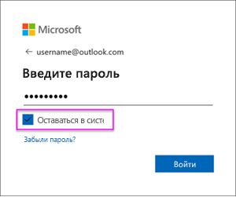

# Обновление набора данных, созданного из файла CSV в OneDrive или SharePoint Online
## Каковы преимущества?
При подключении к CSV-файлу, расположенному в OneDrive или SharePoint Online, в Power BI создается набор данных. Затем данные из CSV-файла импортируются в набор данных в Power BI. После этого Power BI автоматически подключается к файлу и обновляет все изменения, используя набор данных в Power BI. Если вы изменяете CSV-файл в OneDrive или SharePoint Online и сохраняете его, эти изменения будут отражены в Power BI, обычно в течение одного часа. Все визуализации в Power BI, основанные на этом наборе данных, также обновляются автоматически.

Если ваши файлы находятся в общей папке OneDrive для бизнеса или SharePoint Online, с одним и тем же файлом могут работать другие пользователи. После сохранения все внесенные изменения автоматически обновляются в Power BI, обычно в течение часа.

Многие организации запускают процессы, которые автоматически запрашивают данные из баз данных. Эти данные ежедневно сохраняются в виде CSV-файла. Если файл хранится в OneDrive или SharePoint Online и ежедневно перезаписывается, а не создается каждый день с другим именем, вы можете подключиться к этому файлу в Power BI. Набор данных, который подключается к файлу, будет синхронизирован вскоре после обновления файла в OneDrive или SharePoint Online. Все визуализации, основанные на этом наборе данных, также обновляются автоматически.

## Что поддерживается?
Файлы данных с разделителями-запятыми представляют собой простые текстовые файлы, поэтому подключения к внешним источникам данных и отчетам не поддерживаются. Вы не можете запланировать обновление набора данных, созданного из файла с разделителями-запятыми. Однако если файл находится в OneDrive или SharePoint Online, Power BI будет каждый час автоматически синхронизировать любые изменения в файле с набором данных.

## OneDrive или OneDrive для бизнеса. В чем разница?
При наличии личного OneDrive и OneDrive для бизнеса рекомендуется хранить все файлы, которые нужно подключить к Power BI, в OneDrive для бизнеса. И вот почему. Скорее всего, для доступа к этим хранилищам вы используете две учетные записи.

Подключение к OneDrive для бизнеса в Power BI обычно выполняется автоматически, поскольку чаще всего для входа в Power BI и в OneDrive для бизнеса используется одна и та же учетная запись. Однако в личное хранилище OneDrive вы, скорее всего, входите с помощью другой [учетной записи Майкрософт](http://www.microsoft.com/account/default.aspx).

При выполнении входа с использованием учетной записи Майкрософт обязательно установите флажок "Оставаться в системе". После этого Power BI сможет синхронизировать все обновления с наборами данных в Power BI.

При внесении изменений в CSV-файл в OneDrive, который не удается синхронизировать с набором данных в Power BI из-за изменения учетных данных вашей учетной записи Майкрософт, потребуется подключиться к файлу и снова импортировать его из своего личного хранилища OneDrive.

## Действия в случае возникновения проблем
Если данные в CSV-файле в OneDrive изменяются и эти изменения не отражаются в Power BI, скорее всего, Power BI не удается подключиться к OneDrive. Попробуйте подключиться к файлу и повторить его импорт. Если отображается запрос на вход, обязательно установите флажок **Оставаться в системе**.

## Дальнейшие действия
[Средства для устранения неполадок при обновлении](service-gateway-onprem-tshoot.md)
[Устранение неполадок в сценариях обновления](refresh-troubleshooting-refresh-scenarios.md)

Появились дополнительные вопросы? [Попробуйте задать вопрос в сообществе Power BI.](https://community.powerbi.com/)

