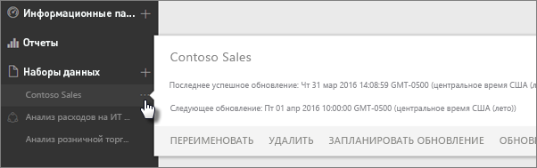
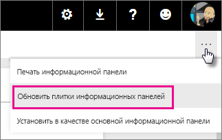
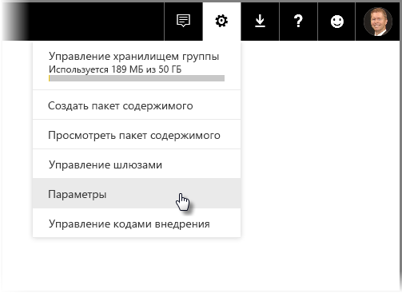

# Обновление данных в Power BI
Часто для принятия правильных решений крайне важно располагать актуальными данными. Возможно, вы уже использовали функцию «Получить данные» в Power BI для подключения к данным и их передачи, создали несколько отчетов и панель мониторинга. Теперь необходимо убедиться, что вы используете наиболее актуальные и ценные данные.

Во многих случаях вам вообще не нужно ничего делать. Некоторые данные, например пакет содержимого Salesforce или Marketo, обновляются автоматически. Если для подключения используется активное подключение или DirectQuery, данные будут обновлены до даты. Однако в других случаях, например, при работе с книгой Excel или файлом Power BI Desktop, подключающимся к внешнему источнику данных в сети или локальному источнику данных, вам потребуется осуществлять обновление вручную или настроить расписание обновления, чтобы система Power BI самостоятельно обновляла данные в отчетах и информационных панелях.

Данная и несколько других статей помогут вам понять, как именно работает обновление данных в Power BI, требуется ли настроить расписание обновления и что именно необходимо для успешного обновления данных.

## Общие сведения об обновлении данных
Перед настройкой обновления, важно понимать, что именно вы обновляете и откуда получаете данные.

*Источник данных* — это то место, откуда поступают данные, которые вы анализируете в отчетах и на информационных панелях, например, веб-служба, такая как Google Analytics или QuickBooks, база данных в облаке, такая как База данных SQL Azure, а также база данных или файл на локальном компьютере или сервере в вашей организации. Все это источники данных. Тип источника данных определяет способ обновления данных из него. Мы рассмотрим обновление для каждого типа источника данных в разделе [Что можно обновить?](#what-can-be-refreshed) немного позже.

*Набор данных* автоматически создается в Power BI при использовании операции получения данных для подключения к пакету содержимого, файлу и передачи данных из него или при подключении к источнику динамических данных. В Power BI Desktop и Excel 2016 можно также опубликовать файл прямо в службе Power BI, что аналогично операции "Получение данных".

В каждом случае создается набор данных, который отображается в области "Моя рабочая область" или группе, т. е. в контейнере в службе Power BI. Если щелкнуть **многоточие (…)** для набора данных, можно просмотреть данные в отчете, изменить параметры и настроить обновление.

Набор данных может получать данные из одного или нескольких источников данных. Например, можно использовать Power BI Desktop для получения данных из базы данных SQL в вашей организации и получить другие данные из веб-канала OData. Затем при публикации файла Power BI создается один набор данных, однако он будет содержать источники данных как для базы данных SQL, так и для канала OData.

Набор данных содержит сведения об источниках данных, учетные данные источников данных, а в большинстве случаев и подмножество данных, скопированных из источника данных. При создании визуализаций в отчетах и информационных панелях вы просматриваете данные в наборе данных, а в случае активного подключения, например, к базе данных SQL Azure, набор данных определяет данные, которые вы просматриваете непосредственно из источника данных. При активном подключении к службам Analysis Services определение набора данных поступает непосредственно из служб Analysis Services.

> *При обновлении данные обновляются в наборе данных, сохраненном в Power BI из источника данных. Это обновление полное, а не добавочное.*
> 
> 

Когда вы обновляете данные в наборе данных с помощью команды «Обновить сейчас» или задания расписания обновления, Power BI использует сведения этого набора данных для подключения к определенным для него источникам данных, запроса обновленных данных, а затем загружает обновленные данные в набор данных. Все визуализации в отчетах или панелях мониторинга основаны на данных, которые обновляются автоматически.

Прежде чем мы продолжим, важно понять следующее.

> *Независимо от того, насколько часто обновляется набор данных или просматриваются динамические данные, сначала обновляться должны данные в источнике данных.*
> 
> 

В большинстве организаций обработка данных осуществляется один раз в день, обычно вечером. Если вы планируете обновление для набора данных, созданного из файла Power BI Desktop, который подключается к локальной базе данных, а ваш ИТ-отдел выполняет обработку этой базы данных SQL один раз за вечер, то достаточно настроить запуск запланированного обновления один раз в день. Например, после обработки данных в базе данных, но перед тем, как вы приступаете к работе. Конечно же, такая ситуация имеет место далеко не всегда. Power BI предоставляет множество способов подключения к источникам данных, которые обновляются довольно часто или даже в режиме реального времени.

## Типы обновления
Существуют четыре основных типа обновления в Power BI. Обновление пакета, обновление данных или модели, обновление плитки и обновление контейнера визуальных элементов.

### Обновление пакета
При таком обновлении синхронизируется файл Power BI Desktop или Excel между службой Power BI и OneDrive или SharePoint Online. При этом из исходного источника данных данные не извлекаются. Набор данных в Power BI будет обновлен только содержимым файла в OneDrive или SharePoint Online.

### Обновление данных или модели
Так называется обновление набора данных в службе Power BI данными из исходного источника данных. Это делается с помощью запланированного обновления или функции "Обновить сейчас". Для такого обновления необходим шлюз для локальных источников данных.

### Обновление плитки
При такой операции обновляется кэш визуальных элементов плитки на информационной панели, когда данные изменяются. Это происходит примерно каждые пятнадцать минут. Можно также принудительно обновить плитку, щелкнув **многоточие (…)** в правом верхнем углу панели мониторинга и выбрав **Обновить плитки панелей мониторинга**.

Дополнительные сведения о распространенных ошибках обновления плитки см. в разделе [Устранение неполадок с плитками](refresh-troubleshooting-tile-errors.md).

### Обновление контейнера визуальных элементов
При такой операции обновляются сохраненные в кэше визуальные элементы, расположенные в отчете, после изменения данных.

## Что можно обновить?
В Power BI операция "Получение данных" обычно используется для импорта данных из файла, хранящегося на локальном диске, в OneDrive или SharePoint Online, публикации отчета из Power BI Desktop или прямого подключения к базе данных в облаке или в вашей организации. В Power BI можно обновить практически любые данные, однако потребность в таком обновлении зависит от того, как был создан набор данных и к каким источникам данных он подключается. Рассмотрим каждый из вариантов обновления данных.

Но прежде чем продолжить, следует рассмотреть несколько важных определений.

**Автоматическое обновление**  — это означает, что регулярное обновление набора данных может осуществляться без задания пользовательской конфигурации. Параметры обновления данных автоматически настраиваются системой Power BI. Для поставщиков интернет-служб обновление обычно выполняется один раз в день. Для файлов, загруженных из OneDrive, автоматическое обновление осуществляется примерно каждый час для данных, поступающих не из внешнего источника данных. Хотя можно настроить различные параметры для расписания обновления и выполнять обновление вручную, вам это может и не потребоваться.

**Настроенное пользователем ручное или запланированное обновление** — это значит, что вы можете вручную обновить команды «Обновить сейчас» или настроить расписание обновления с помощью расписания обновления в параметрах набора данных. Такой тип обновления необходим для файлов Power BI Desktop и книг Excel, которые подключаются к внешним источникам данных в сети или локальным источникам данных.

> [!NOTE]
> После настройки времени запланированного обновления быть задержка обновления. Задержка может продлиться до одного часа.
> 
> 

**Активное подключение или подключение DirectQuery** — это означает наличие активного подключения между Power BI и источником данных. Для локальных источников данных администраторам потребуется настроить в корпоративном шлюзе источник данных, но взаимодействие с пользователем может не требоваться.

> [!NOTE]
> Для повышения производительности панели мониторинга с данными, подключенными с помощью DirectQuery, обновляются автоматически. Вы можете также вручную обновить плитку в любое время с помощью меню **Больше** на плитке.
> 
> 

## Локальные файлы и файлы в OneDrive или SharePoint Online
Обновление данных поддерживается для файлов Power BI Desktop и книг Excel, которые подключаются к внешним источникам данных в сети или локальным источникам данных. Будут обновлены только данные для набора данных в службе Power BI. Локальный файл не будет обновлен.

Хранение файлов в OneDrive или SharePoint Online и подключение к ним из Power BI обеспечивают значительную гибкость. Однако из-а подобной гибкости этот процесс наиболее сложен для понимания. Запланированное обновление файлов, хранящихся в OneDrive или SharePoint Online, отличается от обновления пакета. Дополнительные сведения см. в подразделе [Типы обновления](#types-of-refresh).

### Файл Power BI Desktop
| **Источник данных** | **Автоматическое обновление** | **Настроенное пользователем ручное или запланированное обновление** | **Требуется шлюза** |
| --- | --- | --- | --- |
| Команда получения данных (на ленте) используется для подключения к любому указанному источнику данных в сети и запроса данных из него. |Нет |Да |Нет (см. ниже) |
| Операция "Получение данных" используется для подключения к базе данных Analysis Services и просмотра данных в динамическом режиме. |Да |Нет |Да |
| Операция "Получение данных" используется для подключения к поддерживаемому локальному источнику данных DirectQuery и просмотра данных. |Да |Нет |Да |
| Команда получения данных используется для подключения к Базе данных SQL Azure, хранилищу данных SQL Azure, Azure HDInsight Spark и запроса данных оттуда. |Да |Да |Нет |
| Операция "Получение данных" используется для подключения к любому указанному источнику данных в сети, кроме файла Hadoop (HDFS) и Microsoft Exchange. |Нет |Да |Да |

> [!NOTE]
> Если вы используете функцию [**Web.Page**](https://msdn.microsoft.com/library/mt260924.aspx) и повторно опубликовали набор данных или отчет после 18 ноября 2016 г., вам потребуется шлюз.
> 
> 

Дополнительные сведения см. в статье [Обновление набора данных, созданного из файла Power BI Desktop в OneDrive](refresh-desktop-file-onedrive.md).

### Книга Excel
| **Источник данных** | **Автоматическое обновление** | **Настроенное пользователем ручное или запланированное обновление** | **Требуется шлюза** |
| --- | --- | --- | --- |
| Таблицы данных на листе, не загруженные в модель данных Excel. |Да, каждый час *(только OneDrive или SharePoint Online)* |Только вручную *(только OneDrive или SharePoint Online)* |Нет |
| Таблицы данных на листе, связанные с таблицей в модели данных Excel (связанные таблицы). |Да, каждый час *(только OneDrive или SharePoint Online)* |Только вручную *(только OneDrive или SharePoint Online)* |Нет |
| Power Query* используется для подключения к любому указанному источнику данных в сети, запроса данных из него и их загрузки в модель данных Excel. |Нет |Да |Нет |
| Power Query* используется для подключения к любому указанному источнику данных в сети (кроме файла Hadoop (HDFS) и Microsoft Exchange), запроса данных из него и загрузки данных в модель данных Excel. |Нет |Да |Да |
| Power Pivot используется для подключения к любому указанному источнику данных в сети, запроса данных из него и их загрузки в модель данных Excel. |Нет |Да |Нет |
| Power Pivot используется для подключения к любому указанному локальному источнику данных, запроса данных из него и их загрузки в модель данных Excel. |Нет |Да |Да |

*\* В Excel 2016 аналогом Power Query является набор функций для получения и преобразования данных.*

Дополнительные сведения см. в разделе [Обновление набора данных, созданного из книги Excel в OneDrive](refresh-excel-file-onedrive.md).

### Файл данных с разделителями-запятыми (CSV-файл) в OneDrive или SharePoint Online
| **Источник данных** | **Автоматическое обновление** | **Настроенное пользователем ручное или запланированное обновление** | **Требуется шлюза** |
| --- | --- | --- | --- |
| Данные с разделителями-запятыми |Да, каждый час |Только вручную |Нет |

Дополнительные сведения см. в разделе [Обновление набора данных, созданного из файла данных с разделителями-запятыми (CSV) в OneDrive](refresh-csv-file-onedrive.md).

## Пакеты содержимого
В Power BI существует два типа пакетов содержимого:

**Пакеты содержимого из веб-служб**, таких как Adobe Analytics, Salesforce и Dynamics CRM Online. Наборы данных, созданные из веб-служб, автоматически обновляются один раз в день. Хотя, возможно, это и не потребуется, вы можете выполнить обновить вручную или настроить расписание обновления. Так как веб-службы находятся в облаке, шлюз не требуется.

**Пакеты содержимого организации**, созданные и используемые пользователями в вашей организации. Потребители пакетов содержимого не могут настраивать расписание обновления или выполнять обновление вручную. Только создатель пакета содержимого может настроить обновление для наборов данных в пакете содержимого. Параметры обновления наследуются вместе с набором данных.

### Пакеты содержимого из веб-служб
| **Источник данных** | **Автоматическое обновление** | **Настроенное пользователем ручное или запланированное обновление** | **Требуется шлюза** |
| --- | --- | --- | --- |
| Веб-службы в разделе "Получить данные" &gt; "Службы" |Да |Да |Нет |

### Пакеты содержимого организации
Возможности обновления набора данных, включенного в пакет содержимого организации, зависит от набора данных. См. выше информацию о локальных файлах, OneDrive или SharePoint Online.

Дополнительные сведения см. в разделе [Знакомство с пакетами содержимого организации](service-organizational-content-pack-introduction.md).

## Активные подключения и подключения DirectQuery к локальным источникам данных
С помощью локального шлюза данных можно выполнять запросы Power BI к локальным источникам данных. При взаимодействии с визуализацией запросы из Power BI отправляются непосредственно в базу данных. После этого возвращается обновленные данные, и обновляются визуализации. Поскольку имеется прямое соединение между Power BI и базой данных, настраивать расписание обновления не требуется.

При динамическом подключении к источнику данных SQL Server Analysis Services (SSAS) (не в режиме DirectQuery) данные о подключении могут храниться в кэше даже после загрузки отчета. Это повышает производительность загрузки для отчета. Вы можете запросить последние данные из источника данных SSAS с помощью кнопки **Обновить**. Владельцы источников данных SSAS могут запланировать для набора данных частоту обновления кэша, чтобы обновлять отчеты по мере необходимости. 

При настройке источника данных с использованием локального шлюза этот источник можно использовать для запланированного обновления. Это можно использовать вместо личного шлюза.

> [!NOTE]
> Если для набора данных настроено динамическое подключение или подключение DirectQuery, наборы данных обновляются примерно каждый час или при взаимодействии с данными. *Частоту обновления* можно изменить вручную в параметре *Запланированное обновление кэша* службы Power BI.
> 
> 

| **Источник данных** | **Активный запрос или запрос DirectQuery** | **Настроенное пользователем ручное или запланированное обновление** | **Требуется шлюза** |
| --- | --- | --- | --- |
| Табличная модель Analysis Services |Да |Да |Да |
| Многомерная модель Analysis Services |Да |Да |Да |
| SQL Server |Да |Да |Да |
| SAP HANA |Да |Да |Да |
| Oracle |Да |Да |Да |
| Teradata |Да |Да |Да |

Дополнительные сведения см. в статье [Локальный шлюз данных](service-gateway-onprem.md).

## Базы данных в облаке
При использовании DirectQuery устанавливается прямое подключение между Power BI и базой данных в облаке. При взаимодействии с визуализацией запросы из Power BI отправляются непосредственно в базу данных. После этого возвращается обновленные данные, и обновляются визуализации. И, поскольку как служба Power BI, так и источник данных находятся в облаке, отсутствует необходимость в личном шлюзе.

Если пользователь никак не взаимодействует с визуализацией, данные обновляются автоматически примерно каждый час. Используя параметр *Запланированное обновление кэша*, можно изменить частоту обновления, а также задать ее.

Чтобы задать частоту, в службе Power BI в правом верхнем углу экрана щелкните значок **шестеренки** и выберите **Параметры**.

Отобразится страница **Параметры**, где можно выбрать набор данных, для которого требуется настроить частоту. В верхней части этой страницы перейдите на вкладку **Наборы данных**.

Выберите набор данных, для которого в области справа отобразится коллекция параметров. Для подключения DirectQuery или динамического подключения можно задать частоту обновления от 15 минут до еженедельного обновления. В связанном раскрывающемся меню можно выбрать соответствующие значения, как показано на следующем рисунке.

| **Источник данных** | **Активный запрос или запрос DirectQuery** | **Настроенное пользователем ручное или запланированное обновление** | **Требуется шлюза** |
| --- | --- | --- | --- |
| Хранилище данных SQL Azure |Да |Да |Нет |
| Spark в HDInsight |Да |Да |Нет |

Дополнительные сведения см. в разделе [Azure и Power BI](service-azure-and-power-bi.md).

## Информационные панели, работающие в режиме реального времени
Информационные панели, работающие в режиме реального времени, для обеспечения актуальности данных используют REST API Microsoft Power BI или Microsoft Stream Analytics. Поскольку панели мониторинга реального времени не требуют настройки обновления пользователями, их рассмотрение выходит за рамки данной статьи.

| **Источник данных** | **Автоматически** | **Настроенное пользователем ручное или запланированное обновление** | **Требуется шлюза** |
| --- | --- | --- | --- |
| Пользовательские приложения, разработанные с помощью REST API Power BI или Microsoft Stream Analytics |Да, потоковой передача в реальном времени |Нет |Нет |

Дополнительные сведения см. в разделе [Обзор интерфейса REST API Power BI](https://msdn.microsoft.com/library/mt267603.aspx).

## Настройка запланированного обновления
Дополнительные сведения о настройке запланированного обновления см. в разделе [Настройка запланированного обновления](refresh-scheduled-refresh.md).

## Типичные сценарии обновления данных
Иногда лучший способ узнать об обновлении данных в Power BI заключается в просмотре примеров. Здесь описаны некоторые из наиболее распространенных сценариев обновления данных.

### Книга Excel с таблицами данных
У вас есть книга Excel с несколькими таблицами данных, но ни одна из них не загружена в модель данных Excel. Вы используете команду «Получить данные» для передачи файла книги с локального диска в Power BI и создания панели мониторинга. Но теперь вы внесли несколько изменений в пару таблиц книги на локальном диске и хотите обновить панель мониторинга в Power BI с использованием новых данных.

К сожалению, обновление в этом сценарии не поддерживается. Чтобы обновить набор данных для панели мониторинга, необходимо повторно отправить книгу. Однако существует и более эффективное решение — поместить файл книги в OneDrive или SharePoint Online.

При подключении к файлу в OneDrive или SharePoint Online отчеты и информационные панели отображают данные в том виде, в котором они указаны в файле. В данном случае это книга Excel. Power BI автоматически проверяет файл каждый час на наличие обновлений. Если вы вносите изменения в книгу (хранящуюся в OneDrive или SharePoint Online), эти изменения отражаются в информационной панели и отчетах в течение часа. При этом вам вообще не нужно настраивать обновления. Однако если необходимо немедленно отобразить обновления в Power BI, можно вручную обновить набор данных с помощью команды «Обновить сейчас».

Дополнительные сведения см. в статьях [Получение данных из файлов книг Excel](service-excel-workbook-files.md) и [Обновление набора данных, созданного из книги Excel в OneDrive или SharePoint Online](refresh-excel-file-onedrive.md).

### Книга Excel подключается к базе данных SQL в вашей компании
Предположим, что на локальном компьютере имеется книга Excel с именем SalesReport.xlsx. Power Query в Excel использовался для подключения к базе данных SQL на сервере в вашей компании и запроса данных по продажам, которые загружаются в модель данных. Каждое утро вы открываете книгу и выполняете обновление сводных таблиц.

Теперь необходимо проанализировать данные о продажах в Power BI, поэтому вы используете команду «Получить данные», чтобы подключиться и передать книгу SalesReport.xlsx с локального диска.

В этом случае вы можете вручную обновить данные в наборе данных SalesReport.xlsx или настроить расписание обновления. Так как данные действительно поступают из базы данных SQL в вашей компании, необходимо скачать и установить шлюз. После установки и настройки шлюза необходимо перейти к параметрам набора данных SalesReport и войти в источник данных, сделать это вам придется только один раз. Затем можно настроить расписание обновления, чтобы служба Power BI автоматически подключалась к базе данных SQL и получала обновленные данные. Ваши отчеты и панели мониторинга также обновляется автоматически.

> [!NOTE]
> Будут обновлены только данные из набора данных в службе Power BI. Локальный файл не будет изменен в процессе обновления.
> 
> 

Дополнительные сведения см. в разделах о [данных Excel в Power BI](service-excel-workbook-files.md), [Power BI Gateway — Personal](personal-gateway.md), [локальном шлюзе данных](service-gateway-onprem.md) и [обновлении набора данных, созданного из книги Excel на локальном диске](refresh-excel-file-local-drive.md).

### Файл Power BI Desktop с данными из канала OData
В этом случае вы используете команду «Получить данные» в Power BI Desktop для подключения и импорта данных переписи из канала OData.  Вы создаете несколько отчетов в Power BI Desktop, присваиваете файлу имя WACensus и сохраняете его в общей папке вашей компании. Затем вы публикуете файл в службе Power BI.

В этом случае вы можете вручную обновить данные в наборе данных WACensus или настроить расписание обновления. Так как данные в источнике данных поступают из веб-канала OData, вам не нужно устанавливать шлюз, но необходимо перейти к параметрам набора данных WACensus и выполнить вход в источник данных OData. Затем можно настроить расписание обновления, чтобы служба Power BI автоматически подключалась к каналу OData и получала обновленные данные. Ваши отчеты и панели мониторинга также обновляется автоматически.

Дополнительные сведения см. в разделах [Публикация из Power BI Desktop](desktop-upload-desktop-files.md), [Обновление набора данных, созданного из файла Power BI Desktop на локальном диске](refresh-desktop-file-local-drive.md) и [Обновление набора данных, созданного из файла Power BI Desktop в OneDrive](refresh-desktop-file-onedrive.md).

### Общий пакет содержимого от другого пользователя в организации
Вы подключились к пакету содержимого организации. Он включает в себя панель мониторинга, несколько отчетов и набор данных.

В этом случае вы не можете настроить обновление для набора данных. Аналитик данных, создавший пакет содержимого, отвечает за своевременность обновления набора данных в зависимости от используемых источников данных.

Если панели мониторинга и отчеты из пакета содержимого не обновляются, имеет смысл обратиться к специалисту, создавшему пакет содержимого.

Дополнительные сведения см. в разделах [Знакомство с пакетами содержимого организации](service-organizational-content-pack-introduction.md) и [Работа с пакетами содержимого организации](service-organizational-content-pack-copy-refresh-access.md).

### Пакет содержимого от поставщика веб-служб, например Salesforce
В Power BI вы использовали операцию "Получение данных" для подключения и импорта данных из поставщика веб-служб, например Salesforce. Здесь у вас не слишком большой выбор. Для набора данных Salesforce автоматически устанавливается расписание с обновлением один раз в день. 

Как и большинство поставщиков интернет-служб, Salesforce обновляет данные один раз в день, обычно в ночное время. Вы можете вручную обновить набор данных Salesforce или настроить расписание обновления, однако в этом нет необходимости, так как Power BI будет автоматически обновлять набор данных, что обеспечит обновление ваших отчетов и панелей мониторинга.

Дополнительные сведения см. в разделе [Пакет содержимого Salesforce для Power BI](service-connect-to-salesforce.md).

## Устранение неполадок
Возникающие проблемы обычно вызваны тем, что Power BI не удается выполнить вход в источники данных либо набор данных подключается к локальному источнику данных, а шлюз находится вне сети. Убедитесь, что служба Power BI может выполнить вход в источники данных. Если изменяется пароль, который вы используете для входа в источник данных или Power BI выполняет выход из источника данных, не забудьте повторно войти в источники данных в разделе «Учетные данные источника данных».

Дополнительные сведения об устранении неполадок см. в разделах [Средства для устранения неполадок при обновлении](service-gateway-onprem-tshoot.md) и [Устранение неполадок в сценариях обновления](refresh-troubleshooting-refresh-scenarios.md).

## Дальнейшие действия
[Средства для устранения неполадок при обновлении](service-gateway-onprem-tshoot.md)  
[Устранение неполадок в сценариях обновления](refresh-troubleshooting-refresh-scenarios.md)  
[Шлюз Power BI Gateway — Personal](personal-gateway.md)  
[Локальный шлюз данных](service-gateway-onprem.md)  

Появились дополнительные вопросы? [Попробуйте задать вопрос в сообществе Power BI.](http://community.powerbi.com/)

