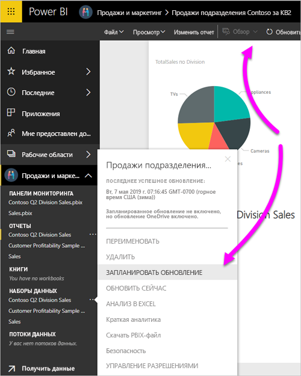

# Обновление набора данных, хранимого в OneDrive или SharePoint Online
Импорт файлов из OneDrive или SharePoint Online в службу Power BI — отличный способ обеспечить синхронизацию вашей работы в Power BI Desktop со службой Power BI.

## Преимущества хранения файла Power BI Desktop в OneDrive или SharePoint Online
Когда вы храните файл Power BI Desktop в службе OneDrive или SharePoint Online, все загруженные в модель файла данные импортируются в набор данных. Все отчеты, созданные в этом файле, загружаются в **отчеты** в службе Power BI. Предположим, вы вносите изменения в файл в OneDrive или SharePoint Online. Эти изменения могут включать добавление новых мер, изменение имен столбцов или редактирование зрительных образов. После сохранения файла служба Power BI также синхронизируется с этими изменениями, обычно в течение часа.

Вы можете выполнить однократное ручное обновление прямо в Power BI Desktop, нажав кнопку **Обновить** на вкладке ленты **Главная**. При нажатии этой кнопки **Обновить** данные в модели файла обновляются измененными данными из исходного источника данных. Такого рода обновление полностью происходит из самого приложения Power BI Desktop. Оно отличается от ручного или запланированного обновления в Power BI, поэтому важно уметь различать их.

При импорте файла Power BI Desktop из OneDrive или SharePoint Online вы загружаете информационную модель и данные в набор данных в Power BI. Необходимо обновлять набор данных в службе Power BI, потому что именно на этом основаны ваши отчеты. Так как источники данных являются внешними, вы можете вручную обновить набор данных с помощью функции **Обновить сейчас** или настроить **Расписание обновления**. 

При обновлении набора данных служба Power BI не подключается к файлу в OneDrive или SharePoint Online для запроса обновленных данных. Она использует данные в наборе данных для подключения непосредственно к источникам данных и получения обновленных данных. Затем она загружает эти данные в набор данных. Эти обновленные данные в наборе данных не синхронизированы с файлом в OneDrive или SharePoint Online.

## Что поддерживается?
В Power BI поддерживаются функции **Обновить сейчас** и **Расписание обновлений** для наборов данных, которые созданы из файлов Power PI Desktop, импортированных с локального диска, когда операция **Получение данных** или **редактор запросов** используются для подключения и загрузки данных из следующих источников данных.

### Шлюз Power BI — персональный
* Все источники данных в сети, отображаемые в **редакторе запросов** и разделе **Получение данных** в Power BI Desktop.
* Все локальные источники данных, отображаемые в **редакторе запросов** и разделе **Получение данных** в Power BI Desktop, кроме файла Hadoop (HDFS) и Microsoft Exchange.

<!-- Refresh Data sources-->
[!INCLUDE [refresh-datasources](./includes/refresh-datasources.md)]

> [!NOTE]
> Следует установить и запустить шлюз, чтобы служба Power BI могла подключаться к локальным источникам данных и обновлять набор данных.
> 
> 

## OneDrive или OneDrive для бизнеса. В чем разница?
При наличии личного OneDrive и OneDrive для бизнеса необходимо хранить все файлы, которые нужно импортировать в Power BI, в OneDrive для бизнеса. Почему? Скорее всего, для доступа к этим хранилищам вы используете разные учетные записи.

При подключении к OneDrive для бизнеса в Power BI подключение становится простым, поскольку ваша учетная запись Power BI часто совпадает с учетной записью OneDrive для бизнеса. В личное хранилище OneDrive вы обычно входите с помощью другой [учетной записи Майкрософт](https://account.microsoft.com).

При выполнении входа с использованием учетной записи Майкрософт обязательно установите флажок **Оставаться в системе**. После этого Power BI сможет синхронизировать все обновления, внесенные в файл в Power BI Desktop, с наборами данных в Power BI.

Если вы изменили свои учетные данные Microsoft, то не сможете синхронизировать изменения между файлом в OneDrive и набором данных в Power BI. Необходимо подключиться и снова импортировать файл из OneDrive.

## Как составить расписание обновления?
При настройке расписания обновления Power BI подключается напрямую к источникам данных. Power BI использует сведения о подключении и учетные данные в наборе данных для запроса обновленных данных. Затем Power BI загружает обновленные данные в набор данных. Также обновляются все визуализации в отчетах и информационных панелях, основанных на этом наборе данных в службе Power BI.

Дополнительные сведения о настройке расписания обновления см. в разделе [Настройка расписания обновления](refresh-scheduled-refresh.md).

## Действия в случае возникновения проблем
Когда что-то идет не так, обычно это происходит из-за того, что Power BI не может войти в источники данных. Могут возникнуть сбои, если набор данных попытается подключиться к локальному источнику данных, но шлюз будет вне сети. Чтобы избежать таких проблем, убедитесь, что служба Power BI может выполнить вход в источники данных. Попробуйте войти в источники данных в **учетных данных источников данных**. Иногда пароль, используемый для входа в источник данных, изменяется или Power BI выходит из источника данных.

Если вы сохраняете изменения в файле Power BI Desktop в OneDrive, а эти изменения не отражаются в Power BI примерно в течение одного часа, это может быть вызвано тем, что Power BI не удается подключиться к OneDrive. Повторите попытку подключения к файлу в OneDrive. Если отображается запрос на вход, обязательно установите флажок **Оставаться в системе**. Поскольку службе Power BI не удалось подключиться к OneDrive для синхронизации с файлом Power BI, вам потребуется импортировать файл еще раз.

Не забудьте оставить флажок **Отправлять мне уведомления по электронной почте об ошибке обновления** установленным. Вам необходимо оперативно получать информацию о сбое запланированного обновления.

## Устранение неполадок
Иногда обновление данных может завершиться неправильно. Как правило, вы сталкиваетесь с проблемами обновления данных при подключении к шлюзу. Ознакомьтесь со статьями об устранении неполадок со шлюзом и узнайте о соответствующих средствах и известных проблемах.

[Устранение неполадок локального шлюза данных](service-gateway-onprem-tshoot.md)

[Устранение неполадок с Power BI Gateway — Personal](service-admin-troubleshooting-power-bi-personal-gateway.md)

Появились дополнительные вопросы? Попробуйте задать вопрос в [сообществе Power BI](https://community.powerbi.com/).

