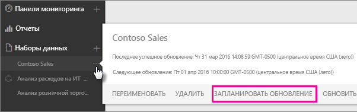
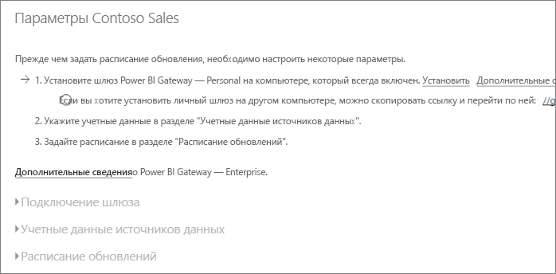
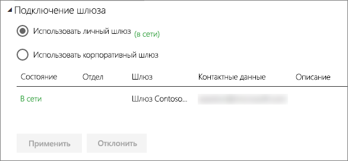
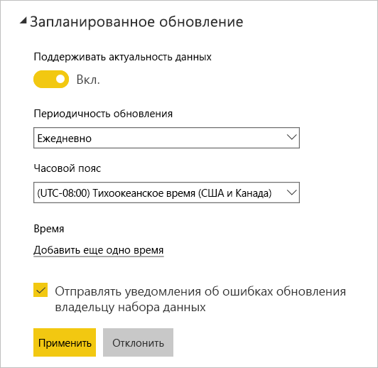

# Настройка запланированного обновления

>[!NOTE]
>После двух месяцев бездействия запланированное обновление набора данных будет приостановлено. Дополнительные сведения см. в разделе [*Расписание обновления*](#schedule-refresh) далее в этой статье.
> 
> 

Если ваш набор данных поддерживает запланированное обновление с использованием команд "Обновить сейчас" и "Расписание обновлений", существует ряд требований и параметров, важных для успешного обновления. Это **подключение к шлюзу**, **учетные данные источника данных** и **расписание обновления**. Давайте рассмотрим каждый элемент более подробно.

Далее описываются параметры, доступные для шлюза [Power BI Gateway — Personal](personal-gateway.md) и [локального шлюза данных](service-gateway-onprem.md).

Чтобы перейти к экрану расписания обновления, можно выполнить следующее.

1. Щелкните **многоточие (…)** рядом с набором данных в разделе **Наборы данных**.
2. Щелкните **Расписание обновлений**.
   
    

## Подключения к шлюзу
Вы увидите различные параметры в зависимости от того, имеется личный или корпоративный шлюза, а также доступен ли он в сети.

Если шлюз не доступен, раздел **Параметры шлюза** будет неактивен. Кроме того, вы увидите сообщение о том, как установить личный шлюз.

Если личный шлюз настроен, его можно будет выбрать, если он находится в сети. Также будет показано, что шлюз вне сети, если он недоступен.

Можно выбрать корпоративный шлюз, если он доступен. Вы увидите корпоративный шлюз, только если ваша учетная запись указана на вкладке "Пользователи" источника данных, настроенного для данного шлюза.

## Учетные данные источника данных
### Шлюз Power BI — персональный
Если вы используете личный шлюз для обновления данных, необходимо предоставить учетные данные, используемые для подключения к внутреннему источнику данных. Если используется подключение к пакету содержимого из веб-службы, то введенные учетные данные подключения будут использованы и для запланированного обновления.

Входить в источники данных нужно лишь при первом использовании обновления для набора данных. После первого ввода эти учетные данные сохраняются вместе с набором данных.

> [!NOTE]
> В случае с некоторыми методами аутентификации нужно помнить, что, если истекает срок действия пароля, который используется для входа в источник данных, или же изменяется сам пароль, его также необходимо изменить в разделе "Учетные данные источника данных".
> 
> 

Обычно возникающие проблемы вызваны следующими причинами: шлюз находится в автономном режиме, так как не может выполнить вход в Windows и запустить службу, либо Power BI не удается войти в источники данных для запроса обновленных данных. Если обновление завершается со сбоем, проверьте параметры набора данных. Если служба шлюза находится в автономном режиме, ошибка отображается в состоянии шлюза. Если Power BI не удается войти в источники данных, ошибка отображается в учетных данных источника данных.

### Локальный шлюз данных
При использовании локального шлюза данных для обновления нет необходимости предоставлять учетные данные, так как они определены для источника данных администратором шлюза.

> [!NOTE]
> При подключении к локальным источникам данных SharePoint для обновления данных Power BI поддерживает только следующие механизмы аутентификации: *анонимный доступ*, *обычная проверка подлинности* и *аутентификация Windows (NTLM/Kerberos)*. Power BI не поддерживает *ADFS* или механизмы *проверки подлинности на основе форм* для обновления данных из локальных источников данных SharePoint.
> 
> 

## Расписание обновления
В разделе запланированного обновления можно определить частоту и интервалы времени для обновления набора данных. Некоторым источникам данных для настройки не требуется наличие шлюз. Другим он необходим.

Чтобы настроить параметры, установите для параметра **Поддерживать актуальность данных** значение **Да**.

> [!NOTE]
> Служба Power BI инициирует запуск обновления данных в течение **15 минут** из запланированного времени обновления.
> 
> 

> [!NOTE]
> После двух месяцев бездействия запланированное обновление набора данных будет приостановлено. Набор данных считается неактивным, если пользователи не открывали панели мониторинга или отчеты, созданные на основе этого набора данных. В этом случае владельцу набора данных отправляется электронное сообщение о том, что запланированное обновление приостановлено, а расписание обновления для набора данных отображается как **отключенное**. Чтобы возобновить запланированное обновление, просто повторно откройте любую панель мониторинга или отчет, созданные на основе набора данных.
> 
> 

## Что поддерживается?
Запланированное обновление поддерживается для определенных наборов данных с использованием разных шлюзов. Ниже приведен справочник, позволяющий понять, что доступно, а что — нет.

### Шлюз Power BI — персональный
**Power BI Desktop**

* Все источники данных в сети, отображаемые в редакторе запросов и разделе "Получение данных" в Power BI Desktop.
* Все локальные источники данных, отображаемые в редакторе запросов и разделе "Получение данных" в Power BI Desktop, кроме файла Hadoop (HDFS) и Microsoft Exchange.

**Excel**

> [!NOTE]
> В Excel 2016 и более поздних версиях функции Power Query доступны на вкладке "Данные" в группе "Скачать и преобразовать".
> 
> 

* Все источники данных в сети, отображаемые в Power Query.
* Все локальные источники данных, отображаемые в Power Query, кроме файла Hadoop (HDFS) и Microsoft Exchange.
* Все источники данных в сети, отображаемые в Power Pivot.\*
* Все локальные источники данных, отображаемые в Power Pivot, кроме файла Hadoop (HDFS) и Microsoft Exchange.

<!-- Refresh Data sources-->
[!INCLUDE [refresh-datasources](./includes/refresh-datasources.md)]

## Устранение неполадок
Иногда обновление данных может завершиться неправильно. Как правило, проблема связана со шлюзом. Ознакомьтесь со статьями об устранении неполадок со шлюзом и узнайте о соответствующих средствах и известных проблемах.

[Устранение неполадок локального шлюза данных](service-gateway-onprem-tshoot.md)

[Устранение неполадок с Power BI Gateway — Personal](service-admin-troubleshooting-power-bi-personal-gateway.md)

## Дальнейшие действия
[Обновление данных в Power BI](refresh-data.md)  
[Шлюз Power BI Gateway — Personal](personal-gateway.md)  
[Локальный шлюз данных](service-gateway-onprem.md)  
[Устранение неполадок локального шлюза данных](service-gateway-onprem-tshoot.md)  
[Устранение неполадок с Power BI Gateway — Personal](service-admin-troubleshooting-power-bi-personal-gateway.md)  

Появились дополнительные вопросы? [Попробуйте задать вопрос в сообществе Power BI.](http://community.powerbi.com/)

