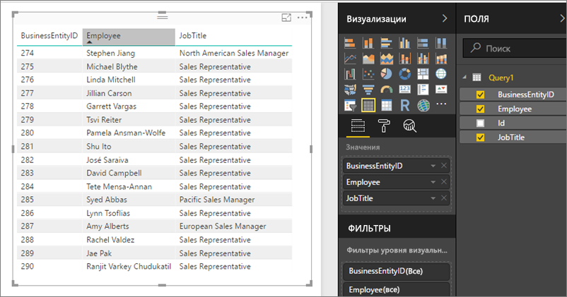

# Доступ к общим наборам данных в решении "Сервер отчетов Power BI" через веб-каналы OData
Вы можете получить доступ к общим наборам данных из Power BI Desktop, используя веб-канал OData.

1. С помощью URL-адреса веб-канала OData можно подключиться к источнику OData.
   
    
2. Когда вы перенесете данные в Power BI Desktop, их можно будет изменять в редакторе запросов.
   
    
3. Теперь данные можно использовать для разработки отчетов.
   
    

Обязательно используйте пункт **Дополнительные параметры**, чтобы включить столбцы открытого типа и отформатировать столбцы в Power Query в соответствии с потребностями.

Дополнительные сведения о [подключении к каналам OData в Power BI Desktop](../connect-data/desktop-connect-odata.md).

У вас имеются и другие вопросы? [Попробуйте задать вопрос в сообществе Power BI.](https://community.powerbi.com/)

