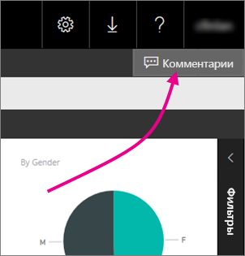
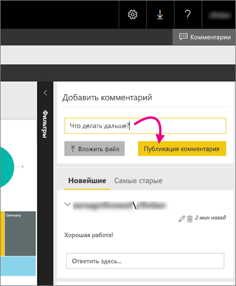

# Добавление комментариев к отчету на сервере отчетов
Вы можете добавлять комментарии к отчетам, в том числе к отчетам Power BI, на веб-портале сервера отчетов. Комментарии связаны с отчетом, и любой пользователь с соответствующими разрешениями может их просматривать. Дополнительные сведения см. в разделе [Разрешения](#permissions) ниже.

## Добавление или просмотр комментариев
1. Откройте отчет с разбивкой на страницы или отчет Power BI на сервере отчетов.
2. Выберите **Комментарии** в правом верхнем углу.
   
    
   
    В области комментариев можно просмотреть все имеющиеся комментарии.
3. Напишите комментарий, а затем выберите **Post Comment** (Опубликовать комментарий).
   
    
   
    Комментарий отображается на панели на веб-портале вместе с предыдущими комментариями. Они не отображаются в отчете в мобильных приложениях Power BI.
   
   > [!TIP]
   > Знаете ли вы? Вы можете [добавлять комментарии к отчетам Power BI в мобильных приложениях Power BI](../mobile-annotate-and-share-a-tile-from-the-mobile-apps.md), а также использовать отчеты с комментариями совместно с другими пользователями.
   > 
   > 

## Разрешения
В зависимости от разрешений вы:

* не можете просматривать комментарии;
* можете просматривать все комментарии, а также публиковать, изменять и удалять свои собственные;
* можете просматривать все комментарии, публиковать, изменять и удалять свои собственные, а также удалять комментарии других пользователей.

## Дальнейшие действия
* [Руководство для пользователя сервера отчетов Power BI](user-handbook-overview.md)  

Появились дополнительные вопросы? [Попробуйте задать вопрос в сообществе Power BI.](https://community.powerbi.com/)

