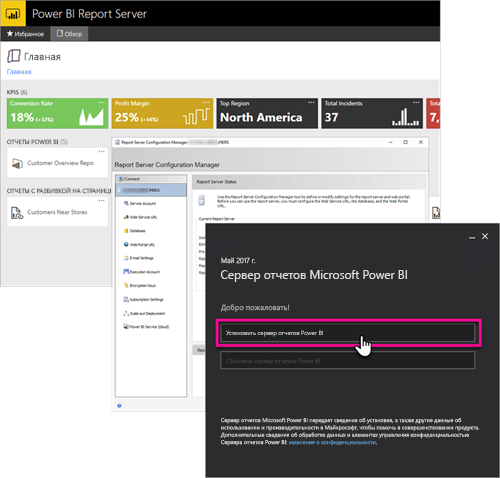

# Общие сведения об администрировании Сервера отчетов Power BI
В этой статье описано, как администрировать Сервер отчетов Power BI — локальное расположение для хранения и администрирования ваших отчетов Power BI, мобильных отчетов и отчетов с разбивкой на страницы. В этом руководстве описаны концепции планирования, развертывания и администрирования Сервера отчетов Power BI и приведены ссылки на дополнительные материалы.

 
## Установка и миграция
Чтобы начать использовать Сервер отчетов Power BI, его нужно установить. Выполнение этой задачи описывается в ряде статей.

Перед началом установки, обновления или миграции на Сервер отчетов Power BI просмотрите [требования к системе](system-requirements.md) для сервера отчетов.

### Установка
Развертывая новый сервер отчетов Power BI, ознакомьтесь со следующими материалами. 

[Установка сервера отчетов Power BI](install-report-server.md)

### Миграция
Для SQL Server Reporting Services обновление на месте не поддерживается. Если у вас есть экземпляр SQL Server Reporting Services, который нужно сделать Сервером отчетов Power BI, необходимо выполнить перенос. Миграцию может потребоваться выполнить и по иным причинам. Дополнительные сведения см. в документации по миграции.

[Миграция установки сервера отчетов](migrate-report-server.md)

## Настройка сервера отчетов
Настройка сервера отчетов предусматривает разные возможности. Будет ли использоваться SSL? Будет ли настроен почтовый сервер? Нужно ли интегрировать службу Power BI, чтобы закреплять визуализации?

Настройка преимущественно будет выполняться в диспетчере конфигурации сервера отчетов. Дополнительные сведения см. в документации по [диспетчеру настройки](https://docs.microsoft.com/sql/reporting-services/install-windows/reporting-services-configuration-manager-native-mode).

## Безопасность
Любая организация стремится обезопасить свои данные. Дополнительные сведения об аутентификации, авторизации, ролях и разрешениях см. в документации по [обеспечению безопасности](https://docs.microsoft.com/sql/reporting-services/security/reporting-services-security-and-protection).

## Дальнейшие действия
[Установка сервера отчетов Power BI](install-report-server.md)  
[Поиск ключа продукта сервера отчетов](find-product-key.md)  
[Установка приложения Power BI Desktop, оптимизированного для сервера отчетов Power BI](install-powerbi-desktop.md)  
[Загрузка построителя отчетов](https://www.microsoft.com/download/details.aspx?id=53613)  
[Download SQL Server Data Tools (SSDT)](https://go.microsoft.com/fwlink/?LinkID=616714) (Скачивание SQL Server Data Tools (SSDT))

Появились дополнительные вопросы? [Попробуйте задать вопрос в сообществе Power BI.](https://community.powerbi.com/)

