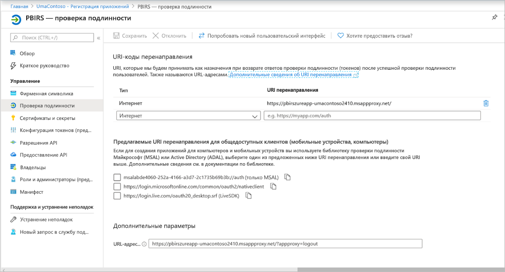

# <a name="configure-power-bi-report-server-with-azure-application-proxy"></a>Настройка Сервера отчетов Power BI с помощью Azure Application Proxy

В этой статье описывается, как использовать Azure Active Directory Application Proxy для подключения к Серверу отчетов Power BI и SQL Server Reporting Services (SSRS) 2016 и более поздних версий. Благодаря этой интеграции пользователи, которые находятся вне корпоративной сети, могут получать доступ к своим отчетам на Сервере отчетов Power BI и в службах Reporting Services со своих клиентских браузеров и использовать защиту Azure Active Directory (AD). Узнайте больше об удаленном доступе к локальным приложениям через [Azure Active Directory Application Proxy](https://docs.microsoft.com/azure/active-directory/manage-apps/application-proxy).

## <a name="environment-details"></a>Сведения о среде

Мы использовали данные значения в созданном нами примере. 

- Домен: umacontoso.com
- Сервер отчетов Power BI: PBIRSAZUREAPP.umacontoso.com
- Источник данных SQL Server: SQLSERVERAZURE.umacontoso.com

## <a name="configure-power-bi-report-server"></a>Настройка сервера отчетов Power BI

После установки Сервера отчетов Power BI (предположим, на виртуальной машине Azure) настройте URL-адреса веб-службы и веб-портала Сервера отчетов Power BI, выполнив следующие действия.

1. Создайте правила для входящего и исходящего трафика в брандмауэре виртуальной машины для порта 80 (или для порта 443, если настроены URL-адреса HTTPS). Кроме того, создайте правила для входящего и исходящего трафика для виртуальной машины Azure на портале Azure, указав протокол TCP и порт 80.
2. DNS-имя, настроенное для виртуальной машины в нашей среде: `pbirsazureapp.eastus.cloudapp.azure.com`.
3. Настройте URL-адреса внешней веб-службы и веб-портала Сервера отчетов Power BI. Для этого выберите вкладку **Дополнительно**, нажмите кнопку **Добавить**, щелкните **Choose Host Header Name** (Выбор имени заголовка узла) и добавьте имя узла (DNS-имя), как показано ниже.

    

1. Мы выполнили предыдущий шаг для раздела веб-службы и веб-портала и зарегистрировали их URL-адреса в Configuration Manager Сервера отчетов.

    - `https://pbirsazureapp.eastus.cloudapp.azure.com/ReportServer`
    - `https://pbirsazureapp.eastus.cloudapp.azure.com/Reports`

2. На портале Azure мы видим два IP-адреса виртуальной машины в разделе сетевых подключений. 

    - **Общедоступный IP-адрес**. 
    - **Частный IP-адрес**. 
    
    Общедоступный IP-адрес используется для доступа извне виртуальной машины.

3. Поэтому мы добавили запись файла узла на виртуальную машину (Сервер отчетов Power BI), чтобы включить общедоступный IP-адрес и имя узла `pbirsazureapp.eastus.cloudapp.azure.com`.
4. Обратите внимание на то, что при перезапуске виртуальной машины может измениться динамический IP-адрес, что потребует добавления правильного IP-адреса в файл узла. Чтобы избежать этого, можно сделать общедоступный IP-адрес статическим на портале Azure.
5. После внесения описанных выше изменений URL-адреса веб-службы и веб-портала должны стать доступными.
6. При обращении к URL-адресу `https://pbirsazureapp.eastus.cloudapp.azure.com/ReportServer` на сервере отображается три запроса учетных данных, после чего мы видим пустой экран.
7. Добавьте следующую запись реестра:

    раздел реестра `HKEY\_LOCAL\_MACHINE \SYSTEM\CurrentControlset\Control \Lsa\ MSV1\_0`.

1. Добавьте новое значение `BackConnectionHostNames` (многострочное) и укажите имя узла `pbirsazureapp.eastus.cloudapp.azure.com`.

После этого мы сможем получить доступ к URL-адресам на сервере.

## <a name="configure-power-bi-report-server-to-work-with-kerberos"></a>Настройка Сервера отчетов Power BI для работы с Kerberos

### <a name="1-configure-the-authentication-type"></a>1. Настройка типа аутентификации

Необходимо настроить тип проверки подлинности для сервера отчетов, чтобы разрешить ограниченное делегирование Kerberos. Это можно сделать в файле **rsreportserver.config**.

В файле rsreportserver.config найдите раздел **Authentication/AuthenticationTypes**.

Необходимо убедиться, что в списке типов аутентификации первым указан тип RSWindowsNegotiate. Она должна выглядеть следующим образом.

```
<AuthenticationTypes>

    <RSWindowsNegotiate/>

</AuthenticationTypes>
```

Если необходимо изменить файл конфигурации, **остановите и перезапустите службу Сервера отчетов** из Configuration Manager Сервера отчетов, чтобы изменения вступили в силу.

### <a name="2-register-service-principal-names-spns"></a>2. Регистрация имен субъектов-служб (SPN)

Откройте командную строку в качестве администратора и выполните следующие действия.

Зарегистрируйте следующие имена субъектов-служб в учетной записи **службы Сервера отчетов Power BI** с помощью приведенных ниже команд.

```
setspn -s http/ Netbios name\_of\_Power BI Report Server\_server<space> Power BI Report Server\_ServiceAccount

setspn -s http/ FQDN\_of Power BI Report Server\_server<space> Power BI Report Server\_ServiceAccount
```

Зарегистрируйте следующие имена субъектов-служб в учетной записи службы SQL Server, используя приведенные ниже команды (для экземпляра по умолчанию SQL Server).

```
setspn -s MSSQLSVC/FQDN\_of\_SQL\_Server: 1433 (PortNumber) <SQL service service account>

setspn -s MSSQLSVC/FQDN\_of\_SQL\_Server<SQL service service account>
```

### <a name="3-configure-delegation-settings"></a>3. Настройка параметров делегирования

Нужно настроить параметры делегирования в учетной записи службы Сервера отчетов.

1. Откройте оснастку "Пользователи и компьютеры Active Directory".
2. Откройте в оснастке "Пользователи и компьютеры Active Directory" свойства учетной записи службы Сервера отчетов.
3. Необходимо настроить ограниченное делегирование с транзитом протокола. При использовании ограниченного делегирования необходимо явно указать службы, для которых настраивается делегирование.
4. Щелкните правой кнопкой мыши **учетную запись службы Сервера отчетов** и выберите **Свойства**.
5. Выберите вкладку **Делегирование**.
6. Выберите параметр **Доверять компьютеру делегирование указанных служб**.
7. Выберите **Использовать любой протокол проверки подлинности**.
8. В разделе **Службы, с которыми эта учетная запись может использовать делегированные учетные данные:** нажмите кнопку **Добавить**.
9. В открывшемся диалоговом окне выберите **Пользователи или компьютеры**.
10. Введите **учетную запись службы SQL Server** и нажмите кнопку **ОК**.

    Ее имя начинается с "MSSQLSVC".

1. Добавьте имена субъектов-служб.
2. Выберите **ОК**. Вы должны увидеть имя субъекта-службы в списке.

Эти действия помогут настроить Сервер отчетов Power BI для работы с механизмом аутентификации Kerberos и тестового подключения к источнику данных, работающему на локальном компьютере.

## <a name="configure-azure-application-proxy-connector"></a>Настройка соединителя Azure Application Proxy

Ознакомьтесь со статьей о [конфигурации, связанной с соединителем Application Proxy](https://docs.microsoft.com/azure/active-directory/manage-apps/application-proxy-add-on-premises-application#add-an-on-premises-app-to-azure-ad).

Мы установили соединитель Application Proxy на Сервер отчетов Power BI, но его можно настроить на отдельном сервере и убедиться, что делегирование настроено должным образом.

### <a name="ensure-the-connector-is-trusted-for-delegation"></a>Обеспечение доверенности соединителя для делегирования

Убедитесь, что соединитель является доверенным для делегирования на имя субъекта-службы, добавленное в учетную запись пула приложений Сервера отчетов.

Настройте ограниченное делегирование Kerberos (KCD), чтобы служба Azure AD Application Proxy могла делегировать удостоверения пользователей для учетной записи пула приложений Сервера отчетов. Для этого настройте для соединителя прокси приложения возможность получать билеты Kerberos для пользователей, которые прошли проверку подлинности в Azure AD. Затем этот сервер передает контекст в целевое приложение (в нашем случае — Сервер отчетов Power BI).

Чтобы настроить ограниченное делегирование Kerberos, выполните приведенные далее действия для каждого компьютера соединителя.

1. Войдите в контроллер домена от имени администратора домена, а затем перейдите к компоненту **Пользователи и компьютеры Active Directory**.
2. Найдите компьютер, на котором запущен соединитель.
3. Дважды щелкните имя компьютера, а затем перейдите на вкладку **Делегирование**.
4. Установите переключатель **Trust this computer for delegation to the specified services only** (Доверять этому компьютеру для делегирования только указанным службам), а затем — **Use any authentication protocol** (Использовать любой протокол аутентификации).
5. Выберите **Добавить**, затем — **Пользователи и группы**.
6. Введите учетную запись службы, которую вы используете для Сервера отчетов Power BI. Это учетная запись, в которую вы добавили имя субъекта-службы во время настройки Сервера отчетов.
7. Нажмите кнопку **ОК**. 
8. Нажмите кнопку **ОК** еще раз, чтобы сохранить изменения.

## <a name="publish-through-azure-ad-application-proxy"></a>Публикация с помощью Azure AD Application Proxy

Теперь все готово к настройке Azure AD Application Proxy.

Опубликуйте Сервер отчетов Power BI через Application Proxy, указав следующие параметры. Пошаговые инструкции по публикации приложения с помощью Application Proxy приведены в статье [Публикация приложений с помощью Azure AD Application Proxy](https://docs.microsoft.com/azure/active-directory/manage-apps/application-proxy-add-on-premises-application#add-an-on-premises-app-to-azure-ad).

- **Внутренний URL-адрес**. Введите URL-адрес Сервера отчетов, к которому соединитель может подключиться в корпоративной сети. Убедитесь, что этот URL-адрес доступен с сервера, на котором установлен соединитель. Рекомендуется использовать домен верхнего уровня, например `https://servername/`, чтобы избежать проблем с вложенными путями, опубликованными через Application Proxy. Например, рекомендуется использовать `https://servername/`, но не `https://servername/reports/` или `https://servername/reportserver/`. Для нашей среды мы настроили `https://pbirsazureapp.eastus.cloudapp.azure.com/`.

    > [!NOTE]
    > Рекомендуется использовать безопасное HTTPS-подключение к Серверу отчетов. Дополнительные практические рекомендации доступны в разделе [Настройка соединений SSL для сервера отчетов, работающего в собственном режиме](https://docs.microsoft.com/sql/reporting-services/security/configure-ssl-connections-on-a-native-mode-report-server?view=sql-server-2017).

- **Внешний URL-адрес**. Введите общедоступный URL-адрес, к которому будет подключаться мобильное приложение Power BI. Например, он может иметь вид `https://reports.contoso.com`, если используется личный домен. Чтобы использовать личный домен, передайте сертификат для домена и добавьте домен msappproxy.net по умолчанию в запись DNS для своего приложения. Подробные инструкции доступны в разделе [Работа с пользовательскими доменами в прокси приложения Azure AD](https://docs.microsoft.com/azure/active-directory/manage-apps/application-proxy-configure-custom-domain).

Для нашей среды мы настроили внешний URL-адрес `https://pbirsazureapp-umacontoso2410.msappproxy.net/`.

- **Метод предварительной проверки подлинности**. Azure Active Directory.
- **Группа соединителей**. Значение по умолчанию.


Мы ничего не изменяли в разделе **Дополнительные параметры**. Он настроен для работы с параметрами по умолчанию.

> [!IMPORTANT]
> При настройке прокси приложения обратите внимание на то, что для свойства **Время ожидания серверного приложения** установлено значение **По умолчанию** (85 секунд). Если у вас есть отчеты, выполнение которых занимает больше 85 секунд, измените значение этого поля на **Длительное** (180 секунд) — это максимальное возможное время ожидания. Если выбрано значение **Длительное**, все отчеты должны завершаться в течение 180 секунд. Если оно будет превышено, возникнет ошибка.


### <a name="configure-single-sign-on"></a>Настройка единого входа

После публикации приложения необходимо настроить параметры единого входа с помощью следующих действий:

1. На странице приложения на портале выберите **Единый вход**.
2. Для **единого входа** выберите режим **Встроенная проверка подлинности Windows**.
3. Задайте для параметра **Внутреннее имя субъекта-службы приложения** значение, заданное ранее. Определить это значение можно, сделав следующее.

    - Попробуйте создать отчет или выполнить тестовое подключение к источнику данных, чтобы создать билет Kerberos.
    - После успешного выполнения отчета или тестового подключения откройте командную строку и выполните команду `klist`. В разделе результатов вы увидите билет с именем субъекта-службы `http/`. Если оно совпадает с именем субъекта-службы, настроенным для Сервера отчетов Power BI, используйте это имя субъекта-службы в данном разделе.

1. Выберите **делегированную идентификацию для входа**, которую соединитель сможет использовать от имени пользователей. Прочитайте дополнительные сведения о [реализации единого входа в приложения с помощью прокси приложения](https://docs.microsoft.com/azure/active-directory/manage-apps/application-proxy-configure-single-sign-on-with-kcd#working-with-different-on-premises-and-cloud-identities).

    Рекомендуется использовать имя субъекта-пользователя. В нашем примере мы настроили параметр **Имя субъекта-пользователя**.

    

1. Нажмите кнопку **Сохранить**, чтобы сохранить изменения.

### <a name="finish-setting-up-your-application"></a>Завершение настройки приложения

Чтобы завершить настройку приложения, перейдите к разделу **Пользователи и группы** и назначьте доступ к этому приложению необходимым пользователям.

1. Настройте параметры **URL-адреса перенаправления** и **Дополнительные параметры** в разделе **Аутентификация** для регистрации приложения Сервера отчетов Power BI, как показано ниже.

    - Создайте URL-адрес перенаправления и настройте его, выбрав **Тип** = **Интернет** и **URI перенаправления** = `https://pbirsazureapp-umacontoso2410.msappproxy.net/`.
    - В разделе **Дополнительные параметры** задайте для параметра **URL-адрес выхода** значение `https://pbirsazureapp-umacontoso2410.msappproxy.net/?Appproxy=logout`.

    

1. Продолжайте настройку раздела **Аутентификация** для регистрации приложения Сервера отчетов Power BI, как показано ниже, задав параметры **Неявное предоставление**, **Тип клиента по умолчанию** и **Поддерживаемые типы учетных записей**.

    - Задайте для параметра **Неявное предоставление** значение **Токен идентификатора**.
    - Для параметра **Тип клиента по умолчанию** задайте значение **Нет**.
    - Для параметра **Поддерживаемые типы учетных записей** задайте значение **Учетные записи только в этом каталоге организации (только UmaContoso — один клиент)** .

    

1. После настройки единого входа и проверки работоспособности URL-адреса `https://pbirsazureapp-umacontoso2410.msappproxy.net` необходимо убедиться, что учетная запись, с которой выполняется вход, синхронизирована с учетной записью, которой предоставляются разрешения на Сервере отчетов Power BI.

1. Сначала необходимо настроить личный домен, который мы планируем использовать в имени для входа, а затем следует его проверить.
2. В этом случае мы приобрели домен umacontoso.com и настроили зону DNS с помощью записей. Вы можете также попробовать использовать домен `onmicrosoft.com` и синхронизировать его с локальной службой AD.

    Ознакомьтесь со статьей [Руководство. Сопоставление существующего настраиваемого DNS-имени со Службой приложений Azure](https://docs.microsoft.com/Azure/app-service/app-service-web-tutorial-custom-domain), чтобы узнать больше.

1. После успешной проверки записи DNS для личного домена для него на портале должно отображаться состояние **Проверено**.

    

1. Установите службу Microsoft Azure AD Connect на сервере контроллера домена и настройте ее синхронизацию с Azure AD.

    

1. После синхронизации Azure AD с локальной службой AD вы увидите на портале Azure приведенное ниже состояние.

    

1. Кроме того, после успешной синхронизации откройте домены и отношения доверия AD на контроллере домена. Щелкните правой кнопкой мыши "Active Directory — домены и доверие", выберите "Свойства" и добавьте имя субъекта-пользователя. В нашей среде используется приобретенный нами личный домен `umacontoso.com`.

1. После добавления имени субъекта-пользователя вы сможете настроить для учетных записей пользователей имя субъекта-пользователя, чтобы учетная запись Azure AD и локальная учетная запись AD были связаны, а во время аутентификации маркер распознавался.

    Доменное имя AD отобразится в раскрывающемся списке в разделе **Имя входа пользователя** после выполнения предыдущего шага. Настройте имя пользователя и выберите домен из раскрывающегося списка в разделе **Имя входа пользователя** на странице свойств пользователя AD.

    

1. После успешной синхронизации AD вы увидите, что локальная учетная запись AD появилась на портале Azure в разделе **Пользователи и группы** приложения. Источником этой учетной записи является **Windows Server AD**.
2. Вход с помощью `umasm@umacontoso.com` будет аналогичен входу с учетными данными Windows `Umacontoso\umasm`.

    Приведенные выше действия применимы, если настроена локальная служба AD и планируется синхронизировать ее с Azure AD.

    Успешный вход после выполнения описанных выше действий:

    

    После чего отобразится веб-портал.

    

    После успешного тестового подключения к источнику данных с использованием аутентификации Kerberos вы увидите следующее.

    

## <a name="access-from-power-bi-mobile-apps"></a>Доступ из мобильных приложений Power BI

### <a name="configure-the-application-registration"></a>Настройка регистрации приложения

Прежде чем мобильное приложение Power BI сможет подключиться к Серверу отчетов Power BI и получить к нему доступ, необходимо настроить регистрацию приложения, которое было автоматически создано ранее, при выполнении инструкций в разделе [Публикация с помощью Azure AD Application Proxy](#publish-through-azure-ad-application-proxy) в этой статье.

1. На странице **Обзор** Azure Active Directory щелкните **Регистрация приложений**.
2. На вкладке **Все приложения** найдите приложение, созданное для Сервера отчетов Power BI.
3. Выберите приложение, а затем щелкните **Аутентификация**.
4. Добавьте следующие универсальные коды ресурса (URI) перенаправления, в зависимости от используемой платформы.

    При настройке мобильного приложения Power BI для **iOS** добавьте следующие универсальные коды ресурса (URI) перенаправления типа "Общедоступный клиент (мобильный и классический)".

    - `msauth://code/mspbi-adal%3a%2f%2fcom.microsoft.powerbimobile`
    - `msauth://code/mspbi-adalms%3a%2f%2fcom.microsoft.powerbimobilems`
    - `mspbi-adal://com.microsoft.powerbimobile`
    - `mspbi-adalms://com.microsoft.powerbimobilems`

    При настройке мобильного приложения Power BI для **Android** добавьте следующие URI перенаправления типа "Общедоступный клиент (мобильный и классический)".

    - `urn:ietf:wg:oauth:2.0:oob`
    - `mspbi-adal://com.microsoft.powerbimobile`
    - `msauth://com.microsoft.powerbim/g79ekQEgXBL5foHfTlO2TPawrbI%3D`
    - `msauth://com.microsoft.powerbim/izba1HXNWrSmQ7ZvMXgqeZPtNEU%3D`

    При настройке мобильного приложения Power BI для iOS и Android добавьте следующие URI перенаправления типа "Общедоступный клиент (мобильный и классический)" в список URI перенаправления, настроенный для iOS.

    - `urn:ietf:wg:oauth:2.0:oob`

    > [!IMPORTANT]
    > Добавить URI перенаправления необходимо для правильной работы приложения.

### <a name="connect-from-the-power-bi-mobile-apps"></a>Подключение из мобильных приложений Power BI

1. Из мобильного приложения Power BI подключитесь к своему экземпляру Сервера отчетов. Чтобы подключиться, введите **внешний URL-адрес** приложения, опубликованного через Application Proxy.
2. Нажмите кнопку **Подключиться**. Вы будете перенаправлены на страницу входа Azure Active Directory.
3. Введите действительные учетные данные для пользователя и выберите **Войти**. Вы увидите элементы со своего Сервера отчетов.

## <a name="next-steps"></a>Дальнейшие действия

[Обеспечение удаленного доступа к Power BI Mobile с помощью Azure Active Directory Application Proxy](https://docs.microsoft.com/azure/active-directory/manage-apps/application-proxy-integrate-with-power-bi)

Появились дополнительные вопросы? [Попробуйте задать вопрос в сообществе Power BI.](https://community.powerbi.com/)

                
