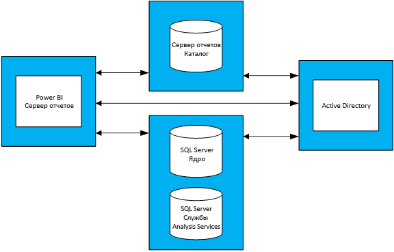

# Руководство по планированию ресурсов для Сервера отчетов Power BI
Сервер отчетов Power BI — это решение самостоятельной бизнес-аналитики и корпоративной отчетности, которое клиенты могут развернуть локально за своим брандмауэром. Оно объединяет возможности интерактивных отчетов Power BI Desktop с платформой локального сервера SQL Server Reporting Services. При интенсивном и растущем использовании аналитики и отчетности на предприятиях, формирование бюджета на аппаратную инфраструктуру и лицензии программного обеспечения, необходимого для масштабирования базы пользователей предприятия, может представлять собой сложную задачу. В этом документе предоставляется руководство по планированию ресурсов для Сервера отчетов Power BI путем совместного использования результатов выполнения многочисленных нагрузочных тестов различных рабочих нагрузок на сервере отчетов. Хотя отчеты, запросы и шаблоны использования организаций могут сильно различаться, результаты, представленные в данном документе, вместе с использованием фактических тестов и подробным описанием того, как они были выполнены, служат в качестве контрольной точки для тех, кто находится на ранней стадии процесса планирования развертывания Сервера отчетов Power BI.

## Сводка по выполнению
Мы выполним два разных типа рабочей нагрузки на Сервере отчетов Power BI, каждая из которых состоит из подготовки различных типов отчетов к просмотру, а также выполнения различных операций на веб-портале. 

* В рабочей нагрузке "Отчет Power BI (активное использование)" наиболее часто выполняющейся операцией (т. е. операцией, выполняемой в течение 60 % всего времени) была подготовка отчетов Power BI к просмотру.
* В рабочей нагрузке "Отчет с разбивкой на страницы (активное использование)" наиболее часто выполняющейся операцией была подготовка отчетов с разбивкой на страницы к просмотру.

В следующей таблице представлено максимальное количество пользователей, с которыми может работать сервер отчетов Power BI с надежностью на уровне 99 % (при условии использования четырехсерверной топологии сервера отчетов Power BI, а также, что не более 5 % пользователей будут обращаться к серверу отчетов в любой момент времени). 

| Рабочая нагрузка | 8 ядер, 32 ГБ ОЗУ | 16 ядер, 64 ГБ ОЗУ |
| --- | --- | --- |
| **Отчет Power BI (активное использование)** (>60 %) |1000 пользователей |3000 пользователей |
| **Отчет с разбивкой на страницы (активное использование)** (>60 %) |2000 пользователей |3200 пользователей |

При каждом выполнении наиболее используемым ресурсом был ЦП. Из-за этого увеличение числа ядер на Сервере отчетов Power BI по сравнению с увеличением объема памяти или дискового пространства обеспечит более высокий уровень надежности системы. 

## Методика тестирования
Используемая топология тестирования была основана на виртуальных машинах Microsoft Azure, а не на физическом оборудовании поставщика. Все компьютеры размещались в регионах США. Это отражает общую тенденцию виртуализации аппаратных средств как локально, так и в общедоступном облаке. 

### Топология Сервера отчетов Power BI
Развертывание Сервера отчетов Power BI состоит из следующих виртуальных машин:

* Контролер домена Active Directory. Необходим для ядра СУБД SQL Server, SQL Server Analysis Services и Сервера отчетов Power BI, чтобы безопасно проверить подлинность всех запросов.
* Ядро СУБД SQL Server и SQL Server Analysis Services. Место, где хранятся все базы данных для использованных отчетов при их подготовке к просмотру.
* Cервере отчетов Power BI
* База данных Сервера отчетов Power BI. Базы данных сервера отчетов и сервер отчетов Power BI размещаются на разных компьютерах, чтобы не конкурировать с ядром СУБД SQL Server за память, ЦП, сети и дисковые ресурсы.

Дополнительные сведения о полной конфигурации каждого компьютера, использованного в топологии, см. в приложении 1.1 "Топология сервера отчетов Power BI" и приложении 1.2 "Настройка виртуальной машины сервера отчетов Power BI".

### Тесты
Тесты, используемые при выполнении нагрузочных тестов, общедоступны в проекте GitHub с названием [Reporting Services LoadTest](https://github.com/Microsoft/Reporting-Services-LoadTest). Это средство позволяет пользователям изучить производительность, надежность, масштабируемость и характеристики восстановления SQL Server Reporting Services и Сервера отчетов Power BI. Этот проект состоит из четырех групп тестовых случаев:

* тесты, имитирующие подготовку отчетов Power BI к просмотру;
* тесты, имитирующие подготовку мобильных отчетов к просмотру;
* тесты, имитирующие подготовку больших и маленьких отчетов с разбивкой на страницы к просмотру; 
* тесты, имитирующие выполнение различных типов операций на веб-портале. 

Все тесты были написаны для выполнения комплексных операций (таких как подготовка отчета к просмотру, создание источника данных и т. д.). Это достигается путем выполнения одного или нескольких веб-запросов к серверу отчетов (через API). На практике пользователю может потребоваться выполнить несколько промежуточных операций для выполнения этих комплексных операций. Например, чтобы подготовить отчет, пользователю нужно перейти на веб-портал, перейти к папке, где находится отчет, а затем щелкнуть отчет, чтобы подготовить его к просмотру. Хотя тесты выполняют не все операции, необходимые для выполнения комплексной задачи, они по-прежнему составляют большую часть нагрузки, которую будет испытывать Сервер отчетов Power BI. Дополнительные сведения о различных типах используемых отчетов, а также о множестве выполняемых операций можно узнать при изучении проекта GitHub.  

> [!NOTE]
> Это средство официально не поддерживается корпорацией Майкрософт, но разработчики продукта участвуют в проекте и отвечают на обращения других участников.

### Рабочие нагрузки
Есть 2 профиля рабочей нагрузки, которые используются при тестировании: "Отчет Power BI (активное использование)" и "Отчет с разбивкой на страницы (активное использование)". В следующей таблице описано распределение запросов, выполняемых на сервере отчетов.

| Действие | Отчет Power BI (активное использование), частота возникновения | Отчет с разбивкой на страницы (активное использование), частота возникновения |
| --- | --- | --- |
| **Подготовка отчетов Power BI к просмотру** |60 % |10 % |
| **Подготовка отчетов с разбивкой на страницы к просмотру** |30 % |60 % |
| **Подготовка мобильных отчетов к просмотру** |5 % |20 % |
| **Операции на веб-портале** |5 % |10 % |

### Пользовательская нагрузка
Каждый раз тесты выполнялись на основе частоты, указанной в одной из двух рабочих нагрузок. Тесты начались с 20 одновременных запросов пользователей к серверу отчетов. Затем пользовательская нагрузка постепенно увеличивалась, пока надежность не упала ниже целевого показателя в 99 %.

## Результаты
### Количество одновременных пользователей
Как упоминалось ранее, тесты начались с 20 одновременных запросов пользователей к серверу отчетов. Затем количество одновременных пользователей постепенно увеличивалось, пока 1 % всех запросов не завершался неудачно. Результаты в следующей таблице показывают количество одновременных запросов пользователей, которые сервер сможет обрабатывать при максимальной нагрузке с частотой отказов менее 1 %.

| Рабочая нагрузка | 8 ядер, 32 ГБ | 16 ядер, 64 ГБ |
| --- | --- | --- |
| **Отчет Power BI (активное использование)** |50 одновременных пользователей |150 одновременных пользователей |
| **Отчет с разбивкой на страницы (активное использование)** |100 одновременных пользователей |160 одновременных пользователей |

### Общее количество пользователей
В корпорации Майкрософт есть рабочее развертывание сервера отчетов Power BI, используемое несколькими командами. При анализе фактического использования этой среды мы наблюдаем, что число одновременных пользователей в любой момент времени (даже во время дневных пиковых нагрузок) не превышало 5 % от общего числа пользователей. Используя этот 5 % коэффициент параллелизма для измерения производительности, мы вычислили общую базу пользователей, которую сервер отчетов Power BI может обработать с надежностью на уровне 99 %.

| Рабочая нагрузка | 8 ядер, 32 ГБ | 16 ядер, 64 ГБ |
| --- | --- | --- |
| **Отчет Power BI (активное использование)** |1000 пользователей |3000 пользователей |
| **Отчет с разбивкой на страницы (активное использование)** |2000 пользователей |3200 пользователей |

### Просмотр результатов
Выберите отчет для просмотра результатов выполнения нагрузочного теста.

| Рабочая нагрузка | 8 ядер, 32 ГБ | 16 ядер, 64 ГБ |
| --- | --- | --- |
| **Отчет Power BI (активное использование)** |[Просмотр: 8 ядер](https://msit.powerbi.com/view?r=eyJrIjoiMDhhNGY4NGQtNGRhYy00Yzk4LTk2MzAtYzFlNWI5NjBkMGFiIiwidCI6IjcyZjk4OGJmLTg2ZjEtNDFhZi05MWFiLTJkN2NkMDExZGI0NyIsImMiOjV9) |[Просмотр: 16 ядер](https://msit.powerbi.com/view?r=eyJrIjoiNDBiODk1OGUtYTAyOC00MzVhLThmZmYtNzVjNTFjNzMwYzkwIiwidCI6IjcyZjk4OGJmLTg2ZjEtNDFhZi05MWFiLTJkN2NkMDExZGI0NyIsImMiOjV9) |
| **Отчет с разбивкой на страницы (активное использование)** |[Просмотр: 8 ядер](https://msit.powerbi.com/view?r=eyJrIjoiNDFiZWYzMTktZGIxNS00MzcwLThjODQtMmJkMGRiZWEzNjhlIiwidCI6IjcyZjk4OGJmLTg2ZjEtNDFhZi05MWFiLTJkN2NkMDExZGI0NyIsImMiOjV9) |[Просмотр: 16 ядер](https://msit.powerbi.com/view?r=eyJrIjoiOTU0YjJkYTgtNDg4Yy00NzlhLWIwMGYtMzg4YWI2MjNmOTZjIiwidCI6IjcyZjk4OGJmLTg2ZjEtNDFhZi05MWFiLTJkN2NkMDExZGI0NyIsImMiOjV9) |

<iframe width="640" height="360" src="https://msit.powerbi.com/view?r=eyJrIjoiMDhhNGY4NGQtNGRhYy00Yzk4LTk2MzAtYzFlNWI5NjBkMGFiIiwidCI6IjcyZjk4OGJmLTg2ZjEtNDFhZi05MWFiLTJkN2NkMDExZGI0NyIsImMiOjV9" frameborder="0" allowFullScreen="true"></iframe>

<iframe width="640" height="360" src="https://msit.powerbi.com/view?r=eyJrIjoiNDBiODk1OGUtYTAyOC00MzVhLThmZmYtNzVjNTFjNzMwYzkwIiwidCI6IjcyZjk4OGJmLTg2ZjEtNDFhZi05MWFiLTJkN2NkMDExZGI0NyIsImMiOjV9" frameborder="0" allowFullScreen="true"></iframe>

<iframe width="640" height="360" src="https://msit.powerbi.com/view?r=eyJrIjoiNDFiZWYzMTktZGIxNS00MzcwLThjODQtMmJkMGRiZWEzNjhlIiwidCI6IjcyZjk4OGJmLTg2ZjEtNDFhZi05MWFiLTJkN2NkMDExZGI0NyIsImMiOjV9" frameborder="0" allowFullScreen="true"></iframe>

<iframe width="640" height="360" src="https://msit.powerbi.com/view?r=eyJrIjoiOTU0YjJkYTgtNDg4Yy00NzlhLWIwMGYtMzg4YWI2MjNmOTZjIiwidCI6IjcyZjk4OGJmLTg2ZjEtNDFhZi05MWFiLTJkN2NkMDExZGI0NyIsImMiOjV9" frameborder="0" allowFullScreen="true"></iframe>

## Сводка
В каждом нагрузочном тесте ЦП был самым перегруженным ресурсом во время пиковой нагрузки на компьютере Сервера отчетов Power BI. Поэтому первый ресурс, который стоит увеличить — это число ядер. Кроме того, можно выполнить развертывание, добавив в топологию дополнительные серверы, размещающие сервер отчетов Power BI.

Результаты, представленные в этом документе, получены при выполнении определенного набора отчетов, использующих определенный набор данных, повторяющихся особым образом. Это полезная контрольная точка, но имейте ввиду, что ее использование будет зависеть от отчетов, запросов, шаблонов использования и развертывания Сервера отчетов Power BI.

## Приложения
### 1\. Топология
**1.1 Топология Сервера отчетов Power BI**

Чтобы сосредоточиться исключительно на поведении сервера отчетов Power BI с различными конфигурациями, конфигурации для каждого типа виртуальной машины (за исключением компьютера, на котором размещен сервер отчетов Power BI) были исправлены. Каждый компьютер был подготовлен в соответствии с требованиями к компьютерам серии D версии 2 с дисками хранилища класса Premium. Подробное описание виртуальных машин каждого размера см. в [разделе "Универсальные" на этой странице](https://azure.microsoft.com/pricing/details/virtual-machines/windows/).

| Тип виртуальной машины | Процессор | Память | Размер виртуальной машины Azure |
| --- | --- | --- | --- |
| **Контроллер домена Active Directory** |2 ядра |7 ГБ |Standard_DS2_v2 |
| **Ядро СУБД SQL Server и Analysis Services** |16 ядер |56 ГБ |Standard_DS5_v2 |
| **База данных сервера отчетов** |16 ядер |56 ГБ |Standard_DS5_v2 |

**1.2 Настройка виртуальной машины сервера отчетов Power BI** 

Для виртуальной машины, на которой размещен сервер отчетов Power BI, были использованы различные конфигурации процессора и памяти. В отличие от других виртуальных машин этот компьютер подготовлен в соответствии с требованиями к компьютерам серии D версии 3 с дисками хранилища класса Premium. Подробное описание виртуальной машины этого размера см. в [разделе "Универсальные" на этой странице](https://azure.microsoft.com/pricing/details/virtual-machines/windows/.).

| Виртуальная машина | Процессор | Память | Размер виртуальной машины Azure |
| --- | --- | --- | --- |
| **Сервер отчетов Power BI (маленький)** |8 ядер |32 ГБ |Standard_D8S_v3 |
| **Сервер отчетов Power BI (крупный)** |16 ядер |64 ГБ |vStandard_D16S_v3 |

### 2\. Запуск средства LoadTest
Если нужно запустить инструмент LoadTest Reporting Services для развертывания Сервера отчетов Power BI в Microsoft Azure, сделайте следующее.

1. Клонируйте проект Reporting Services LoadTest из GitHub (https://github.com/Microsoft/Reporting-Services-LoadTest).  
2. В каталоге проекта найдите файл решения с именем RSLoadTests.sln. Откройте этот файл в Visual Studio 2015 или более поздней версии.
3. Определите, хотите ли вы запустить это средство для развертывания сервера отчетов Power BI или для развертывания сервера отчетов Power BI в Microsoft Azure. Если вы собираетесь выполнить его для собственного развертывания, перейдите к шагу 5.
4. Следуйте указаниям на странице https://github.com/Microsoft/Reporting-Services-LoadTest#create-a-sql-server-reporting-services-load-environment-in-azure, чтобы создать среду сервера отчетов Power BI в Azure.
5. После завершения развертывания в этой среде выполните тесты, следуя указаниям, приведенным на странице https://github.com/Microsoft/Reporting-Services-LoadTest#load-test-execution.

Появились дополнительные вопросы? [Попробуйте задать вопрос в сообществе Power BI.](https://community.powerbi.com/)
