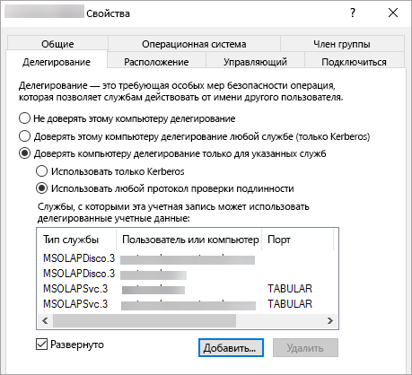

# <a name="configure-kerberos-to-use-power-bi-reports"></a>Настройка Kerberos для использования отчетов Power BI
<iframe width="640" height="360" src="https://www.youtube.com/embed/vCH8Fa3OpQ0?showinfo=0" frameborder="0" allowfullscreen></iframe>

Узнайте, как настроить сервер отчетов для проверки подлинности Kerberos в источниках данных, которые используются в отчетах Power BI для распределенной среды.

На сервере отчетов Power BI можно размещать отчеты Power BI. Сервер отчетов поддерживает множество источников данных. В этой статье описана система SQL Server Analysis Services, но рассматриваемые понятия применимы и к другим источникам данных, например к SQL Server.

Сервер отчетов Power BI, SQL Server и Analysis Services можно установить на одном компьютере. Все эти службы должны работать без дополнительной настройки. Это очень удобно для тестовой среды. Если эти службы установить на разных компьютерах, которые называются распределенной средой, то могут возникать ошибки. В этой среде необходимо использовать проверку подлинности Kerberos. Обязательной конфигурации, необходимой для реализации этой проверки подлинности, не существует. 

В частности, необходимо настроить ограниченное делегирование. Возможно, в вашей среде настроен протокол Kerberos, но в ней не настроено ограниченное делегирование.

## <a name="error-running-report"></a>Ошибка при выполнении отчета
Если сервер отчетов настроен неправильно, может появиться следующая ошибка.

    Something went wrong.

    We couldn’t run the report because we couldn’t connect to its data source. The report or data source might not be configured correctly. 

В технических сведениях вы увидите следующее сообщение.

    We couldn’t connect to the Analysis Services server. The server forcibly closed the connection. To connect as the user viewing the report, your organization must have configured Kerberos constrained delegation.


## <a name="configuring-kerberos-constrained-delegation"></a>Настройка ограниченного делегирования Kerberos
Для работы ограниченного делегирования Kerberos нужно настроить несколько элементов. Эти элементы включают имена субъектов-служб (SPN) и параметры делегирования учетных записей служб.

> [!NOTE]
> Только администратор домена имеет право настраивать параметры делегирования и имена субъектов-служб.
> 
> 

Потребуется настроить или проверить следующие компоненты.

1. Тип проверки подлинности в конфигурации сервера отчетов.
2. Имена субъектов-служб для учетной записи службы сервера отчетов.
3. Имена субъектов-служб для службы Analysis Services.
4. Имена субъектов-служб для службы браузера SQL на компьютере Analysis Services. Это касается только именованных экземпляров.
5. Параметры делегирования в учетной записи службы сервера отчетов.

## <a name="authentication-type-within-report-server-configuration"></a>Тип проверки подлинности в конфигурации сервера отчетов
Необходимо настроить тип проверки подлинности для сервера отчетов, чтобы разрешить ограниченное делегирование Kerberos. Это можно сделать в файле **rsreportserver.config**. По умолчанию этот файл находится в папке `C:\Program Files\Microsoft Power BI Report Server\PBIRS\ReportServer`.

В файле rsreportserver.config найдите раздел **Authentication/AuthenticationTypes**.

Убедитесь, что в списке типов проверки подлинности первым указан тип RSWindowsNegotiate. Список должен выглядеть так.

```xml
<AuthenticationTypes>
    <RSWindowsNegotiate/>
    <RSWindowsNTLM/>
</AuthenticationTypes>
```

Если вам потребовалось изменить файл конфигурации, необходимо остановиться и запустить сервер отчетов, чтобы проверить, вступили ли в силу изменения.

Дополнительные сведения см. в статье, посвященной [настройке проверки подлинности Windows на сервере отчетов](https://docs.microsoft.com/sql/reporting-services/security/configure-windows-authentication-on-the-report-server).

## <a name="spns-for-the-report-server-service-account"></a>Имена субъектов-служб для учетной записи службы сервера отчетов
Теперь нужно убедиться, что для сервера отчетов есть доступные допустимые имена субъектов-служб. Это зависит от учетной записи службы, настроенной для сервера отчетов.

### <a name="virtual-service-account-or-network-service"></a>Учетная запись виртуальной службы или сетевой службы
Если для сервера отчетов настроена учетная запись виртуальной службы или учетная запись сетевой службы, вам не нужно ничего делать. Речь идет об учетной записи компьютера. По умолчанию у учетной записи компьютера есть имена субъектов-служб HOST. Эти имена можно использовать для службы HTTP, и их будет использовать сервер отчетов.

Если вы используете имя виртуального сервера, которое не совпадает с учетной записью компьютера, вы не сможете использовать записи HOST. Поэтому вам нужно вручную добавить имена SPN для имени узла виртуального сервера.

### <a name="domain-user-account"></a>Учетная запись пользователя домена
Если сервер отчетов настроен для использования учетной записи пользователя домена, необходимо вручную создать имена субъектов-служб HTTP для этой учетной записи. Это можно сделать с помощью встроенного средства Windows SetSPN.

> [!NOTE]
> Вам потребуются права администратора домена, чтобы создать имя субъекта-службы.
> 
> 

Рекомендуется создать два имени SPN. Одно — с именем NetBIOS и другое — с полным доменным именем (FQDN). Ниже приведен формат имени субъекта-службы.

    <Service>/<Host>:<port>

Сервер отчетов Power BI будет использовать службу HTTP. Для имен субъектов-служб HTTP порт не будет отображаться. Здесь нас интересует служба HTTP. Узел имени субъекта-службы — это имя, которое вы используете в URL-адресе. Как правило, это имя компьютера. При наличии подсистемы балансировки нагрузки это может быть виртуальное имя.

> [!NOTE]
> Чтобы проверить URL-адрес, просмотрите введенный адрес в строке браузера или откройте вкладку "URL-адрес веб-портала" в диспетчере конфигурации сервера отчетов.
> 
> 

Если имя компьютера — ContosoRS, имена субъектов-служб будут выглядеть следующим образом.

| Тип SPN | SPN |
| --- | --- |
| Полное доменное имя (FQDN) |HTTP/ContosoRS.contoso.com |
| NetBIOS |HTTP/ContosoRS |

### <a name="location-of-spn"></a>Расположение SPN
Итак, где разместить имя субъекта-службы? Имя субъекта-службы будет размещено в учетной записи службы. Если вы используете учетную запись виртуальной или сетевой службы, это будет учетная запись компьютера. Хотя мы уже говорили об этом, это нужно будет сделать только для виртуального URL-адреса. Если вы используете пользователя домена для учетной записи службы сервера отчетов, поместите имя субъекта-службы в учетную запись этого пользователя домена.

Например, если мы используем учетную запись сетевой службы и имя компьютера ContosoRS, мы поместим имя субъекта-службы в ContosoRS.

При использовании учетной записи пользователя домена RSService следует поместить имя субъекта-службы в RSService.

### <a name="using-setspn-to-add-the-spn"></a>Добавление имени субъекта-службы с помощью SetSPN
Для добавления имени субъекта-службы можно использовать средство SetSPN. Следуйте приведенному выше примеру с учетной записью компьютера и учетной записью пользователя домена.

Размещение имени субъекта-службы в учетной записи компьютера (обоих имен: имени субъекта-службы NetBIOS и полного доменного имени) будет выглядеть, как в примере ниже, если использовать виртуальный URL-адрес contosoreports.

      Setspn -a HTTP/contosoreports.contoso.com ContosoRS
      Setspn -a HTTP/contosoreports ContosoRS

Размещение имени субъекта-службы в учетной записи пользователя домена (обоих имен: имени субъекта-службы NetBIOS и полного доменного имени) будет выглядеть, как в примере ниже, если использовать имя компьютера в качестве узла имени субъекта-службы.

      Setspn -a HTTP/ContosoRS.contoso.com RSService
      Setspn -a HTTP/ContosoRS RSService

## <a name="spns-for-the-analysis-services-service"></a>Имена субъектов-служб для службы Analysis Services
Настройка имен субъектов-служб для служб Analysis Services похожа на процедуру, которую вы выполняли для сервера отчетов Power BI. Формат имени субъекта-службы немного отличается, если вы используете именованный экземпляр.

Для Analysis Services используется служба MSOLAPSvc.3. Необходимо указать имя экземпляра для расположения порта в имени субъекта-службы. Часть, указывающая на узел, в имени субъекта-службы будет именем компьютера или именем кластера.

Пример имени субъекта-службы Analysis Services будет выглядеть следующим образом.

| Тип | Форматировать |
| --- | --- |
| Экземпляр по умолчанию |MSOLAPSvc.3/ContosoAS.contoso.com<br>MSOLAPSvc.3/ContosoAS |
| Именованный экземпляр |MSOLAPSvc.3/ContosoAS.contoso.com:INSTANCENAME<br>MSOLAPSvc.3/ContosoAS:INSTANCENAME |

Размещение имени субъекта-службы также похоже на процедуру размещения для сервера отчетов Power BI. Размещение зависит от учетной записи службы.  Если вы используете локальную систему или сетевую службу, вы используете учетную запись компьютера. Если вы используете учетную запись пользователя домена для экземпляра Analysis Services, поместите имя субъекта-службы в учетную запись этого пользователя домена.

### <a name="using-setspn-to-add-the-spn"></a>Добавление имени субъекта-службы с помощью SetSPN
Для добавления имени субъекта-службы можно использовать средство SetSPN. Например, имя компьютера будет ContosoAS.

Размещение имени субъекта-службы в учетной записи компьютера (обоих имен: имени субъекта-службы NetBIOS и полного доменного имени) будет выглядеть, как в примере ниже.

    Setspn -a MSOLAPSvc.3/ContosoAS.contoso.com ContosoAS
    Setspn -a MSOLAPSvc.3/ContosoAS ContosoAS

Размещение имени субъекта-службы в учетной пользователя домена (обоих имен: имени субъекта-службы NetBIOS и полного доменного имени) будет выглядеть, как в примере ниже.

    Setspn -a MSOLAPSvc.3/ContosoAS.contoso.com OLAPService
    Setspn -a MSOLAPSvc.3/ContosoAS OLAPService

## <a name="spns-for-the-sql-browser-service"></a>Имена субъектов-служб для службы браузера SQL
Если вы используете именованный экземпляр служб Analysis Services, убедитесь, что у вас есть имя субъекта-службы для службы браузера. Это имя должно быть уникальным для Analysis Services.

Настройка имен субъектов-служб для браузера SQL похожа на процедуру, которую вы выполняли для сервера отчетов Power BI.

Для браузера SQL используйте службу MSOLAPDisco.3. Необходимо указать имя экземпляра для расположения порта в имени субъекта-службы. Часть, указывающая на узел, в имени субъекта-службы будет именем компьютера или именем кластера.
Не нужно указывать значения порта и имени экземпляра.

Пример имени субъекта-службы Analysis Services будет выглядеть следующим образом.

    MSOLAPDisco.3/ContosoAS.contoso.com
    MSOLAPDisco.3/ContosoAS

Размещение имени субъекта-службы также похоже на процедуру размещения для сервера отчетов Power BI. Единственная разница — браузер SQL выполняется под учетной записью локальной системы. Это означает, что имена SPN всегда будут указываться в учетной записи компьютера. 

### <a name="using-setspn-to-add-the-spn"></a>Добавление имени субъекта-службы с помощью SetSPN
Для добавления имени субъекта-службы можно использовать средство SetSPN. Например, имя компьютера будет ContosoAS.

Размещение имени субъекта-службы в учетной записи компьютера (обоих имен: имени субъекта-службы NetBIOS и полного доменного имени) будет выглядеть, как в примере ниже.

    Setspn -a MSOLAPDisco.3/ContosoAS.contoso.com ContosoAS
    Setspn -a MSOLAPDisco.3/ContosoAS ContosoAS

Дополнительные сведения см. в статье об [обязательном имени субъекта-службы для службы браузера SQL Server](https://support.microsoft.com/kb/950599).

## <a name="delegation-settings-on-the-report-server-service-account"></a>Параметры делегирования в учетной записи службы сервера отчетов
В самом конце нужно настроить параметры делегирования в учетной записи службы сервера отчетов. Для этого можно использовать различные средства. Для целей этого документа мы ограничимся средством "Пользователи и компьютеры Active Directory".

Сначала откройте в средстве "Пользователи и компьютеры Active Directory" свойства учетной записи службы сервера отчетов. Это будет учетная запись компьютера, если используется учетная запись виртуальной службы или сетевая служба, либо учетная запись пользователя домена.

Необходимо настроить ограниченное делегирование с транзитом протокола. При использовании ограниченного делегирования необходимо явно указать службы, для которых настраивается делегирование. В список служб, которым можно назначать делегирование сервера отчетов Power BI, будут добавлены имя субъекта-службы Analysis Services и имя субъекта-службы браузера SQL.

1. Щелкните правой кнопкой мыши учетную запись службы сервера отчетов и выберите **Свойства**.
2. Выберите вкладку **Делегирование**.
3. Выберите параметр **Доверять компьютеру делегирование указанных служб**.
4. Выберите **Использовать любой протокол проверки подлинности**.
5. В разделе **Службы, которым эта учетная запись может предоставлять делегированные учетные данные** нажмите кнопку **Добавить**.
6. В открывшемся диалоговом окне выберите **Пользователи или компьютеры**.
7. Введите учетную запись службы для Analysis Services и нажмите кнопку **ОК**.
8. Выберите имя субъекта-службы, которое вы создали. Оно будет начинаться с `MSOLAPSvc.3`. Если вы добавили полное доменное имя и имя субъекта-службы NetBIOS, выберите оба имени. Вы можете увидеть только одно имя.
9. Нажмите кнопку **ОК**.  Вы должны увидеть имя субъекта-службы в списке.
10. При необходимости можно выбрать **Развернуто**, чтобы увидеть в списке имя субъекта-службы NetBIOS и полное доменное имя.
11. Еще раз нажмите кнопку **Добавить**. Теперь добавьте имя субъекта-службы браузера SQL.
12. В открывшемся диалоговом окне выберите **Пользователи или компьютеры**.
13. Введите имя компьютера, на котором работает служба браузера SQL, и нажмите кнопку **ОК**.
14. Выберите имя субъекта-службы, которое вы создали. Оно будет начинаться с `MSOLAPDisco.3`. Если вы добавили полное доменное имя и имя субъекта-службы NetBIOS, выберите оба имени. Вы можете увидеть только одно имя.
15. Нажмите кнопку **ОК**. Если установлен флажок **Развернуто**, диалоговое окно должно выглядеть следующим образом.
    
    
16. Нажмите кнопку **ОК**.
17. Перезапустите сервер отчетов Power BI.

## <a name="running-a-power-bi-report"></a>Запуск отчета Power BI
После выполнения всех приведенных выше настроек отчет должен отображаться правильно. 


Хотя эта конфигурация должна работать в большинстве случаев при использовании Kerberos, в зависимости от вашей среды может понадобиться другая конфигурация. Если отчет по-прежнему не будет загружаться, обратитесь к администратору домена, чтобы выяснить причину, или обратитесь в службу поддержки.

## <a name="next-steps"></a>Дальнейшие действия
[Обзор функций администратора](admin-handbook-overview.md)  
[Установка сервера отчетов Power BI](install-report-server.md)  

У вас имеются и другие вопросы? [Попробуйте задать вопрос в сообществе Power BI.](https://community.powerbi.com/)

