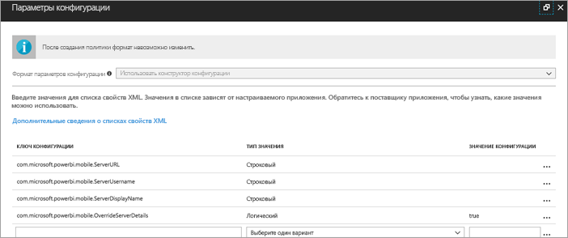
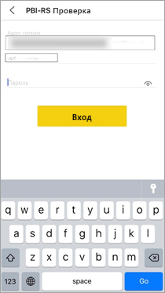

# Удаленная настройка доступа мобильных приложений Power BI для iOS к серверу отчетов

В этой статье вы узнаете, как настроить доступ мобильных приложений Power BI для iOS к серверу отчетов с помощью средства MDM организации. Для этого ИТ-администратор создает политику настройки приложения с требуемыми сведениями, которые передаются в приложение. 

 После этого пользователям мобильного приложения Power BI для iOS будет проще подключаться к серверу отчетов организации, так как подключение к нему уже настроено. 

## Создание политики настройки приложения в средстве MDM 

Чтобы создать политику настройки приложения, администратору нужно выполнить в Microsoft Intune указанные ниже действия. В других средствах MDM процедура, необходимая для создания политики настройки приложения, может быть иной. 

1. Подключите средство MDM. 
2. Создайте политику настройки приложения и присвойте ей имя. 
3. Выберите пользователей, к которым будет применена эта политика. 
4. Создайте пары "ключ — значение". 

Эти пары представлены в таблице ниже.

|Ключ  |Тип  |Описание  |
|---------|---------|---------|
| com.microsoft.powerbi.mobile.ServerURL | Строка | URL-адрес сервера отчетов   Должен начинаться с префикса http или https |
| com.microsoft.powerbi.mobile.ServerUsername | Строка | [необязательно]   Имя пользователя для подключения к серверу.   Если оно отсутствует, в приложении будет выведен запрос на ввод имени пользователя.| 
| com.microsoft.powerbi.mobile.ServerDisplayName | Строка | [необязательно]   Значение по умолчанию — "Сервер отчетов"   Понятное имя, представляющее сервер в приложении | 
| com.microsoft.powerbi.mobile.OverrideServerDetails | Логический | Значение по умолчанию — True  Если задано значение True (Истина), этот параметр переопределяет любое уже имеющееся определение сервера отчетов на мобильном устройстве. Уже настроенные существующие серверы удаляются.   Кроме того, пользователь не может удалить данную конфигурацию.   Если задано значение False, передаваемые значения добавляются, но существующие параметры сохраняются.   Если в мобильном приложении уже настроен тот же URL-адрес сервера, приложение оставляет эту конфигурацию нетронутой. Приложение не требует, чтобы пользователь вновь проходил проверку подлинности на том же сервере. |

Ниже приведен пример настройки политики конфигурации с помощью Intune.

## Подключение конечных пользователей к серверу отчетов

 Предположим, вы публикуете политику настройки приложения для списка рассылки. Когда пользователи и устройства в этом списке рассылки запускают мобильное приложение iOS, они должны будут выполнить следующие действия. 

1. Появляется сообщение о том, что для мобильного приложения настроен доступ к серверу отчетов. Пользователю необходимо коснуться элемента **Вход**.

    

2.  На странице **Подключение к серверу** сведения о сервере отчетов уже заполнены. Необходимо коснуться элемента **Подключиться**.

    

3. Необходимо ввести пароль, чтобы пройти проверку подлинности, а затем коснуться элемента **Вход**. 

    

Теперь пользователи могут просматривать ключевые показатели эффективности и отчеты Power BI, хранящиеся на сервере отчетов, и взаимодействовать с ними.

## Дальнейшие действия

- [Обеспечение удаленного доступа к Power BI Mobile с помощью Azure Active Directory Application Proxy](https://docs.microsoft.com/azure/active-directory/manage-apps/application-proxy-integrate-with-power-bi)
- [Обзор функций администратора](admin-handbook-overview.md)  
- [Установка сервера отчетов Power BI](install-report-server.md)  

Появились дополнительные вопросы? [Попробуйте задать вопрос в сообществе Power BI.](https://community.powerbi.com/)

