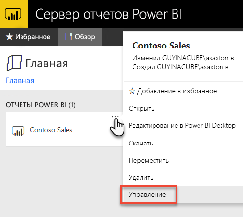
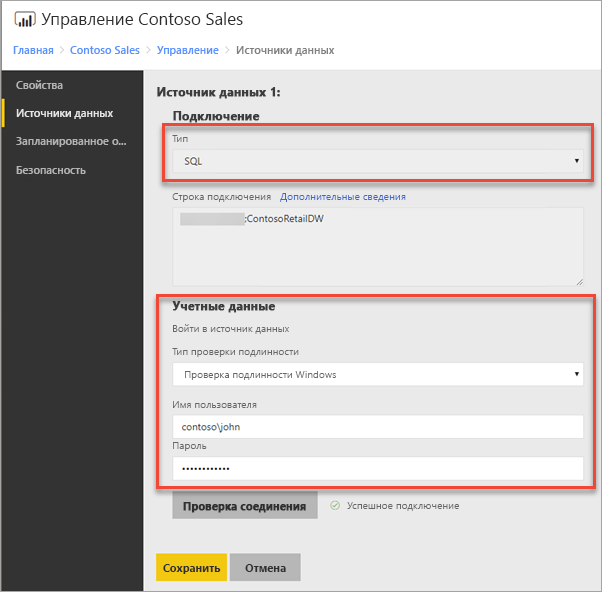
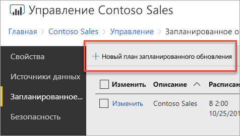
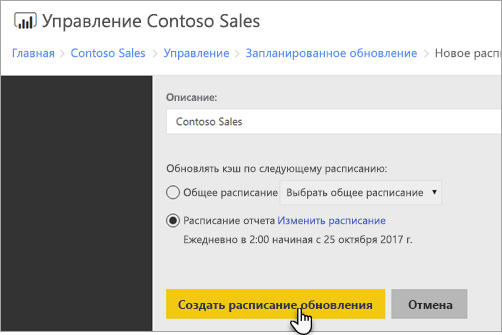
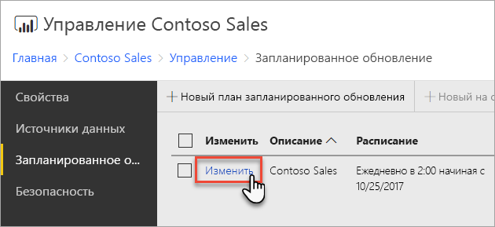
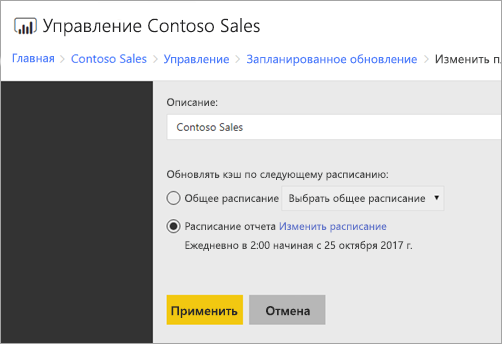

# Как настроить запланированное обновление отчета Power BI
Для обновления данных в отчете Power BI необходимо создать расписание обновления. Это можно сделать в области *Управление* отчета Power BI.

## Настройка учетных данных для источника данных
Прежде чем создать расписание обновления данных, необходимо задать учетные данные для **каждого источника данных**, используемого в отчете Power BI.

1. На веб-портале щелкните правой кнопкой мыши отчет Power BI и выберите пункт **Управление**.
   
    
2. В меню слева выберите вкладку **Источники данных**.
3. Для каждого появившегося источника данных выберите тип аутентификации, который будет использоваться при подключении к источнику данных. Введите соответствующие учетные данные.
   
    

## Создание расписания обновления
Чтобы создать расписание обновления, сделайте следующее:

1. На веб-портале щелкните правой кнопкой мыши отчет Power BI и выберите пункт **Управление**.
   
    
2. В меню слева выберите вкладку **Запланированное обновление**.
3. На странице **Запланированное обновление** щелкните **Создать расписание обновления**.
   
    
4. На странице **Создание расписания обновления** введите описание и настройте расписание для обновления модели данных.
5. По завершении нажмите кнопку **Создать расписание обновления**.
   
    

## Изменение расписания обновления
Изменение расписания обновления выполняется так же, как и его создание.

1. На веб-портале щелкните правой кнопкой мыши отчет Power BI и выберите пункт **Управление**.
   
    
2. В меню слева выберите вкладку **Запланированное обновление**.
3. На странице **Запланированное обновление** щелкните **Изменить** рядом с расписанием обновления, которое нужно изменить.
   
    
4. На странице **Изменение расписания обновления** введите описание и настройте расписание для обновления модели данных.
5. По завершении нажмите кнопку **Применить**.
   
    

## Просмотр состояния расписания обновления
Просмотреть состояние расписания обновления можно на веб-портале.

1. На веб-портале щелкните правой кнопкой мыши отчет Power BI и выберите пункт **Управление**.
   
    
2. В меню слева выберите вкладку **Запланированное обновление**.
3. На странице **Запланированное обновление** в крайнем столбце справа отображается состояние расписания.
   
   | **Состояние** | **Описание** |
   | --- | --- |
   | Новое расписание обновления |Расписание создано, но не выполняется. |
   | Обновление |Запущен процесс обновления. |
   | Потоковая передача модели на сервер анализа данных |Выполняется копирование модели из базы данных каталога сервера отчетов в размещенный экземпляр служб Analysis Services. |
   | Обновление данных |Выполняется обновление данных в модели. |
   | Удаление учетных данных из модели |Из модели удалены учетные данные для подключения к источнику данных. |
   | Сохранение модели в каталог |Обновление данных завершено и обновленная модель сохраняется обратно в базу данных каталога сервера отчетов. |
   | Обновление данных завершено |Обновление выполнено. |
   | Ошибка |При обновлении данных произошла ошибка, которая отображается на экране. |

Чтобы узнать текущее состояние, необходимо обновить веб-страницу. Состояние не изменится автоматически.

## Дальнейшие действия
Дополнительные сведения о создании и изменении расписаний см. в руководстве по [созданию, изменению и удалению расписаний](https://docs.microsoft.com/sql/reporting-services/subscriptions/create-modify-and-delete-schedules).

Сведения об устранении неполадок с запланированным обновлением см. в статье [Troubleshoot scheduled refresh in Power BI Report Server](scheduled-refresh-troubleshoot.md) (Устранение неполадок с запланированным обновлением в сервере отчетов Power BI).

Появились дополнительные вопросы? [Попробуйте задать вопрос в сообществе Power BI.](https://community.powerbi.com/)

