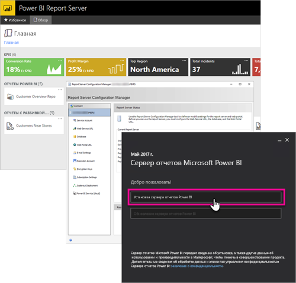

# Общие сведения о руководстве для разработчика сервера отчетов Power BI
Это — руководство для разработчика сервера отчетов Power BI, локального расположения для хранения и администрирования ваших отчетов Power BI, мобильных отчетов и отчетов с разбивкой на страницы.

В этом руководстве описаны возможности работы с сервером отчетов Power BI, доступные разработчику.

## Внедрение
Любой отчет на сервере Power BI можно внедрить в iFrame, добавив параметр строки запроса `?rs:Embed=true` в URL-адрес. Эта возможность доступна для отчетов Power BI и отчетов других типов.

### Управление средством просмотра отчетов
Работая с отчетами с разбивкой на страницы, можно использовать элемент управления средства просмотра отчетов. Этот элемент управления можно поместить в приложение .NET для Windows или веб-приложение. См. дополнительные сведения об [элементе управления средства просмотра](https://docs.microsoft.com/sql/reporting-services/application-integration/integrating-reporting-services-using-reportviewer-controls-get-started).

## API-интерфейсы
Существует несколько вариантов взаимодействия API с сервером отчетов Power BI, а именно:

* [REST API](rest-api.md);
* [Доступ к URL-адресу](https://docs.microsoft.com/sql/reporting-services/url-access-ssrs)
* [Поставщик WMI](https://docs.microsoft.com/sql/reporting-services/wmi-provider-library-reference/reporting-services-wmi-provider-library-reference-ssrs)

Для управления сервером отчетов можно также использовать [служебные программы PowerShell](https://github.com/Microsoft/ReportingServicesTools) с открытым исходным кодом.

> [!NOTE]
> Служебные программы PowerShell в настоящее время не поддерживают файлы Power BI Desktop (PBIX).
> 
> 

## Пользовательские расширения
Библиотека расширений — это набор классов, интерфейсов и типов значений, доступных на сервере отчетов Power BI. Эта библиотека обеспечивает доступ к функциональным возможностям системы. Она предназначена для использования приложений Microsoft .NET Framework для расширения компонентов сервера отчетов Power BI.

Вы можете создавать расширения нескольких типов.

* Расширения обработки данных
* Расширения доставки
* Расширения подготовки отчетов для отчетов с разбивкой на страницы
* Расширения безопасности

См. дополнительные сведения о [библиотеке расширений](https://docs.microsoft.com/sql/reporting-services/extensions/reporting-services-extension-library).

## Дальнейшие действия
[Приступая к работе с элементом управления средства просмотра отчетов](https://docs.microsoft.com/sql/reporting-services/application-integration/integrating-reporting-services-using-reportviewer-controls-get-started)  
[Создание приложений с помощью веб-службы и платформы .NET Framework](https://docs.microsoft.com/sql/reporting-services/report-server-web-service/net-framework/building-applications-using-the-web-service-and-the-net-framework)  
[Доступ к URL-адресу](https://docs.microsoft.com/sql/reporting-services/url-access-ssrs)  
[Библиотека расширений](https://docs.microsoft.com/sql/reporting-services/extensions/reporting-services-extension-library)  
[Поставщик WMI](https://docs.microsoft.com/sql/reporting-services/wmi-provider-library-reference/reporting-services-wmi-provider-library-reference-ssrs)

Появились дополнительные вопросы? [Попробуйте задать вопрос в сообществе Power BI.](https://community.powerbi.com/)

