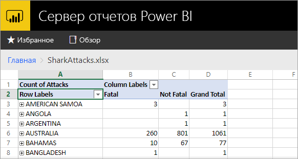
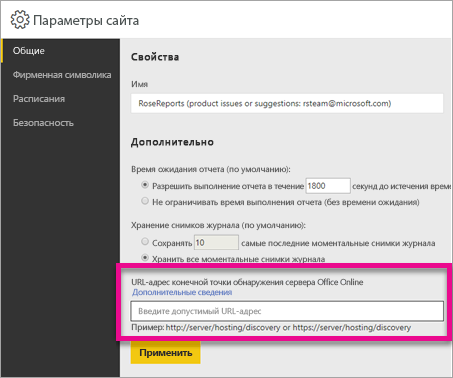

# <a name="configure-your-report-server-to-host-excel-workbooks-using-office-online-server-oos"></a>Настройка сервера отчетов для размещения книг Excel с использованием Office Online Server (OOS)

Кроме просмотра отчетов Power BI на веб-портале в решении "Сервер отчетов Microsoft Power BI" можно размещать книги Excel с помощью [Office Online Server](https://docs.microsoft.com/officeonlineserver/office-online-server-overview) (OOS). Сервер отчетов можно использовать как единое расположение для публикации и просмотра самостоятельного содержимого Microsoft BI.



## <a name="prepare-server-to-run-office-online-server"></a>Подготовка сервера к работе с Office Online Server

Выполните описанные ниже процедуры на сервере, где будет выполняться Office Online Server. Это должен быть сервер Windows Server 2012 R2 или Windows Server 2016. Для работы Windows Server 2016 требуется выпуск Office Online Server за апрель 2017 г. или более поздняя версия.

### <a name="install-prerequisite-software-for-office-online-server"></a>Установка необходимого программного обеспечения для Office Online Server

1. Откройте командную строку Windows PowerShell с правами администратора и выполните следующую команду, чтобы установить необходимые роли и службы.

    **Windows Server 2012 R2:**

    ```powershell
    Add-WindowsFeature Web-Server,Web-Mgmt-Tools,Web-Mgmt-Console,Web-WebServer,Web-Common-Http,Web-Default-Doc,Web-Static-Content,Web-Performance,Web-Stat-Compression,Web-Dyn-Compression,Web-Security,Web-Filtering,Web-Windows-Auth,Web-App-Dev,Web-Net-Ext45,Web-Asp-Net45,Web-ISAPI-Ext,Web-ISAPI-Filter,Web-Includes,InkandHandwritingServices,NET-Framework-Features,NET-Framework-Core,NET-HTTP-Activation,NET-Non-HTTP-Activ,NET-WCF-HTTP-Activation45,Windows-Identity-Foundation,Server-Media-Foundation
    ```

    **Windows Server 2016:**

    ```powershell
    Add-WindowsFeature Web-Server,Web-Mgmt-Tools,Web-Mgmt-Console,Web-WebServer,Web-Common-Http,Web-Default-Doc,Web-Static-Content,Web-Performance,Web-Stat-Compression,Web-Dyn-Compression,Web-Security,Web-Filtering,Web-Windows-Auth,Web-App-Dev,Web-Net-Ext45,Web-Asp-Net45,Web-ISAPI-Ext,Web-ISAPI-Filter,Web-Includes,NET-Framework-Features,NET-Framework-45-Features,NET-Framework-Core,NET-Framework-45-Core,NET-HTTP-Activation,NET-Non-HTTP-Activ,NET-WCF-HTTP-Activation45,Windows-Identity-Foundation,Server-Media-Foundation
    ```

    При появлении соответствующего запроса перезагрузите сервер.
2. Установите следующее программное обеспечение:

   * [.NET Framework 4.5.2](https://go.microsoft.com/fwlink/p/?LinkId=510096).
   * [Распространяемые пакеты Visual C++ для Visual Studio 2013](https://www.microsoft.com/download/details.aspx?id=40784).
   * [Распространяемый компонент Visual C++ для Visual Studio 2015](https://go.microsoft.com/fwlink/p/?LinkId=620071).
   * [Microsoft.IdentityModel.Extention.dll](https://go.microsoft.com/fwlink/p/?LinkId=620072).

### <a name="install-office-online-server"></a>Установка Office Online Server

Вы можете использовать функции Excel Online с доступом к внешним данным (например, Power Pivot). Но при этом решение Office Online Server должно находиться в том же лесу Active Directory, что и его пользователи, а также все источники внешних данных, к которым вы планируете получить доступ с помощью аутентификации Windows.

1. Скачайте Office Online Server с веб-сайта [Volume Licensing Service Center (VLSC)](http://go.microsoft.com/fwlink/p/?LinkId=256561). Файлы для скачивания находятся в разделе продуктов Office на портале VLSC. Разработчики могут скачать OOS на сайте MSDN для подписчиков.
2. Запустите Setup.exe.
3. На странице **Условия лицензионного соглашения на использование программного обеспечения корпорации Майкрософт** выберите **Я принимаю условия этого соглашения** и нажмите кнопку **Продолжить**.
4. На странице **Выбор расположения файлов** выберите папку, в которую вы хотите установить файлы Office Online Server (например, C:\Program Files\Microsoft Office Web Apps\*), а затем выберите **Установить сейчас**. Если указанная папка не существует, она будет создана автоматически.

    Рекомендуем установить Office Online Server на системном диске.

5. Когда установка Office Online Server будет завершена, нажмите кнопку **Закрыть**.

### <a name="install-language-packs-for-office-web-apps-server-optional"></a>Установка языковых пакетов для сервера Office Web Apps (необязательно)

Языковые пакеты Office Online Server позволяют пользователям просматривать веб-файлы Office на нескольких языках.

Чтобы установить языковые пакеты, выполните следующие инструкции.

1. Скачайте языковые пакеты Office Online Server в [Центре загрузки Майкрософт](http://go.microsoft.com/fwlink/p/?LinkId=798136).
2. Запустите **wacserverlanguagepack.exe**.
3. В мастере языковых пакетов Office Online Server на странице **Условия лицензионного соглашения на использование программного обеспечения корпорации Майкрософт** выберите **Я принимаю условия этого соглашения** и нажмите кнопку **Продолжить**.
4. Когда установка Office Online Server будет завершена, нажмите кнопку **Закрыть**.

## <a name="deploy-office-online-server"></a>Развертывание Office Online Server

### <a name="create-the-office-online-server-farm-https"></a>Создание фермы Office Online Server (HTTPS)

С помощью команды New-OfficeWebAppsFarm создайте ферму Office Online Server, состоящую из одного сервера, как показано в примере ниже.

```powershell
New-OfficeWebAppsFarm -InternalUrl "https://server.contoso.com" -ExternalUrl "https://wacweb01.contoso.com" -CertificateName "OfficeWebApps Certificate"
```

**Параметры**

* **— InternalURL** — полное доменное имя (FQDN) сервера, на котором выполняется Office Online Server, например `http://servername.contoso.com`.
* **— ExternalURL** — полное доменное имя, по которому можно осуществлять доступ через Интернет.
* **— CertificateName** — понятное имя сертификата.

### <a name="create-the-office-online-server-farm-http"></a>Создание фермы Office Online Server (HTTP)

С помощью команды New-OfficeWebAppsFarm создайте ферму Office Online Server, состоящую из одного сервера, как показано в примере ниже.

```powershell
New-OfficeWebAppsFarm -InternalURL "http://servername" -AllowHttp
```

**Параметры**

* **— InternalURL** — имя сервера, на котором выполняется Office Online Server, например `http://servername`.
* **— AllowHttp** — параметр, который отвечает за настройку фермы для использования протокола HTTP.

### <a name="verify-that-the-office-online-server-farm-was-created-successfully"></a>Проверка созданной фермы Office Online Server

Сведения о созданной ферме отображаются в командной строке Windows PowerShell. Чтобы убедиться, что ферма Office Online Server правильно установлена и настроена, введите в веб-браузере URL-адрес обнаружения Office Online Server, как показано в примере ниже. URL-адрес обнаружения — это параметр *InternalUrl*, указанный при настройке фермы Office Online Server, к которому добавляется */hosting/discovery*, например:

```
<InternalUrl>/hosting/discovery
```

Если Office Online Server работает надлежащим образом, в веб-браузере должен отобразиться XML-файл обнаружения для протокола интерфейса Web Application Open Platform (WOPI). Первые несколько строк в этом файле должны выглядеть так:

```xml
<?xml version="1.0" encoding="utf-8" ?> 
<wopi-discovery>
<net-zone name="internal-http">
<app name="Excel" favIconUrl="<InternalUrl>/x/_layouts/images/FavIcon_Excel.ico" checkLicense="true">
<action name="view" ext="ods" default="true" urlsrc="<InternalUrl>/x/_layouts/xlviewerinternal.aspx?<ui=UI_LLCC&><rs=DC_LLCC&>" /> 
<action name="view" ext="xls" default="true" urlsrc="<InternalUrl>/x/_layouts/xlviewerinternal.aspx?<ui=UI_LLCC&><rs=DC_LLCC&>" /> 
<action name="view" ext="xlsb" default="true" urlsrc="<InternalUrl>/x/_layouts/xlviewerinternal.aspx?<ui=UI_LLCC&><rs=DC_LLCC&>" /> 
<action name="view" ext="xlsm" default="true" urlsrc="<InternalUrl>/x/_layouts/xlviewerinternal.aspx?<ui=UI_LLCC&><rs=DC_LLCC&>" /> 
```

### <a name="configure-excel-workbook-maximum-size"></a>Настройка максимального размера книги Excel

Максимальный размер файлов для решения "Сервер отчетов Power BI" составляет 100 МБ. Чтобы обеспечить соответствие этому требованию, вам нужно выполнить настройку в OOS вручную.

```powershell
Set-OfficeWebAppsFarm -ExcelWorkbookSizeMax 100
```

## <a name="using-effectiveusername-with-analysis-services"></a>Использование EffectiveUserName с Analysis Services

Далее описано, как разрешить активные подключения к Analysis Services для книги Excel, в которой используется EffectiveUserName. Чтобы использовать EffectiveUserName в OOS, вам нужно добавить учетную запись компьютера сервера OOS с правами администратора для экземпляра Analysis Services. Чтобы сделать это, требуется среда Management Studio для SQL Server 2016 или более поздней версии.

Для книг Excel сейчас поддерживаются только внедренные подключения Analysis Services. Учетная запись пользователя должна иметь разрешение на подключение к Analysis Services, так как возможности прокси-сервера для пользователя недоступны.

Выполните следующие команды PowerShell на сервере OOS:

```powershell
Set-OfficeWebAppsFarm -ExcelUseEffectiveUserName:$true
Set-OfficeWebAppsFarm -ExcelAllowExternalData:$true
Set-OfficeWebAppsFarm -ExcelWarnOnDataRefresh:$false
```

## <a name="configure-a-power-pivot-instance-for-data-models"></a>Настройка экземпляра Power Pivot для моделей данных

Установив экземпляр режима Power Pivot для Analysis Services, можно работать с книгами Excel, использующими Power Pivot. Убедитесь, что для имени экземпляра установлено значение *POWERPIVOT*. Добавьте учетную запись компьютера сервера OOS с правами администратора для экземпляра режима Power Pivot для Analysis Services. Чтобы сделать это, требуется среда Management Studio для SQL Server 2016 или более поздней версии.

Чтобы в OOS использовался экземпляр режима Power Pivot, выполните следующую команду:

```powershell
New-OfficeWebAppsExcelBIServer -ServerId <server_name>\POWERPIVOT
```

Если вы еще не разрешили внешние данные, в описанной выше процедуре по подключению Analysis Services выполните следующую команду:

```powershell
Set-OfficeWebAppsFarm -ExcelAllowExternalData:$true
```

### <a name="firewall-considerations"></a>Рекомендации по использованию брандмауэров

Чтобы избежать проблем с брандмауэром, откройте порты 2382 и 2383. Кроме того, можно добавить *msmdsrv.exe* в качестве политики брандмауэра приложения для экземпляра Power Pivot.

## <a name="configure-power-bi-report-server-to-use-the-oos-server"></a>Настройка решения "Сервер отчетов Power BI" для использования сервера OOS

На странице **Общие** в разделе **Настройки веб-сайта** введите URL-адрес обнаружения OOS. URL-адрес обнаружения OOS — это параметр *InternalUrl*, используемый при развертывании сервера OOS, к которому добавляется */hosting/discovery*. Например, `http://servername/hosting/discovery` для протокола HTTP. И `https://server.contoso.com/hosting/discovery` для протокола HTTPS.

Чтобы перейти к разделу **Настройки веб-сайта** выберите **значок шестеренки** вверху справа и щелкните **Настройки веб-сайта**.

URL-адрес обнаружения Office Online Server отображается только для пользователя с ролью **Системный администратор**.



Введите URL-адрес обнаружения и щелкните **Применить**, выбрав книги Excel. На веб-портале должна отобразиться книга.

## <a name="limitations-and-considerations"></a>Рекомендации и ограничения

* Книги будут доступны только для чтения.

## <a name="next-steps"></a>Дальнейшие действия

[Обзор функций администратора](admin-handbook-overview.md)  
[Установка сервера отчетов Power BI](install-report-server.md)  
[Загрузка построителя отчетов](https://www.microsoft.com/download/details.aspx?id=53613)  
[Download SQL Server Data Tools (SSDT)](http://go.microsoft.com/fwlink/?LinkID=616714) (Скачивание SQL Server Data Tools (SSDT))

Появились дополнительные вопросы? [Попробуйте задать вопрос в сообществе Power BI.](https://community.powerbi.com/)
