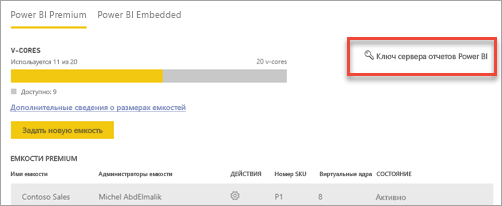
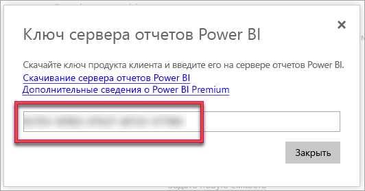
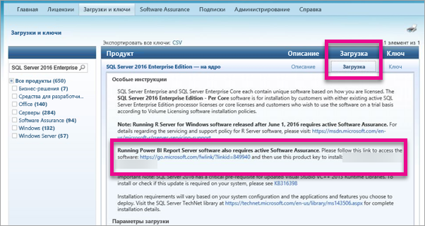

# Как найти ключ продукта сервера отчетов
Узнайте, как найти ключ продукта сервера отчетов Power BI для установки сервера в рабочей среде.

<iframe width="640" height="360" src="https://www.youtube.com/embed/6CQnf-NGtpU?rel=0&amp;showinfo=0" frameborder="0" allowfullscreen></iframe>

Вы загрузили сервер отчетов Power BI и заключили соглашение SQL Server Enterprise Software Assurance. Или вы приобрели версию Power BI Premium. Для установки сервера в рабочей среде требуется ключ продукта. Где же ключ продукта? 

Ключ находится в одном из двух расположений. Это зависит от приобретенного продукта.

## Приобретена версия Power BI Premium
Если вы приобрели Power BI Premium, на портале администрирования Power BI на вкладке **Параметры емкости** будет отображаться ключ продукта для Сервера отчетов Power BI. Это будет доступно только глобальным администраторам или пользователям, которым назначена роль администратора службы Power BI.

Щелкните **Ключ сервера отчетов Power BI**, чтобы появилось диалоговое окно с ключом вашего продукта. Вы можете скопировать его и использовать при установке.

## Заключено соглашение Software Assurance
Если вы заключили соглашение SQL Server Enterprise SA, то можете получить ключ продукта на веб-сайте [Volume Licensing Service Center](https://www.microsoft.com/Licensing/servicecenter/). Возможно, ключ находится в последнем пакете обновления для последней версии SQL Server. Если его там нет, посмотрите в выпуске RTM последней версии SQL Server.

> [!NOTE]
> Просмотрите раздел "Загрузка", а не раздел "Ключи".
> 
> 

## Дальнейшие действия
[Установка сервера отчетов Power BI](install-report-server.md)  
[Установка приложения Power BI Desktop, оптимизированного для сервера отчетов Power BI](install-powerbi-desktop.md)  
[Загрузка построителя отчетов](https://www.microsoft.com/download/details.aspx?id=53613)  
[Download SQL Server Data Tools (SSDT)](https://go.microsoft.com/fwlink/?LinkID=616714) (Скачивание SQL Server Data Tools (SSDT))

Появились дополнительные вопросы? [Попробуйте задать вопрос в сообществе Power BI.](https://community.powerbi.com/)

