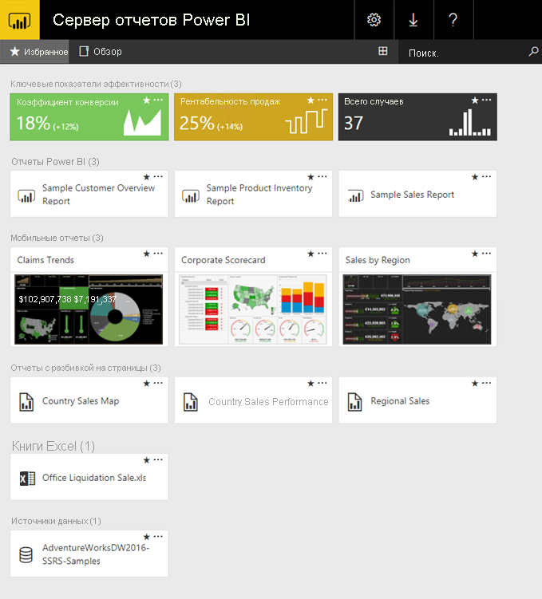

# Что такое Сервер отчетов Power BI?

Сервер отчетов Power BI — это локальный сервер отчетов с веб-порталом, на котором вы можете просматривать и администрировать отчеты и ключевые показатели эффективности, а также дополнительными инструментами для создания отчетов Power BI, отчетов с разбивкой на страницы, мобильных отчетов и ключевых показателей эффективности. У пользователей есть несколько вариантов доступа к этим отчетам: просмотр в веб-браузере, просмотр на мобильном устройстве, получение в виде сообщения электронной почты.

## Сравнительный анализ Сервера отчетов Power BI 
Функции Сервера отчетов Power BI похожи на функции SQL Server Reporting Services и веб-службы Power BI. На службу Power BI Сервер отчетов Power BI похож возможностью размещать отчеты Power BI (.PBIX) и файлы Excel. На Reporting Services Сервер отчетов Power BI похож локальным размещением и возможностью размещать отчеты с разбивкой на страницы (.RDL). Сервер отчетов Power BI является надмножеством Reporting Services и, соответственно, поддерживает все функции Reporting Services, а также ряд дополнительных возможностей, включая отчеты Power BI. См. дополнительные сведения о [сравнении Сервера отчетов Power BI и службы Power BI](compare-report-server-service.md).

## Лицензирование Сервера отчетов Power BI
Сервер отчетов Power BI можно использовать с двумя разными лицензиями: [Power BI Premium](../service-premium.md) или [SQL Server Enterprise Edition](https://www.microsoft.com/sql-server/sql-server-2017-editions) по программе Software Assurance. Лицензия Power BI Premium позволяет создавать гибридные развертывания, сочетающие облачные и локальные технологии.  

## Веб-портал
Основной точкой взаимодействия с Сервером отчетов Power BI является защищенный веб-портал, который можно просматривать в любом современном браузере. Здесь вам доступны все отчеты и ключевые показатели эффективности. Содержимое веб-портала организовано в традиционную иерархию папок. Содержимое в этих папках группируется по следующим типам: отчеты Power BI, мобильные отчеты, отчеты с разбивкой на страницы, ключевые показатели эффективности и книги Excel, а также общие наборы данных и общие источники данных в качестве стандартных блоков для создания отчетов. Вы можете отмечать избранные элементы, чтобы просматривать их в отдельной папке. Можно также создавать ключевые показатели эффективности прямо на веб-портале. 

Вы можете управлять содержимым веб-портала в зависимости от предоставленных вам разрешений. Вы можете планировать обработку отчетов, открывать отчет по требованию и (или) подписываться на регулярно публикуемые отчеты. Также вы можете применять к веб-порталу оформление с [фирменной символикой](https://docs.microsoft.com/sql/reporting-services/branding-the-web-portal). 

См. дополнительные сведения о [веб-портале (основной режим служб SSRS)](https://docs.microsoft.com/sql/reporting-services/web-portal-ssrs-native-mode).

## Отчеты Power BI
Версия Power BI Desktop, оптимизированная для сервера отчетов, позволяет создавать отчеты Power BI (.PBIX). Вы можете опубликовать и просматривать их на веб-портале в созданной вами среде.

Отчет Power BI — это разностороннее представление модели данных на основе визуализаций, которые отображают разные результаты и сведения о выбранной модели данных.  В отчете может быть одна визуализация или несколько страниц, заполненных визуализациями. В зависимости от назначенной вам роли, вы можете читать и изучать отчеты или создавать новые отчеты для других пользователей.

[Установка приложения Power BI Desktop, оптимизированного для сервера отчетов Power BI](quickstart-create-powerbi-report.md).

## Отчеты с разбивкой на страницы
Отчеты с разбивкой на страницы (.RDL) — это отчеты в формате документа с визуализациями, позволяющие расширять таблицы горизонтально и (или) вертикально на несколько страниц, чтобы поместить все необходимые данные. Они отлично подходят для создания документов с фиксированным макетом и разрешением, оптимизированных для печати, например файлов в формате PDF и Word.

Для создания этих современных отчетов используется [построитель отчетов](https://docs.microsoft.com/sql/reporting-services/report-builder/report-builder-in-sql-server-2016) или конструктор отчетов в [SQL Server Data Tools (SSDT)](https://docs.microsoft.com/sql/reporting-services/tools/reporting-services-in-sql-server-data-tools-ssdt).

## Мобильные отчеты Reporting Services
Мобильные отчеты подключаются к локальным источникам данных и имеют удобный макет, который адаптируется к разным типам, форматам и ориентациям устройств. Для создания таких отчетов применяется издатель мобильных отчетов для SQL Server.

См. дополнительные сведения о [мобильных отчетах Reporting Services](https://docs.microsoft.com/sql/reporting-services/mobile-reports/create-mobile-reports-with-sql-server-mobile-report-publisher). 

## Функции программирования сервера отчетов
Воспользуйтесь преимуществами функций программирования сервера отчетов Power BI, чтобы расширять и настраивать возможности отчетов с помощью API-интерфейсов для интеграции или расширения данных и обработки отчетов в пользовательских приложениях.

См. дополнительные сведения в [документации разработчика сервера отчетов](https://docs.microsoft.com/sql/reporting-services/reporting-services-developer-documentation).

## Дальнейшие действия
[Установка сервера отчетов Power BI](install-report-server.md)  
[Install Report Builder](https://docs.microsoft.com/sql/reporting-services/install-windows/install-report-builder) (Установка построителя отчетов)  

Появились дополнительные вопросы? [Попробуйте задать вопрос в сообществе Power BI.](https://community.powerbi.com/)

