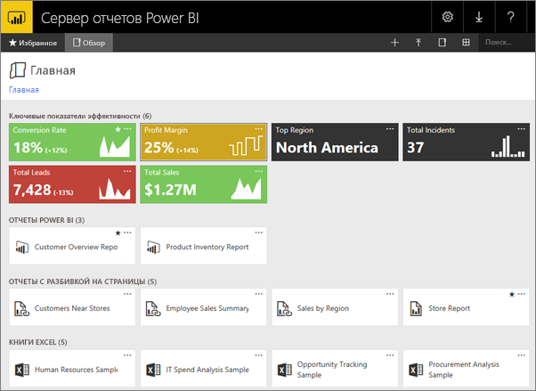
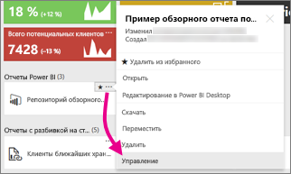
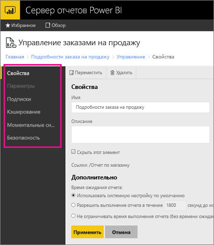
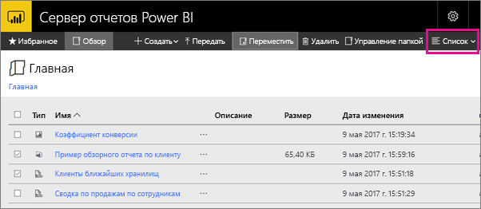

# Навигация по веб-порталу сервера отчетов Power BI
Веб-портал сервера отчетов Power BI — это локальное расположение для просмотра и хранения отчетов Power BI, мобильных отчетов, отчетов с разбивкой на страницы, ключевых показателей эффективности, а также управления ими.

Веб-портал можно открыть в любом современном браузере. На веб-портале отчеты и ключевые показатели эффективности упорядочены в папки, которые вы можете помечать как избранные. Кроме того, здесь можно хранить книги Excel. На веб-портале можно запустить средства для создания отчетов.

* **Отчеты Power BI**, создаваемые службой Power BI Desktop, можно просматривать на веб-портале или в мобильных приложениях Power BI.
* **Отчеты с разбивкой на страницы**, созданные в построителе отчетов, представляют собой современные документы с фиксированным макетом, оптимизированные для печати.
* **Ключевые показатели эффективности**, созданные на веб-портале.

На веб-портале можно просматривать папки сервера отчетов или искать конкретные отчеты. Можно просмотреть отчет, его общие свойства и последние копии отчета, зарегистрированные в журнале отчета. Если у вас есть соответствующие разрешения, можно также подписаться на отчеты и получать их по электронной почте или в общей папке в файловой системе.

## Задачи веб-портала
Веб-портал можно использовать для различных задач. Некоторые из них перечислены ниже.

* Просмотр, поиск, печать отчетов и подписка на отчеты.
* Создание, защита и поддержание иерархии папок для упорядочения элементов на сервере.
* Настройка свойств выполнения отчета, журнала отчета и параметров отчета.
* Создание общих расписаний и общих источников данных, что упрощает управление ими.
* Создание подписок, управляемых данными, для распространения отчетов среди большого количества получателей.
* Создание связанных отчетов для повторного использования и повторного назначения существующего отчета различными способами.
* Загрузка и открытие распространенных средств, например Power BI Desktop (сервер отчетов), построитель отчетов и издатель мобильных отчетов.
* [Создание ключевых показателей эффективности](https://docs.microsoft.com/sql/reporting-services/working-with-kpis-in-reporting-services).
* Отправка отзывов или запросов на новые функции.
* [Настройка фирменной символики на веб-портале](https://docs.microsoft.com/sql/reporting-services/branding-the-web-portal).
* [Работа с ключевыми показателями эффективности](https://docs.microsoft.com/sql/reporting-services/working-with-kpis-in-reporting-services).
* [Работа с общими наборами данных](https://docs.microsoft.com/sql/reporting-services/work-with-shared-datasets-web-portal).

## Роли и разрешения на веб-портале
Веб-портал — это веб-приложение, которое работает в браузере. Когда вы открываете веб-портал, страницы, ссылки и параметры, которые вы видите, зависят от ваших разрешений на сервере отчетов. Если вам назначена роль с полными правами, у вас есть доступ к полному набору меню и страницам приложения для управления сервером отчетов. Если вам назначена роль с разрешениями на просмотр и запуск отчетов, вы будете видеть только меню и страницы, необходимые для выполнения этих действий. Вам могут быть назначены разные роли для разных серверов отчетов и даже для отдельных отчетов и папок на одном сервере отчетов.

## Запуск веб-портала
1. Откройте веб-браузер.
   
    См. список [поддерживаемых веб-браузеров и версий](browser-support.md).
2. В адресной строке введите URL-адрес веб-портала.
   
    По умолчанию используется такой формат URL-адреса: *http://[имя_компьютера]/reports*.
   
    Сервер отчетов может быть настроен для использования конкретного порта. Например, *http://[имя_компьютера]:80/reports* или *http://[имя_компьютера]:8080/reports*
   
    Вы увидите, что веб-портал группирует элементы по следующим категориям.
   
   * Ключевые показатели эффективности
   * Мобильные отчеты
   * Отчеты с разбивкой на страницы
   * Отчеты Power BI Desktop
   * Книги Excel
   * Наборы данных
   * Источники данных
   * Ресурсы

## Создание и редактирование отчетов Power BI Desktop (PBIX-файлы)
Вы можете просматривать, отправлять, создавать и упорядочивать разрешения для отчетов Power BI Desktop на веб-портале, а также управлять этими разрешениями.

### Создание отчета Power BI Desktop
1. Щелкните **Создать** > **Отчет Power BI**.
   
    
   
    Откроется приложение Power BI Desktop.
   
    
2. Создайте отчет Power BI. Дополнительные сведения см. в [этой статье](quickstart-create-powerbi-report.md).
3. Отправьте отчет на сервер отчетов.

### Изменение существующего отчета Power BI Desktop
1. Нажмите кнопку с многоточием (**…**) в правом верхнем углу плитки отчета. Выберите **Изменить в Power BI Desktop**.
   
    
   
    Откроется приложение Power BI Desktop.
2. Внесите необходимые изменения и сохраните отчет… [как?]

## Создание и редактирование отчетов с разбивкой на страницы (RDL-файлы)
Вы можете просматривать, отправлять, создавать и упорядочивать разрешения для отчетов с разбивкой на страницы на веб-портале, а также управлять этими разрешениями.

### Создание отчета с разбивкой на страницы
1. Выберите **Создать** > **Отчет с разбивкой на страницы**.
   
    Откроется приложение построителя отчетов.
   
    
2. Создайте отчет с разбивкой на страницы. Дополнительные сведения см. в [этой статье](quickstart-create-paginated-report.md).
3. Отправьте отчет на сервер отчетов.

### Изменение существующего отчета с разбивкой на страницы
1. Нажмите кнопку с многоточием (…) в правом верхнем углу плитки отчета. Выберите **Изменить в построителе отчетов**.
   
    
   
    Откроется приложение построителя отчетов.
2. Внесите необходимые изменения и сохраните отчет.

## Отправка и упорядочение книг Excel
Вы можете отправлять и упорядочивать разрешения для отчетов Power BI Desktop и книг Excel, а также управлять этими разрешениями. Они будут сгруппированы на веб-портале вместе.

Книги хранятся на сервере отчетов Power BI, так же как и другие файлы ресурсов. Если выбрать одну из книг, она будет загружена на ваш компьютер. Чтобы сохранить внесенные изменения, снова отправьте книгу на сервер отчетов.

## Управление элементами на веб-портале
Сервер отчетов Power BI позволяет детально управлять элементами, которые хранятся на веб-портале. Например, можно настроить подписки, кэширование, моментальные снимки и защиту для отдельных отчетов с разбивкой на страницы.

1. Нажмите кнопку с многоточием (…) в правом верхнем углу элемента. Затем выберите **Управлять**.
   
    
2. Выберите свойство или другой компонент, который требуется настроить.
   
    
3. Нажмите кнопку **Применить**.

См. дополнительные сведения о [работе с подписками на веб-портале](https://docs.microsoft.com/sql/reporting-services/working-with-subscriptions-web-portal).

## Добавление тегов к избранным отчетам и ключевым показателям эффективности
Вы можете добавлять теги к избранным отчетам и ключевым показателям эффективности. Их проще найти, так как они все собраны в одну папку "Избранное" и на веб-портале, и в мобильных приложениях Power BI. 

1. Перейдите к ключевому показателю эффективности или отчету, который нужно добавить в избранное. Щелкните в правом верхнем углу кнопку с многоточием (**…**) и выберите **Добавить в избранное**.
   
    
2. На ленте веб-портала выберите вкладку **Избранное** — в списке появится только что добавленный элемент.
   
    
   
    В мобильных приложениях Power BI вы увидите добавленные в избранное элементы, а также свои избранные панели мониторинга службы Power BI.
   
    

## Скрытие или отображение элементов на веб-портале
На веб-портале можно скрыть элементы. Вы также можете просматривать скрытые элементы.

### Скрытие элемента
1. Нажмите кнопку с многоточием (…) в правом верхнем углу элемента. Затем выберите **Управлять**.
   
    
2. Выберите **Скрыть этот элемент**.
   
    
3. Нажмите кнопку **Применить**.

### Просмотр скрытых элементов
1. Выберите **Плитки** (или **Список**) в правом верхнем углу. Затем выберите **Показать скрытые элементы**.
   
    Элементы отобразятся. Они отображаются как отключенные, но вы все равно можете открывать и изменять их.
   
    

## Поиск элементов
Можно ввести условие поиска и просмотреть все элементы, к которым у вас есть доступ. Результаты разделяются на ключевые показатели эффективности, отчеты, наборы данных и другие элементы. Вы можете взаимодействовать с результатами классификации и добавлять их в избранное.  

## Перемещение или удаление элементов из представления списка
По умолчанию веб-портал отображает содержимое в виде плиток.

Вы можете поменять представление на список, в котором можно легко перемещать или удалять несколько элементов одновременно. 

1. Выберите **Плитки** > **Список**.
   
    
2. Выберите элементы, а затем выберите действие **Переместить** или **Удалить**.

## Дальнейшие действия
[Руководство пользователя](user-handbook-overview.md)  
[Краткое руководство: постраничные отчеты](quickstart-create-paginated-report.md)  
[Краткое руководство: отчеты Power BI](quickstart-create-powerbi-report.md)

Появились дополнительные вопросы? [Попробуйте задать вопрос в сообществе Power BI.](https://community.powerbi.com/)

