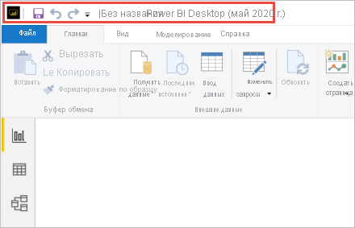

# Установка приложения Power BI Desktop, оптимизированного для сервера отчетов Power BI

Чтобы создавать отчеты Power BI для сервера отчетов Power BI, скачайте и установите версию Power BI Desktop, которая оптимизирована для этого сервера. Этот выпуск отличается от выпуска Power BI Desktop, который используется в службе Power BI. Например, версия Power BI Desktop для службы Power BI включает предварительные версии функций. Эти функции не публикуются на Сервере отчетов Power BI, пока они не будут предоставлены в общий доступ. Использование этого выпуска позволяет обеспечить взаимодействие между сервером отчетов и известной версией отчетов и модели. 

Не беспокойтесь. Power BI Desktop и приложение Power BI Desktop, оптимизированное для решения "Сервер отчетов Power BI", можно устанавливать параллельно на одном компьютере.

## Загрузка и установка Power BI Desktop

Самый простой способ скачать последнюю версию приложения Power BI Desktop, оптимизированного для решения "Сервер отчетов Power BI", — запустить его из веб-портала сервера отчетов.

1. На веб-портале сервера отчетов последовательно выберите **Загрузка** > **Power BI Desktop**.

    

    Либо перейдите на домашнюю страницу [Сервера отчетов Power BI](https://powerbi.microsoft.com/report-server/) и выберите **Расширенные параметры загрузки**.

2. На странице центра загрузки выберите язык и нажмите кнопку **Скачать**.

3. В зависимости от компьютера выберите файл: 

    - **PBIDesktopRS.msi** (32-разрядная версия);
    - **PBIDesktopRS_x64.msi** (64-разрядная версия).

1. Скачав установщик, запустите мастер установки Power BI Desktop.

2. На завершающем этапе процесса установки выберите параметр **Запустить Power BI Desktop**.

    После автоматического запуска приложения вы будете готовы к работе.

## Проверка используемой версии
Проверить используемую версию Power BI Desktop нетрудно: Посмотрите на экран запуска или заголовок окна Power BI Desktop. Если в строке заголовка отображается **Power BI Desktop (май 2020 г.)** , вы установили правильную версию. Кроме того, цвета логотипа Power BI изменены на обратные: желтый на черном вместо черного на желтом.

В строке заголовка версии Power BI Desktop для службы Power BI не указаны месяц и год выпуска.

## Сопоставление расширения файла
Предположим, что вы установили Power BI Desktop и приложение Power BI Desktop, оптимизированное для решения "Сервер отчетов Power BI", параллельно на одном компьютере. Файлы PBIX сопоставляются с самой последней установкой Power BI Desktop. Поэтому при двойном щелчке по PBIX-файлу будет запущен последний установленный экземпляр Power BI Desktop.

Если у вас уже есть приложение Power BI Desktop, и вы устанавливаете приложение Power BI Desktop, оптимизированное для Сервера отчетов Power BI, все PBIX-файлы будут по умолчанию открываться в приложении Power BI Desktop, оптимизированном для Сервера отчетов Power BI. Если необходимо, чтобы при открытии PBIX-файлов по умолчанию запускалось приложение Power BI Desktop, переустановите [Power BI Desktop из Microsoft Store](https://aka.ms/pbidesktopstore).

Всегда можно открыть ту версию Power BI Desktop, которую нужно использовать первой, а затем открыть файл в приложении Power BI Desktop.

Вот самый надежный способ всегда открывать правильную версию Power BI Desktop. Начните редактировать отчет Power BI на Сервере отчетов Power BI или создайте отчет Power BI в службе Power BI.

## Рекомендации и ограничения

Отчеты на сервере отчетов Power BI и в службе Power BI (`https://app.powerbi.com`), а также в мобильных приложениях Power BI работают почти одинаково, но некоторые функции все же различаются.

### Выбор языка

Для версии Power BI Desktop, оптимизированной для сервера отчетов Power BI, выбор языка осуществляется при установке приложения. Вы не можете изменить сделанный выбор, однако при необходимости можно установить версию на другом языке.

### Визуальные элементы отчетов в браузере

Отчеты на сервере отчетов Power BI поддерживают почти все визуализации, в том числе визуальные элементы Power BI. Отчеты на сервере отчетов Power BI не поддерживают:

* визуальные элементы R;
* карты ArcGIS;
* строки навигации;
* Функции предварительной версии Power BI Desktop

### Отчеты в мобильных приложениях Power BI

Отчеты на сервере отчетов Power BI поддерживают все функциональные возможности, доступные в [мобильных приложениях Power BI](../consumer/mobile/mobile-apps-for-mobile-devices.md), в том числе:

* [Макет отчета для мобильной версии](../create-reports/desktop-create-phone-report.md). Вы можете оптимизировать отчет для мобильных приложений Power BI. На мобильных устройствах у оптимизированных отчетов есть специальный значок  и макет.
  
    

В мобильных приложениях Power BI отчеты на сервере отчетов Power BI не поддерживают:

* Визуальные элементы R
* карты ArcGIS;
* Визуальные элементы Power BI
* строки навигации;
* географическую фильтрацию и штрихкоды.

### Настраиваемая безопасность

Приложение Power BI Desktop, оптимизированное для сервера отчетов Power BI, не поддерживает настраиваемую безопасность. Если в сервере отчетов Power BI включен настраиваемый модуль безопасности, вы не сможете сохранить отчет Power BI из приложения Power BI Desktop (оптимизированного для сервера отчетов Power BI) на экземпляре сервера отчетов Power BI. Необходимо вместо этого сохранить PBIX-файл отчета из Power BI Desktop и отправить его на сайт портала сервера отчетов Power BI.

### Сохранение отчетов на сервере отчетов Power BI в другом домене

При сохранении отчета Power BI на сервере отчетов Power BI используются учетные данные Windows. Сохранение напрямую на сервере отчетов в другом домене с учетными данными Windows не поддерживается. Чтобы просмотреть сервер отчетов и вручную отправить файл с компьютера, можно использовать веб-браузер.

## Дальнейшие действия

Теперь, когда приложение Power BI Desktop установлено, можно приступить к созданию отчетов Power BI.

[Создание отчета Power BI для Сервера отчетов Power BI](quickstart-create-powerbi-report.md)  
[Что такое Сервер отчетов Power BI?](get-started.md)

Появились дополнительные вопросы? [Попробуйте задать вопрос в сообществе Power BI.](https://community.powerbi.com/)

