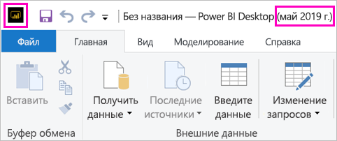

# Установка приложения Power BI Desktop, оптимизированного для сервера отчетов Power BI

Чтобы создавать отчеты Power BI для решения "Сервер отчетов Power BI", скачайте и установите приложение Power BI Desktop, оптимизированное для этого решения. Этот выпуск отличается от выпуска Power BI Desktop, который используется в службе Power BI. Например, версия Power BI Desktop для службы Power BI включает функции предварительной версии, которые будут включены в состав Сервера отчетов Power BI только после их выпуска. Использование этого выпуска позволяет обеспечить взаимодействие между сервером отчетов и известной версией отчетов и модели. 

Мы рады сообщить, что Power BI Desktop и приложение Power BI Desktop, оптимизированное для Сервера отчетов Power BI, можно устанавливать параллельно, на одном компьютере.

## Загрузка и установка Power BI Desktop

Самый простой способ скачать последнюю версию приложения Power BI Desktop, оптимизированного для решения "Сервер отчетов Power BI", — запустить его из веб-портала сервера отчетов.

1. На веб-портале сервера отчетов последовательно выберите **Загрузка** > **Power BI Desktop**.

    

    Или перейти непосредственно к [Microsoft Power BI Desktop](https://www.microsoft.com/download/details.aspx?id=56723) (, оптимизированному для сервера отчетов Power BI мая 2019) в центре загрузки Майкрософт.

2. На странице Центра загрузки нажмите кнопку **Скачать**.

3. В зависимости от компьютера выберите файл: 

    - **PBIDesktopRS.msi** (32-разрядная версия);

    - **PBIDesktopRS_x64.msi** (64-разрядная версия).

1. Скачав установщик, запустите мастер установки Power BI Desktop (мая 2019 г.).

2. В конце установки, выберите **запуска Power BI Desktop**.

    После автоматического запуска приложения вы будете готовы к работе.

## Проверка используемой версии
Проверить используемую версию Power BI Desktop нетрудно: Посмотрите на экран запуска или заголовок окна Power BI Desktop. В строке заголовка отображаются месяц и год выпуска. Кроме того, цвета логотипа Power BI изменены на обратные: желтый на черном вместо черного на желтом.

В строке заголовка версии Power BI Desktop для службы Power BI не указаны месяц и год выпуска.

## Сопоставление расширения файла
Если Power BI Desktop и приложение Power BI Desktop, оптимизированное для Сервера отчетов Power BI, установлены на одном компьютере, то с файлами с расширением PBIX будет связан тот экземпляр Power BI Desktop, который был установлен последним. Поэтому при двойном щелчке по PBIX-файлу будет запущен последний установленный экземпляр Power BI Desktop.

Если у вас уже есть приложение Power BI Desktop, и вы устанавливаете приложение Power BI Desktop, оптимизированное для Сервера отчетов Power BI, все PBIX-файлы будут по умолчанию открываться в приложении Power BI Desktop, оптимизированном для Сервера отчетов Power BI. Если необходимо, чтобы при открытии PBIX-файлов по умолчанию запускалось приложение Power BI Desktop, переустановите [Power BI Desktop из Microsoft Store](http://aka.ms/pbidesktopstore).

Всегда можно открыть ту версию Power BI Desktop, которую нужно использовать первой, а затем открыть файл в приложении Power BI Desktop.

Редактирование отчета Power BI на сервере отчетов Power BI или создании нового отчета Power BI на веб-портале всегда открывается правильную версию Power BI Desktop.

## Рекомендации и ограничения

Отчеты в сервере отчетов Power BI и в службе Power BI (http://app.powerbi.com)), и в мобильных приложениях Power BI работают почти одинаково, но некоторые функции все же различаются.

### В браузере

Отчеты Power BI Report Server поддерживают почти все визуализации, включая пользовательские визуальные элементы. Отчеты на сервере отчетов Power BI не поддерживают:

* визуальные элементы R;
* карты ArcGIS;
* строки навигации;
* Функции предварительной версии Power BI Desktop

### В мобильных приложениях Power BI

Отчеты на сервере отчетов Power BI поддерживают все функциональные возможности, доступные в [мобильных приложениях Power BI](../consumer/mobile/mobile-apps-for-mobile-devices.md), в том числе:

* [Макет отчета для мобильной версии](../desktop-create-phone-report.md). Вы можете оптимизировать отчет для мобильных приложений Power BI. На мобильных устройствах у оптимизированных отчетов есть специальный значок  и макет.
  
    

В мобильных приложениях Power BI отчеты на сервере отчетов Power BI не поддерживают:

* визуальные элементы R;
* карты ArcGIS;
* Пользовательские визуальные элементы
* строки навигации;
* Географическая фильтрацию и штрихкоды.

## Power BI Desktop для более ранних версий Сервера отчетов Power BI

Если вы используете более раннюю версию сервера отчетов, нужна подходящая версия Power BI Desktop. Здесь приведена ссылка для скачивания предыдущей версии.

- Microsoft Power BI Desktop ([оптимизировано для сервера отчетов Power BI — января 2019](https://go.microsoft.com/fwlink/?linkid=2055039))

## Дальнейшие действия

Теперь, когда приложение Power BI Desktop установлено, можно приступить к созданию отчетов Power BI.

[Создание отчета Power BI для Сервера отчетов Power BI](quickstart-create-powerbi-report.md)  
[Что такое Сервер отчетов Power BI?](get-started.md)

Появились дополнительные вопросы? [Попробуйте задать вопрос в сообществе Power BI.](https://community.powerbi.com/)
