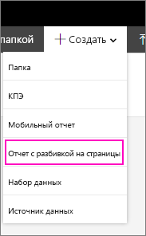
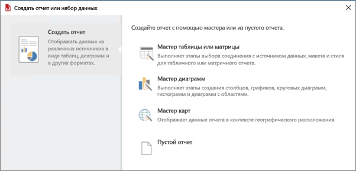

# Установка построителя отчетов — сервер отчетов Power BI

Построитель отчетов является автономным приложением и устанавливается на компьютере пользователем или администратором. Его можно установить из Центра загрузки Майкрософт или с сервера отчетов Power BI.  

Ищете справку по установке построителя отчетов для службы Power BI? См. статью о [Power BI Report Builder](../report-builder-power-bi.md).
  
Обычно администратор устанавливает и настраивает сервер отчетов Power BI, предоставляет разрешение на скачивание построителя отчетов с веб-портала и управляет папками и разрешениями для отчетов и общих наборов данных, сохраняемых на сервере отчетов. Дополнительные сведения о сервере отчетов Power BI см. в статье [Общие сведения об администрировании сервера отчетов Power BI](admin-handbook-overview.md).  
  
## Требования к системе
  
 См. раздел **требования к системе** на [странице загрузки построителя отчетов](https://go.microsoft.com/fwlink/?LinkID=734968) в Центре загрузки Майкрософт.
 
## Установка построителя отчетов с веб-портала
  
Построитель отчетов можно установить с веб-портала сервера отчетов Power BI. Возможно, вы уже установили построитель отчетов для создания отчетов для сервера SSRS. Вы можете использовать ту же версию или построитель отчетов, чтобы создавать отчеты для сервера отчетов Power BI. Если построитель отчетов еще не установлен, это легко исправить.

1. На веб-портале сервера отчетов Power BI выберите **Создать** > **Отчет с разбивкой на страницы**.
   
    
   
    Если построитель отчетов еще не установлен, запустится мастер построителя отчетов (Майкрософт).  
  
3.  Примите условия лицензионного соглашения и нажмите **Далее**.  
 
5.  Нажмите **Установить**, чтобы выполнить установку построителя отчетов.  

2. После установки в построителе отчетов откроется экран **создания отчета или набора данных**.
   
    
 

##   Установка построителя отчетов из Центра загрузки  
  
1.  На [странице загрузки построителя отчетов в Центре загрузки Майкрософт](https://go.microsoft.com/fwlink/?LinkID=734968) нажмите **Скачать**.  
  
2.  После завершения загрузки построителя отчетов выберите **Запустить**.  
  
     Запустится мастер построителя отчетов (Майкрософт).  
  
3.  Примите условия лицензионного соглашения и нажмите **Далее**.  
 
5.  Нажмите **Установить**, чтобы выполнить установку построителя отчетов.  
 

## Дальнейшие действия

[Что такое Сервер отчетов Power BI?](get-started.md)
