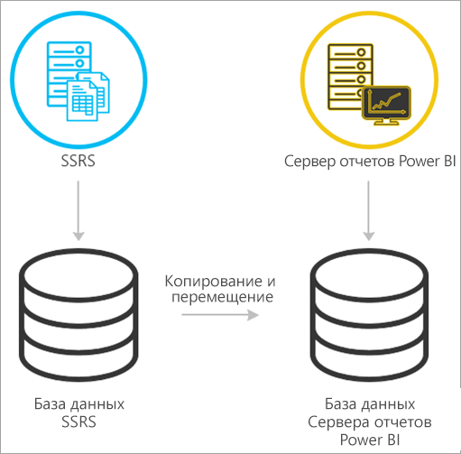
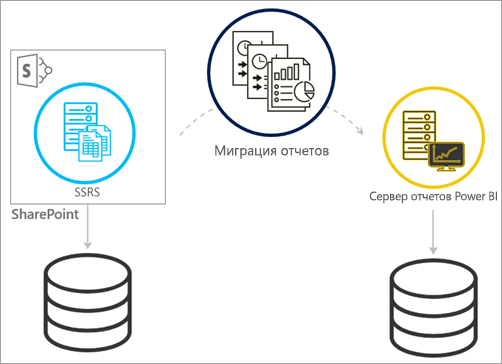
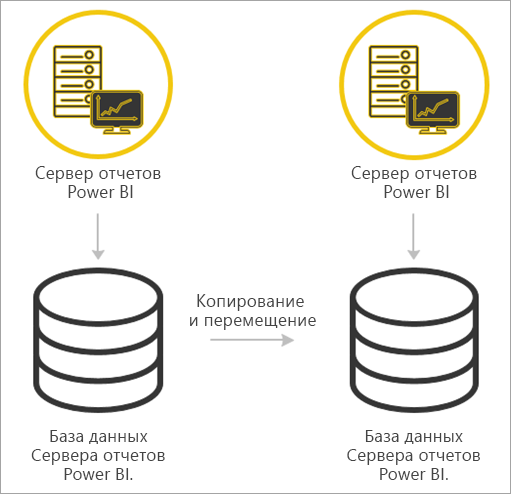

# <a name="migrate-a-report-server-installation"></a>Миграция установки сервера отчетов

Узнайте, как перенести существующий экземпляр SQL Server Reporting Services (SSRS) в экземпляр сервера отчетов Power BI.

Миграция — это перемещение файлов данных приложения на новый экземпляр сервера отчетов Power BI. Ниже приведены распространенные причины, в связи с которыми может потребоваться миграция установки.

* Необходимость перейти из SQL Server Reporting Services на сервер отчетов Power BI.
  
  > [!NOTE]
  > Обновление по месту установки из SQL Server Reporting Services на сервер отчетов Power BI Report Server отсутствует. Требуется миграция.

* Наличие требований к крупномасштабному развертыванию или обновлению.
* Смена оборудования или изменение топологии установки.
* Возникновение проблемы, блокирующей обновление.

## <a name="migrating-to-power-bi-report-server-from-ssrs-native-mode"></a>Миграция на сервер отчетов Power BI из служб SSRS (в основном режиме)

Процесс миграции из экземпляра служб SSRS (в основном режиме) на сервер отчетов Power BI состоит из нескольких этапов.



> [!NOTE]
> Для миграции поддерживаются службы SQL Server 2008 Reporting Services и более поздних версий.

* Резервное копирование файлов конфигурации, базы данных и приложения.
* Резервное копирование ключа шифрования.
* Клонирование базы данных сервера отчетов, на котором размещаются ваши отчеты.
* Установка сервера отчетов Power BI. Если используется одно и то же оборудование, можно установить сервер отчетов Power BI на том же сервере, что и экземпляр служб SSRS. Дополнительные сведения об установке сервера отчетов Power BI см. в [этой статье](install-report-server.md).

> [!NOTE]
> Экземпляр сервера отчетов Power BI будет называться *PBIRS*.

* Настройка сервера отчетов с помощью диспетчера конфигурации сервера отчетов и подключение к клонированной базе данных.
* Выполнение любой очистки, необходимой для экземпляра служб SSRS (в основном режиме).

## <a name="migration-to-power-bi-report-server-from-ssrs-sharepoint-integrated-mode"></a>Миграция на сервер отчетов Power BI из служб SSRS (в режиме интеграции с SharePoint)

Миграция из служб SSRS (в режиме интеграции с SharePoint) на сервер отчетов Power BI не так проста, как в основном режиме. Эти действия помогут вам разобраться в этом процессе, однако можно использовать и другие файлы и ресурсы в SharePoint, чтобы выполнить дополнительные действия.



Необходимо перенести содержимое конкретного сервера отчетов из SharePoint на сервер отчетов Power BI. Сервер отчетов Power BI должен быть уже установлен в вашей среде. Дополнительные сведения об установке сервера отчетов Power BI см. в [этой статье](install-report-server.md).

Если требуется скопировать содержимое сервера отчетов из среды SharePoint на сервер отчетов Power BI, нужно использовать такие средства, как **rs.exe**, чтобы скопировать содержимое. Ниже приведен пример скрипта для копирования содержимого сервера отчетов из SharePoint на сервер отчетов Power BI.

> [!NOTE]
> Такой пример скрипта предназначен для работы с SharePoint 2010 и более поздних версий и SQL Server 2008 Reporting Services и более поздних версий.

### <a name="sample-script"></a>Пример скрипта

```
Sample Script
rs.exe
-i ssrs_migration.rss -e Mgmt2010
-s http://SourceServer/_vti_bin/reportserver
-v st="sites/bi" -v f="Shared Documents“
-u Domain\User1 -p Password
-v ts=http://TargetServer/reportserver
-v tu="Domain\User" -v tp="Password"
```

## <a name="migrating-from-one-power-bi-report-server-to-another"></a>Миграция с одного сервера отчетов Power BI на другой

Миграция с одного сервера отчетов Power BI на другой выполняется так же, как миграция из служб SSRS (в собственном режиме).



* Резервное копирование файлов конфигурации, базы данных и приложения.
* Резервное копирование ключа шифрования.
* Клонирование базы данных сервера отчетов, на котором размещаются ваши отчеты.
* Установка сервера отчетов Power BI. *Нельзя* установить сервер отчетов Power BI на том же сервере, с которого выполняется миграция. Дополнительные сведения об установке сервера отчетов Power BI см. в [этой статье](install-report-server.md).

> [!NOTE]
> Экземпляр сервера отчетов Power BI будет называться *PBIRS*.

* Настройка сервера отчетов с помощью диспетчера конфигурации сервера отчетов и подключение к клонированной базе данных.
* Выполните любую очистку, необходимую для установки старого сервера отчетов Power BI.

## <a name="next-steps"></a>Дальнейшие действия

[Обзор функций администратора](admin-handbook-overview.md)  
[Установка сервера отчетов Power BI](install-report-server.md)  
[Script with the rs.exe Utility and the Web Service](https://docs.microsoft.com/sql/reporting-services/tools/script-with-the-rs-exe-utility-and-the-web-service) (Скрипт, содержащий служебную программу rs.exe и веб-службу)

Появились дополнительные вопросы? [Попробуйте задать вопрос в сообществе Power BI.](https://community.powerbi.com/)