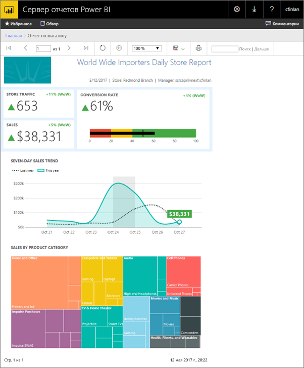
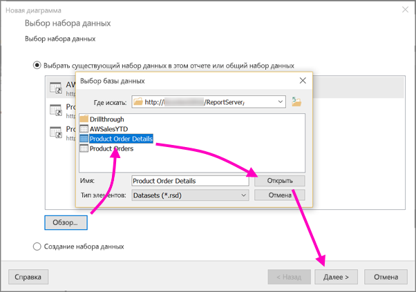
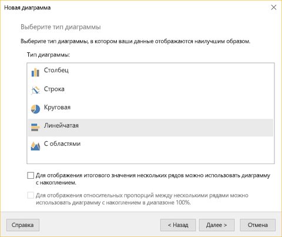
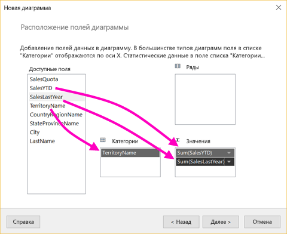
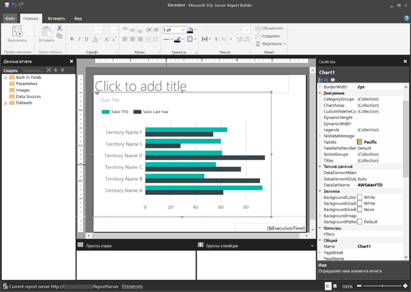
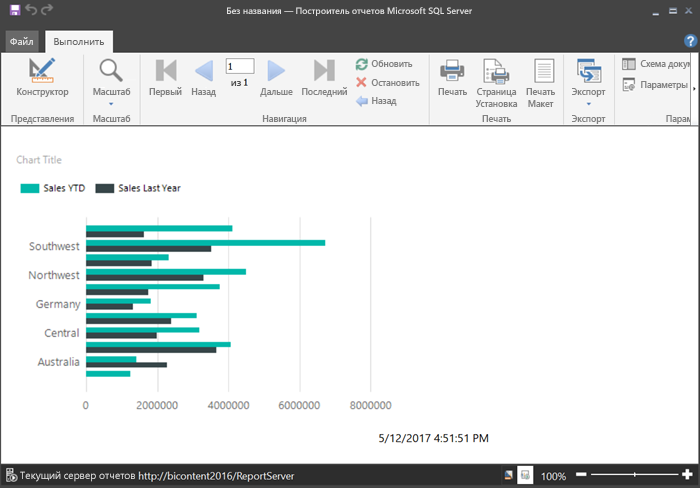
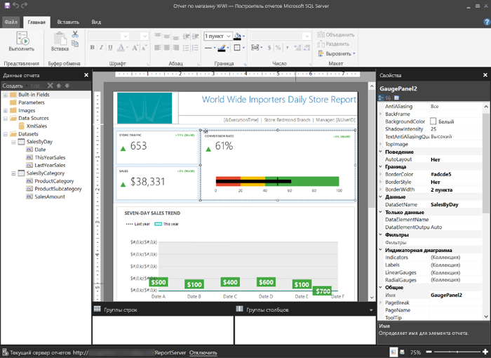

# Создание отчета с разбивкой на страницы BI для Сервера отчетов Power BI
В этой статье вы создадите отчет c разбивкой на страницы Power BI для сервера отчетов Power BI за несколько простых шагов.

Ищете справку по созданию отчетов с разбиением на страницы в Построителе отчетов для службы Power BI? См. статью о [Power BI Report Builder](../paginated-reports/report-builder-power-bi.md).

Как и предполагает название, отчеты c разбивкой на страницы могут выполняться на большом количестве страниц. Они поддерживают точную настройку и создаются в фиксированном формате. Отчеты с разбивкой на страницы это RDL-файлы.

Отчеты c разбивкой на страницы можно хранить на веб-портале сервера отчетов Power BI веб-портале и там же управлять ими, так же как и на веб-портале служб SQL Server Reporting Services (SSRS). Вы можете создавать и редактировать отчеты в построителе или конструкторе отчетов в SQL Server Data Tools (SSDT), а затем публиковать их на любом веб-портале. Затем сообщите читателям в вашей организации, что отчеты можно просматривать в браузере или в мобильном приложении Power BI на мобильных устройствах.

Если вы уже создавали отчеты с разбивкой на страницы в построителе или конструкторе отчетов, вы можете создавать такие же отчеты для сервера отчетов Power BI. Если вы еще не создавали такие отчеты, ниже описаны действия, с помощью которых можно быстро приступить к работе.

## Шаг 1. Запуск построителя отчетов
Возможно, вы уже установили построитель отчетов для создания отчетов для сервера SSRS. Вы можете использовать ту же версию или построитель отчетов, чтобы создавать отчеты для сервера отчетов Power BI. Если построитель отчетов еще не установлен, это легко исправить.

1. На веб-портале сервера отчетов Power BI выберите **Создать** > **Отчет с разбивкой на страницы**.
   
    
   
    Если построитель отчетов еще не установлен, эти действия сразу приведут вас к установке.
2. После установки в построителе отчетов откроется экран **создания отчета или набора данных**.
   
    
3. Выберите мастер для типа отчета, который требуется создать:
   
   * таблица или матрица;
   * диаграмма;
   * карта;
   * пустой отчет.
4. Начнем с мастера диаграмм.
   
    Мастер диаграмм поможет вам создать простую диаграмму в отчете. После этого вы сможете настраивать отчет практически до бесконечности.

## Шаг 2. Использование мастера диаграмм
С помощью мастера диаграмм вы пройдете основные этапы создания визуализации в отчете.

Отчеты с разбивкой на страницы можно подключать к разным источникам данных: от Microsoft SQL Server и базы данных Microsoft Azure SQL до Oracle, Hyperion и многих других. Прочитайте статью об [источниках данных, которые поддерживаются отчетами с разбивкой на страницы](connect-data-sources.md).

На первой странице в мастере диаграмм (**Выбор набора данных**) можно создать набор данных или выбрать общий набор данных на сервере. *Наборы данных* возвращают данные отчета из запроса к внешнему источнику данных.

1. Щелкните **Обзор**, а затем выберите общий набор данных на сервере и щелкните **Открыть** > **Далее**.
   
    
   
     Необходимо создать набор данных? См. статью о [создании общего или внедренного набора данных](https://docs.microsoft.com/sql/reporting-services/report-data/create-a-shared-dataset-or-embedded-dataset-report-builder-and-ssrs).
2. Выберите тип диаграммы (в нашем случае это линейчатая диаграмма).
   
    
3. Упорядочите поля, перетаскивая их в окна **Категории**, **Серии** и **Значения**.
   
    
4. Нажмите кнопку **Далее** > **Готово**.

## Шаг 3. Создание отчета
Теперь вы находитесь в представлении конструктора отчетов. Обратите внимание, что вы видите данные заполнителя, а не свои данные.

* Чтобы просмотреть свои данные, выберите **Выполнить**.
  
     
* Чтобы вернуться в представление конструктора, выберите **Конструктор**.

Теперь можно изменить созданную диаграмму, изменив макет, значения или условные обозначения — то есть практические любые параметры.

Вы даже можете добавить любые визуализации: датчики, таблицы, матрицы, таблицы, схемы и т. д. Можно добавить верхние и нижние колонтитулы для нескольких страниц. См. [руководства по построителю отчетов](https://docs.microsoft.com/sql/reporting-services/report-builder-tutorials), чтобы попробовать все возможности.

## Шаг 4. Сохранение отчета на сервере отчетов
Когда отчет будет готов, вы сможете сохранить его на сервере отчетов Power BI.

1. В меню **Файл** выберите **Сохранить как** и сохраните отчет на сервере отчетов. 
2. Теперь вы можете просмотреть его в браузере.
   
    

## Дальнейшие действия
Есть много отличных ресурсов, которые помогут вам создавать отчеты в построителе и в конструкторе отчетов в SQL Server Data Tools. Стоит начать с руководств по построителю отчетов.

* [Руководства по построителю отчетов](https://docs.microsoft.com/sql/reporting-services/report-builder-tutorials)
* [Что такое Сервер отчетов Power BI?](get-started.md)  

Появились дополнительные вопросы? [Попробуйте задать вопрос в сообществе Power BI.](https://community.powerbi.com/)

