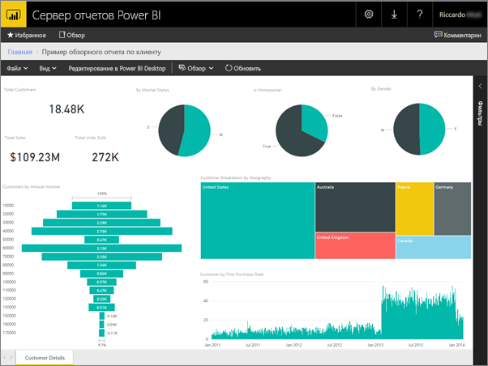
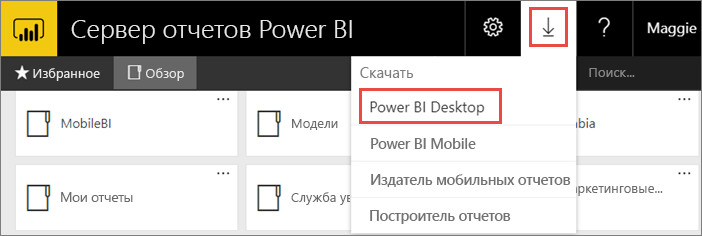
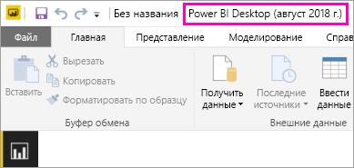
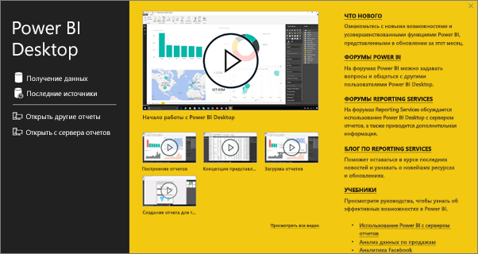
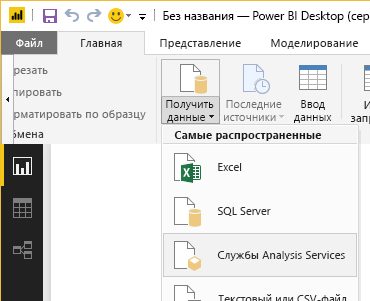
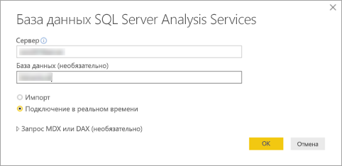
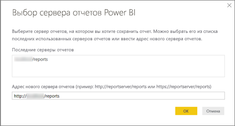
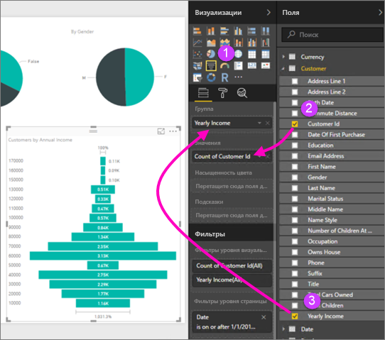
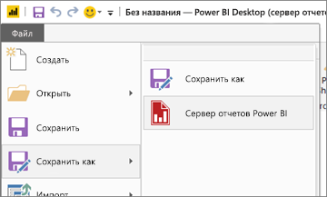

# Создание отчета Power BI для Сервера отчетов Power BI
Отчеты Power BI можно хранить и администрировать локально на веб-портале Сервера отчетов Power BI так же, как и в облачной службе Power BI (https://powerbi.com). Вы можете создавать и редактировать отчеты в приложении Power BI Desktop, а затем публиковать их на веб-портале. Затем можно сообщить читателям в вашей организации о том, что эти отчеты можно просматривать в браузере или мобильном приложении Power BI на мобильных устройствах.

Ниже описаны четыре шага, с помощью которых можно приступить к работе.

## Шаг 1. Установка приложения Power BI Desktop, оптимизированного для сервера отчетов Power BI

Если вы уже создавали отчеты Power BI в приложении Power BI Desktop, то вы практически готовы создавать отчеты Power BI для сервера отчетов Power BI. Рекомендуется установить версию Power BI Desktop, оптимизированную для сервера отчетов Power BI, так как это обеспечит постоянную синхронизацию сервера с приложением. Обе версии Power BI Desktop можно установить на одном компьютере.

1. На веб-портале сервера отчетов последовательно выберите **Загрузка** > **Power BI Desktop**.

    

    Вы также можете перейти непосредственно к приложению [Microsoft Power BI Desktop](https://www.microsoft.com/download/details.aspx?id=57271) (август 2018 г.), оптимизированному для решения сервера отчетов Power BI, в Центре загрузки Майкрософт.

2. На странице Центра загрузки нажмите кнопку **Скачать**.

3. В зависимости от компьютера выберите файл:

    - **PBIDesktopRS.msi** (32-разрядная версия);

    - **PBIDesktopRS_x64.msi** (64-разрядная версия).

4. Скачав установщик, запустите мастер установки Power BI Desktop (август 2018 г.).

2. На завершающем этапе процесса установки выберите параметр **Start Power BI Desktop now** (Запустить Power BI Desktop).
   
    После автоматического запуска приложения вы будете готовы к работе. Если в строке заголовка отображается "Power BI Desktop (август 2018 г.)", вы установили правильную версию.

    

3. Если вы не знакомы с Power BI Desktop, просмотрите видеоролики на экране приветствия.
   
    

## Шаг 2. Выбор источника данных
Вы можете подключаться к разным типам источников данных. Узнайте больше о [подключении к источникам данных](connect-data-sources.md).

1. На экране приветствия выберите **Get Data** (Получить данные).
   
    На вкладке **Home** (Главная) выберите пункт **Get Data** (Получить данные).
2. Выберите источник данных (в этом примере **Analysis Services**).
   
    
3. Заполните поле **Server** (Сервер) и при необходимости поле **Database** (База данных). Убедитесь, что установлен флажок **Connect live** (Подключение в реальном времени) и нажмите кнопку **ОK**.
   
    
4. Выберите сервер отчетов, на котором вы будете хранить отчеты.
   
    

## Шаг 3. Создание отчета
Здесь начинается самое интересное: нужно создать визуальные элементы, иллюстрирующие ваши данные.

Например, можно создать воронкообразную диаграмму на основе значений, отображающих годовой доход пользователей и групп.

1. В разделе **Visualizations** (Визуализации) выберите элемент **Funnel chart** (Воронкообразная диаграмма).
2. Перетащите поле для подсчета в область **Values** (Значения). Если это не числовое поле, Power BI Desktop автоматически установит для него значение *Count of* (Количество).
3. Перетащите поле в группу в область **Group** (Группа).

См. дополнительные сведения о [создании отчетов Power BI](../desktop-report-view.md).

## Шаг 4. Сохранение отчета на сервере отчетов
Когда отчет будет готов, вы сможете сохранить его на сервере отчетов Power BI, который вы выбрали на шаге 2.

1. В меню **Файл** выберите пункт **Сохранить как** > **Сервер отчетов Power BI**.
   
    
2. Теперь вы можете просмотреть отчет на веб-портале.
   
    

## Дальнейшие действия
### Power BI Desktop
Существует много отличных ресурсов для создания отчетов в Power BI Desktop. Советуем начать с этих материалов:

* [Начало работы с Power BI Desktop](../desktop-getting-started.md)
* Интерактивное обучение [Начало работы с Power BI Desktop](../guided-learning/gettingdata.yml?tutorial-step=2)

### сервере отчетов Power BI
* [Установка приложения Power BI Desktop, оптимизированного для сервера отчетов Power BI](install-powerbi-desktop.md)  
* [Что такое Сервер отчетов Power BI?](get-started.md)  

Появились дополнительные вопросы? [Попробуйте задать вопрос в сообществе Power BI.](https://community.powerbi.com/)
