# <a name="embed-a-power-bi-report-server-report-using-an-iframe-in-sharepoint-server"></a>По внедрению отчета решения "Сервер отчетов Power BI" с помощью iFrame в SharePoint Server

В этой статье вы узнаете, как внедрить отчет Сервера отчетов Power BI с помощью iFrame на страницу SharePoint. Если вы используете SharePoint Online, Сервер отчетов Power BI должен быть общедоступным. В SharePoint Online веб-часть Power BI, которая работает со службой Power BI, несовместима с Сервером отчетов Power BI.  

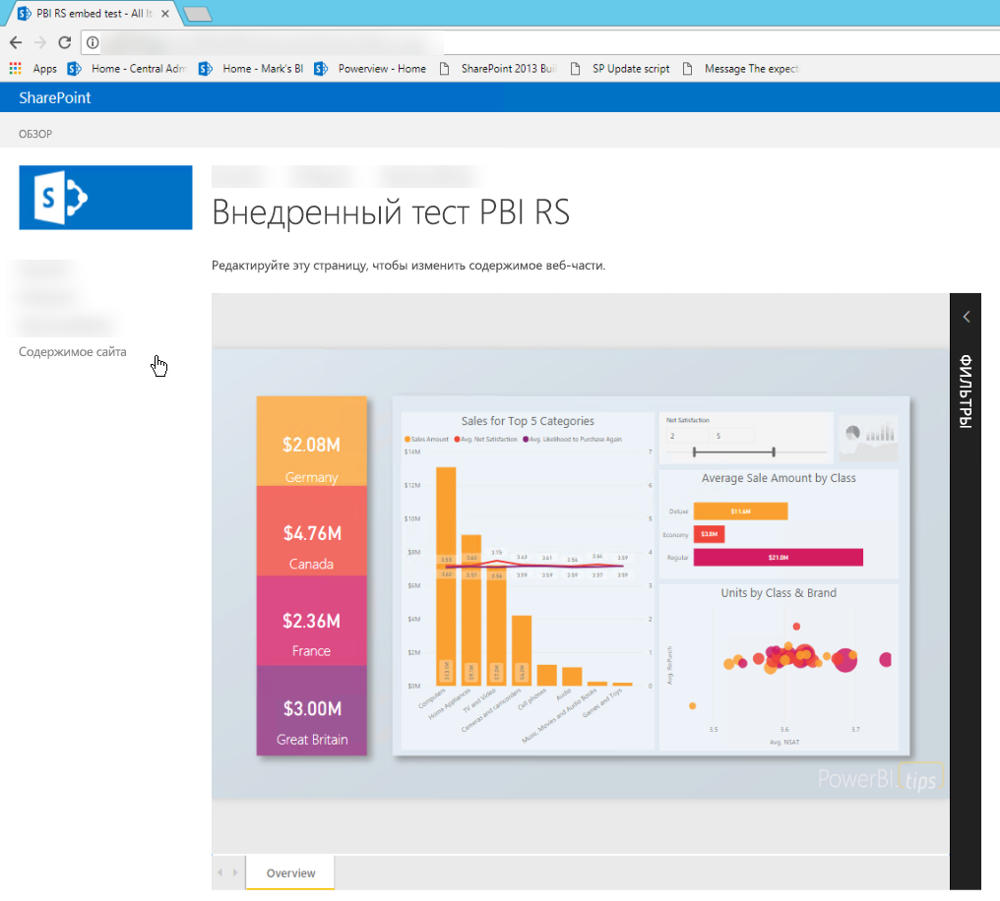

## <a name="prerequisites"></a>Предварительные требования
* Установленный и настроенный [Сервер отчетов Power BI](https://powerbi.microsoft.com/report-server/).
* Установленное [приложение Power BI Desktop, оптимизированное для Сервера отчетов Power BI](install-powerbi-desktop.md).
* Установленная и настроенная среда [SharePoint](https://docs.microsoft.com/sharepoint/install/install).
* Internet Explorer 11 поддерживается только при работе с SharePoint Online.  В любом из этих сценариев можно использовать другие поддерживаемые браузеры.

## <a name="create-the-power-bi-report-url"></a>Создание URL-адреса отчета Power BI

1. Скачайте пример из GitHub: [демонстрация блога](https://github.com/Microsoft/powerbi-desktop-samples). Выберите **Clone or download** (Клонировать или скачать) и затем **Скачать ZIP-файл**.

    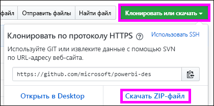

2. Распакуйте файл и откройте пример PBIX-файла в Power BI Desktop, оптимизированном для Сервера отчетов Power BI.

    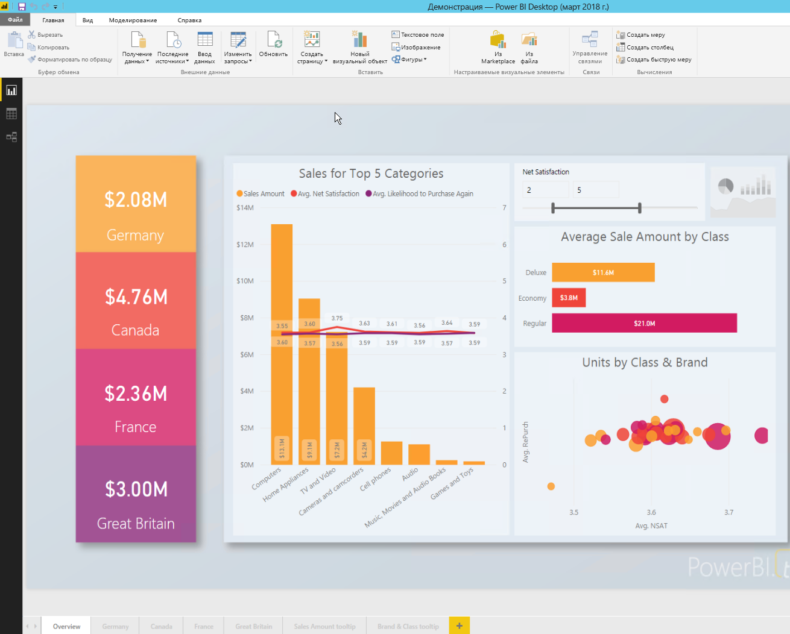

3. Сохраните отчет в решении **Сервер отчетов Power BI**. 

    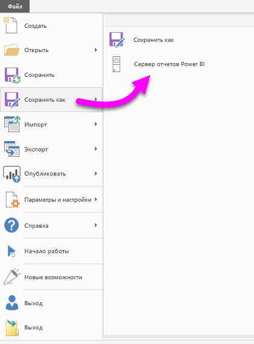

4. Просмотрите отчет на веб-портале Сервера отчетов Power BI.

    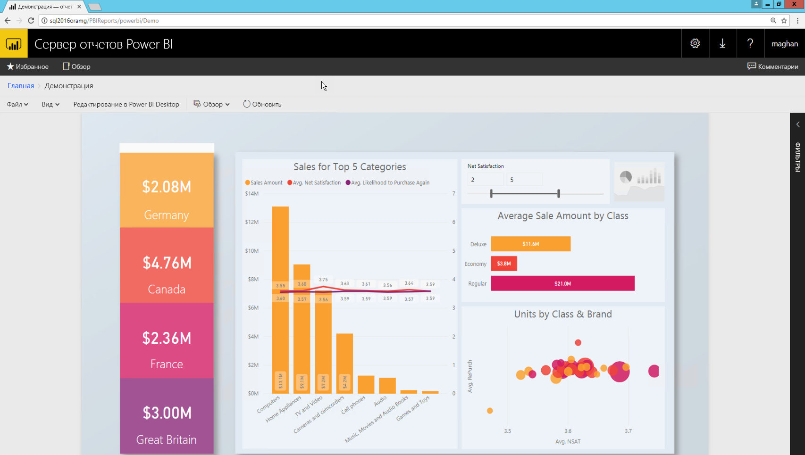

### <a name="capture-the-url-parameter"></a>Запись параметра URL-адреса

Получив URL-адрес, вы можете создать iFrame для размещения отчета на веб-странице SharePoint. Для любого URL-адреса отчета Сервера отчетов Power BI добавьте следующий параметр строки запроса, чтобы внедрить отчет в iFrame SharePoint: `?rs:embed=true`.

   Например:
    ``` 
    https://myserver/reports/powerbi/Sales?rs:embed=true
    ```
## <a name="embed-the-report-in-a-sharepoint-iframe"></a>Внедрение отчета в iFrame SharePoint

1. Перейдите к странице **Содержимое сайта** в SharePoint.

    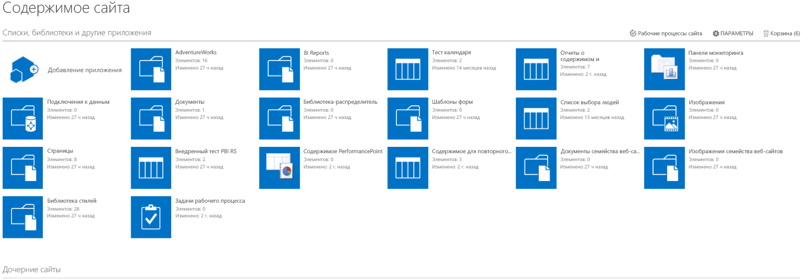

2. Выберите страницу, на которую нужно добавить отчет.

    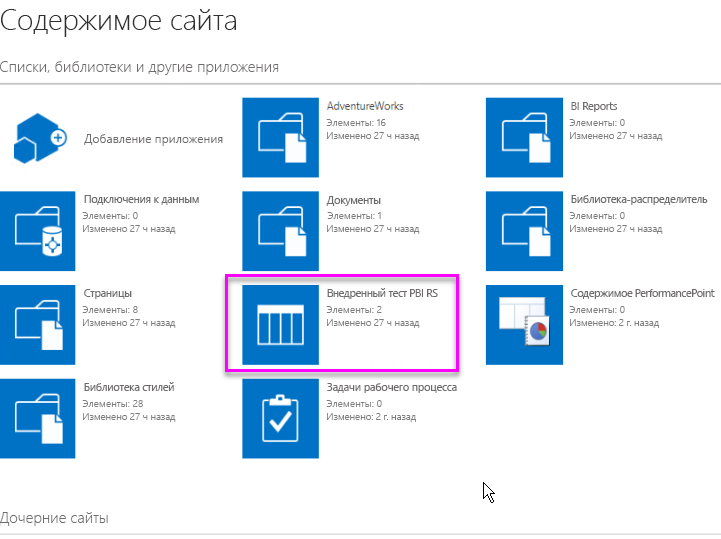

3. Выберите значок шестеренки в верхней правой части страницы и элемент **Изменить страницу**.

    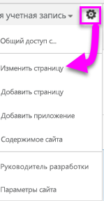

4. Выберите **Добавить веб-часть**.

5. В разделе **Категории** выберите **Среда и контент**. В разделе **Части** выберите **Редактор содержимого** и щелкните **Добавить**.

    

6. Выберите **Click here to add new content** (Щелкните здесь, чтобы добавить новое содержимое).

7. В верхнем меню выберите **Форматирование текста** и затем **Изменить источник**.

     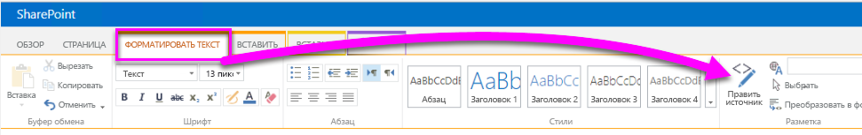

8. В окне **Изменить источник** вставьте код для iFrame в поле **Источник HTML** и нажмите кнопку **ОК**.

    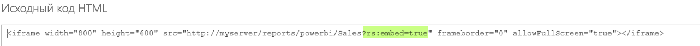

     Например:
     ```html
     <iframe width="800" height="600" src="https://myserver/reports/powerbi/Sales?rs:embed=true" frameborder="0" allowFullScreen="true"></iframe>
     ```

9. В верхнем меню выберите **Страница** и затем **Остановить изменение**.

    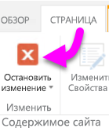

    Отчет отображается на странице.

    

## <a name="next-steps"></a>Дальнейшие действия

- [Создание отчета Power BI для Сервера отчетов Power BI](quickstart-create-powerbi-report.md).  
- [Создание отчета с разбивкой на страницы для Сервера отчетов Power BI](quickstart-create-paginated-report.md).  

Появились дополнительные вопросы? [Ответы на них см. в сообществе Power BI](https://community.powerbi.com/). 
