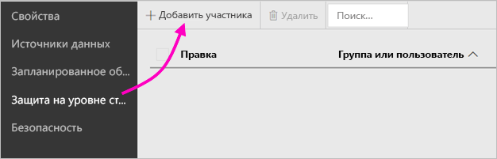
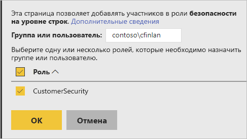
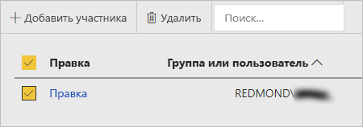

# Безопасность на уровне строк (RLS) на сервере отчетов Power BI

Настройка безопасности на уровне строк (RLS) с сервером отчетов Power BI может ограничить доступ к данным для определенных пользователей. Фильтры ограничивают доступ к данным на уровне строк; определить их можно в ролях.  Если вы используете разрешения по умолчанию на сервере отчетов Power BI, любой пользователь с разрешениями "Издатель" или "Диспетчер содержимого" для отчета Power BI сможет назначать участников для ролей этого отчета.    

Вы можете настроить RLS для отчетов, импортированных в Power BI, с помощью Power BI Desktop. RLS также можно настроить для отчетов, которые используют DirectQuery, таких как SQL Server.  Помните, что RLS не учитывается, если подключение DirectQuery использует встроенную проверку подлинности для читателей отчетов. Для динамических подключений служб Analysis Services безопасность на уровне строк настраивается в локальной модели. Параметр безопасности не отображается для наборов данных динамического подключения. 

[!INCLUDE [rls-desktop-define-roles](../includes/rls-desktop-define-roles.md)]

## Двунаправленная перекрестная фильтрация

По умолчанию при фильтрации с обеспечением безопасности на уровне строк используются однонаправленные фильтры, независимо от установленного типа связи (однонаправленной или двунаправленной). Вы можете вручную включить двунаправленную перекрестную фильтрацию для безопасности на уровне строк.

- Выберите связь и установите флажок  **Применить фильтр безопасности в обоих направлениях** . 

    

Установите этот флажок при реализации [динамической безопасности на уровне строк](https://docs.microsoft.com/sql/analysis-services/supplemental-lesson-implement-dynamic-security-by-using-row-filters) на основе имени пользователя или имени для входа. 

Дополнительные сведения см. в статье [Двунаправленная перекрестная фильтрация при работе с DirectQuery в Power BI Desktop](../desktop-bidirectional-filtering.md) и техническом документе по [обеспечению безопасности в табличной семантической модели бизнес-аналитики](http://download.microsoft.com/download/D/2/0/D20E1C5F-72EA-4505-9F26-FEF9550EFD44/Securing%20the%20Tabular%20BI%20Semantic%20Model.docx).

[!INCLUDE [rls-desktop-view-as-roles](../includes/rls-desktop-view-as-roles.md)]

## Добавление участников в роли 

После сохранения отчета на сервере отчетов Power BI вы можете управлять безопасностью и добавлять или удалять участников на сервере. Вариант настройки безопасности на уровне строк доступен и активен только для пользователей, имеющих разрешения "Издатель" или "Диспетчер содержимого" для отчета.

 Если отчет не содержит необходимые роли, вы должны открыть его в Power BI Desktop, добавить или изменить роли, а затем сохранить на сервере отчетов Power BI. 

1. В Power BI Desktop сохраните отчет на сервере отчетов Power BI. Необходимо использовать версию Power BI Desktop, оптимизированную для сервера отчетов Power BI.
2. В службе отчетов Power BI нажмите кнопку с многоточием (**…**) рядом с отчетом. 

3. Выберите **Управление** > **Безопасность на уровне строк**. 

     

    На странице **Безопасность на уровне строк** можно добавлять участников в роль, созданную в Power BI Desktop.

5. Чтобы добавить участника, выберите **Добавить участника**.

1. Укажите в текстовом поле пользователя или группу в формате имени пользователя "ДОМЕН\пользователь" и выберите роли, которые вы хотите им назначить. Этот участник должен быть в пределах вашей организации.   

    

    В зависимости от настройки службы Active Directory можно также ввести имя участника-пользователя. В этом случае сервер отчетов отображает соответствующее имя пользователя в списке.

1. Нажмите кнопку **ОК**, чтобы применить выбранный вариант.   

8. Чтобы удалить участников, установите флажок рядом с их именами и выберите **Удалить**.  Можно удалить несколько участников за раз. 

    

## username() и userprincipalname()

Функции DAX username() и userprincipalname() в наборе данных обеспечивают определенные преимущества. Их можно использовать в выражениях в Power BI Desktop. При публикации модели сервер отчетов Power BI использует их.

В Power BI Desktop функция username() возвращает имя пользователя в формате "ДОМЕН\пользователь", а функция userprincipalname() возвращает имя пользователя в формате user@contoso.com.

В пределах сервера отчетов Power BI функции username() и userprincipalname() возвращают имя участника-пользователя (UPN), сходное с адресом электронной почты.

При использовании нестандартной проверки подлинности на сервере отчетов Power BI он возвращает формат имени пользователя, который вы настроили для пользователей.  

## Ограничения 

Ниже приведены текущие ограничения для безопасности на уровне строк в моделях Power BI. 

Пользователи, получающие доступ к отчетам с помощью функции DAX username(), заметят новое поведение, когда имя участника-пользователя (UPN) возвращается, ЗА ИСКЛЮЧЕНИЕМ случаев использования DirectQuery со встроенной безопасностью.  Так как безопасность на уровне строк не учитывается в этом сценарии, в этом случае поведение не изменяется.

Безопасность на уровне строк (RLS) можно определять только для наборов данных, созданных в Power BI Desktop. Чтобы включить RLS для наборов данных, созданных в Excel, нужно сначала преобразовать файлы в формат Power BI Desktop (PBIX). Дополнительные сведения о [преобразовании файлов Excel](../desktop-import-excel-workbooks.md).

Поддерживаются только подключения Extract, Transform, Load (ETL) и DirectQuery с использованием сохраненных учетных данных. Динамические подключения к службам Analysis Services и подключения DirectQuery с помощью встроенной проверки подлинности обрабатываются в базовом источнике данных. 

Если вы используете встроенную систему безопасности с DirectQuery, ваши пользователи могут заметить следующее:
- RLS отключена и возвращаются все данные;
- пользователи не могут изменять свои назначения ролей и получают сообщение об ошибке на странице управления RLS;
- для функции DAX username можно по-прежнему получать имя пользователя в формате "ДОМЕН\ПОЛЬЗОВАТЕЛЬ". 

Авторы отчетов не могут просматривать данные отчета на сервере отчетов Power BI, пока не назначат себе соответствующие роли после отправки отчета. 

 

## ВОПРОСЫ И ОТВЕТЫ 

### Можно ли создавать роли для источников данных служб Analysis Services? 

Да, если данные импортированы в Power BI Desktop. Если вы используете динамическое подключение, то не сможете настроить RLS в службе Power BI. RLS определяется локально в модели Analysis Services. 

### Могу ли я использовать RLS для ограничения столбцов или мер, доступных для моих пользователей? 

Нет. Если у пользователя есть доступ к конкретной строке данных, они могут видеть все столбцы данных для этой строки. 

### Позволяет ли RLS скрыть подробные данные, но предоставить доступ к сводным данным, представленным в визуальных элементах? 

Нет. Вы защищаете отдельные строки данных, но пользователи всегда могут видеть сведения или сводные данные. 

### Можно ли добавлять новые роли в Power BI Desktop, если у меня уже есть существующие назначенные роли и участники? 

Да, если у вас уже определены существующие роли и участники, назначенные на сервере отчетов Power BI, можно создать дополнительные роли и повторно опубликовать отчет. Это не повлияет на текущие назначения. 
 

## Дальнейшие действия

[Что такое Сервер отчетов Power BI?](get-started.md) 
[Руководство для администратора](admin-handbook-overview.md)  

Появились дополнительные вопросы? [Попробуйте задать вопрос в сообществе Power BI.](https://community.powerbi.com/)