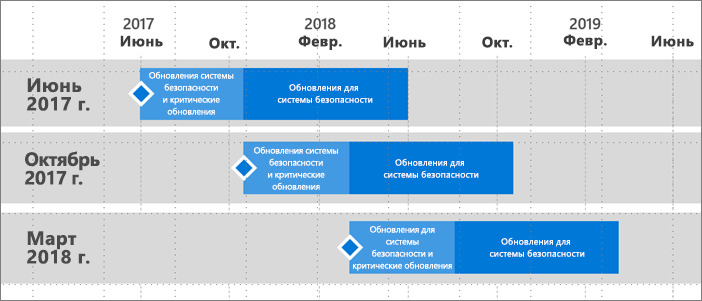

# Сроки предоставления поддержки для сервера отчетов Power BI
Выпуск сервера отчетов Power BI ожидается несколько раз в год. Критические обновления и обновления для системы безопасности будут предоставляться до следующего выпуска общедоступной версии. После следующего выпуска предыдущая версия будет и дальше получать обновления для системы безопасности на протяжении времени существования выпуска (12 месяцев).

Такая политика позволяет нам быстро предоставлять пользователям новые продукты и дает возможность гибко использовать эти нововведения в нужном темпе.

* Этап предоставления обновлений системы безопасности и критических обновлений: при запуске последней текущей версии сервера отчетов Power BI вы получите обновления системы безопасности и критические обновления.
* Этап предоставления (только) обновлений системы безопасности: после выпуска новой версии поддержка предыдущих версий сводится к предоставлению обновлений системы безопасности на протяжении двенадцатимесячного цикла поддержки продуктов Майкрософт (как показано на рис. 1).

    

## История изменений
| **Версия** | **Период доступности** | **Дата окончания поддержки** |
| --- | --- | --- |
| Июнь 2017 г. |12 июня 2017 г. |12 июня 2018 г. |
| Октябрь 2017 г. |31 октября 2017 г. |31 октября 2018 г. |
| Март 2018 г. | 19 марта 2018 г. | 19 марта 2019 г. |

Чтобы скачать сервер отчетов Power BI и службу Power BI Desktop, оптимизированную для сервера отчетов Power BI, перейдите на страницу [Локальная работа с отчетами с использованием сервера Power BI Report Server](https://powerbi.microsoft.com/report-server/).

## Дальнейшие действия
[Новые возможности сервера отчетов Power BI](whats-new.md)  
[Что такое Сервер отчетов Power BI?](get-started.md)
[Обзор функций администратора](admin-handbook-overview.md)  
[Установка сервера отчетов Power BI](install-report-server.md)  

Появились дополнительные вопросы? [Попробуйте задать вопрос в сообществе Power BI.](https://community.powerbi.com/)

