# Руководство. Изучение возможностей веб-портала Сервера отчетов Power BI на виртуальной машине
С помощью этого руководства вы создадите виртуальную машину с установленным Сервером отчетов Power BI, чтобы изучить возможности просмотра, редактирования и управления, предоставляемые в Power BI. В руководстве используется пример отчетов с разбивкой на страницы и ключевых показателей эффективности.

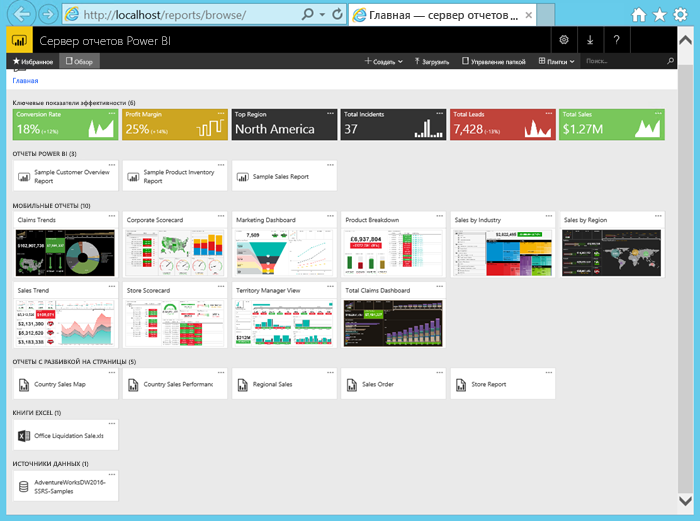

В рамках этого руководства выполняются следующие задачи:

> [!div class="checklist"]
> * создание виртуальной машины и подключение к ней;
> * запуск веб-портала Сервера отчетов Power BI и навигация по нему;
> * назначение тега избранному элементу;
> * просмотр и редактирование отчета Power BI;
> * просмотр, изменение отчета с разбивкой на страницы и управление им;
> * просмотр книги Excel в Excel Online.

Для работы с этим руководством требуется подписка Azure. Если у вас ее нет, [создайте бесплатную учетную запись](https://azure.microsoft.com/free/?WT.mc_id=A261C142F) перед началом работы.

## Создание виртуальной машины для Сервера отчетов Power BI

Команда разработки Power BI подготовила очень удобный образ виртуальной машины с предустановленным Сервером отчетов Power BI.

1. В Azure Marketplace выберите Сервер отчетов Power BI. Вот прямая ссылка: [Сервер отчетов Power BI](https://azuremarketplace.microsoft.com/marketplace/apps/reportingservices.technical-preview?tab=Overview).  

2. Выберите **Get it now** (Получить).
3. Щелкните **Продолжить**, чтобы подтвердить согласие с условиями использования и политикой конфиденциальности.

4. Щелкните **Создать**.

    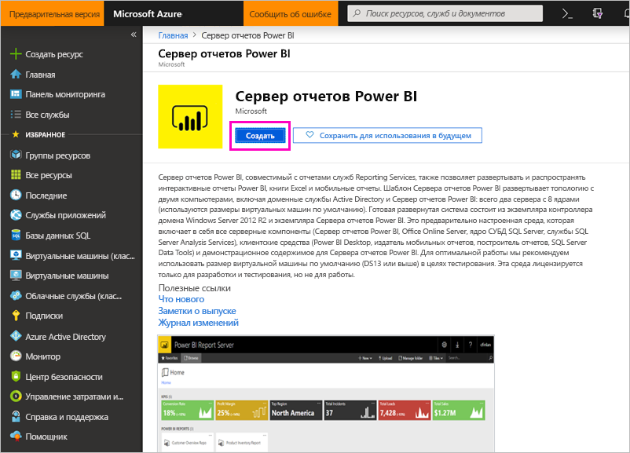

5. **Шаг 1. Основы**: для параметра **Имя виртуальной машины** установите значение **reportservervm**.

    В имени виртуальной машины для Сервера отчетов Power BI не должно быть дефисов.

5. Назначьте имя пользователя и пароль.

6. В поле **Группа ресурсов** выберите **Создать новую** и присвойте этой группе имя **reportserverresourcegroup** > **ОК**.

    Если вы проходите учебник несколько раз, нужно дать группе ресурсов другое имя. В одной подписке невозможно использовать два одинаковых имени группы ресурсов. 

    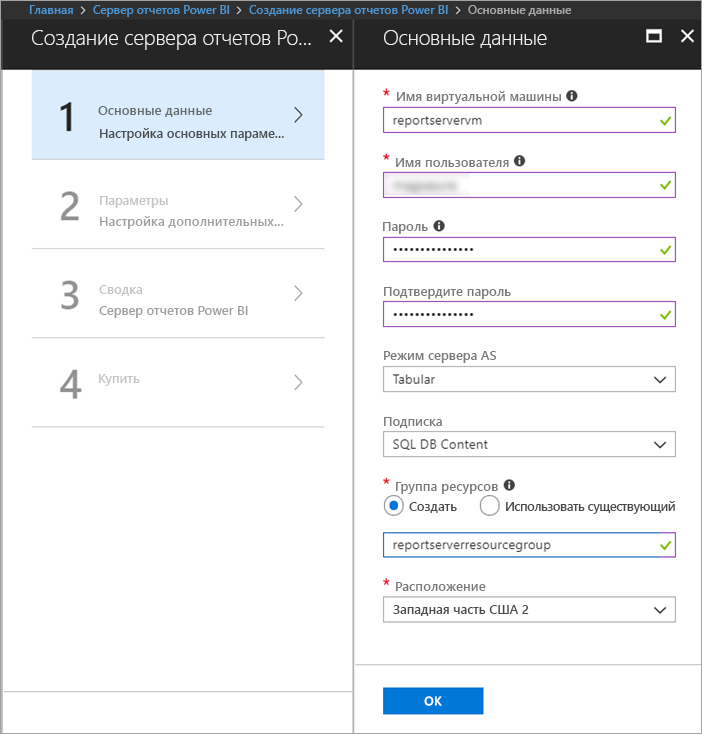

7. Для остальных параметров сохраните значения по умолчанию и нажмите кнопку **ОК**.

8. **Шаг 2. Параметры**: сохраните здесь все значения по умолчанию и нажмите кнопку **ОК**.
 
    Значения **учетной записи хранения SQL** и **учетной записи хранения диагностики** также должны быть уникальными. Если вы проходите руководство несколько раз, нужно дать им разные имена.

9. **Шаг 3. Сводка**: просмотрите выбранные параметры и нажмите кнопку **ОК**.

10. **Шаг 4. Покупка**: ознакомьтесь с условиями использования и политикой конфиденциальности, а затем выберите **Создать**.

    **Отправка развертывания для Сервера отчетов Power BI** может занять несколько минут.

## Подключение к виртуальной машине

1. В области навигации Azure выберите **Виртуальные машины**. 

2. В поле **Filter by name** (Фильтрация по имени) введите "report" (отчет). 

3. Выберите виртуальную машину с именем **REPORTSERVERVM**.

    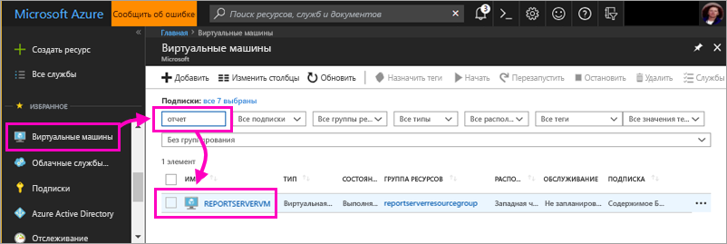

4. Для виртуальной машины REPORTSERVERVM выберите действие **Подключиться**.

    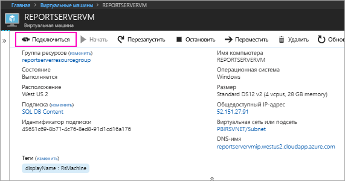

5. В области **Подключение к виртуальной машине** сохраните значения по умолчанию и выберите **Скачать RDP-файл**.

1. В диалоговом окне **Подключение к удаленному рабочему столу** щелкните **Подключиться**.

6. Введите имя и пароль, которые вы назначили для этой виртуальной машины и щелкните **ОК**.

7. Отобразится новое диалоговое окно с сообщением о том, что **не удается идентифицировать удаленный компьютер**. Нажмите кнопку **ОК**.

   Готово! Открывается виртуальная машина.

## Сервер отчетов Power BI на виртуальной машине

Открыв удаленный рабочий стол виртуальной машины, вы увидите указанные ниже элементы.

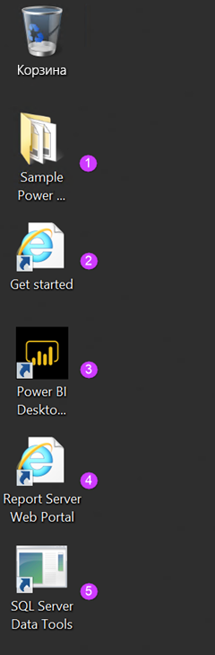

|число;  |Назначение элемента  |
|---------|---------|
| | Примеры отчетов Power BI (PBIX) |
| | Ссылки на документацию по Серверу отчетов Power BI |
| | Запуск приложения Power BI Desktop, оптимизированного для Сервера отчетов Power BI (январь 2019 г.) |
| | Открытие в браузере веб-портала Сервера отчетов Power BI |
| | Запуск SQL Server Data Tools для создания отчета с разбивкой на страницы (RDL) |

Дважды щелкните значок **веб-портала сервера отчетов**. В браузере откроется страница `https://localhost/reports/browse`. На веб-портале отображаются разные файлы, сгруппированные по типам. 

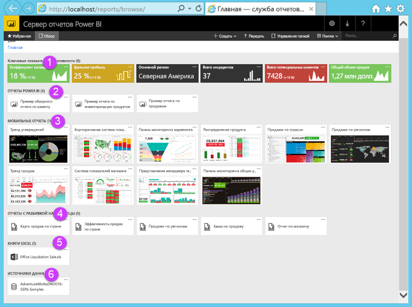

|число;  |Назначение элемента  |
|---------|---------|
| | Ключевые показатели эффективности, созданные на веб-портале |
| |  Отчеты Power BI (PBIX)  |
| | Мобильные отчеты, созданные в издателе мобильных отчетов для Microsoft SQL Server  |
| |  Отчеты с разбивкой на страницы, созданные в построителе отчетов или с помощью SQL Server Data Tools  |
| | Книги Excel   | 
| | Источники данных для отчетов с разбивкой на страницы | 

## Маркировка избранных элементов
Вы можете добавлять теги к избранным отчетам и ключевым показателям эффективности. Их проще найти, так как они все собраны в одну папку "Избранное" и на веб-портале, и в мобильных приложениях Power BI. 

1. Щелкните значок многоточия ( **…** ) в правом верхнем углу окна ключевого показателя эффективности **Удельная прибыль**, затем выберите действие **Добавить в избранное**.
   
    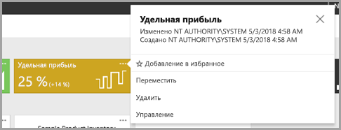
2. На ленте веб-портала выберите вкладку **Избранное** — в списке появится только что добавленный элемент.
   
    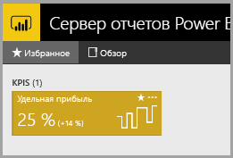

3. Выберите **Обзор**, чтобы вернуться к веб-порталу.
   
## Просмотр элементов в представлении списка
По умолчанию веб-портал отображает содержимое в виде плиток.

Вы можете поменять представление на список, в котором можно легко перемещать или удалять несколько элементов одновременно. 

1. Выберите **Плитки** > **Список**.
   
    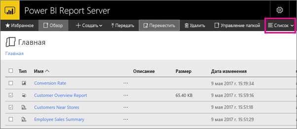

2. Вернитесь к представлению плиток, последовательно выбрав **Список** > **Плитки**.

## Отчеты Power BI

На веб-портале вы можете просматривать отчеты Power BI и работать с ними, а также запустить приложение Power BI Desktop.

### Просмотр отчетов Power BI

1. На веб-портале в разделе **Отчеты Power BI** выберите **Sample Customer Overview Report** (Пример отчета с общими сведениями о клиентах). Выбранный отчет откроется в окне браузера.

1. Выберите в схеме дерева блок "США", чтобы проверить выделение связанных значений в других визуальных элементах.

    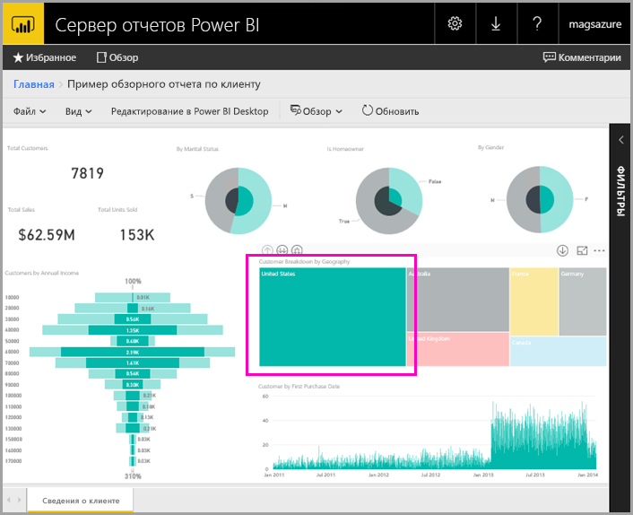

### Редактирование в Power BI Desktop

1. Выберите **Edit in Power BI Desktop** (Редактирование в Power BI Desktop).

1. Выберите **Разрешить**, чтобы этот сайт получил возможность открывать программу на локальном компьютере. 

     В Power BI Desktop откроется отчет. На верхней панели отображается имя "Power BI Desktop (январь 2019 г.)". Это версия, оптимизированная для Сервера отчетов Power BI.

    Используйте версию Power BI Desktop, установленную в виртуальной машине. Невозможно перейти в другой домен для отправки отчета.

3. На панели полей разверните таблицу Customers (Клиенты) и перетащите из нее поле Occupation (Род занятий) в фильтры уровня отчетов.

    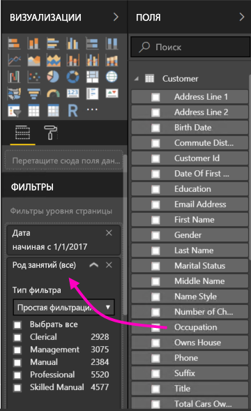

1. Сохраните отчет.

1. Вернитесь к отчету, открытому в браузере, и щелкните значок **Обновить** в интерфейсе браузера.

    

8. Разверните панель **Фильтры** справа, чтобы увидеть добавленный фильтр **Occupation** (Род занятий). Выберите **Professional** (Профессиональный).

    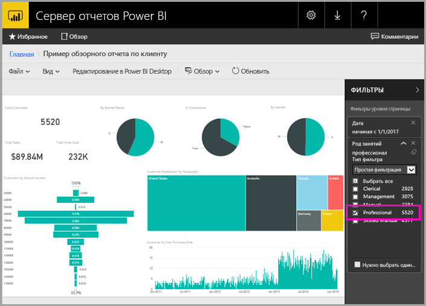

3. Выберите **Обзор**, чтобы вернуться к веб-порталу.

## Отчеты с разбивкой на страницы (RDL)

На веб-портале вы можете просматривать отчеты с разбивкой на страницы и управлять ими, а также запускать построитель отчетов.

### Управление отчетом с разбивкой на страницы

1. На веб-портале в разделе **Отчеты с разбивкой на страницы** выберите **Дополнительные параметры** (...) рядом с элементом **Заказ на продажу** > **Управление**.

1. Выберите **Параметры**, затем замените значение по умолчанию в поле **SalesOrderNumber** строкой **SO50689** и выберите  > **Применить**.

   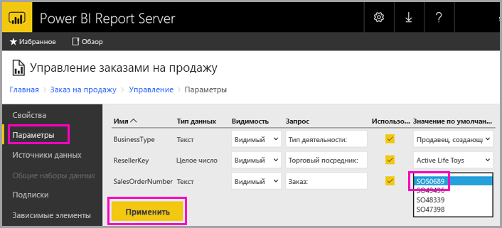

3. Выберите **Обзор**, чтобы вернуться к веб-порталу.

### Просмотр отчета с разбивкой на страницы

1. Выберите на веб-портале **Заказ на продажу**.
 
3.  Вы увидите ранее настроенный параметр **заказа** со значением **SO50689**. 

    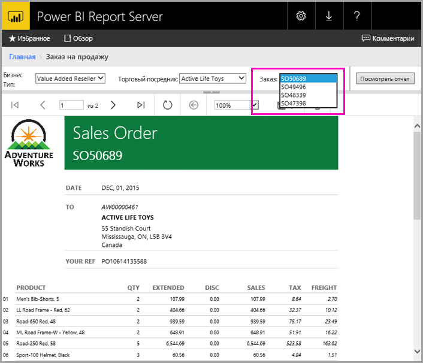

    Здесь вы можете изменить этот параметр, а также любые другие параметры, не изменяя значения по умолчанию.

1. Выберите **Заказ** **SO48339** > **Просмотреть отчет**.

4. Откроется страница 1 из 2. Щелкните стрелку вправо, чтобы открыть вторую страницу. Откроется вторая страница с продолжением таблицы.

    

5. Выберите **Обзор**, чтобы вернуться к веб-порталу.

### Редактирование отчета с разбивкой на страницы

Вы можете изменить отчет с разбивкой на страницы в построителе отчетов, который можно запустить непосредственно из браузера.

1. На веб-портале щелкните **Дополнительные параметры** (...) рядом с элементом **Заказ на продажу** > **Изменить в построителе отчетов**.

1. Выберите **Разрешить**, чтобы этот сайт получил возможность открывать программу на локальном компьютере.

1. В построителе отчетов в режиме конструктора откроется отчет о заказе на продажу.

    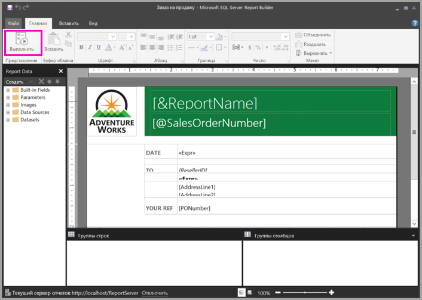

1. Выберите **Запустить**, чтобы посмотреть отчет.

    

5. Закройте построитель отчетов и вернитесь к окну браузера.

## Просмотр книг Excel

Вы можете просматривать книги Excel и работать с ними, используя Excel Online в Сервере отчетов Power BI. 

1. Выберите книгу Excel **Office Liquidation Sale.xlsx**. Возможно, поступит запрос на ввод учетных данных. Выберите в нем **Отменить**. 
    Книга откроется на веб-портале.
1. Выберите срез **Устройство**.

    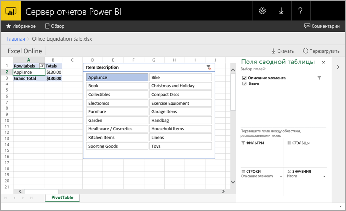

1. Выберите **Обзор**, чтобы вернуться к веб-порталу.

## Очистка ресурсов

Итак, вы завершили работу с нашим руководством. Теперь можно удалить группу ресурсов, виртуальную машину и все связанные с ними ресурсы. 

- Для этого выберите группу ресурсов для виртуальной машины и щелкните **Удалить**.

## Дальнейшие действия

С помощью этого руководства вы создали виртуальную машину с предустановленным Сервером отчетов Power BI. Затем вы применили некоторые функции веб-портала, а также открыли отчет Power BI и отчет с разбивкой на страницы в соответствующих редакторах. На этой виртуальной машине установлены источники данных SQL Server Analysis Services. Вы можете попробовать создать собственные отчеты Power BI и отчеты с разбивкой на страницы с помощью тех же источников данных. 

В следующих руководствах цикла представлены дополнительные сведения о создании отчетов для Сервера отчетов Power BI.

> [!div class="nextstepaction"]
> [Создание отчета Power BI для Сервера отчетов Power BI](./quickstart-create-powerbi-report.md)

