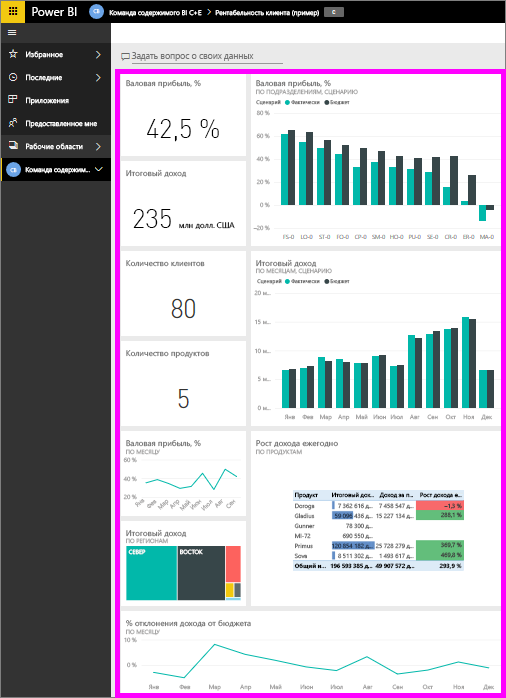
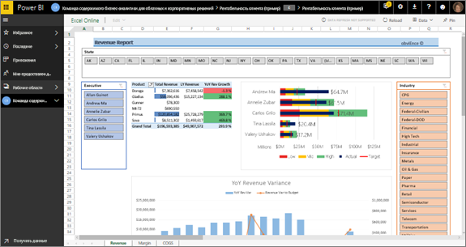
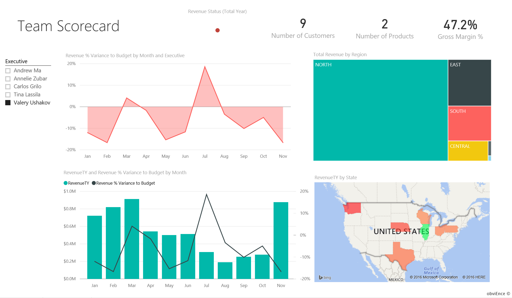
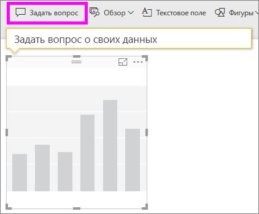
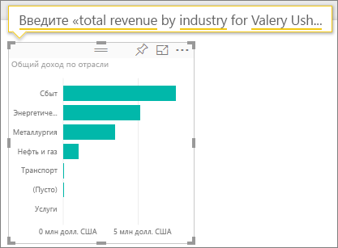
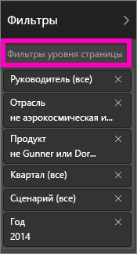
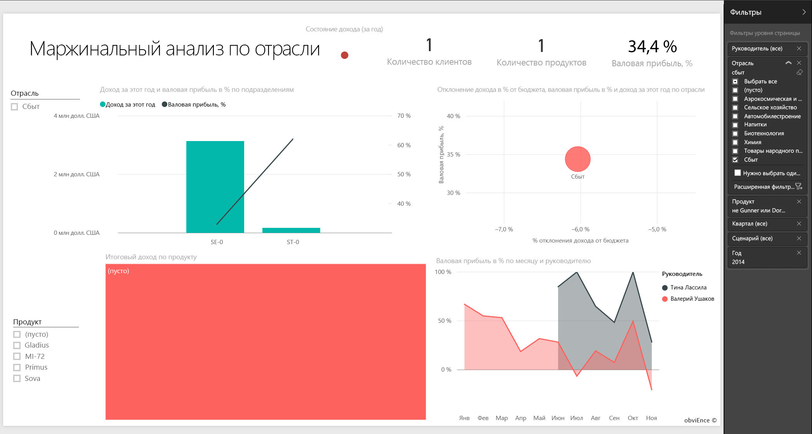
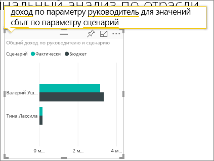

# Пример "Рентабельность клиента" для Power BI: Узнайте о возможностях

Пакет содержимого "Рентабельность клиента" включает панель мониторинга, отчет и набор данных для компании, производящей маркетинговые материалы. Эту панель мониторинга создал финансовый директор для просмотра основных метрик о пяти руководителях подразделения, продуктах, клиентах и валовой прибыли. Здесь можно легко увидеть факторы, влияющие на прибыль.

Этот пример входит в серию, демонстрирующую, как использовать Power BI с бизнес-данными, отчетами и панелями мониторинга. Он создан на основе реальных данных [obviEnce](http://www.obvience.com/), которые были анонимизированы. Данные доступны в нескольких форматах: пакет содержимого, PBIX-файл Power BI Desktop или книга Excel. См. сведения в статье [Примеры данных, доступные для использования в службе Power BI](sample-datasets.md). 

В этом руководстве описано, как использовать пример пакета содержимого "Рентабельность клиента" службе Power BI. Так как в Power BI Desktop и службе возможности работы с отчетами практически не отличаются, этот же пример PBIX-файла можно использовать и в Power BI Desktop. 

Вам не требуется лицензия Power BI для просмотра примеров в Power BI Desktop. Если у вас нет лицензии Power BI Pro, можно сохранить пример в личную рабочую область в службе Power BI. 

## Получение примера

Прежде чем использовать пример, необходимо скачать его как [пакет содержимого](#get-the-content-pack-for-this-sample), [PBIX-файл](#get-the-pbix-file-for-this-sample) или [книгу Excel](#get-the-excel-workbook-for-this-sample).

### Получение пакета содержимого для этого примера

1. Откройте службу Power BI (app.powerbi.com), войдите в систему и откройте рабочую область, где хотите сохранить пример.

   Если у вас нет лицензии Power BI Pro, можно сохранить пример в личной рабочей области.

2. В левом нижнем углу выберите **Получить данные**.

   
3. На странице **Получение данных** выберите **Примеры**.

4. Выберите **Рентабельность клиента — пример**, а затем элемент **Подключиться**.  

    
5. Power BI импортирует пакет содержимого и добавляет новую панель мониторинга, отчет и набор данных в текущую рабочую область.

    

### Получение PBIX-файла для этого примера

Кроме того, вы можете скачать пример пакета "Рентабельность клиента" в виде [PBIX-файла](https://download.microsoft.com/download/6/A/9/6A93FD6E-CBA5-40BD-B42E-4DCAE8CDD059/Customer%20Profitability%20Sample%20PBIX.pbix), предназначенного для работы в Power BI Desktop.

### Получение книги Excel для этого примера

Если вы хотите просмотреть источник данных для этого примера, он также доступен в виде [книги Excel](https://go.microsoft.com/fwlink/?LinkId=529781). Книга содержит листы Power View, которые можно просматривать и изменять. Чтобы просмотреть необработанные данные, включите надстройки анализа данных и выберите **Power Pivot > Управление**. Чтобы включить надстройки Power View и Power Pivot, перейдите к разделу [Просмотр примеров Excel непосредственно из Excel](sample-datasets.md#optional-take-a-look-at-the-excel-samples-from-inside-excel-itself).

## Какие данные отображаются на информационной панели?

В рабочей области, где сохранен пример, найдите и выберите панель мониторинга "Рентабельность клиента":

### Плитки панели мониторинга, охватывающей всю компанию
1. Откройте панель мониторинга в службе Power BI. Плитки панелей мониторинга позволяют нашему финансовому директору отслеживать важные метрики на уровне всей компании. Когда она видит что-то интересное, она щелкает плитку, чтобы проанализировать данные более подробно.

2. Просмотрите плитки слева на панели мониторинга.

    

   Обратите внимание на следующие сведения:
   - Валовая прибыль компании составляет 42,5 %.
   - У нее 80 клиентов.
   - Она продает пять разных продуктов.
   - В феврале у компании наблюдалось наименьшее расхождение дохода с бюджетом, а в марте — наибольшее.
   - Основная часть дохода поступает из восточного и северного регионов. Валовая прибыль никогда не выходила за пределы бюджета, подразделения ER-0 и MA-0 требуется изучить более подробно.
   - Итоговый доход за этот год приближается к бюджету.

### Плитки панели мониторинга по отдельным руководителям
Плитки в правой части панели мониторинга содержат показатели команды. Финансовому директору нужно следить за работой своих руководителей, а эти плитки дают общее представление о доходах с использованием доли валовой прибыли (GM%). Если для любого из руководителей возникает неожиданная тенденция по доле валовой прибыли, директор может подробнее изучить данный вопрос.

Анализируя плитки панели мониторинга по отдельным руководителям, мы можем сделать следующие наблюдения:

- Все руководители, за исключением Карлоса, превысили показатели целевых продаж. Но у него самый высокий показатель фактических продаж.
- Руководитель Annelie имеет самую низкую долю валовой прибыли, но с марта этот показатель стабильно увеличивается.
- С другой стороны, у Valery наблюдается значительное снижение показателя GM%.
- У Andrew наблюдается переменный успех.

## Просмотр базовых данных панели мониторинга
На этой панели мониторинга содержатся плитки со ссылками на отчет и книгу Excel.

### Открытие источника данных в Excel Online
На этой панели мониторинга закреплены две плитки из книги Excel: **Target vs Actual** (Целевые и фактические продажи) и **Year Over Year Revenue Growth** (Рост дохода в годовом исчислении). Если вы выберете любую из этих плиток, Power BI откроет источник данных. В данном случае это Excel Online.

1. Выберите одну из плиток, закрепленных из Excel. Excel Online открывается в службе Power BI.
2. Обратите внимание, что книга содержит три вкладки с собранными данными. Откройте вкладку **Revenue** (Доход).
3. Давайте узнаем, почему Carlos еще не достиг этих показателей:  

    а. В области ползунка **Executive** (Руководитель) выберите **Carlos Grilo**.   

    б. В первой сводной таблице показано, что рост дохода руководителя Carlos от его основного продукта (Primus) снизился на 152 % по сравнению с прошлым годом. На диаграмме **YoY Revenue Variance** (Отклонение дохода в годовом исчислении) видно, что в большинстве месяцев эти показатели ниже суммы, заложенной в бюджете.  

    

    

4. Продолжаем изучение. Если вы найдете что-то интересное, выберите **Закрепить** в правом верхнем углу, чтобы [закрепить элемент на панели мониторинга](service-dashboard-pin-tile-from-excel.md).

5. Чтобы вернуться на панель мониторинга, нажмите кнопку со стрелкой назад в браузере.

### Открытие основного отчета Power BI
Многие плитки на панели мониторинга примера "Рентабельность клиента" закреплены из соответствующего базового примера отчета.

1. Выберите одну из этих плиток, чтобы открыть отчет в режиме чтения.

   Если эта плитка была создана с помощью компонента "Вопросы и ответы", при ее выборе открывается окно "Вопросы и ответы". Выберите **Exit Q&A** (Выход из вопросов и ответов), чтобы вернуться на панель мониторинга и попробовать другую плитку.

2. Отчет содержит три страницы. Каждая вкладка в нижней части отчета представляет отдельную страницу.

    

    * **Team Scorecard** (Командная система показателей) содержит сведения о работе и показателях пяти руководителей.
    * **Industry Margin Analysis** (Анализ прибыльности по отрасли) позволяет проанализировать рентабельность с учетом состояния всей отрасли.
    * **Executive Scorecard** (Система показателей руководства) позволяет просмотреть данные для каждого из руководителей в формате с настраиваемым размером страницы.

### Страница Team Scorecard (Командная система показателей)

Давайте подробнее рассмотрим двух участников команды и разберемся, какие именно сведения можно получить: 

1. В срезе **Executive** (Руководитель) слева выберите имя Andrew, чтобы отфильтровать страницу отчета и отобразить только сведения об Andrew:

   * Для быстрого определения ключевого показателя эффективности посмотрите на поле **Revenue Status (Total Year)** (Состояние дохода за весь год) для Andrew, оно зеленое, значит, этот руководитель работает хорошо.
   * Диаграмма **Дисперсия % дохода от бюджета по месяцу и руководителю** показывает, что, за исключением отставания в феврале, Andrew обеспечивает приемлемые показатели. Больше всего он работает в восточном регионе, где обслуживает 49 клиентов и 5 из 7 продуктов. Его показатель GM% не является самым высоким или самым низким.
   * Диаграмма **RevenueTY and Revenue % Var to Budget by Month** (Дисперсия дохода за год и % дохода от бюджета по месяцу) показывает, что уровень доходов неуклонно растет. Но если щелкнуть квадрат для центрального региона (**Central**) на диаграмме "дерево", выясняется, что Andrew имеет доход только в марте и только в Индиане. Это запланированное поведение или стоит разобраться в этом подробнее?

2. Теперь перейдем к Valery. В срезе **Executive** (Руководитель) выберите имя Valery, чтобы отфильтровать страницу отчета и отобразить только данные об этом руководителе. 

   

   * Обратите внимание на красный ключевой показатель эффективности для **Revenue Status (Total Year)** (Состояние дохода за весь год). Это определенно требует более подробного рассмотрения.
   * У этого руководителя наблюдаются проблемы и с отклонением дохода, так как установленные границы доходности не соблюдаются.
   * Valery имеет всего девять клиентов, обрабатывает только два продукта и работает практически только с клиентами в северном регионе. Такая специализация может объяснять широкие колебания метрик этого руководителя.
   * При выборе квадрата **North** (Север) на диаграмме "дерево" становится видно, что валовая прибыль Valery в северном регионе согласуется с общим уровнем прибыли.
   * Выбирая другие квадраты в разделе **Total Revenue by Region** (Итоговый доход по регионам), можно узнать о сложившейся ситуации: у этого руководителя показатель GM% колеблется в пределах от 23 до 79 %, а показатели доходов во всех регионах, за исключением северного, имеют четко выраженный сезонный характер.

3. Продолжайте анализировать данные, чтобы узнать о причинах низкой производительности Valery. Просмотрите регионы, другие подразделения, а также следующую страницу отчета: **Industry Margin Analysis** (Маржинальный анализ по отрасли).

### Маржинальный анализ по отрасли
Эта страница отчета содержит другой срез данных. На ней рассматривается валовая прибыль для всей отрасли, разделенной на сегменты. Финансовый директор использует эту страницу для сравнения метрик компании и подразделений с метриками всей отрасли, чтобы выявлять и обеспечивать рентабельность. Вы можете спросить, почему на этой странице приведена диаграмма **Gross Margin % by Month and Executive** (Валовая маржа в % по месяцам и руководителям), ведь она относится к конкретной команде? Ее наличие позволяет отфильтровать страницу по руководителю подразделения.  

1. Как рентабельность зависит от отрасли? Как распределяются продукты и клиенты в зависимости от отрасли? Чтобы ответить на эти вопросы, выберите одну или несколько отраслей в верхней левой части (начните с отрасли товаров народного потребления — CPG). Чтобы очистить фильтр, выберите значок очистки.

2. На пузырьковой диаграмме **Revenue Var % to Budget, GM%, and RevenueTY by Industry** (Отклонение дохода в % от бюджета, валовая маржа в % и доход за год по отрасли) финансовый директор ищет самые крупные пузырьки, так как именно они оказывают наибольшее влияние на прибыль. Чтобы легко определить влияние каждого руководителя по отраслевому сегменту, отфильтруйте на странице данные, выбрав имя руководителя на диаграмме с областями.

3. Выбирая на странице разных руководителей, обратите внимание на следующее:
   * У руководителя Andrew область влияния распространяется на множество разных отраслевых сегментов, а показатели GM% и Var% изменяются в широких пределах, причем первый больше изменяется в положительную сторону.
   * Annelie имеет аналогичную диаграмму, однако данный руководитель работает лишь с несколькими отраслевыми сегментами, специализируясь на федеральном сегменте и продукте Gladius.
   * Carlos специализируется на сегменте служб и получает хороший доход. Он значительно улучшил отклонение по высокотехнологичному сегменту, а также продемонстрировал крайне высокие показатели относительно бюджета в новом для себя сегменте — промышленном.
   * Tina работает с небольшим количеством сегментов и имеет наибольший показатель GM%, однако небольшой размер пузырьков показывает, что данный руководитель оказывает минимальное влияние на доходы компании.
   * Valery, который отвечает только за один продукт, работает всего в пяти отраслевых сегментах. Влияние этого руководителя носит сезонный характер, но всегда дает крупные пузырьки, указывая на ощутимый вклад в доходы компании. Объясняется ли низкая производительность этого руководителя особенностями отраслевых сегментов?

### Система показателей руководства
Эта страница имеет формат с настраиваемым размером страницы.

## Углубленное изучение данных с помощью задания вопросов в поле вопросов и ответов
Для нашего анализа было бы полезно определить, из какой отрасли Valery получает наибольший доход. Давайте воспользуемся вопросами и ответами.

1. Выберите пункт **Изменить отчет**, чтобы открыть отчет в режиме правки. Режим правки доступен только владельцу отчета. Также этот режим иногда называют режимом *автора*. Если же к этому отчету вам лишь предоставлен общий доступ, открыть его в режиме правки будет невозможно.

2.  В верхней части панели мониторинга выберите **Задать вопрос**, чтобы открыть поле "Вопросы и ответы".

    

3. В поле вопроса введите *total revenue by industry for Valery* (общий доход по отрасли для Valery). Обратите внимание на обновление визуализации по мере ввода вопроса.

    

   Как видно, основной областью доходов Valery является отрасль распространения.

### Углубленное изучение с помощью фильтров
Давайте рассмотрим отрасль распространения.  

1. Откройте страницу отчета **Industry Margin Analysis** (Маржинальный анализ по отрасли).
2. Не выбирая визуализации на странице отчета, разверните область фильтров справа, если она еще не развернута. В области **Фильтры** должны отображаться только **Фильтры уровня страницы**.  

   
3. Найдите фильтр для **отрасли** и щелкните стрелку, чтобы развернуть список. Теперь добавим фильтр страницы для отрасли распространения. Сначала очистите все выделения, сняв флажок **Выделить все**. Затем установите только флажок **Distribution** (Дистрибуция).  

   
4. На диаграмме **Gross Margin % by Month and Executive** (Валовая прибыль в % по месяцу и руководителю) видно, что клиенты из данной отрасли есть только у Valery и Tina, а Valery работает с этой отраслью только с июня по ноябрь.   
5. Выберите **Tina**, а затем **Valery** в условных обозначениях диаграммы **Gross Margin by Month and Executive** (Валовая прибыль по месяцу и руководителю). Обратите внимание, что на диаграмме **Total Revenue by Product** (Общий доход по продукту) доля у Tina меньше, чем у Valery.
6. Чтобы просмотреть фактический доход, выберите поле "Вопросы и ответы" в панели мониторинга и введите *total revenue by executive for distribution by scenario* (общий доход по руководителю для дистрибуции по сценарию).  

     

    Аналогичным образом можно изучить другие отрасли и даже добавить клиентов в визуальные элементы, чтобы понять причины такого уровня производительности Valery.

## Дальнейшие действия: Подключение к данным
В этой среде можно свободно экспериментировать, так как сохранять изменения не требуется. Однако если изменения сохраняются, всегда можно выбрать функцию **Получить данные** для получения новой копии этого примера.

Мы надеемся, что из этого обзора вы узнали, как с помощью панелей мониторинга, вопросов и ответов, а также отчетов Power BI можно получить представление о данных из примера. Теперь ваша очередь — выполните подключение к собственным данным. С помощью Power BI можно подключаться ко многим типам источников данных. Дополнительные сведения см. в руководстве по [началу работы со службой Power BI](service-get-started.md).

