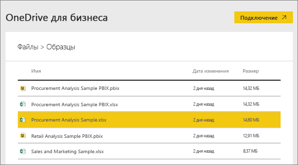
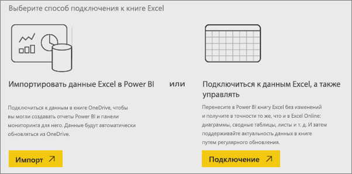
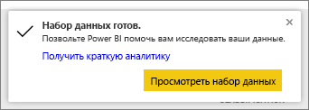
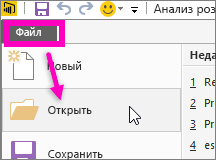

# Получение образцов данных для Power BI
Предположим, что вы не знакомы с Power BI и хотите оценить эту службу, но у вас нет данных.  Или, возможно, у вас есть набор данных. Так как вы пока не понимаете, как работает Power BI, возможно, вас беспокоит возможность повреждения набора данных?

Не переживайте! Корпорация Майкрософт и obviEnce ([www.obvience.com](http://www.obvience.com/)) создали примеры данных, которые можно использовать для изучения принципов работы в Power BI.  Эти данные были анонимизированы и взяты из разных отраслей, например финансы, персонал, продажи и многое другое. Кроме того, в нашей электронной документации эти образцы используются в руководствах и примерах, благодаря чему вы сможете ознакомиться с их использованием.      

   

Каждый из этих примеров доступен в нескольких форматах: как пакет содержимого, отдельная книга Excel и PBIX-файл. Если вы не знаете, что это такое или как их получить, не переживайте. Мы все подробно объясним далее в этой статье. Кроме того, для каждого примера мы создали *краткий обзор*. Это статьи, содержащие общие сведения о примере, а также описание разных сценариев его использования. Один сценарий может содержать полезные сведения для менеджеров, другой — сведения о выполнении конкурентного анализа, создании отчетов и информационных панелей для совместного использования. Кроме того, в них могут объясняться их преимущества для бизнеса.   

Прежде чем начать, прочитайте эти правила и условия использования примеров. После этого мы расскажем о примерах и покажем, как их использовать.   

## Правила использования книг Excel из примеров Power BI

©2015  Microsoft Corporation. All rights reserved. Документы и книги предоставляются «как есть». Сведения и представления, содержащиеся в книгах, включая URL-адреса и ссылки на другие веб-сайты, могут изменяться без предварительного уведомления. Вы принимаете на себя риски их использования. Некоторые примеры служат только для иллюстрации и являются вымышленными. Связь с реальными обстоятельствами является случайной. Майкрософт не предоставляет никаких гарантий, явных или подразумеваемых, относительно приведенных здесь сведений.

Книги не предоставляют вам никаких юридических прав на интеллектуальную собственность в каких-либо продуктах корпорации Майкрософт. Вы можете копировать и использовать эту книгу в личных справочных целях.

Книги и соответствующие данные предоставлены ObviEnce. [www.obvience.com](http://www.obvience.com)

ObviEnce является независимым поставщиком программных продуктов и инкубатором объектов авторских прав, основное внимание уделяющим бизнес-аналитике Майкрософт. ObviEnce работает в тесном сотрудничестве с корпорацией Майкрософт для быстрого запуска и развертывания решений бизнес-аналитики Майкрософт.

Книги и данные являются собственностью obviEnce, LLC и предоставляются исключительно для демонстрации функциональных возможностей Power BI с отраслевыми демонстрационными данными.

Любое использование книг и данных должно учитывать приведенную выше атрибуцию (которая также присутствует на информационном листе, входящем в состав каждой книги). Книга и все визуализации должны сопровождаться следующим уведомленим об авторских правах: obviEnce ©.

Щелкнув любую из ссылок ниже для скачивания файлов книг Excel или PBIX-файлов, вы соглашаетесь с приведенными выше условиями.

## Доступные примеры
В Power BI можно использовать восемь примеров.  Каждый из них относится к определенной отрасли.

### Рентабельность клиента — пример  
[Ознакомьтесь с примером "Рентабельность клиента"](sample-customer-profitability.md).

В этом отраслевом примере анализируются ключевые показатели финансового директора для руководителей, продуктов и клиентов организации. Можно выяснить, какие факторы влияют на рентабельность компании.

### Управление персоналом — пример  
[Ознакомьтесь с примером "Управление персоналом"](sample-human-resources.md)

В этом примере рассматривается стратегия найма в организации путем анализа новых сотрудников, действующих сотрудников и сотрудников, которые покинули организацию.  В процессе изучения данных можно определить тенденции добровольных уходов и дисбаланса в стратегии найма.

### Анализ расходов ИТ-отдела — образец 
[Ознакомьтесь с примером "Анализ расходов ИТ-отдела"](sample-it-spend.md).

В этом примере анализируются запланированные и фактические расходы ИТ-отдела компании. Это сравнение помогает понять, насколько хорошо компания составила годовой план, и позволяет исследовать области со значительными отклонениями от плана. Компания в этом образце ежегодно проходит цикл планирования, а затем ежеквартально создает новый текущий прогноз, помогающий анализировать изменения в расходах ИТ-отдела за последний финансовый год.

### Анализ возможных сделок — пример  
[Ознакомьтесь с примером "Анализ возможностей"](sample-opportunity-analysis.md).

В этом примере рассматривается канал продаж программного обеспечения компании. Менеджеры по продажам наблюдают за прямыми и партнерскими каналами продаж, отслеживая возможные сделки и доход от продаж по региону, объему сделки и каналу.

### Анализ закупок — пример  
[Ознакомьтесь с примером "Анализ закупок"](sample-procurement.md).

В этом отраслевом примере анализируются ключевые показатели финансового директора для руководителей, продуктов и клиентов организации. Можно выяснить, какие факторы влияют на рентабельность компании.

### Анализ розничной торговли — пример  
[Ознакомьтесь с примером "Анализ розничной торговли"](sample-retail-analysis.md).

В этом отраслевом примере анализируются данные о розничной продаже товаров в различных магазинах и районах. Метрики сравнивают эффективность за этот год c показателями за прошлый год в следующих областях: продажи, единицы, валовая прибыль и дисперсия, что также называют анализом нового магазина.

### Продажи и маркетинг — пример  
[Ознакомьтесь с примером "Продажи и маркетинг"](sample-sales-and-marketing.md).

В этом примере анализируется производственная компания VanArsdel Ltd. Он позволяет руководителю отдела маркетинга вести наблюдение за положением компании VanArsdel в отрасли и на рынке.  В процессе изучения образца можно узнать долю компании на рынке, объем продукции, продаж и материалов.

### Качество поставщика — образец  
[Ознакомьтесь с примером "Анализ качества поставщика"](sample-supplier-quality.md).

В этом отраслевом примере внимание уделено одной из типичных проблем канала поставок — анализу качества поставщиков. В анализе действуют два основных показателя: общее число дефектов и общее время простоя, вызванное этими дефектами. В этом образце преследуются две главные цели: понять, кто с точки зрения качества является наиболее и наименее подходящим поставщиком, и определить, какие предприятия лучше всего выполняют поиск и отклоняют дефекты в целях минимизации времени простоя.

Теперь вы знаете, какие примеры доступны. Пора узнать, как их получить.  

## Как получить примеры
Как уже говорилось, примеры доступны в нескольких форматах: пакеты содержимого, книги Excel и PBIX-файлы. Мы опишем, как использовать каждый из них, начиная с пакетов содержимого.

## Примеры Power BI в виде пакетов содержимого
Пакеты содержимого — это единственный формат примеров, который можно получить из Power BI. Вам даже не нужно выходить из Power BI, чтобы найти их. По сути, пакет содержимого представляет собой набор панелей мониторинга, наборов данных и отчетов, который можно использовать в службе Power BI. Пользователи создают пакеты содержимого, чтобы предоставить доступ к данным другим сотрудникам. Каждый из примеров пакетов содержимого Power BI содержит набор данных, отчет и информационную панель.  Они недоступны для Power BI Desktop. Дополнительные сведения о пакетах содержимого см. в статье [Знакомство с пакетами содержимого организации в Power BI](service-organizational-content-pack-introduction.md).

### Получение и открытие примера пакета содержимого в службе Power BI
1. Откройте службу Power BI (app.powerbi.com) и войдите в систему.
2. В левом нижнем углу выберите **Получить данные**.

    
3. На странице "Получение данных" щелкните значок **Примеры**.

   
4. Выберите один из примеров, чтобы открыть его описание. Затем выберите **Подключиться**.  

   
5. Power BI импортирует пакет содержимого и добавляет новую информационную панель, отчет и набор данных в текущую рабочую область. Новое содержимое отмечено желтой звездочкой. Используйте примеры для тестового запуска Power BI.  

   

Теперь, когда у вас есть данные, вы можете продолжить работу.  Ознакомьтесь с некоторыми из наших руководств, в которых используются пакеты содержимого, или просто откройте службу Power BI и просмотрите их.

## Примеры Power BI в виде файлов Excel
Каждый из примеров пакетов содержимого также доступен в виде книги Excel. Книги Excel предназначены для использования со службой Power BI.  

1. Скачайте отдельные файлы, используя приведенные ниже ссылки, или [скачайте один ZIP-файл со всеми файлами примеров](https://go.microsoft.com/fwlink/?LinkId=535020). Опытные пользователи могут скачать книги Excel для просмотра или изменения моделей данных.

   * [Анализ розничной торговли — пример](https://go.microsoft.com/fwlink/?LinkId=529778)
   * [Анализ качества поставщика — пример](https://go.microsoft.com/fwlink/?LinkId=529779)
   * [Управление персоналом — пример](https://go.microsoft.com/fwlink/?LinkId=529780)
   * [Рентабельность клиента — пример](https://go.microsoft.com/fwlink/?LinkId=529781)
   * [Отслеживание возможных сделок — пример](https://go.microsoft.com/fwlink/?LinkId=529782)
   * [Анализ расходов ИТ-отдела — пример](https://go.microsoft.com/fwlink/?LinkId=529783)
   * [Анализ закупок — пример](https://go.microsoft.com/fwlink/?LinkId=529784)
   * [Продажи и маркетинг — пример](https://go.microsoft.com/fwlink/?LinkId=529785)
2. Сохраните скачанный файл. Важно, где сохранен файл.

   * . **Локально** — в случае сохранения файла на локальный диск на компьютере или в другом расположении в вашей организации вы можете импортировать файл в Power BI. На самом деле файл останется на локальном диске, поэтому файл не импортируется в Power BI целиком. На самом деле создается новый набор данных на сайте Power BI, и в него загружаются данные, а в некоторых случаях — модель данных. Если файл содержит отчеты, они отображаются на сайте Power BI в области "Отчеты".
   *  **OneDrive-бизнес** — если вы используете OneDrive для бизнеса, а для входа в него используете ту же учетную запись, что и для Power BI, OneDrive для бизнеса является оптимальным средством для синхронизации работы в Excel, Power BI или файлах CSV с набором данных, отчетами и панелями мониторинга в Power BI. Так как Power BI и OneDrive находятся в облаке, Power BI подключается к вашему файлу в OneDrive примерно раз в час. При обнаружении каких-либо изменений ваш набор данных, отчеты и информационные панели в Power BI автоматически обновляются.
   * **OneDrive для личного использования** — если вы сохраняете файлы в свою учетную запись OneDrive, вы получаете многие преимущества, доступные в OneDrive для бизнеса. Главное отличие — при первом подключении к файлу (щелкнув "Получить данные" > "Файлы" > "OneDrive — персональный") необходимо войти в OneDrive с учетной записью Майкрософт, которая обычно отличается от учетной записи, используемой для входа в Power BI. При входе в OneDrive с учетной записью Майкрософт убедитесь, что установлен флажок "Оставаться в системе". Тогда Power BI сможет примерно раз в час подключаться к вашему файлу и синхронизировать его с набором данных в Power BI.
   * **Сайты рабочих групп SharePoint** — сохранение файлов Power BI на сайтах рабочих групп SharePoint очень похоже на сохранение файлов в OneDrive для бизнеса. Главное отличие состоит в подключении к файлу из Power BI. Можно указать URL-адрес или подключаться к корневой папке.
1. Откройте службу Power BI (app.powerbi.com) и войдите в систему.

   > [!TIP]
   > На этом этапе вы можете создать информационную панель и присвоить ей имя файла, который планируете импортировать.  В противном случае при импорте набора данных Excel служба Power BI не создаст информационную панель с именем примера, а вместо этого добавит плитку на открытую в настоящий момент информационную панель. Выбрав эту плитку, вы перейдете к отчету по набору данных. Это не основная проблема, так как всегда можно создать информационную панель позже, но при использовании новой вы исключите один или два этапа.
   >
   >
4. В левом нижнем углу выберите **Получить данные**.

    
5. На странице "Получение данных" выберите **Файлы > Получить**.

     
6. Перейдите в расположение, куда был сохранен скачанный пример.

   
7. Выберите этот файл (в данном случае — **Procurement Analysis Sample.xlsx**), сохраненный в OneDrive для бизнеса, и щелкните **Подключиться**.

   
8. Выберите, следует ли импортировать данные или подключить книги в Power BI, и просматривайте данные точно так же, как в Excel Online.

    
9. При выборе **Импортировать** служба Power BI импортирует пример книги и добавляет его как новый набор данных с именем **Анализ закупок — пример**.  Если книга содержит листы Power View, таблицы, диапазоны или модели данных, Power BI также создает отчет (с тем же именем). Если вы еще не открыли информационную панель, служба Power BI создаст ее. (Если информационная панель открыта, при щелчке элемента **Получить данные** на ней отобразится новая пустая плитка.  Щелкнув ее, вы перейдете к отчету для только что добавленного набора данных.) Новое содержимое имеет то же имя, что и пример, и отмечается желтой звездочкой.
10. Когда появится экран **Набор данных готов.**, выберите **Просмотреть набор данных** или **Получить краткую аналитику** либо найдите и откройте связанный отчет или панель мониторинга в области навигации Power BI слева.  

     

### (Необязательно.) Просмотр примеров Excel непосредственно из Excel
Хотите понять, как данные в книге Excel преобразовываются в наборы данных и отчеты Power BI? Открыв примеры Excel непосредственно в ***Excel*** и просмотрев листы, вы получите некоторые ответы на вопросы.

* В первый раз при открытии образца книги в Excel появляются два предупреждения. Первое сообщает, что книга находится в режиме защищенного просмотра. Выберите **Включить редактирование**. Второе сообщает, что книга содержит подключения к внешним данным. Выберите **Включить содержимое**.
* Каждая книга содержит несколько листов Power View. Если вы хотите просмотреть листы Power View в Excel, нужно [включить надстройку Power View](https://support.office.com/article/flash-silverlight-and-shockwave-controls-blocked-in-microsoft-office-55738f12-a01d-420e-a533-7cef1ff6aeb1), скачав пакет разделов реестра.
* Так где же фактические данные? Они находятся в модели данных Power Pivot. Для просмотра данных листы Power View не требуются. На вкладке **PowerPivot** выберите **Управление**.

    Отсутствует вкладка **Power Pivot**? [Включите надстройку Power Pivot](https://support.office.com/article/Start-Power-Pivot-in-Microsoft-Excel-2013-add-in-A891A66D-36E3-43FC-81E8-FC4798F39EA8).

    В Power Pivot вы можете просматривать данные в базовых таблицах, а также все формулы DAX. 

* Вкладка «Сведения» содержит сведения о компании obviEnce, создавшей образец.

## Примеры Power BI в виде PBIX-файлов
Каждый из примеров пакетов содержимого также доступен в виде PBIX-файла. PBIX-файлы предназначены для использования со службой Power BI Desktop.  

1. Скачайте файлы по отдельности, используя ссылки ниже. При выборе этих ссылок файлы автоматически сохраняются в папку "Загрузки". 

   * [Анализ розничной торговли — пример (PBIX-файл)](https://download.microsoft.com/download/9/6/D/96DDC2FF-2568-491D-AAFA-AFDD6F763AE3/Retail%20Analysis%20Sample%20PBIX.pbix)
   * [Анализ качества поставщика — пример (PBIX-файл)](https://download.microsoft.com/download/8/C/6/8C661638-C102-4C04-992E-9EA56A5D319B/Supplier-Quality-Analysis-Sample-PBIX.pbix)
   <!-- Previous link doesn't work -->
   * [Управление персоналом — пример (PBIX-файл)](https://download.microsoft.com/download/6/9/5/69503155-05A5-483E-829A-F7B5F3DD5D27/Human%20Resources%20Sample%20PBIX.pbix)
   * [Рентабельность клиента — пример (PBIX-файл)](https://download.microsoft.com/download/6/A/9/6A93FD6E-CBA5-40BD-B42E-4DCAE8CDD059/Customer%20Profitability%20Sample%20PBIX.pbix)
   * [Отслеживание возможных сделок — пример (PBIX-файл)](https://download.microsoft.com/download/9/1/5/915ABCFA-7125-4D85-A7BD-05645BD95BD8/Opportunity%20Analysis%20Sample%20PBIX.pbix)
   * [Анализ расходов на ИТ — пример (PBIX-файл)](https://download.microsoft.com/download/E/9/8/E98CEB6D-CEBB-41CF-BA2B-1A1D61B27D87/IT%20Spend%20Analysis%20Sample%20PBIX.pbix)
   * [Анализ закупок — пример (PBIX-файл)](https://download.microsoft.com/download/D/5/3/D5390069-F723-413B-8D27-5888500516EB/Procurement%20Analysis%20Sample%20PBIX.pbix)
   * [Продажи и маркетинг — пример (PBIX-файл)](https://download.microsoft.com/download/9/7/6/9767913A-29DB-40CF-8944-9AC2BC940C53/Sales%20and%20Marketing%20Sample%20PBIX.pbix)

1. В Power BI Desktop щелкните **Файл > Открыть** и перейдите к расположению, куда был сохранен пример PBIX-файла.

   
4. Чтобы открыть этот файл в Power BI Desktop, выберите его.

## Дальнейшие действия
[Основные понятия для разработчиков в службе Power BI](service-basic-concepts.md)

[Руководство. Подключение к примерам для Power BI](sample-tutorial-connect-to-the-samples.md)

[Источники данных для Power BI](service-get-data.md)

Появились дополнительные вопросы? [Ответы на них см. в сообществе Power BI.](https://community.powerbi.com/)
