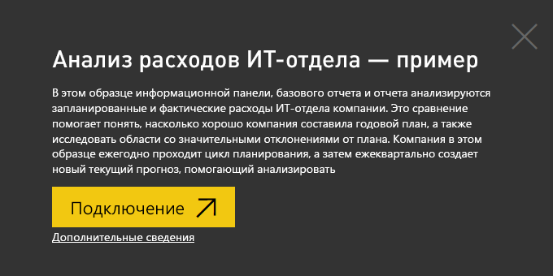
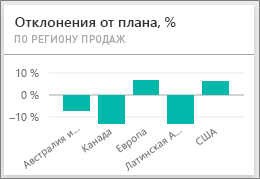
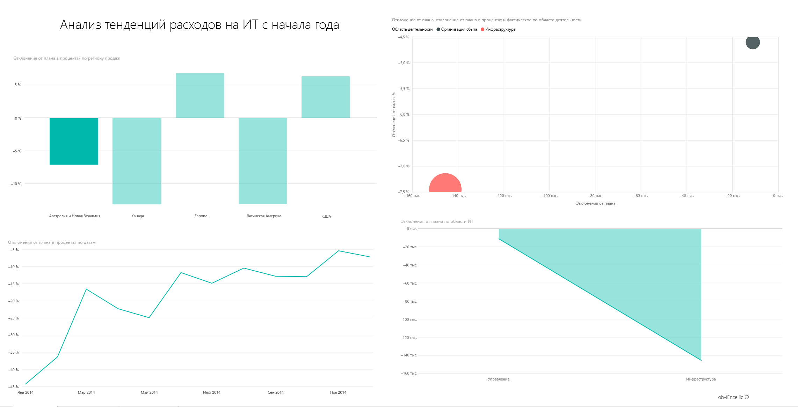
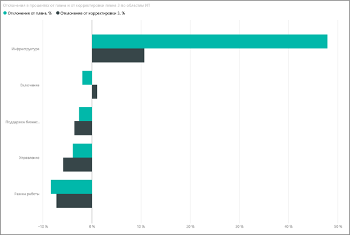

# Образец "Анализ расходов на ИТ" для Power BI: обзор

Пакет содержимого для примера "Анализ расходов ИТ-отдела" содержит панель мониторинга, отчет и набор данных и позволяет проанализировать запланированные и фактические затраты на ИТ-отдел. Это сравнение помогает понять, насколько хорошо компания составила годовой план, и позволяет исследовать области со значительными отклонениями от плана. Компания в этом примере ежегодно проходит цикл планирования, а затем ежеквартально создает новый текущий прогноз, помогающий анализировать изменения в расходах ИТ-отдела за последний финансовый год.

Этот пример входит в серию, демонстрирующую, как использовать Power BI с бизнес-данными, отчетами и панелями мониторинга. Он создан на основе реальных данных [obviEnce](http://www.obvience.com/), которые были анонимизированы. Данные доступны в нескольких форматах: пакет содержимого, PBIX-файл Power BI Desktop или книга Excel. См. раздел [Примеры для Power BI](sample-datasets.md). 

В этом руководстве мы изучим пример пакета содержимого "Анализ расходов на ИТ" в службе Power BI. Так как в Power BI Desktop и службе возможности работы с отчетами практически не отличаются, этот же пример PBIX-файла можно использовать и в Power BI Desktop. 

Вам не требуется лицензия Power BI для просмотра примеров в Power BI Desktop. Если у вас нет лицензии Power BI Pro, можно сохранить пример в личную рабочую область в службе Power BI. 

## Получение примера

 Прежде чем использовать пример, необходимо скачать его как [пакет содержимого](#get-the-content-pack-for-this-sample), [PBIX-файл](#get-the-pbix-file-for-this-sample) или [книгу Excel](#get-the-excel-workbook-for-this-sample).

### Получение пакета содержимого для этого примера

1. Откройте службу Power BI (app.powerbi.com), войдите в систему и откройте рабочую область, где хотите сохранить пример.

   Если у вас нет лицензии Power BI Pro, можно сохранить пример в личной рабочей области.

2. В левом нижнем углу выберите **Получить данные**.
   
   
3. На странице **Получение данных** выберите **Примеры**.
   
4. Выберите **Анализ расходов ИТ-отдела — пример**, а затем выберите **Подключиться**.  
  
   
   
5. Power BI импортирует пакет содержимого и добавляет новую панель мониторинга, отчет и набор данных в текущую рабочую область.
   
   
  
### Получение PBIX-файла для этого примера

Кроме того, вы можете загрузить пример "Анализ расходов ИТ-отдела" в виде [PBIX-файла](https://download.microsoft.com/download/E/9/8/E98CEB6D-CEBB-41CF-BA2B-1A1D61B27D87/IT%20Spend%20Analysis%20Sample%20PBIX.pbix), который предназначен для работы с Power BI Desktop.

### Получение книги Excel для этого примера

Если вы хотите просмотреть источник данных для этого примера, он также доступен в виде [книги Excel](https://go.microsoft.com/fwlink/?LinkId=529783). Книга содержит листы Power View, которые можно просматривать и изменять. Чтобы просмотреть необработанные данные, включите надстройки анализа данных и выберите **Power Pivot > Управление**. Чтобы включить надстройки Power View и Power Pivot, перейдите к разделу [Просмотр примеров Excel непосредственно из Excel](sample-datasets.md#explore-excel-samples-inside-excel).

## Панель мониторинга для примера"Анализ расходов ИТ-отдела"
На двух плитках с данными — **Var Plan %** (% отклонения от плана) и **Variance Latest Estimate % Quarter 3** (% отклонения от текущего прогноза на 3-й квартал) — в левой части панели мониторинга содержатся общие сведения о соответствии плану и текущему прогнозу на квартал (LE3 = текущий прогноз на 3-й квартал). В целом мы отстаем от плана примерно на 6 %. Рассмотрим причину отклонения: когда, где и в какой категории.

## Страница YTD IT Spend Trend Analysis (Анализ тенденций расходов ИТ-отдела с начала года)
При выборе на панели мониторинга плитки **Var Plan % by Sales Region** (% отклонения от плана по региону продаж) открывается страница **YTD IT Spend Trend Analysis** (Анализ тенденций расходов ИТ-отдела) отчета образца анализа расходов на ИТ. Мы сразу вкратце видим положительное отклонение в США и Европе и отрицательное отклонение в Канаде, Латинской Америке и Австралии. У США наблюдается положительное 6-процентное отклонение от текущего прогноза, а у Австралии отрицательное 7-процентное отклонение от текущего прогноза.

Однако, если делать выводы просто глядя на эту диаграмму, можно сформировать ложное впечатление. Чтобы рассматривать все происходящее в перспективе, нужно обратиться к фактическим денежным суммам.

1. В диаграмме **Var Plan % by Sales Region** (% отклонения от плана по региону продаж) выберите **Aus and NZ** (Австралия и Новая Зеландия) и просмотрите диаграмму **Var Plan by IT Area** (Отклонение от плана по области ИТ).

   
2. Теперь выберите **США**. Обратите внимание, что Австралия и Новая Зеландия составляют очень небольшую часть общих затрат по сравнению с США.

    Далее рассмотрим, какая категория в США является причиной отклонения.

## Вопросы о данных
1. В области навигации сверху выберите **Анализ расходов ИТ-отдела — пример**, чтобы вернуться к примеру панели мониторинга.
2. Выберите **Задать вопрос о данных**.
3. В списке **Вопросы для начала работы** слева выберите **вопрос о плане по областям ИТ**.

   

4. В поле вопросов и ответов очистите предыдущую запись и введите *Показать диаграмму областей ИТ, % отклонения от плана и % отклонения от текущего прогноза на 3-й квартал*.

   

   В первой области ИТ — **Инфраструктура** — обратите внимание, что значительно изменилось значение процента между начальным отклонением от плана и отклонением от текущего прогноза.

## Страница YTD Spend by Cost Elements (Расходы по элементам затрат с начала года)

1. Вернитесь к панели мониторинга и просмотрите плитку **% отклонения от плана и % отклонения от текущего прогноза на 3-й квартал**.

   

   Обратите внимание, что область инфраструктуры выделяется с большим положительным отклонением от плана.

1. Выберите эту плитку, чтобы открыть отчет и просмотрите страницу **YTD Spend by Cost Elements** (Расходы по элементам затрат с начала года).
2. Выберите столбец **Инфраструктура** в диаграмме **% отклонения от плана и % отклонения от текущего прогноза на 3-й квартал по областям ИТ** в нижней левой части панели и просмотрите значения отклонения от плана в диаграмме **отклонения от плана в процентах по региону продаж** внизу слева.

    
3. Поочередно выберите имя каждого элемента в срезе **Группа элементов затрат**, чтобы найти элемент затрат с наибольшим отклонением.
4. Выбрав **Другое**, щелкните **Инфраструктура** в срезе **Область ИТ** и выберите вложенные области в срезе **Вложенные области ИТ**, чтобы найти вложенную область с наибольшим отклонением.  

   Обратите внимание на большое отклонение для **Сети**. Видимо, компания решила в качестве преимущества предоставить своим сотрудникам услуги телефонной связи, несмотря на то что этот момент не был запланирован.

## Страница анализа отклонения от плана

1. Выберите вкладку **анализа отклонения от плана** в нижней части страницы.

2. В диаграмме **отклонения от плана и % отклонения от плана по области деятельности** в левой части выберите столбец **Инфраструктура**, чтобы выделить значения области деятельности "Инфраструктура" в остальной части страницы.

    

   Обратите внимание, что в диаграмме **% отклонения от плана по месяцу и области деятельности** область деятельности "Инфраструктура" приобрела положительное значение отклонения в феврале. Кроме того, обратите внимание, как отклонение от плана для этой области деятельности зависит от страны, если сравнивать со всеми остальными областями деятельности. 

3. Воспользуйтесь срезами **Область ИТ** и **Вложенные области ИТ** справа, чтобы отфильтровать значения в остальной части страницы и проанализировать данные. 

## Редактирование отчета
В левом верхнем углу щелкните **Изменить отчет**, чтобы просмотреть отчет в представлении редактирования:

* Изучите компоненты страниц — поля в каждой диаграмме и фильтры на страницах.
* Добавьте страницы и диаграммы на основе тех же данных.
* Измените тип визуализации для каждой диаграммы.
* Закрепите нужные диаграммы на панели мониторинга.

## Дальнейшие действия: подключение к данным
В этой среде можно свободно экспериментировать, так как сохранять изменения не требуется. Однако если изменения сохраняются, всегда можно выбрать функцию **Получить данные** для получения новой копии этого примера.

Мы надеемся, что из этого обзора вы узнали, как с помощью панелей мониторинга, вопросов и ответов, а также отчетов Power BI можно получить представление о данных из примера. Теперь ваша очередь — выполните подключение к собственным данным. С помощью Power BI можно подключаться ко многим типам источников данных. Дополнительные сведения см. в руководстве по [началу работы со службой Power BI](service-get-started.md).
