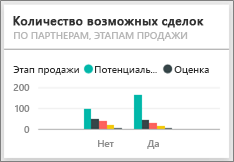

# Образец "Анализ возможностей" для Power BI: обзор

## Общие сведения о примере "Анализ возможностей"
**Анализ возможностей — пример** содержит панель мониторинга (и связанный с ней отчет) для компании-разработчика программного обеспечения, использующей два канала продаж: *прямой* и *партнерский*. Менеджер по продажам создала эту панель мониторинга для отслеживания возможных сделок и дохода по регионам, величине сделок и каналам.

Менеджер по продажам учитывает две меры дохода:

* **доход** — это примерная оценка продавцом того, какой доход получит компания.
* **факторный доход** — это доход, вычисляемый по формуле "доход X вероятность%", который обычно более точно прогнозирует фактический доход от продаж. Вероятность определяется по текущему ***этапу сделки***.
  * Потенциальный клиент — 10 %  
  * Оценка — 20 %  
  * Решение — 40 %  
  * Предложение — 60 %  
  * Завершение — 80 %

  

Этот образец входит в серию, демонстрирующую, как можно использовать Power BI с бизнес-данными, отчетами и информационными панелями. Это реальные данные из obviEnce ([www.obvience.com)](http://www.obvience.com/), которые были обезличены.

## Предварительные требования

 Прежде чем использовать пример, необходимо скачать его как [пакет содержимого](https://docs.microsoft.com/en-us/power-bi/sample-opportunity-analysis#get-the-content-pack-for-this-sample), [PBIX-файл](http://download.microsoft.com/download/9/1/5/915ABCFA-7125-4D85-A7BD-05645BD95BD8/Opportunity Analysis Sample PBIX.pbix) или [книгу Excel](http://go.microsoft.com/fwlink/?LinkId=529782).

### Получение пакета содержимого для этого примера

1. Откройте службу Power BI (app.powerbi.com) и войдите в систему.
2. В левом нижнем углу выберите **Получить данные**.
   
    
3. На странице "Получение данных" щелкните значок **Примеры**.
   
   
4. Выберите **Анализ возможностей — пример**, затем выберите **Подключиться**.  
  
   
   
5. Power BI импортирует пакет содержимого и добавляет новую информационную панель, отчет и набор данных в текущую рабочую область. Новое содержимое отмечено желтой звездочкой. 
   
   
  
### Получение PBIX-файла для этого примера

Также вы можете загрузить пример в виде PBIX-файла, который предназначен для работы с Power BI Desktop. 

 * [Анализ возможностей — пример](http://download.microsoft.com/download/9/1/5/915ABCFA-7125-4D85-A7BD-05645BD95BD8/Opportunity%20Analysis%20Sample%20PBIX.pbix)

### Получение книги Excel для этого примера
Вы также можете [скачать только набор данных (книга Excel) для этого примера](http://go.microsoft.com/fwlink/?LinkId=529782). Книга содержит листы Power View, которые можно просматривать и изменять. Чтобы просмотреть необработанные данные выберите элементы **Power Pivot > Управление**.

## Какие данные отображаются на информационной панели?
Наш менеджер по продажам создал эту панель мониторинга, чтобы отслеживать наиболее важные метрики. Когда она видит что-либо интересное, она выбирает плитку, чтобы проанализировать данные более подробно.

1. Доход компании составляет 2 млрд долл. США, а факторный доход — 461 млн долл. США.
2. Число возможных сделок и возможный доход соответствуют знакомому воронкообразному шаблону, где итоговые показатели уменьшаются на каждом последующем этапе.
3. Основная часть наших возможностей находится в восточном регионе.
4. Крупные возможные сделки приносят больший доход, чем возможные сделки среднего и малого размера.
5. Крупные партнерские сделки приносят больший доход: в среднем 8 млн долл. США по сравнению с 6 млн долл. США для прямых продаж.

Поскольку усилия, необходимые для заключения сделки, одинаковы для сделок любого размера, нашей компании следует подробнее изучить данные для получения дополнительных сведений о крупных возможных сделках.

Выберите плитку **Opportunity Count by Partner Driven and Sales Stage** (Число возможных сделок по участию партнеров и этапу продаж), чтобы открыть страницу 1 отчета.  

## Просмотр страниц в отчете
### Страница 1 нашего отчета называется "Opportunity Counts Overview" (Обзор числа возможных сделок).

* Восточный регион предоставляет наибольшее число возможных сделок.  
* На круговой диаграмме выберите по одному региону за раз для фильтрации страницы. Для каждого региона партнеры предоставляют значительно более крупные возможные сделки.   
* Гистограмма Opportunity Count by Partner Driven and Opportunity Size (Число возможных сделок по участию партнеров и размеру) дает четко понять, что большинство крупных возможных сделок можно реализовать при участии партнеров, а большинство возможных сделок среднего и малого размера участия партнеров не требует.
* Выберите каждый этап продаж на линейчатой диаграмме в левом нижнем углу, чтобы просмотреть разницу в региональных показателях, и обратите внимание на то, что хотя восточный регион и является наиболее перспективным с точки зрения числа возможных сделок, на этапах решения, предложения и завершения все три региона имеют сравнимые показатели. Это означает, что мы закрываем больший процент сделок в центральном (Central) и западном (West) регионах.

### Страница 2 нашего отчета называется Revenue Overview (Обзор доходов).
На этой странице данные представлены аналогичным образом, однако с точки зрения перспективы дохода, а не количества.  

* Восточный регион наиболее перспективен не только по числу возможных сделок, но и по доходу.  
* Фильтрация по участию партнеров (выберите утвердительный ответ **Yes** в условных обозначениях в верхнем правом углу) показывает доход 1,5 млрд долл. США и 294 млн долл. США. Сравните это с показателями в 644 млрд долл. США и 166 млн долл. США для дохода без участия партнеров.  
* Средний доход для крупных клиентов выше (8 млн), если возможная сделка проводится с их участием, чем в случае отсутствия участия со стороны партнеров (6 млн).  
* Для крупных сделок с привлечением партнеров средний доход почти в два раза выше дохода аналогичных средних сделок (4 млн).  
* Средний доход для малых и средних сделок как при участии партнеров, так и без него примерно одинаков.   

Совершенно ясно, что наши партнеры лучше осуществляют продажи клиентам.  Имеет смысл заключать больше сделок через наших партнеров.

### Страница 3 нашего отчета называется Region Stage Counts (Показатели по этапу и региону).
На этой странице рассматриваются те же самые данные, но разбитые по региону и этапу.  

* Фильтрация по восточному региону (выберите **East** на круговой диаграмме) показывает, что возможные сделки на востоке практически поровну делятся между сделками с привлечением партнеров и сделками без их участия.
* Крупные сделки наиболее распространены в центральном регионе, небольшие сделки — в восточном регионе, а средние сделки — в западном.

### Страница 4 нашего отчета называется Upcoming Opportunities (Предстоящие возможные сделки)
Здесь мы опять разбираем те же факторы, но на этот раз с точки зрения даты и времени.  

Наш финансовый директор использует эту страницу для управления рабочей нагрузкой. Анализируя возможности извлечения прибыли по этапу продаж и месяцу, она может соответствующим образом планировать работу.

* Средний доход на этапе завершения самый высокий. Заключение таких сделок является главным приоритетом.
* Фильтрация по месяцам (для этого нужно выбрать название месяца в левом фрагменте) показывает, что на январь приходится большая часть сделок на этапе завершения с факторным доходом в 75 млн долл. США. С другой стороны, на февраль приходятся в основном средние сделки на этапе решения и предложения.
* В целом показатели факторного дохода колеблются в зависимости от этапа продаж, числа возможных сделок и размера сделки. Добавьте фильтры (с помощью панели фильтров справа) для этих факторов, чтобы получить дополнительные сведения.

В такой безопасной среде можно работать. Отказаться от сохранения изменений можно в любой момент. Однако если изменения сохраняются, всегда можно выбрать функцию **Получить данные** для получения новой копии этого образца.

## Дальнейшие действия: подключение к данным
Мы надеемся, что в этом обзоре вы узнали, каким образом с помощью панелей мониторинга, вопросов и ответов и отчетов можно получить представление о данных по отслеживанию возможных сделок. Теперь ваша очередь — выполните подключение к собственным данным. С помощью Power BI можно подключаться ко многим типам источников данных. Узнайте больше о [начале работы с Power BI](service-get-started.md).

[Скачать образцы](sample-datasets.md)  
