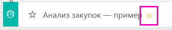
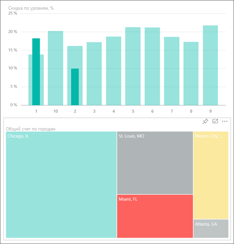
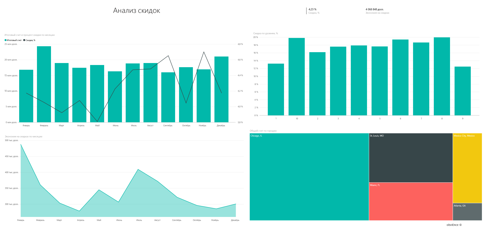
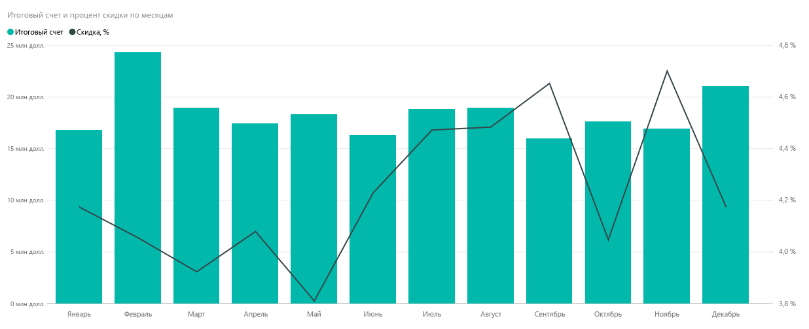
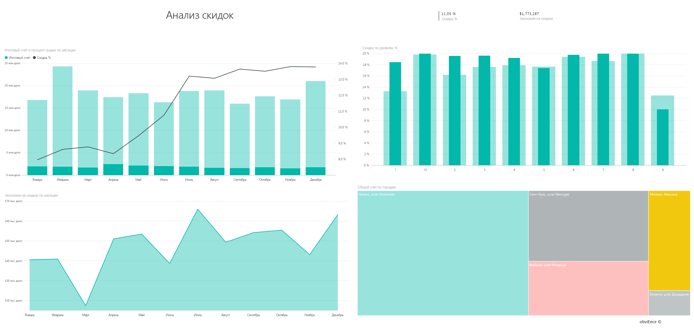

# Образец "Анализ закупок" для Power BI: обзор

## Обзор с примером "Анализ закупок"
В этом примере панели мониторинга предприятия и базовом отчете анализируются расходы производственной компании на поставщиков по категории и расположению. В данном примере мы исследуем следующие области:

* самые популярные поставщики;
* категории с самыми большими расходами;
* поставщики, предоставляющие наибольшую скидку, а также время ее предоставления.

Этот пример входит в серию, демонстрирующую, как можно использовать Power BI с бизнес-данными, отчетами и панелями мониторинга. Это реальные данные из obviEnce ([www.obvience.com)](http://www.obvience.com/), которые были обезличены.

## Предварительные требования

 Прежде чем использовать пример, необходимо загрузить его как пакет содержимого, PBIX-файл или книгу Excel.

### Получение пакета содержимого для этого примера

1. Откройте службу Power BI (app.powerbi.com) и войдите в систему.
2. В левом нижнем углу выберите **Получить данные**.
   
    
3. На странице "Получение данных" щелкните значок **Примеры**.
   
   
4. Выберите **Анализ закупок — пример**, затем выберите **Подключиться**.  
  
   
   
5. Power BI импортирует пакет содержимого и добавляет новую информационную панель, отчет и набор данных в текущую рабочую область. Новое содержимое отмечено желтой звездочкой. 
   
   
  
### Получение PBIX-файла для этого примера

Также вы можете загрузить пример в виде PBIX-файла, который предназначен для работы с Power BI Desktop. 

 * [Анализ закупок — пример](http://download.microsoft.com/download/D/5/3/D5390069-F723-413B-8D27-5888500516EB/Procurement%20Analysis%20Sample%20PBIX.pbix)

### Получение книги Excel для этого примера
Вы также можете [скачать только набор данных (книга Excel) для этого примера](http://go.microsoft.com/fwlink/?LinkId=529784). Книга содержит листы Power View, которые можно просматривать и изменять. Чтобы просмотреть необработанные данные выберите элементы **Power Pivot > Управление**.

## Тенденции затрат
Давайте сначала рассмотрим тенденции затрат по категории и расположению.  

1. Из рабочей области откройте вкладку **Информационные панели** и выберите информационную панель Procurement Analysis (Анализ закупок).
2. Выберите плитку панели мониторинга **Total Invoice by Country/Region**(Итоговый счет по стране/региону). Открывается страница Spend Overview (Обзор затрат) отчета Procurement Analysis Sample (Анализ закупок — пример).

    

Обратите внимание на несколько следующих моментов.

* Обратите внимание, что на графике **Total Invoice by Month and Category** (Итоговый счет по месяцу и категории) категория **Direct** (Прямые) имеет довольно согласованные затраты, категория **Logistics** (Логистика) имеет пиковое значение в декабре, а категория **Other** (Другие) имеет пиковое значение в феврале.
* На карте **Total Invoice by Country/Region** (Итоговый счет по стране/региону) основная часть затрат относится к США.
* Обратите внимание, что на гистограмме **Total Invoice by Sub Category** (Итоговый счет по подкатегории) к наиболее значительным категориям затрат относится **Hardware** (Оборудование) и **Indirect Goods & Services** (Косвенные товары и услуги).
* На линейчатой диаграмме Total Invoice by Tier (Итоговый счет по уровню) видно, что основная часть нашего бизнеса ведется с нашими поставщиками уровня 1 (десятью ведущими поставщиками). Это помогает лучше управлять отношениями с поставщиками.

## Затраты в Мексике
Давайте рассмотрим области затрат в Мексике.

1. На круговой диаграмме выберите пузырек **Мексика** на карте. Обратите внимание, что на гистограмме "Total Invoice by Sub Category" (Итоговый счет по подкатегории) основная часть относится к подкатегории **Indirect Goods & Services** (Косвенные товары и услуги).

   
2. Рассмотрим столбец **Indirect Goods & Services** (Косвенные товары и услуги) более подробно.

   * Щелкните стрелку детализации  в правом верхнем углу диаграммы.
   * Выберите столбец **Indirect Goods & Services** (Косвенные товары и услуги).

      Пока что максимальные затраты в этой категории приходятся на продажи и маркетинг.
   * На карте еще раз выберите **Мексика** .

      Наибольшие затраты в этой категории в Мексике приходятся на обслуживание и ремонт.

      
3. Выберите стрелку вверх в левой верхней части диаграммы, чтобы включить детализацию.
4. Щелкните стрелку еще раз, чтобы отключить детализацию.  
5. В верхней панели навигации выберите **Power BI**, чтобы вернуться к своей рабочей области.

## Оценка разных городов
Мы можем использовать выделение для оценки разных городов.

1. Выберите плитку панели мониторинга **Total Invoice, Discount % By Month**(Итоговый счет, скидка по месяцу). Отчет открывается на странице Discount Analysis (Анализ скидок).
2. Выберите разные города в древовидной диаграмме **Total Invoice by City** (Итоговый счет по городу), чтобы сравнить их. Почти все счета для Майами выставлены поставщиками уровня 1.

   

## Скидки поставщиков
Давайте также рассмотрим скидки, предоставляемые поставщиками, и периоды времени, когда мы получаем наибольшие скидки.

В частности, это следующие вопросы.

* Скидки отличаются по месяцам или одинаковы каждый месяц?
* Получают ли некоторые города дополнительные скидки?

### Скидка по месяцам
Из комбинированной диаграммы **Total Invoice and Discount % by Month** (Итоговый счет и скидка по месяцу) видно, что **февраль** является максимально загруженным месяцем, а в **сентябре** загрузка минимальна. Теперь рассмотрим процент скидки в эти месяцы.
Обратите внимание, что при увеличении объема скидка уменьшается и наоборот. Чем больше нам нужна скидка, тем менее выгодную сделку мы получаем.

### Скидка по городам
Другой областью для исследования является скидка по городам. Выбирайте каждый город на диаграмме-дереве и следите за тем, как изменяются другие диаграммы.

* Для города Сент-Луис в штате Миссури наблюдается пиковое значение итогового счета в феврале и значительное сокращение экономии на скидках в апреле.
* Для города Мехико в Мексике наблюдается наибольший процент скидки (11,05 %), а для города Атланта в штате Джорджия — наименьший (0,08 %).

### Редактирование отчета
В левом верхнем углу щелкните **Изменить отчет** и просмотрите отчет в представлении редактирования.

* Ознакомьтесь с созданием страниц.
* Добавьте страницы и диаграммы на основе тех же данных.
* Измените тип визуализации для диаграммы: например, используйте вместо диаграммы "дерево" кольцевую диаграмму.
* Прикрепите их к панели мониторинга.

В такой безопасной среде можно работать. Отказаться от сохранения изменений можно в любой момент. Если изменения сохраняются, всегда можно выбрать функцию **Получить данные** для получения новой копии этого примера.

## Дальнейшие действия: подключение к данным
Мы надеемся, что в этом обзоре вы узнали, каким образом с помощью информационных панелей Power BI и отчетов можно получить представление о данных закупок. Теперь ваша очередь — выполните подключение к собственным данным. С помощью Power BI можно подключаться ко многим типам источников данных. Узнайте больше о [начале работы с Power BI](service-get-started.md).
