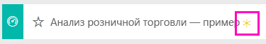
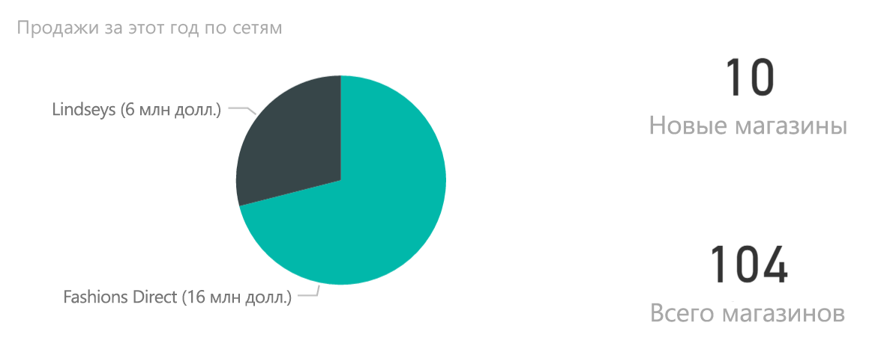
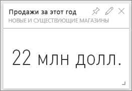
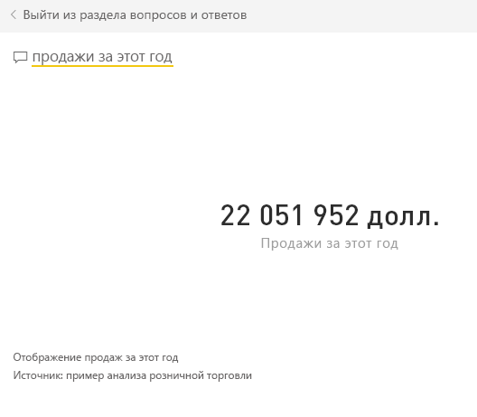
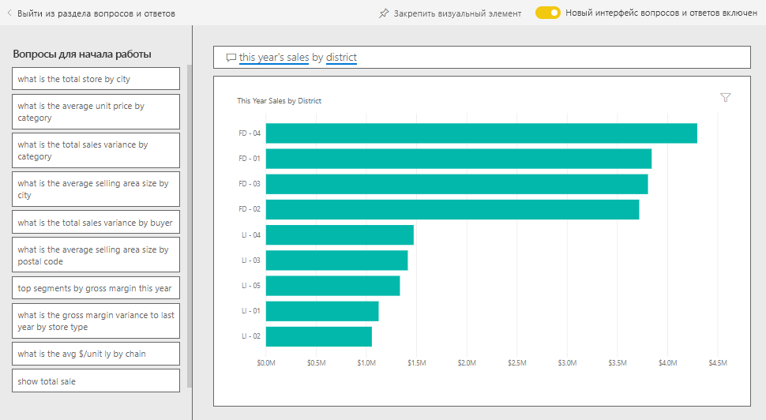
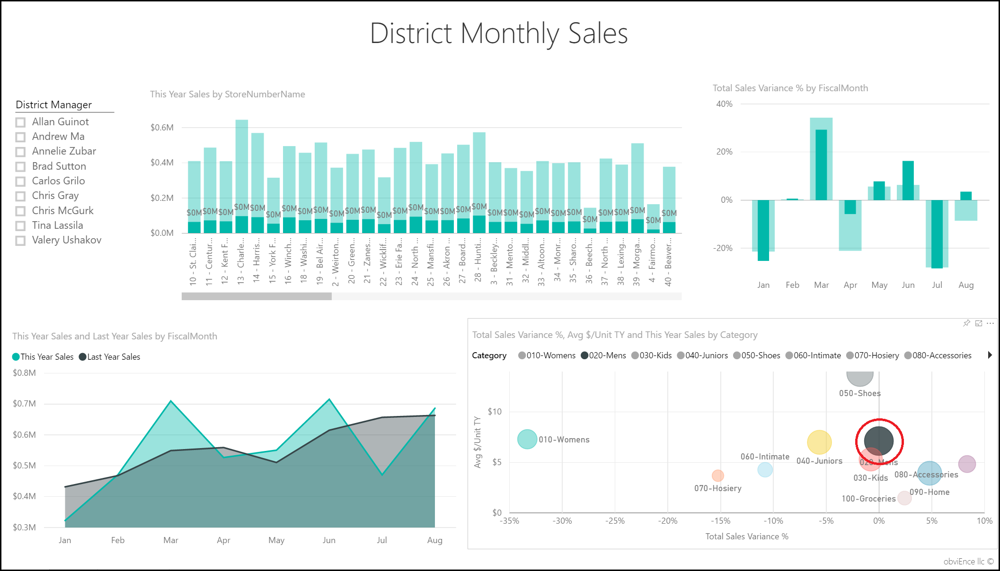
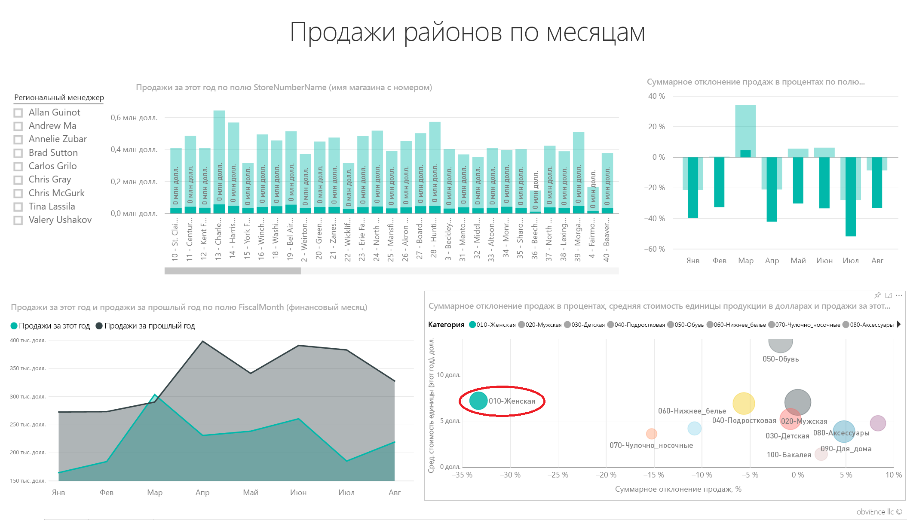
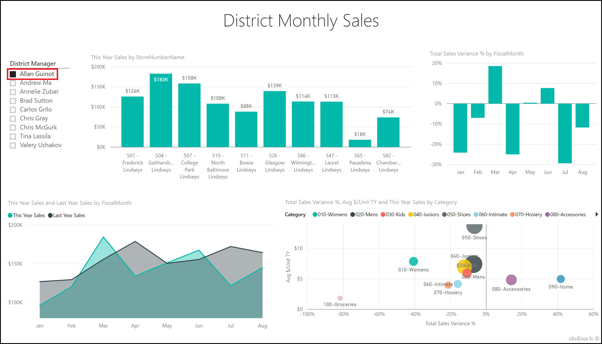
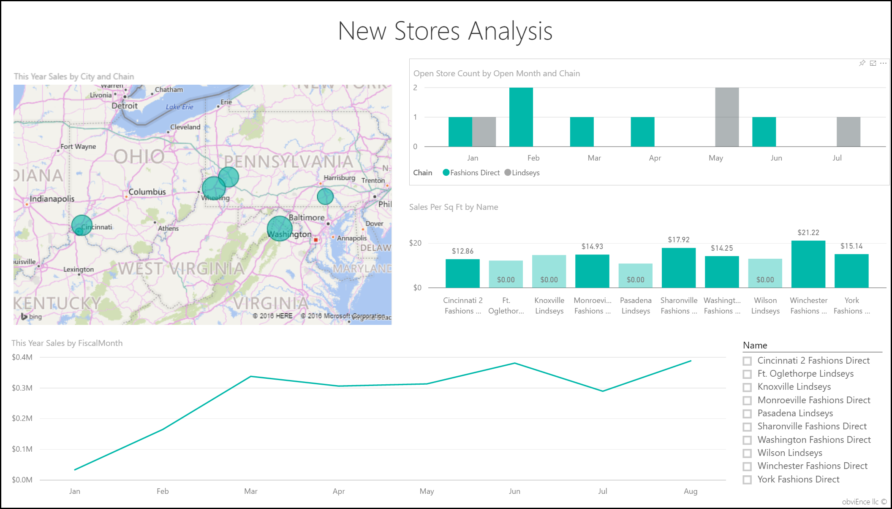
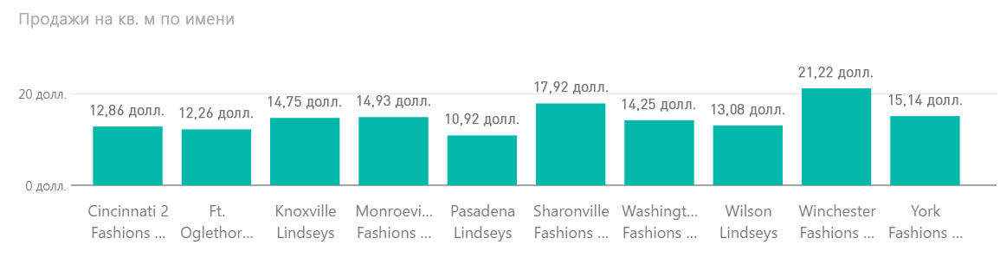

# Образец "Анализ розничной торговли" для Power BI: обзор

Этот образец отраслевой панели мониторинга и базовый отчет анализируют данные о розничных продажах товаров, проданных в различных магазинах и районах. Метрики сравнивают эффективность за этот год c показателями за прошлый год в следующих областях: продажи, единицы, валовая прибыль и дисперсия, что также называют анализом нового магазина. Это реальные данные из obviEnce ([www.obvience.com](http://www.obvience.com)), которые были обезличены.

## Предварительные требования

 Прежде чем использовать пример, необходимо скачать его как [пакет содержимого](https://docs.microsoft.com/en-us/power-bi/sample-datasets#get-and-open-a-sample-content-pack-in-power-bi-service), [PBIX-файл](http://download.microsoft.com/download/9/6/D/96DDC2FF-2568-491D-AAFA-AFDD6F763AE3/Retail%20Analysis%20Sample%20PBIX.pbix) или [книгу Excel](http://go.microsoft.com/fwlink/?LinkId=529778).

### Получение пакета содержимого для этого примера

1. Откройте службу Power BI (app.powerbi.com) и войдите в систему.
2. В левом нижнем углу выберите **Получить данные**.
   
    
3. На странице "Получение данных" щелкните значок **Примеры**.
   
   
4. Выберите **Анализ розничной торговли — пример**, затем выберите **Подключиться**.  
  
   
   
5. Power BI импортирует пакет содержимого и добавляет новую информационную панель, отчет и набор данных в текущую рабочую область. Новое содержимое отмечено желтой звездочкой. 
   
   
  
### Получение PBIX-файла для этого примера

Также вы можете загрузить пример в виде PBIX-файла, который предназначен для работы с Power BI Desktop. 

 * [Анализ розничной торговли — пример](http://download.microsoft.com/download/9/6/D/96DDC2FF-2568-491D-AAFA-AFDD6F763AE3/Retail%20Analysis%20Sample%20PBIX.pbix)

### Получение книги Excel для этого примера
Вы также можете [скачать только набор данных (книга Excel) для этого примера](http://go.microsoft.com/fwlink/?LinkId=529778). Книга содержит листы Power View, которые можно просматривать и изменять. Чтобы просмотреть необработанные данные выберите элементы **Power Pivot > Управление**.

## Запуск на панели мониторинга и открытие отчета
1. На панели мониторинга выберите плитку "Итог по магазинам":

     

   Откроется страница "Обзор продаж магазинов" в отчете. На ней видно, что всего есть 104 магазина, из них 10 новых. У нас есть две сети: Fashions Direct и Lindseys. В среднем магазины Fashions Direct крупнее.
2. На круговой диаграмме выберите **Fashions Direct**.

     

   Обратите внимание на результат пузырьковой диаграммы:

     

   Район FD-01 имеет наибольший средний объем продаж на квадратный метр, FD-02 имеет наименьшее отклонение продаж по сравнению с предыдущим годом, FD-03 и FD-04 имеют наихудшие показатели.
3. Выбирайте отдельные пузырьки или другие диаграммы, чтобы определить влияние выбранных вами параметров
4. Чтобы вернуться к информационной панели, выберите ее имя на верхней панели навигации (строка навигации).

   
5. На панели мониторинга выберите плитку "Продажи в этом году".

   

   Это эквивалентно вводу фразы "Продажи в этом году" в поле вопроса.

   Появляется следующий экран:

   

## Просмотр плитки, созданной с помощью поля "Вопросы и ответы" Power BI
Давайте запросим более конкретные сведения.

1. Добавьте в вопрос слова "Продажи в этом году **по районам**". Просмотрите результаты — ответ автоматически выводится в виде линейчатой диаграммы и предлагает другие фразы:

   
2. Теперь измените вопрос следующим образом: "Продажи в этом году **по почтовому индексу и сети**".

   Обратите внимание на то, как по мере ввода данных система отвечает на вопрос с помощью соответствующих диаграмм.
3. Поэкспериментируйте с другими вопросами и посмотрите, какие результаты можно получить.
4. Когда все будет готово, возвращайтесь к панели мониторинга.

## Подробные сведения о данных
Теперь давайте рассмотрим все более подробно, определив производительность по районам.

1. На информационной панели щелкните плитку сравнения продаж за этот год с продажами за предыдущий год.

   

   Обратите внимание на значительное расхождение с прошлым годом, где особенно неудачными месяцами являются январь, апрель и июль.

   

   Давайте посмотрим, сможем ли мы выявить источник проблем.
2. Выберите пузырьковую диаграмму и щелкните **020 Mens**.

     

   Обратите внимание, что мужская категория, в отличие от остальной части бизнеса, не была подвержена апрельскому спаду, однако январь и июль остались проблемными месяцами.
3. Теперь щелкните **пузырек 010-Womens’**.

   

   Обратите внимание, что во все месяцы показатели в женской категории значительно ниже общих показателей бизнеса, кроме того, почти для всех месяцев показатели намного ниже аналогичных показателей за предыдущий год.
4. Выберите пузырек еще раз, чтобы очистить фильтр.

## Попробуйте использовать срез
Давайте посмотрим, насколько эффективно осуществляются продажи по районам.

1. Щелкните Allan Guinot в срезе сверху слева.

   

   Обратите внимание, что в прошлом году максимальные показатели по району Allan наблюдались в марте и июне.
2. Теперь, пока район Allan все еще выбран, щелкните пузырек женской категории.

   

   Обратите внимание, что в рамках женской категории этот район так и не достиг объема продаж за прошлый год.
3. Изучите диспетчеры и категории других районов: какую дополнительную информацию вы сможете найти?
4. Когда будете готовы, возвращайтесь на панель мониторинга.

## Что наши данные сообщают о росте продаж в этом году?
Последней рассматриваемой областью является наш рост — новые магазины, открытые в этом году.

1. Выберите плитку «Магазины, открытые в этом году».

   

   Из плитки видно, что в этом году было открыто больше магазинов Fashions Direct, чем магазинов Lindseys.
2. Просмотрите диаграмму "Sales Per Sq Ft by Name" (Продажи на кв. фут по имени):

   

    Средний показатель продаж на кв. фут у новых магазинов сильно различается.
3. Щелкните элемент условных обозначений Fashions Direct в правой верхней части диаграммы. Обратите внимание, что для одной и той же сети лучший магазин (Winchester Fashions Direct) значительно обходит по показателям худший магазин (Cincinnati 2 Fashions Direct) — 21,22 против 12,86 долл. США соответственно.

   
4. Щелкните Winchester Fashions Direct на срезе и обратите внимание на график. Первый отчет с суммами продаж поступил в феврале.
5. Щелкните Cincinnati 2 Fashions Direct на срезе, и вы увидите на графике, что этот магазин был открыт в июне и, похоже, имеет самые низкие показатели.
6. Как и раньше, просмотрите данные, щелкая другие панели, графики и пузырьки на всех диаграммах, и попробуйте обнаружить какие-либо ценные сведения.

В такой безопасной среде можно работать. Отказаться от сохранения изменений можно в любой момент. Однако если изменения сохраняются, всегда можно выбрать функцию "Получить данные" для получения новой копии этого образца.

## Подключение к данным
Мы надеемся, что в этом обзоре вы узнали, каким образом с помощью панелей мониторинга, вопросов и ответов и отчетов можно получить представление о данных о розничных продажах. Теперь ваша очередь — выполните подключение к собственным данным. С помощью Power BI можно подключаться ко многим типам источников данных. Узнайте больше о [начале работы с Power BI](service-get-started.md).

## Дальнейшие действия
* [Скачайте пример пакета содержимого "Анализ розничной торговли"](sample-tutorial-connect-to-the-samples.md)
* [Скачайте ZIP-файл и все примеры файлов](http://go.microsoft.com/fwlink/?LinkId=535020)    
* [Скачайте книгу Excel для этого примера Power BI](http://go.microsoft.com/fwlink/?LinkId=529778)    
* [Получение данных (для Power BI)](service-get-data.md)    
* [Power BI — основные понятия](service-basic-concepts.md)    
* Появились дополнительные вопросы? [Ответы на них см. в сообществе Power BI.](http://community.powerbi.com/)
