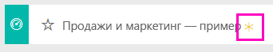
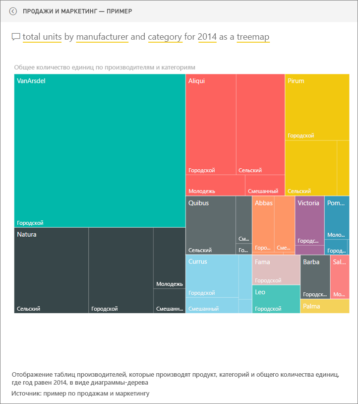

# Образец "Продажи и маркетинг" для Power BI: обзор

## Обзор с примером "Продажи и маркетинг"
В **образце "Продажи и маркетинг"** содержится информационная панель и отчет для вымышленной производственной компании VanArsdel Ltd. Эта информационная панель была создана руководителем отдела маркетинга VanArsdel (CMO) для просмотра занимаемой доли рынка, объема продуктов, продаж и отслеживания мнений.

У VanArsdel много конкурентов, однако компания является лидером рынка в отрасли. Руководитель отдела маркетинга хочет увеличить долю рынка и найти новые возможности для получения прибыли. Но по некоторым причинам доля компании на рынке начала уменьшаться. Значительное снижение наблюдалось в июне.

Этот образец входит в серию, демонстрирующую, как можно использовать Power BI с бизнес-данными, отчетами и информационными панелями. Это реальные данные с сайта Obvience (www.obvience.com), которые были обезличены.

## Предварительные требования

 Прежде чем использовать пример, необходимо скачать его как [пакет содержимого](https://docs.microsoft.com/power-bi/sample-sales-and-marketing#get-the-content-pack-for-this-sample), [PBIX-файл](http://download.microsoft.com/download/9/7/6/9767913A-29DB-40CF-8944-9AC2BC940C53/Sales%20and%20Marketing%20Sample%20PBIX.pbix) или [книгу Excel](http://go.microsoft.com/fwlink/?LinkId=529785).

### Получение пакета содержимого для этого примера

1. Откройте службу Power BI (app.powerbi.com) и войдите в систему.
2. В левом нижнем углу выберите **Получить данные**.
   
    
3. На странице "Получение данных" щелкните значок **Примеры**.
   
   
4. Выберите **Продажи и маркетинг — пример**, затем выберите **Подключиться**.  
  
   
   
5. Power BI импортирует пакет содержимого и добавляет новую информационную панель, отчет и набор данных в текущую рабочую область. Новое содержимое отмечено желтой звездочкой. 
   
   
  
### Получение PBIX-файла для этого примера

Также вы можете загрузить пример в виде PBIX-файла, который предназначен для работы с Power BI Desktop. 

 * [Продажи и маркетинг — пример](http://download.microsoft.com/download/9/7/6/9767913A-29DB-40CF-8944-9AC2BC940C53/Sales%20and%20Marketing%20Sample%20PBIX.pbix)

### Получение книги Excel для этого примера
Вы также можете [скачать только набор данных (книга Excel) для этого примера](http://go.microsoft.com/fwlink/?LinkId=529785). Книга содержит листы Power View, которые можно просматривать и изменять. Чтобы просмотреть необработанные данные выберите элементы **Power Pivot > Управление**.

## Какие данные отображаются на информационной панели?
Начнем обзор с информационной панели и посмотрим на плитки, закрепленные руководителем. Мы видим сведения о доле на рынке, продажах и мнениях. Данные разбиты по региону, времени и конкуренции.

* Цифры на плитках в левом столбце демонстрируют объем продаж в отрасли за последний год (50 000), долю на рынке (32,86 %), объем продаж (16 000), показатель мнений (68), спад мнений (4) и общее число проданных единиц (1 млн).
* На верхнем графике показано изменение доли рынка с течением времени. В июне произошло существенное снижение доли рынка. Кроме того, начинает останавливаться незначительный рост доли за скользящий год.
* Самым крупным конкурентом компании является Aliqui (как видно в среднем столбце).
* Большая часть бизнеса ведется в восточном и центральном регионах.
* График в нижней части показывает, что снижение в июне не является сезонным, поскольку подобная тенденция не наблюдается ни у одного из конкурентов.
* На двух плитках "Всего единиц" отображается количество проданного товара по сегменту и региону или производителю. Самыми крупными отраслевыми сегментами рынка являются **Производительность** и **Удобства**.

### Использование вопросов и ответов для более подробного изучения ситуации
#### Какие сегменты способствуют увеличению продаж? Соответствует ли это отраслевой тенденции?
1. Выберите плитку "Total Units Overall by Segment" (Общее число единиц по сегменту), после чего откроется строка вопроса.
2. В конце существующего запроса введите **для VanArsdel** . Вопрос будет интерпретирован и будет отображена диаграмма, обновленная согласно ответу. Источниками максимальных объемов продукции являются категории "Удобство" и "Умеренность".

   
3. Доля в категориях **Умеренность** и **Удобство** очень высока — это сегменты, в которых мы конкурируем.
4. Вернитесь к информационной панели, щелкнув ее имя на верхней панели навигации (строка навигации).

#### Что собой представляет доля общего количества единиц на рынке для категории (по сравнению с регионом)?
1. Посмотрите на плитку "Total Units YTD by Manufacturer, Region" (Общее число единиц с начала года по производителю, региону). Интересно, как выглядит доля общего числа единиц на рынке по категории?

   
2. В поле вопроса вверху панели мониторинга введите запрос на вывод **общего числа единиц по производителю и категории в 2014 году в виде диаграммы-дерева**. Обратите внимание на обновление визуализации по мере ввода вопроса.
   
3. Чтобы сравнить результаты, закрепите диаграмму на информационной панели. Очень интересный момент: в 2014 году компания VanArsdel продавала только продукцию в категории **Городской стиль** .
4. Вернитесь на информационную панель.

Информационные панели также являются точками входа в отчеты.  Если плитка была создана из базового отчета, после ее щелчка открывается отчет.

На нашей информационной панели в строке скользящего года отображается, что доля рынка больше не увеличивается с течением времени, а даже немного снижается. С чем связано значительное сокращение доли рынка в июне? Для дальнейшего анализа щелкните эту визуализацию, чтобы открыть базовый отчет.

### В отчете 4 страницы
#### На странице 1 отчета рассматривается доля компании VanArsdel на рынке.

1. Взгляните на гистограмму "Общее количество число единиц по месяцу и isVanArsdel" в нижней части. Столбец черного цвета отображает продукты VanArsdel (наши продукты), а зеленого — продукты конкурентов. Снижение в июне 2014 года, которое произошло для VanArsdel, не наблюдалось у конкурентов.
2. Линейчатая диаграмма "Общий объем категории по сегменту" в середине справа отфильтрована для отображения двух основных сегментов VanArsdel. Рассмотрим, как был создан этот фильтр.  

   а.  Разверните панель "Фильтры" справа.  
   б.  Щелкните, чтобы выбрать визуализацию.  
   в.  Обратите внимание, что в группе "Фильтры уровня визуальных элементов" **Сегмент** отфильтрован так, чтобы включать только **Удобства** и **Умеренность**.  
   г.  Измените фильтр, выбрав "Сегмент", чтобы развернуть этот раздел, а затем щелкните **Производительность** для добавления этого сегмента.  
3. В разделе "Total Units by Month and isVanArsdel" (Общее число единиц по месяцу и isVanArsdel) выберите черную отметку "Да", чтобы выполнить перекрестную фильтрацию страницы по VanArsdel. Обратите внимание, что конкуренция в сегменте "Производительность" отсутствует.
4. Еще раз выберите черную отметку "Да", чтобы удалить фильтр.
5. Посмотрим на график. На нем отображается ежемесячная доля на рынке и доли за скользящий год. Показатели за скользящий год сглаживают ежемесячные колебания и демонстрируют долгосрочные тенденции. Выберите сегмент "Convenience" (Удобство), а затем сегмент "Moderation" (Умеренность) на линейчатой диаграмме, чтобы увидеть колебания доли на рынке по каждому сегменту. В сегменте "Умеренность" гораздо больше колебаний доли на рынке, чем в сегменте "Удобства".

Нам по-прежнему нужно выяснить причину сокращения доли на рынке в июне. Проверим сегмент "Мнения".

#### Страница 3 отчета посвящена сегменту "Мнения".

Твиты, сообщения в Facebook, блоги, статьи и другие материалы оказывают влияние на формирование мнений, как показано на двух графиках. На графике в левой верхней части видно, что мнения по нашим продуктам были в основном нейтральными вплоть до февраля. С февраля началось значительное снижение, которое длилось до июня. Что послужило причиной спада положительных отзывов? Необходимо обратиться к внешним источникам. В феврале в нескольких статьях и записях блогов обслуживание клиентов в VanArsdel было отмечено как худшее в отрасли. Эти негативные отзывы в прессе были напрямую связаны с мнениями клиентов и объемом продаж. Компания VanArsdel приложила максимум усилий, чтобы улучшить обслуживание клиентов, и отрасль учла это. В июле количество положительных отзывов стало расти и достигло рекордно высокого уровня в 60. Этот всплеск можно увидеть на графике "Общее количество единиц по месяцу" на страницах 1 и 3. Возможно, это частично объясняет сокращение доли на рынке в июне?

Следующим направлением для изучения будет разрыв во мнениях: в каких районах наблюдается наибольшее сокращение, каким образом из этого можно извлечь выгоду и определить способы его воспроизведения в других районах.

#### Страница 2 отчета посвящена тенденции по категории с начала года.

* Их всех компаний в этой категории VanArsdel является самой крупной. Ее основными конкурентами выступают Natura, Aliqui и Pirium. Рассмотрим этот момент.
* Компания Aliqui увеличивает рост прибыли, но показатель объема продуктов по сравнению с нашим по-прежнему остается низким.
* На диаграмме-дереве компания VanArsdel показана зеленым цветом. В восточной части клиенты предпочитают наших конкурентов, в центральной части у нас все в порядке. На востоке наша доля минимальна.
* География оказывает влияние на количество проданных единиц. Восток является главным регионом для большинства производителей, и VanArsdel также прочно присутствует в центральном регионе.
* На диаграмме "Процент отклонения от общего количества единиц с начала года по месяцу и производителю" в правой нижней части демонстрируется положительное отклонение, и это хороший знак — в этом году дела идут лучше, чем в прошлом, однако то же самое можно сказать и о нашем конкуренте Aliqui.

#### Страница 4 отчета посвящена конкурентному анализу продуктов.

* На графике в левой нижней части показаны все сегменты категории, за исключением двух самых сильных сегментов VanArsdel. После фильтрации по категории с помощью щелчков по столбцам можно определить потенциальные направления расширения для VanArsdel. Сегменты **Экстремальный стиль** и **Производительность** растут быстрее других.
* Однако мы не конкурируем в этих сегментах. Чтобы охватить эти направления, с помощью имеющихся данных можно узнать, какие сегменты популярных в определенных регионах. Мы можем продолжить изучение вопросов, касающихся самого быстро развивающегося региона и основного конкурента в этом сегменте.
* Помните сокращение доли рынка в июне? Июнь является значимым месяцем для сегмента производительности — сегмента, в котором отсутствует конкуренция. Это может объяснить сокращение доли рынка в июне.

С помощью фильтрации визуализаций по VanArsdel, по сегменту, по месяцу и по региону можно выяснить возможности роста для VanArsdel.

В такой безопасной среде можно работать. Отказаться от сохранения изменений можно в любой момент. Однако если изменения сохраняются, всегда можно выбрать функцию **Получить данные** для получения новой копии этого образца.

## Дальнейшие действия: подключение к данным
Мы надеемся, что в этом обзоре вы узнали, каким образом с помощью информационных панелей, вопросов и ответов и отчетов можно получить представление о данных по продажам и маркетингу. Теперь ваша очередь — выполните подключение к собственным данным. С помощью Power BI можно подключаться ко многим типам источников данных. Узнайте больше о [начале работы с Power BI](service-get-started.md).  
