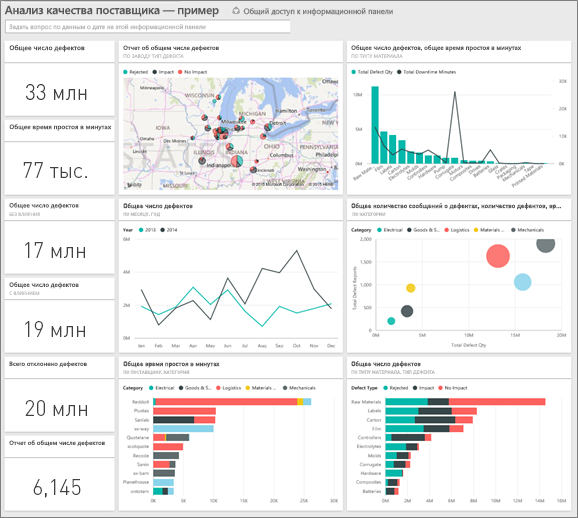
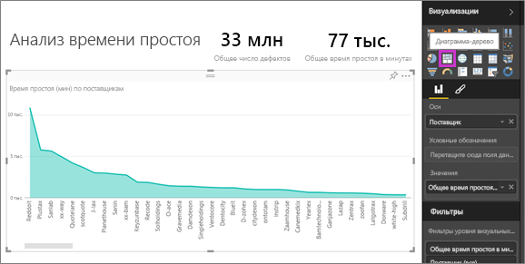
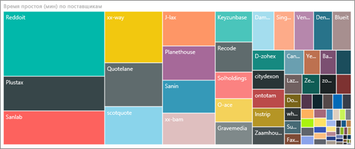
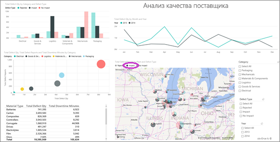
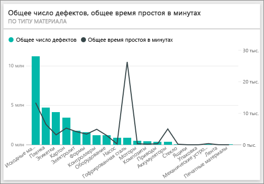
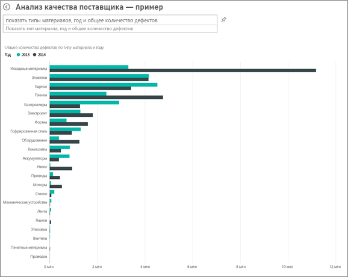
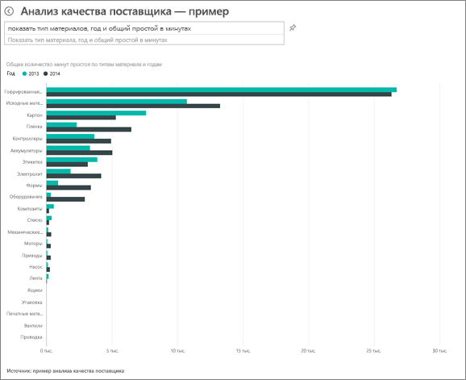
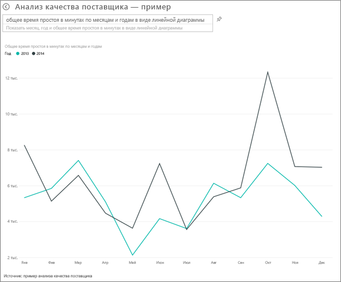

# Образец "Анализ качества поставщика: обзор"

## Общие сведения о примере "Анализ качества поставщика"
В этом образце информационной панели, базового набора данных и отчета рассматривается одна из распространенных проблем цепочки поставок — анализ качества поставщика.
В анализе действуют два основных показателя: общее число дефектов и общее время простоя, вызванное этими дефектами. Этот образец преследует две основные цели:

* определение лучшего и худшего поставщиков в отношении качества;
* определение планов, которые лучше всего выполняют поиск и отклоняют дефекты, для минимизации времени простоя.

Этот образец входит в серию, демонстрирующую, как можно использовать Power BI с бизнес-данными, отчетами и информационными панелями.
Это реальные данные из obviEnce ([www.obvience.com](http://www.obvience.com/)), которые были обезличены.

## Предварительные требования

 Прежде чем использовать пример, необходимо скачать его как [пакет содержимого](https://docs.microsoft.com/en-us/power-bi/sample-supplier-quality#get-the-content-pack-for-this-sample), [PBIX-файл](http://download.microsoft.com/download/8/C/6/8C661638-C102-4C04-992E-9EA56A5D319B/Supplier-Quality-Analysis-Sample-PBIX.pbix) или [книгу Excel](http://go.microsoft.com/fwlink/?LinkId=529779).

### Получение пакета содержимого для этого примера

1. Откройте службу Power BI (app.powerbi.com) и войдите в систему.
2. В левом нижнем углу выберите **Получить данные**.
   
    
3. На странице "Получение данных" щелкните значок **Примеры**.
   
   
4. Выберите **Supplier Quality Analysis Sample** (Анализ качества поставщика — пример), затем выберите **Подключиться**.  
  
   
   
5. Power BI импортирует пакет содержимого и добавляет новую информационную панель, отчет и набор данных в текущую рабочую область. Новое содержимое отмечено желтой звездочкой. 
   
   
  
### Получение PBIX-файла для этого примера

Также вы можете загрузить пример в виде PBIX-файла, который предназначен для работы с Power BI Desktop. 

 * [Анализ качества поставщика — пример](http://download.microsoft.com/download/8/C/6/8C661638-C102-4C04-992E-9EA56A5D319B/Supplier-Quality-Analysis-Sample-PBIX.pbix)

### Получение книги Excel для этого примера
Вы также можете [скачать только набор данных (книга Excel) для этого примера](http://go.microsoft.com/fwlink/?LinkId=529779). Книга содержит листы Power View, которые можно просматривать и изменять. Чтобы просмотреть необработанные данные выберите элементы **Power Pivot > Управление**.

## Простои, вызванные дефектными материалами
Давайте проанализируем простои, вызванные дефектными материалами, и узнаем ответственных поставщиков.  

1. На информационной панели выберите числовую плитку **Общее количеств дефектов** или **Общее количество минут простоя** .  

     

   На странице "Анализ времени простоя" откроется отчет "Образец анализа качества поставщика". Обратите внимание, что имеется 33 млн дефектных единиц, а общее время простоя, вызванное ими, составляет 77 000 минут. У некоторых материалов меньше дефектных фрагментов, но они могут привести к существенной задержке, что станет причиной большего времени простоя. Рассмотрим их на странице отчета.  
2. В строке **Общее количество минут простоя** в комбинированной диаграмме **Дефекты и время простоя (в минутах) по типу материала** видно, что максимальное время простоя связано с материалами с дефектом "гармошка".  
3. В этой диаграмме выберите столбец **Гармошка** , чтобы узнать, какие заводы больше всего затронул этот дефект и какой поставщик отвечает за это.  

     
4. На карте выберите отдельные заводы, чтобы определить, какой поставщик или материал связан с временем простоя на данном заводе.

### Кто является худшим поставщиком?
 Нам нужно найти восемь худших поставщиков и определить, какой процент времени простоя они вызвали. Это можно сделать, изменив диаграмму **Время простоя (в минутах) по поставщикам** на древовидную диаграмму.  

1. На странице 3 отчета "Анализ времени простоя" щелкните **Изменить отчет** в левом верхнем углу.  
2. Выберите диаграмму области **Время простоя (в минутах) по поставщикам** и на панели "Визуализации" выберите "Диаграмма дерево".  

     

    Поле **Поставщик** автоматически располагается как **Группа**.  

      

   На этой диаграмме "дерево" можно увидеть восемь основных поставщиков в виде восьми блоков в левой части. Также можно увидеть, что они связаны с 50 % всех минут времени простоя.  
3. В области навигации сверху выберите **Анализ качества поставщика — пример**, чтобы вернуться к панели мониторинга.

### Сравнение заводов
Теперь рассмотрим, какие заводы лучше всего управляют дефектным материалом, что приводит к невысокому времени простоя.  

1. Выберите плитку **Отчеты по общему количеству дефектов по заводам, типам дефектов** .  

    Отчет откроется на странице "Качество поставщика".  

     
2. В условных обозначениях выберите круг **Влияние** .  

      

    Обратите внимание, что на пузырьковой диаграмме самой проблемной категорией является **Логистика** — в ней максимальные показатели общего количества дефектов, отчетов по дефектам и общего количества минут простоя. Изучим эту категорию подробнее.  
3. В пузырьковой диаграмме выберите круг "Логистика" и просмотрите заводы в Спрингфилде (Иллинойс) и Напервиле (Иллинойс). Кажется, в Напервиле управление дефектными материалами ведется лучше всего, поскольку здесь наблюдается большое количество отказов и значительное число последствий по сравнению с показателями для Спрингфилда.  

     
4. В области навигации сверху выберите **Анализ качества поставщика — пример**, чтобы вернуться к активной рабочей области.

## Управление каким типом материала осуществляется лучше всего?
Лучшим управляемым типом материала является тип с наименьшим временем простоя или его отсутствием, независимо от количества дефектов.

* На панели мониторинга взгляните на плитку **Total Defect Quantity by Material Type, Defect Type** (Общее количество дефектов по типу материала, типу дефекта).

  

Обратите внимание, что **Сырье** имеет высокое значение общего количества дефектов, но большая часть дефектов либо отклонена, либо не оказывает никакого влияния.

Проверим, что сырье не связано со значительным временем простоя, несмотря на большое количество дефектов.

* На информационной панели взгляните на плитку **Общее количество дефектов, Общее количество минут простоя по типу материала** .

  

Очевидно, сырье находится под эффективным управлением: у него больше дефектов, но общее время простоя ниже.

### Сравнение дефектов с временем простоя по годам
1. Выберите плитку **Общее число отчетов о дефектах по заводу, типу дефекта**, чтобы открыть отчет на первой странице — "Качество поставщика".
2. Обратите внимание, что значение показателя **Defect Qty** (Количество дефектов) выше в 2014 г. по сравнению с 2013 г.  

      
3. Дополнительные дефекты приводят к увеличению времени простоя? Чтобы узнать это, можно ввести вопросы в поле "Вопросы и ответы".  
4. В области навигации сверху выберите **Анализ качества поставщика — пример**, чтобы вернуться к панели мониторинга.  
5. Поскольку мы знаем, что сырье имеет наибольшее количество дефектов, в поле вопроса введите "показать типы материалов, год и общее количество дефектов".  

    В 2014 году в сырье было обнаружено гораздо больше дефектов, чем в 2013.  

      
6. Теперь изменим вопрос и попросим "показать типы материалов, год и общее количество минут простоя".  

   

Время простоя, связанное с сырьем, примерно одинаково в 2013 и 2014 годах, несмотря на то, что в 2014 году в сырье было много дефектов.

Оказывается, что значительное количество дефектов в сырье в 2014 году не являлось причиной дополнительного времени простоя в 2014 г.

### Сравнение дефектов с временем простоя по месяцам
Рассмотрим другую плитку информационной панели, связанную с общим количеством дефектов.  

1. Щелкните стрелку "Назад"  в верхнем левом углу над полем вопроса, чтобы вернуться на информационную панель.  

    Взглянув на плитку **Общее количество дефектов по месяцам, годам** более внимательно, можно увидеть, что количество дефектов в первой половине 2014 года совпадало с числом дефектов в 2013 году, но во втором полугодии 2014 года произошел резкий скачок.  

      

    Давайте посмотрим, привел ли этот рост количества дефектов к равному увеличению количества минут простоя.  
2. В поле вопроса введите "общее время простоя в минутах по месяцам и годам в виде графика".  

   

   Мы видим скачок количества минут простоя в июне и октябре, однако рост количества дефектов не привел к увеличению времени простоя. Это значит, что управление дефектами осуществляется на должном уровне.  
3. Чтобы закрепить этот график на информационной панели, щелкните значок закрепления  справа от поля вопроса.  
4. Чтобы изучить месяцы с выбросами, просмотрите минуты простоя в октябре по типу материала, расположению завода, категории и т. д., задав вопрос "общее количество минут простоя в октябре по заводу".    
5. Щелкните стрелку "Назад"  в верхнем левом углу над полем вопроса, чтобы вернуться на информационную панель.

В такой безопасной среде можно работать. Отказаться от сохранения изменений можно в любой момент. Однако если изменения сохраняются, всегда можно выбрать функцию **Получить данные** для получения новой копии этого образца.

## Дальнейшие действия: подключение к данным
Мы надеемся, что в этом обзоре вы узнали, каким образом с помощью информационных панелей, вопросов и ответов и отчетов можно получить представление о данных, связанных с качеством поставщика. Теперь ваша очередь — выполните подключение к собственным данным. С помощью Power BI можно подключаться ко многим типам источников данных. Узнайте больше о [начале работы с Power BI](service-get-started.md).
