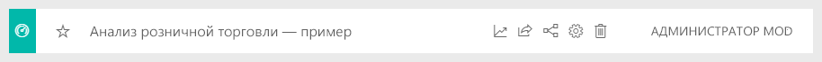

#  Импорт и открытие пакетов образцов для Power BI

Из этого руководства вы узнаете, как выполнять такие задачи: 
- Импорт примера пакета содержимого, его добавление в службу Power BI и открытие содержимого. *Пакет содержимого* — это тип примера, в котором набор данных входит в состав информационной панели и отчета. 
- Открывать PBIX-файл образца в Power BI Desktop.

Если вам необходимы предварительные сведения, см. статью [Примеры наборов данных для Power BI](sample-datasets.md). В ней содержатся сведения о примерах, их получении, сохранении и использовании, а также описание каждого примера. 

## Предварительные требования
Примеры доступны как в службе Power BI, так и в Power BI Desktop. Для работы с этим руководством мы будем использовать пример "Анализ розничной торговли".

В этом учебнике используется пакет содержимого с примером *Анализ розничной торговли* , куда входит информационная панель, отчет и набор данных.
Чтобы ознакомиться с этим пакетом содержимого и сценарием его использования, см. статью [Пример "Анализ розничной торговли" для Power BI: обзор](sample-retail-analysis.md).

## Примеры в службе Power BI

1. Откройте службу Power BI (app.powerbi.com), войдите в систему и откройте рабочую область, где хотите сохранить пример. 

    Если у вас нет лицензии Power BI Pro, можно сохранить пример в личной рабочей области.

2. В нижней части области навигации выберите **Получить данные**. 

   

   Если команда **Получить данные** отсутствует, разверните область навигации, выбрав вверху следующий значок: .

5. На странице **Получение данных** выберите **Примеры**.
   
6. Выберите **Анализ розничной торговли — пример** и щелкните **Подключиться**.   
   
   

## Что импортировалось?
После нажатия кнопки **Подключить** служба Power BI получает копию пакета содержимого и сохраняет ее в облаке. Пользователь, создавший пакет содержимого, добавил в него набор данных, отчет и информационную панель. Именно это вы и получаете, нажав кнопку **Подключить**. 

1. При нажатии кнопки **Подключить** Power BI создает панель мониторинга и добавляет ее на вкладку **Панели мониторинга**. 
   
   
2. Откройте вкладку **Отчеты**. Здесь вы увидите новый отчет с именем *Анализ розничной торговли — пример*.
   
   
   
   Перейдите на вкладку **Наборы данных**, там также появится новый набор данных.
   
   

## Изучение нового содержимого
Теперь самостоятельно изучите информационную панель, набор данных и отчет. Существует много различных способов перехода к панелям мониторинга, отчетам и наборам данных. Один из них описан ниже.  

1. Вернитесь на вкладку **Панели мониторинга** и выберите панель мониторинга **Анализ розничной торговли — пример**.       

   Открывшаяся панель мониторинга состоит из ряда плиток визуализаций.   
 
1. Выберите одну из плиток на панели мониторинга, чтобы открыть соответствующий отчет. В этом примере мы выберем диаграмму с областями **Продажи за этот год, продажи за прошлый год по финансовому месяцу**.  

   

   На странице, на которой содержится эта диаграмма с областями, открывается отчет, в данном случае это страница **Продажи в регионах по месяцам** отчета.
   
   
   
   > [!NOTE]
   > Если плитка была создана с помощью функции [Вопросы и ответы Power BI](power-bi-tutorial-q-and-a.md), вместо отчета откроется страница вопросов и ответов. Если плитка [закреплена из Excel](service-dashboard-pin-tile-from-excel.md), в службе Power BI откроется Excel Online.
   > 
   > 
1. Когда пользователи предоставляют коллегам общий доступ к пакету содержимого, обычно они хотят лишь поделиться аналитическими сведениями, а не предоставить прямой доступ к данным. На вкладке **Наборы данных** можно изучить набор данных несколькими способами. Однако вы не сможете просмотреть строки и столбцы данных, как это можно сделать в Power BI Desktop или Excel. 
   
   
   
1. Один из способов изучения набора данных заключается в создании собственных визуализаций и отчетов с нуля. Щелкните значок диаграммы  чтобы открыть набор данных в режиме правки отчета.
     
   

1. Другой способ заключается в использовании [краткой аналитики](consumer/end-user-insights.md). Щелкните **Дополнительные параметры** (...) и выберите команду **Получить краткую аналитику**. После сбора информации выберите **Просмотреть аналитику**.
     
    

## Примеры в Power BI Desktop 
При первом открытии PBIX-файла примера в Power BI Desktop он отображается в представлении отчетов, в котором можно просматривать, создавать и изменять любое количество страниц отчета с визуализациями. Представление отчетов во многом похоже на режим правки отчета в службе Power BI. Вы можете перемещать визуализации, копировать, вставлять, объединять элементы и т. д. 

В отличие от редактирования отчета в службе Power BI, в Power BI Desktop вы можете работать с запросами и моделями данных, чтобы извлекать самые полезные сведения для отчетов. Затем вы можете сохранить файл Power BI Desktop где угодно — как на локальном диске, так и в облаке.

1. Скачайте [PBIX-файл "Анализ розничной торговли — пример"](https://download.microsoft.com/download/9/6/D/96DDC2FF-2568-491D-AAFA-AFDD6F763AE3/Retail%20Analysis%20Sample%20PBIX.pbix) и откройте его в Power BI Desktop. 

    

1. Файл откроется в представлении отчета. Обратите внимание на четыре вкладки в нижней части редактора отчетов, они представляют четыре страницы в этом отчете. В этом примере сейчас выбрана страница **Новые магазины**. 

    .

1. Подробный обзор редактора отчетов см. в статье [Знакомство с редактором отчетов](service-the-report-editor-take-a-tour.md).

## Что содержит ваш отчет?
Когда вы скачиваете PBIX-файл примера, вы получаете не только отчет, но и *базовый набор данных*. При открытии файла Power BI Desktop загружает данные вместе со связанными запросами и связями. Вы можете просматривать базовые данные и связи, но не можете просматривать базовые запросы в редакторе запросов.

1. Переключитесь в [Представление данных](desktop-data-view.md), выбрав значок таблицы .
 
    

    В представлении данных можно проверять, изучать и анализировать данные в модели Power BI Desktop. Оно отличается от просмотра таблиц, столбцов и данных в редакторе запросов. Данные в представлении данных уже загружены в модель.

    При моделировании данных иногда требуется просмотреть фактическое содержимое строк или столбцов таблицы без создания визуального элемента на холсте отчета. Это особенно характерно для тех случаев, когда вы создаете меры и вычисляемые столбцы или хотите определить тип данных или категорию данных.

1. Переключитесь в [представление связей](desktop-relationship-view.md), выбрав следующий значок: .
 
    

    В представлении связей показаны все таблицы, столбцы и связи в модели. Здесь вы можете просматривать, изменять и создавать связи.

## Дальнейшие действия
В этой среде можно свободно экспериментировать, так как сохранять изменения не требуется. Однако если изменения сохраняются, всегда можно выбрать функцию **Получить данные** для получения новой копии этого примера.

Мы надеемся, что из этого обзора вы узнали, как с помощью панелей мониторинга, наборов данных, связей и отчетов Power BI можно получить аналитические сведения о данных из примера. Теперь ваша очередь — выполните подключение к собственным данным. С помощью Power BI можно подключаться ко многим типам источников данных. Дополнительные сведения см. в статьях [Приступая к работе со службой Power BI](service-get-started.md) и [Приступая к работе с Power BI Desktop](desktop-getting-started.md).  

Для получения дополнительной информации см.  
- [Основные понятия для разработчиков в службе Power BI](service-basic-concepts.md)
- [Примеры для службы Power BI](sample-datasets.md)
- [Источники данных для Power BI](service-get-data.md)

Появились дополнительные вопросы? [Ответы на них см. в сообществе Power BI.](https://community.powerbi.com/)
