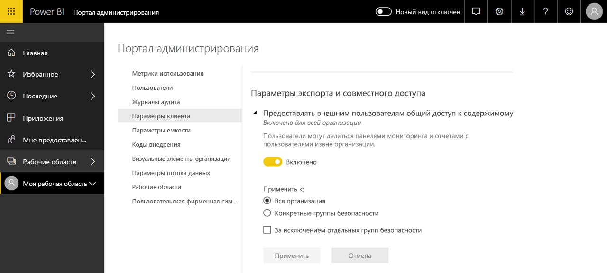

# Что такое администрирование Power BI?

Администрирование Power BI — это управление клиентом Power BI, в которое входит настройка политик управления, мониторинг использования и подготовка лицензий, емкостей и ресурсов для организации. В этой статье содержится обзор ролей, задач и средств администрирования, а также ссылки на статьи с подробными сведениями о них.

Служба Power BI разработана как инструмент для самостоятельной бизнес-аналитики. При этом администратор клиента Power BI полностью отвечает за все данные, процессы и политики. Администратор Power BI является ключевым участником команды, в которую входят разработчики, аналитики и другие специалисты по бизнес-аналитике. Роль администратора в этой команде заключается в том, что он обеспечивает выполнение следующих важных задач:

- анализ ключевых показателей эффективности и метрик, которые _фактически_ требуются пользователям;
- сокращение времени на доставку корпоративных отчетов от ИТ-подразделений;
- повышение уровня принятия и окупаемости развертываний Power BI.

Задача администратора состоит в том, чтобы поддерживать производительность бизнес-пользователей, а также обеспечить безопасность и соответствие всем законам и регламентам. В обязанности администратора может входить техническая поддержка, а во многих случаях и оказание помощи бизнес-пользователям.

## Роли администратора, связанные с Power BI

Существует несколько ролей, связанных с администрированием Power BI. Они описаны в следующей таблице.

| **Тип администратора** | **Область ответственности администратора** | **Область задач Power BI** |
| --- | --- | --- |
| Глобальный администратор Office 365 | Office 365 | Может управлять всеми аспектами клиента Power BI и других служб. |
| Администратор выставления счетов Office 365 | Office 365 | Может приобретать лицензии Power BI через подписки Office 365. |
| Администратор службы Power BI | Клиент Power BI | Полностью контролирует клиент Power BI и его административные функции (кроме лицензирования). |
| Администратор емкости Power BI Premium | Отдельная емкость Premium | Полностью контролирует емкость Premium и ее административные функции. |
| Администратор емкости Power BI Embedded | Отдельная емкость Embedded | Полностью контролирует емкость Embedded и ее административные функции. |

Глобальные администраторы Office 365 или Azure Active Directory имеют права администратора в Power BI. Глобальный администратор Office 365 может назначать другим пользователям роль администратора службы Power BI, которая предоставляет права администратора только для Power BI.

Администраторы службы Power BI имеют доступ к порталу администрирования Power BI, на котором настраиваются многие параметры функциональности, безопасности и мониторинга на уровне клиента. Администраторы служб имеют полный доступ ко всем ресурсам клиента Power BI. В большинстве случаев администраторы служб только обнаруживают проблемы, а для принятия корректирующих мер передают информацию владельцам соответствующих ресурсов.

Роль администратора службы Power BI не дает возможности назначать пользователям лицензии или просматривать журналы аудита в Office 365. Таким образом, функции администрирования Power BI пока нельзя полностью возложить на пользователей, которым назначена только роль администратора службы Power BI.

## Задачи администрирования

Администраторы выполняют многие задачи, связанные с поддержкой клиента Power BI в своей организации. Эти задачи перечислены в следующей таблице.

| **Область задач** | **Типичные задачи** |
| --- | --- |
| Управление клиентом Power BI |<ul><li>Включение и отключение основных возможностей Power BI <li>Отчеты о потреблении и производительности <li>Просмотр результатов аудита событий и управление им</ul>|
| Приобретение и назначение лицензий Power BI |<ul><li>Управление регистрацией пользователей <li>Приобретение и назначение лицензий Pro <li>Запрет доступа пользователей к Power BI</ul>|
| Управление емкостью Premium |<ul><li>Приобретение и применение емкости Premium <li>Обеспечение качества обслуживания|
| Управление емкостью Embedded |<ul><li>Приобретение емкости Embedded для упрощения работы с Power BI для независимых поставщиков и разработчиков программного обеспечения</ul>|
| Контроль соблюдения внутренних политик, законов и регламентов | <ul><li>Управление классификацией бизнес-данных <li>Помощь в применении политик публикации и совместного использования содержимого</ul>|
| Управление ресурсами Power BI |<ul><li>Управление рабочими областями <li>Публикация настраиваемых визуальных элементов <li>Проверка кодов, используемых для внедрения Power BI в другие приложения|
| Предоставление помощи и поддержки для пользователей клиента |<ul><li>Устранение неполадок с доступом к данным и решение других проблем</ul>|
| Другие задачи |<ul><li>Развертывание Power BI Desktop, например через System Center Configuration Manager <li>Управление развертыванием мобильного приложения Power BI с помощью Intune <li>Управление конфиденциальностью и защитой данных, например защитой источников данных</ul>|

## Инструменты администрирования

В следующей таблице представлены несколько инструментов, связанных с администрированием Power BI. Администраторы выполняют основную часть своей работы на портале администрирования Power BI и по мере необходимости применяют другие средства.

| **Инструмент** | **Типичные задачи** |
| --- | --- |
| Портал администрирования Power BI |<ul><li>Приобретение и применение емкости Premium</li><li>Обеспечение качества обслуживания</li><li>Управление классификацией бизнес-данных</li><li>Помощь в применении политик публикации и совместного использования содержимого</li><li>Управление рабочими областями <li>Публикация настраиваемых визуальных элементов</li><li>Проверка кодов, используемых для внедрения Power BI в другие приложения</li><li>Устранение неполадок с доступом к данным и решение других проблем</li></ul>|
| Центр администрирования Microsoft 365 |<ul><li>Управление регистрацией пользователей</li><li>Приобретение и назначение лицензий Pro</li><li>Запрет доступа пользователей к Power BI</li></ul>|
| Центр безопасности и соответствия требованиям Office 365 |<ul><li>Просмотр результатов аудита событий и управление им</li></ul>|
| Azure Active Directory (AAD) на портале Azure |<ul><li>Настройка условного доступа к ресурсам Power BI через AAD</li><li>Подготовка емкости Power BI Embedded</li></ul>|
| Командлеты PowerShell |<ul><li>Управление рабочими областями и другими аспектами Power BI с помощью скриптов</li></ul>|
| Административные API и пакеты SDK |<ul><li>Создание собственных инструментов администрирования для упрощения работы администратора Power BI. Например, в Power BI Desktop эти API-интерфейсы могут использоваться для создания отчетов на основе данных об администрировании</li></ul>|

## Дальнейшие действия

Мы надеемся, что эта статья помогла вам получить общее представление о работе администраторов Power BI и связанных с ней ролях, задачах и средствах. Указанные ниже статьи помогут лучше разобраться в этой теме.

[Портал администрирования Power BI](service-admin-portal.md)

[Использование командлетов PowerShell](/powershell/power-bi/overview)

[Administering Power BI — frequently asked questions (FAQ)](service-admin-faq.md) (Часто задаваемые вопросы об администрировании Power BI)

Появились дополнительные вопросы? [Попробуйте задать вопрос в сообществе Power BI.](http://community.powerbi.com/)