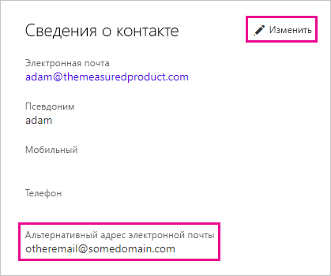

# <a name="using-an-alternate-email-address"></a>Использование запасного адреса электронной почты
По умолчанию адрес электронной почты, используемый вами для входа в Power BI, также используется для отправки вам сообщений об обновлениях, связанных с действиями в Power BI.  Например, этот адрес будет задействован, когда другой пользователь отправляет вам приглашение к общему доступу.

Иногда требуется, чтобы сообщения электронной почты доставлялись на альтернативный адрес, не совпадающий с адресом электронной почты, который использовался для входа в Power BI.

## <a name="updating-through-office-365-personal-info-page"></a>Обновление с помощью страницы с личными сведениями Office 365
1. Откройте [страницу со своими личными сведениями Office 365](https://portal.office.com/account/#personalinfo).  При появлении запроса на вход укажите адрес электронной почты и пароль, используемые для входа в Power BI.
2. Щелкните ссылку "Изменить" в разделе контактных сведений.  
   
   > [!NOTE]
   > Если эта ссылка отсутствует, то ваш адрес электронной почты управляется администратором Office 365 и для изменения адреса электронной почты нужно обратиться к нему.
   > 
   > 
   
   
3. В поле запасного адреса электронной почты введите адрес электронной почты, который вы хотели бы использовать для получения сообщений об обновлениях, отправляемых службой Power BI.

> [!NOTE]
> Изменение этого параметра не повлияет на то, какой адрес электронной почты будет использоваться для отправки сообщений об обновлениях служб, информационных бюллетеней и других рекламных материалов.  Такие сообщения всегда будут посылаться на электронный адрес, использованный при регистрации в Power BI.
> 
> 

## <a name="updating-through-azure-active-directory"></a>Обновление через Azure Active Directory
При записи токена внедрения Active Directory Azure (AAD) для Power BI можно использовать три разных типа сообщений электронной почты. Этими типами являются:

* основной адрес электронной почты, связанный с учетной записью AAD пользователя;
* адрес электронной почты имени субъекта-пользователя;
* атрибут массива "other" для адреса электронной почты.

Power BI выбирает тип электронной почты по следующим критериям:
1.  Если в объекте-пользователе клиента AAD присутствует атрибут почты, то Power BI использует его для адреса электронной почты.
2.  Если электронная почта имени субъекта-пользователя *отличается*от адреса электронной почты домена **\*.onmicrosoft.com** (сведения после символа "\@"), то Power BI использует этот атрибут почты для адреса электронной почты.
3.  Если в объекте-пользователе AAD присутствует атрибут массива "other" для электронной почты, то используется первый адрес электронной почты в этом списке (так как в этом атрибуте может существовать список адресов электронной почты).
4. Если ни одно из указанных выше условий не выполняется, используется адрес для имени субъекта-пользователя.

## <a name="updating-with-powershell"></a>Обновление с помощью PowerShell
Вы также можете обновить альтернативный адрес электронной почты через PowerShell для Azure Active Directory. Это делается с помощью команды [Set-AzureADUser](https://docs.microsoft.com/powershell/module/azuread/set-azureaduser).

```
Set-AzureADUser -ObjectId john@contoso.com -OtherMails "otheremail@somedomain.com"
```

Дополнительные сведения см. в статье [Azure Active Directory PowerShell Version 2](https://docs.microsoft.com/powershell/azure/active-directory/install-adv2) (Azure Active Directory PowerShell версии 2).

Появились дополнительные вопросы? [Ответы на них см. в сообществе Power BI.](http://community.powerbi.com/)

