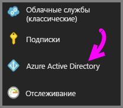
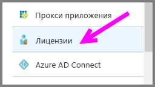

# Краткое руководство. Назначение лицензий Power BI Pro в Azure

Индивидуальные лицензии Power BI Pro предоставляют доступ ко всему содержимому и всем возможностям службы Power BI, включая совместный доступ к содержимому и совместную работу с другими пользователями Pro. Публиковать и использовать содержимое в рабочих областях приложения, совместно использовать панели мониторинга, а также подписываться на панели мониторинга и отчеты могут только пользователи с лицензией Pro. В этой статье объясняется, как назначать лицензии Power BI Pro в Azure. Вы также можете [назначать лицензии в Office 365](service-admin-assigning-power-bi-pro-licenses.md).

## Предварительные требования

Вам потребуется подписка Azure, которая используется в Power BI для запросов к Active Directory.

Перед началом работы необходимо [приобрести хотя бы одну лицензию](service-admin-purchasing-power-bi-pro.md).

## Назначение лицензий отдельным учетным записям пользователей

Выполните следующие действия, чтобы назначить лицензии Power BI Pro отдельным учетным записям пользователей:

1. Перейдите на [портал Azure](https://ms.portal.azure.com/#@microsoft.onmicrosoft.com/dashboard/private/39bc3cf7-31a4-43f6-954c-f2d69ca2f0). 

2. На панели навигации слева выберите **Azure Active Directory**.

    

3. В разделе **Azure Active Directory** выберите **Лицензии**.

    

4. В разделе **Лицензии** щелкните **Все продукты**, а затем **Power BI Pro**, чтобы отобразить список лицензированных пользователей.

    

5. Щелкните **Назначить**, чтобы добавить лицензию Power BI Pro еще одной учетной записи пользователя.

    

## Дальнейшие действия

Итак, вы назначили лицензии, и теперь можно подробнее изучить Power BI Pro.

[Power BI Pro в вашей организации](service-admin-power-bi-pro-in-your-organization.md)

[Поиск пользователей Power BI, выполнивших вход](service-admin-access-usage.md)

Появились дополнительные вопросы? [Попробуйте задать вопрос в сообществе Power BI.](https://community.powerbi.com/)