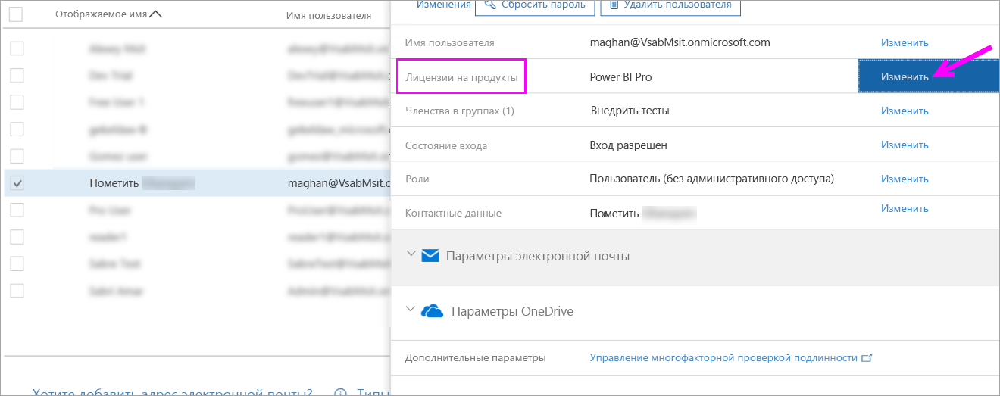
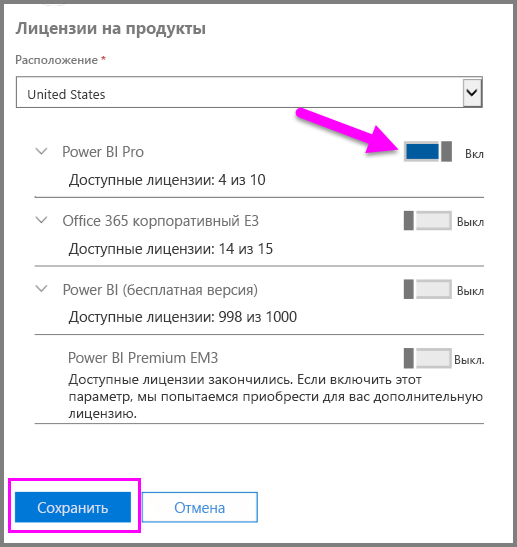
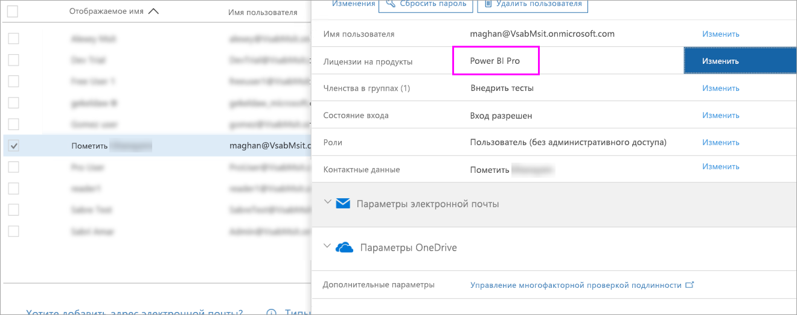

# Краткое руководство. Назначение лицензий Power BI Pro в Office 365

Индивидуальные лицензии Power BI Pro предоставляют доступ ко всему содержимому и всем возможностям службы Power BI, включая совместный доступ к содержимому и совместную работу с другими пользователями Pro. Публиковать и использовать содержимое в рабочих областях приложения, совместно использовать панели мониторинга, а также подписываться на панели мониторинга и отчеты могут только пользователи с лицензией Pro. В этой статье объясняется, как назначать лицензии Power BI Pro в Office 365. Вы также можете [назначать лицензии в Azure](service-admin-assigning-power-bi-pro-licenses-azure.md).

## Предварительные требования

Необходимо быть членом роли [**Глобальный администратор** или **Администратор учетной записи**](https://support.office.com/article/about-office-365-admin-roles-da585eea-f576-4f55-a1e0-87090b6aaa9d?ui=en-US&rs=en-US&ad=US) в Office 365.

Перед началом работы необходимо [приобрести хотя бы одну лицензию](service-admin-purchasing-power-bi-pro.md).

## Назначение лицензий отдельным учетным записям пользователей

Выполните следующие действия, чтобы назначить лицензии Power BI Pro отдельным учетным записям пользователей:

1. Откройте [Центр администрирования Office 365](https://portal.office.com/adminportal/home#/homepage).

2. На панели навигации слева разверните пункт **Пользователи** и выберите элемент **Активные пользователи**.

    

3. Выберите пользователя, а затем в разделе **Лицензии на продукты** — **Изменить**.

    

4. В области **Power BI Pro** выберите значение **Включено**, а затем нажмите кнопку **Сохранить**.

    

5. В области **Состояние** для выбранных учетных записей убедитесь в назначении лицензии Power BI Pro.

    

## Дальнейшие действия

Итак, вы назначили лицензии, и теперь можно подробнее изучить Power BI Pro.

[Power BI Pro в вашей организации](service-admin-power-bi-pro-in-your-organization.md)

[Поиск пользователей Power BI, выполнивших вход](service-admin-access-usage.md)

Появились дополнительные вопросы? [Попробуйте задать вопрос в сообществе Power BI.](https://community.powerbi.com/)