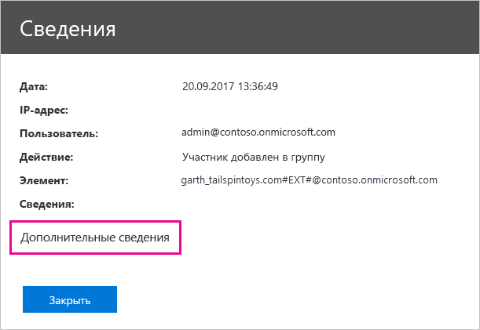

# <a name="use-auditing-within-your-organization"></a>Применение функции аудита в своей организации

Сведения о том, кто выполняет действия в клиенте Power BI, что это за действия и какие элементы они затрагивают, могут быть важными для выполнения требований в организации, например для соблюдения нормативных требований или для управления записями. Функцию аудита Power BI можно использовать для проверки выполнявшихся пользователями действий, таких как просмотр отчета или панели мониторинга. Эту функцию нельзя использовать для аудита разрешений.

Использовать функцию аудита можно в Центре безопасности и соответствия требованиям Microsoft Office 365 или с помощью PowerShell. Аудит зависит от функциональных возможностей Exchange Online (автоматически подготавливается для Power BI).

Данные аудита можно фильтровать по диапазону дат, пользователю, панели мониторинга, отчету, набору данных и типу действий. Кроме того, можно загрузить информацию о действиях в CSV-файл и проанализировать ее в автономном режиме.

## <a name="requirements"></a>Требования

Чтобы получить доступ к журналам аудита, вы должны удовлетворить следующие требования:

* Для доступа к журналам аудита вы должны быть глобальным администратором или вам должна быть назначена роль журналов аудита или журналов аудита в режиме просмотра в Exchange Online. По умолчанию группы ролей управления соответствием и управления организацией назначены на странице **Разрешения** в центре администрирования Exchange.

    Чтобы предоставить учетным записям без прав администратора доступ к журналу аудита, необходимо сделать пользователя участником одной из этих групп ролей. Если вы хотите сделать это другим способом, вы можете создать пользовательскую группу ролей в центре администрирования Exchange, назначить упомянутые выше роли, связанные с журналом аудита, этой группе, а затем включить учетную запись без прав администратора в новую группу ролей. См. дополнительные сведения об [управлении группами ролей в Exchange Online](/Exchange/permissions-exo/role-groups).

    Если у вас нет доступа к Центру администрирования Exchange из Центра администрирования Microsoft 365, перейдите на страницу https://outlook.office365.com/ecp и войдите в систему с помощью своих учетных данных.

* Если у вас есть доступ к журналу аудита, но вы не являетесь глобальным администратором или администратором службы Power BI, вы не сможете получить доступ к порталу администрирования Power BI. В этом случае вам нужно использовать прямую ссылку на [Центр безопасности и соответствия требованиям Office 365](https://sip.protection.office.com/#/unifiedauditlog).

## <a name="access-your-audit-logs"></a>Доступ к журналам аудита

Для доступа к журналам сначала убедитесь, что ведение журнала включено в Power BI. Дополнительные сведения см. в разделе [Журналы аудита](service-admin-portal.md#audit-logs) в документации на портале администрирования. После включения аудита его данные могут отобразиться с задержкой до 48 часов. Если данные не отображаются сразу, проверьте журналы аудита позже. Аналогичная задержка возможна при получении разрешения на просмотр журналов аудита: доступ к ним может быть предоставлен не сразу.

Журналы аудита Power BI доступны непосредственно из [Центра безопасности и соответствия требованиям Office 365](https://sip.protection.office.com/#/unifiedauditlog). На портале администрирования Power BI также есть соответствующая ссылка:

1. В Power BI в правом верхнем углу экрана щелкните **значок шестеренки** и выберите **Портал администрирования**.

   

1. Выберите **Журналы аудита**.

1. Нажмите кнопку **Перейти в Центр администрирования Office 365**.

   

## <a name="search-only-power-bi-activities"></a>Поиск только действий Power BI

Ограничьте результаты поиска только действиями Power BI, выполнив следующие действия. См. дополнительные сведения о [списке действий, проверяемых Power BI](#activities-audited-by-power-bi) далее в этой статье.

1. На странице **Поиск журналов аудита** в разделе **Поиск** найдите раскрывающийся список **Действия**.

2. Выберите в нем пункт **Действия Power BI**.

   

3. Щелкните в любом месте за пределами поля выбора, чтобы закрыть список.

Поисковые запросы возвращают только действия Power BI.

## <a name="search-the-audit-logs-by-date"></a>Поиск журналов аудита по дате

С помощью полей **Дата начала** и **Дата окончания** можно искать журналы по диапазону дат. По умолчанию выбрано последние семь дней. На экране отображаются дата и время в формате UTC. Максимально возможный диапазон дат составляет 90 дней. 

Если выбранный диапазон дат превышает 90 дней, отобразится сообщение об ошибке. Если используется максимальный диапазон в 90 дней, выберите текущее время для поля **Дата начала**. В противном случае отобразится сообщение об ошибке, предупреждающее, что дата начала предшествует дате окончания. Если функция аудита была включена в течение последних 90 дней, начало диапазона дат не может предшествовать дате включения этой функции.


## <a name="search-the-audit-logs-by-users"></a>Поиск журналов аудита по пользователям

В записях журнала аудита можно искать действия, выполненные конкретными пользователями. Введите одно или несколько имен пользователей в поле **Пользователи**. Имя пользователя имеет форму адреса электронной почты. Это учетная запись, которую пользователи используют для входа в Power BI. Чтобы поиск вернул записи для всех пользователей (и учетных записей служб) в организации, оставьте это поле пустым.


## <a name="view-search-results"></a>Просмотр результатов поиска

После того как вы нажмете кнопку **Поиск**, будут загружены результаты поиска. Через несколько минут они отобразятся в разделе **Результаты**. По завершении поиска показывается число найденных результатов. В окне **поиска по журналу аудита** отображается максимум 1000 событий. Если более 1000 событий соответствуют критерию поиска, в приложении отображаются последние 1000 событий.

### <a name="view-the-main-results"></a>Просмотр основных результатов

Область **Результаты** содержит следующие сведения о каждом событии, найденном в ходе поиска. Чтобы отсортировать результаты, щелкните заголовок столбца в области **Результаты**.

| **Столбец** | **Определение** |
| --- | --- |
| Даты |Дата и время (в формате UTC) события. |
| IP-адрес |IP-адрес устройства, которое используется для зарегистрированного действия. IP-адрес отображается в приложении в формате IPv4 или IPv6. |
| Пользователь |Пользователь (или учетная запись службы), выполнивший действие, которое вызвало событие. |
| Activity |Действие, выполненное пользователем. Это значение соответствует действиям, выбранным в раскрывающемся списке **Действия**. Для события из журнала аудита администратора Exchange значением в этом столбце является командлет Exchange. |
| Элемент |Объект, который был создан или изменен из-за соответствующего действия. Например, просмотренный или измененный файл либо обновленная учетная запись пользователя. Значения в этом столбце отображаются не для всех действий. |
| Подробности |Дополнительные сведения о действии. Аналогичным образом значения в этом столбце отображаются не для всех действий. |

### <a name="view-the-details-for-an-event"></a>Просмотр сведений о событии

Дополнительные сведения о событии можно просмотреть, выбрав запись о событии в списке результатов поиска. Отобразится страница **Сведения** с подробными свойствами из записи события. Отображаемые свойства на странице **Сведения** зависят от службы Office 365, в которой произошло событие.

Для отображения этих сведений выберите **Дополнительные сведения**. Свойство RecordType всех записей в Power BI имеет значение 20. См. дополнительные сведения о [свойствах в журнале аудита](/office365/securitycompliance/detailed-properties-in-the-office-365-audit-log/).

   

## <a name="export-search-results"></a>Экспорт результатов поиска

Чтобы экспортировать журнал аудита Power BI в CSV-файл, выполните следующие действия:

1. Выберите команду **Export results** (Экспорт результатов).

1. Выберите пункт **Save loaded results** (Сохранить загруженные результаты) или **Download all results** (Загрузить все результаты).

    

## <a name="use-powershell-to-search-audit-logs"></a>Поиск в журналах аудита с помощью PowerShell

Вы также можете получить доступ к журналам аудита по имени пользователя с помощью PowerShell. В следующем примере показано, как подключиться к Exchange Online PowerShell и извлечь записи журнала аудита Power BI с помощью команды [Search-UnifiedAuditLog](/powershell/module/exchange/policy-and-compliance-audit/search-unifiedauditlog?view=exchange-ps/). Чтобы запустить скрипт, администратор должен назначить вам соответствующие разрешения, как описано в разделе [Требования](#requirements).

```powershell
Set-ExecutionPolicy RemoteSigned

$UserCredential = Get-Credential

$Session = New-PSSession -ConfigurationName Microsoft.Exchange -ConnectionUri https://outlook.office365.com/powershell-liveid/ -Credential $UserCredential -Authentication Basic -AllowRedirection

Import-PSSession $Session
Search-UnifiedAuditLog -StartDate 9/11/2018 -EndDate 9/15/2018 -RecordType PowerBI -ResultSize 1000 | Format-Table | More
```

Дополнительные сведения о подключении к Exchange Online см. в разделе [Подключение к Exchange Online с помощью удаленной оболочки PowerShell](/powershell/exchange/exchange-online/connect-to-exchange-online-powershell/connect-to-exchange-online-powershell/). Еще один пример использования PowerShell с журналами аудита описан в руководстве по [использованию журнала аудита Power BI и PowerShell для назначения лицензий Power BI Pro](https://powerbi.microsoft.com/blog/using-power-bi-audit-log-and-powershell-to-assign-power-bi-pro-licenses/).

## <a name="activities-audited-by-power-bi"></a>Список действий, проверяемых Power BI

С помощью Power BI можно выполнять аудит таких действий:

| Понятное имя                                     | Имя операции                              | Примечания                                  |
|---------------------------------------------------|---------------------------------------------|------------------------------------------|
| Добавлен источник данных в шлюз Power BI             | AddDatasourceToGateway                      |                                          |
| Добавлен доступ к папке Power BI                      | AddFolderAccess                             | Сейчас не используется                       |
| Добавлены участники группы Power BI                      | AddGroupMembers                             |                                          |
| Администратор подключил к клиенту учетную запись хранения для потоков данных | AdminAttachedDataflowStorageAccountToTenant | Сейчас не используется                       |
| Анализируемый набор данных Power BI                         | AnalyzedByExternalApplication               |                                          |
| Проанализирован отчет Power BI                          | AnalyzeInExcel                              |                                          |
| привязка набора данных Power BI к шлюзу;                | BindToGateway                               |                                          |
| Изменено состояние емкости                            | ChangeCapacityState                         |                                          |
| Изменено назначение пользователей емкости                  | UpdateCapacityUsersAssignment               |                                          |
| Изменены подключения к наборам данных Power BI              | SetAllConnections                           |                                          |
| Изменение администраторов шлюза Power BI                   | ChangeGatewayAdministrators                 |                                          |
| Изменен состав пользователей источника данных шлюза Power BI        | ChangeGatewayDatasourceUsers                |                                          |
| Создан пакет содержимого организации Power BI      | CreateOrgApp                                |                                          |
| Создано приложение Power BI                              | CreateApp                                   |                                          |
| Создана панель мониторинга Power BI                        | CreateDashboard                             |                                          |
| Создан поток данных Power BI                         | CreateDataflow                              |                                          |
| Создан набор данных Power BI                          | CreateDataset                               |                                          |
| Создана подписка на Power BI по электронной почте               | CreateEmailSubscription                     |                                          |
| Создана папка Power BI                           | CreateFolder                                |                                          |
| Создание шлюза Power BI                          | CreateGateway                               |                                          |
| Создана группа Power BI                            | CreateGroup                                 |                                          |
| Создан отчет Power BI                           | CreateReport                                |                                          |
| Поток данных перенесен во внешнюю учетную запись хранения     | DataflowMigratedToExternalStorageAccount    | Сейчас не используется                       |
| Добавлены разрешения для потока данных                        | DataflowPermissionsAdded                    | Сейчас не используется                       |
| Удалены разрешения для потока данных                      | DataflowPermissionsRemoved                  | Сейчас не используется                       |
| Удален пакет содержимого организации Power BI      | DeleteOrgApp                                |                                          |
| Удален комментарий Power BI                          | DeleteComment                               |                                          |
| Удалена панель мониторинга Power BI                        | DeleteDashboard                             | Сейчас не используется                       |
| Удален поток данных Power BI                         | DeleteDataflow                              | Сейчас не используется                       |
| Удален набор данных Power BI                          | DeleteDataset                               |                                          |
| Удалена подписка на Power BI по электронной почте               | DeleteEmailSubscription                     |                                          |
| Удалена папка Power BI                           | DeleteFolder                                |                                          |
| Удален доступ к папке Power BI                    | DeleteFolderAccess                          | Сейчас не используется                       |
| Удаление шлюза Power BI                          | DeleteGateway                               |                                          |
| Удалена группа Power BI                            | DeleteGroup                                 |                                          |
| Удален отчет Power BI                           | DeleteReport                                |                                          |
| Обнаружены источники набора данных Power BI          | GetDatasources                              |                                          |
| Скачанный отчет Power BI                        | DownloadReport                              |                                          |
| Изменено разрешение сертификации Power BI          | EditCertificationPermission                 | Сейчас не используется                       |
| Изменена панель мониторинга Power BI                         | EditDashboard                               | Сейчас не используется                       |
| Изменен набор данных Power BI                           | EditDataset                                 |                                          |
| Изменены свойства набора данных Power BI                | EditDatasetProperties                       | Сейчас не используется                       |
| Изменен отчет Power BI                            | EditReport                                  |                                          |
| Экспортирован поток данных Power BI                        | ExportDataflow                              |                                          |
| Экспортированы данные визуальных элементов отчета Power BI              | ExportReport                                |                                          |
| Экспортированы данные плиток Power BI                       | ExportTile                                  |                                          |
| Не удалось добавить разрешения для потока данных                | FailedToAddDataflowPermissions              | Сейчас не используется                       |
| Не удалось удалить разрешения для потока данных             | FailedToRemoveDataflowPermissions           | Сейчас не используется                       |
| Создан маркер SAS потока данных Power BI             | GenerateDataflowSasToken                    |                                          |
| Создан токен внедрения Power BI                    | GenerateEmbedToken                          |                                          |
| Импортирован файл в Power BI                         | Импорт                                      |                                          |
| Установлено приложение Power BI                            | InstallApp                                  |                                          |
| Рабочая область перенесена в емкость                  | MigrateWorkspaceIntoCapacity                |                                          |
| Опубликован комментарий Power BI                           | PostComment                                 |                                          |
| Напечатана панель мониторинга Power BI                        | PrintDashboard                              |                                          |
| Напечатана страница отчета Power BI                      | PrintReport                                 |                                          |
| Отчет Power BI опубликован в Интернете                  | PublishToWebReport                          |                                          |
| Получен секрет потока данных Power BI из Key Vault  | ReceiveDataflowSecretFromKeyVault           | Сейчас не используется                       |
| Удаление источника данных из шлюза Power BI         | RemoveDatasourceFromGateway                 |                                          |
| Удалены участники группы Power BI                    | DeleteGroupMembers                          |                                          |
| Рабочая область удалена из емкости                 | RemoveWorkspacesFromCapacity                |                                          |
| Переименована панель мониторинга Power BI                        | RenameDashboard                             |                                          |
| Запрошено обновление потока данных Power BI               | RequestDataflowRefresh                      | Сейчас не используется                       |
| Запрошено обновление набора данных Power BI                | RefreshDataset                              |                                          |
| Получены рабочие области Power BI                     | GetWorkspaces                               |                                          |
| Задано запланированное обновление потока данных Power BI        | SetScheduledRefreshOnDataflow               |                                          |
| Задано запланированное обновление набора данных Power BI         | SetScheduledRefresh                         |                                          |
| Предоставлен общий доступ к панели мониторинга Power BI                         | ShareDashboard                              |                                          |
| Предоставлен общий доступ к отчету Power BI                            | ShareReport                                 |                                          |
| Начало работы в расширенной пробной версии Power BI                   | OptInForExtendedProTrial                    | Сейчас не используется                       |
| Запущена пробная версия Power BI                            | OptInForProTrial                            |                                          |
| Принято управление источником данных Power BI                   | TakeOverDatasource                          |                                          |
| Принято управление набором данных Power BI                        | TakeOverDataset                             |                                          |
| Отменена публикация приложения Power BI                          | UnpublishApp                                |                                          |
| Обновлены параметры управления ресурсами емкости      | UpdateCapacityResourceGovernanceSettings    | Пока не реализовано в Центре администрирования Microsoft 365 |
| Обновлен администратор емкости                            | UpdateCapacityAdmins                        |                                          |
| Обновлено отображаемое имя емкости                     | UpdateCapacityDisplayName                   |                                          |
| Обновлены параметры Power BI организации          | UpdatedAdminFeatureSwitch                   |                                          |
| Обновлено приложение Power BI                              | UpdateApp                                   |                                          |
| Обновлен поток данных Power BI                         | UpdateDataflow                              |                                          |
| Обновлены источники набора данных Power BI             | UpdateDatasources                           |                                          |
| Обновлены параметры набора данных Power BI               | UpdateDatasetParameters                     |                                          |
| Обновлена подписка на Power BI по электронной почте               | UpdateEmailSubscription                     |                                          |
| Обновлена папка Power BI                           | UpdateFolder                                |                                          |
| Обновлен доступ к папке Power BI                    | UpdateFolderAccess                          |                                          |
| Обновлены учетные данные источника данных шлюза Power BI  | UpdateDatasourceCredentials                 |                                          |
| Просмотрена панель мониторинга Power BI                         | ViewDashboard                               |                                          |
| Просмотрен поток данных Power BI                          | ViewDataflow                                |                                          |
| Просмотрен отчет Power BI                            | ViewReport                                  |                                          |
| Просмотрена плитка Power BI                              | ViewTile                                    |                                          |
| Просмотрены метрики использования Power BI                     | ViewUsageMetrics                            |                                          |
|                                                   |                                             |                                          |

## <a name="next-steps"></a>Дальнейшие действия

[Что такое администрирование Power BI?](service-admin-administering-power-bi-in-your-organization.md)  

[Портал администрирования Power BI](service-admin-portal.md)  

Появились дополнительные вопросы? [Попробуйте задать вопрос в сообществе Power BI.](http://community.powerbi.com/)
