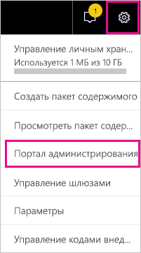
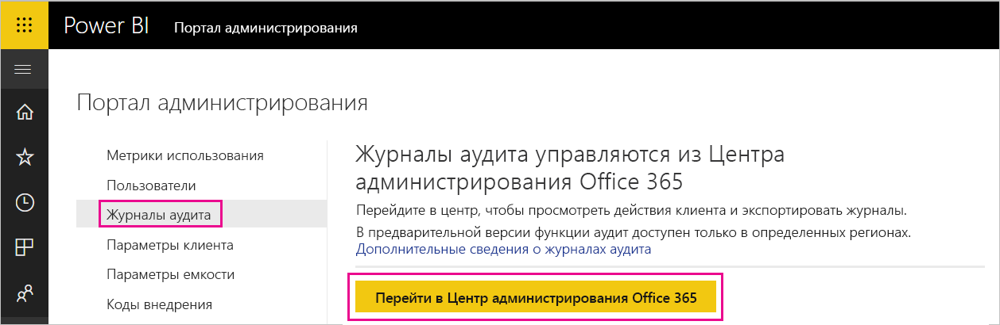
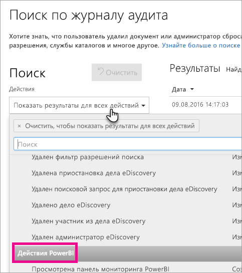
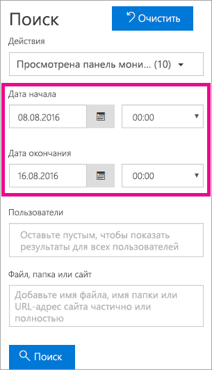
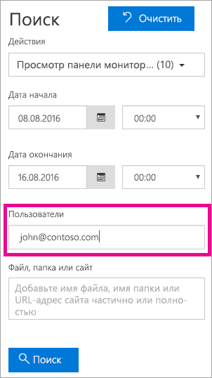
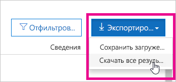

# <a name="using-auditing-within-your-organization"></a>Применение функции аудита в своей организации

<iframe width="560" height="315" src="https://www.youtube.com/embed/zj4kA39jV_4?showinfo=0" frameborder="0" allowfullscreen></iframe>

Узнайте, как использовать функцию аудита в Power BI для отслеживания и анализа выполненных действий. Вы можете использовать PowerShell или средства Центра безопасности и соответствия требованиям.

Сведения о том, кто выполняет действия в клиенте Power BI, что это за действия и какие элементы они затрагивают, могут быть важными для выполнения требований в организации, например для соблюдения нормативных требований или для управления записями.

Данные аудита можно фильтровать по диапазону дат, пользователю, панели мониторинга, отчету, набору данных и типу действий. Кроме того, можно загрузить информацию о действиях в CSV-файл и проанализировать ее в автономном режиме.

> [!NOTE]
> Функция аудита в Power BI доступна в режиме предварительной версии во всех регионах.

## <a name="requirements"></a>Требования
Чтобы получить доступ к журналам аудита, вы должны удовлетворить следующие требования:

- Для доступа к разделу аудита Центра безопасности и соответствия требованиям Microsoft Office 365 требуется лицензия Exchange Online (включена в подписки Office 365 корпоративный E3 и E5).
- Вы должны быть глобальным администратором или администратором Exchange, который предоставляет доступ к журналу аудита. 

  Ролями администратора Exchange можно управлять в Центре администрирования Exchange. Дополнительные сведения см. в статье [Разрешения в Exchange Online](https://technet.microsoft.com/library/jj200692(v=exchg.150).aspx).

- Если у вас есть доступ к журналу аудита, но вы не являетесь глобальным администратором или администратором службы Power BI, вы не сможете получить доступ к порталу администрирования Power BI. В таком случае вам нужно получить прямую ссылку на Центр безопасности и соответствия требованиям Office 365.

## <a name="enabling-auditing-functionality-in-the-power-bi-admin-portal"></a>Включение функции аудита на портале администрирования Power BI

Для работы с отчетами необходимо включить аудит для вашей организации. Это можно сделать в параметрах клиента на портале администрирования.

1. Справа вверху щелкните **значок шестеренки**.

2. Выберите **Портал администрирования**.
   
   

3. Выберите **Параметры клиента**.
   
   

4. Включите параметр **Создание журналов аудита для аудита внутренних действий и обеспечения соответствия требованиям**.

5. Нажмите кнопку **Применить**.

Теперь средство Power BI будет вести журнал действий, которые пользователь в нем выполняет. Для отображения журналов в центре безопасности и соответствия требованиям Office 365 может потребоваться до 48 часов. Сведения о том, какие действия регистрируются в журнале, см. в разделе [List of activities audited by Power BI](#list-of-activities-audited-by-power-bi) (Список действий, аудит которых проводит Power BI).

> [!NOTE]
> Чтобы включить функцию аудита для Power BI в клиенте, требуется по крайней мере одна лицензия почтовых ящиков Exchange.

## <a name="accessing-your-audit-logs"></a>Доступ к журналам аудита

Для просмотра журналов Power BI откройте центр безопасности и соответствия требованиям Office 365.

1. Справа вверху щелкните **значок шестеренки**.

2. Выберите **Портал администрирования**.
   
   

3. Выберите **Журналы аудита**.
 
4. Нажмите кнопку **Перейти в Центр администрирования Office 365**.
   
   

Кроме того, можно открыть [Office 365 | Безопасность и соответствие требованиям](https://protection.office.com/#/unifiedauditlog).

> [!NOTE]
> Чтобы предоставить учетным записям без прав администратора доступ к журналу аудита, необходимо назначить соответствующие разрешения в Центре администрирования Exchange Online. Можно назначить пользователя в существующую группу ролей, например "Управление организацией", или создать новую группу ролей "Журналы аудита". Дополнительные сведения см. в статье [Разрешения в Exchange Online](https://technet.microsoft.com/library/jj200692\(v=exchg.150\).aspx).

## <a name="search-only-power-bi-activities"></a>Поиск только действий Power BI

Результаты поиска можно ограничить только действиями Power BI. Для этого выполните следующее.

1. На странице **Поиск журналов аудита** в разделе **Поиск** найдите раскрывающийся список **Действия**.

2. Выберите в нем пункт **Действия PowerBI**.
   
   

3. Щелкните в любом месте за пределами поля выбора, чтобы закрыть список.

Теперь в результатах поиска будут отображаться только действия Power BI.

## <a name="search-the-audit-logs-by-date"></a>Поиск журналов аудита по дате

С помощью полей "Дата начала" и "Дата окончания" можно искать журналы по диапазону дат. По умолчанию выбраны последние семь дней. Для даты и времени используется формат UTC. Максимально возможный диапазон дат составляет 90 дней. Если выбранный диапазон дат превышает 90 дней, отображается сообщение об ошибке.

> [!NOTE]
> Если используется максимальный диапазон в 90 дней, для начальной даты выберите текущее время. В противном случае отобразится сообщение об ошибке, предупреждающее, что дата начала предшествует дате окончания. Если функция аудита была включена в течение последних 90 дней, максимальный диапазон дат не может начинаться до даты включения этой функции.



## <a name="search-the-audit-logs-by-users"></a>Поиск журналов аудита по пользователям

В записях журнала аудита можно искать действия, выполненные конкретными пользователями. Для этого введите одно или несколько имен пользователей в поле "Пользователи".  Это должно быть имя пользователя, использованное для входа в Power BI. Оно имеет форму адреса электронной почты.
Чтобы поиск вернул записи для всех пользователей (и учетных записей служб) в организации, оставьте это поле пустым.



## <a name="viewing-search-results"></a>Просмотр результатов поиска

После нажатия кнопки поиска результаты загружаются и через несколько секунд отображаются в области результатов. По завершении поиска показывается число найденных результатов. 

> [!NOTE]
> Отображается максимум 1000 событий. Если условиям поиска соответствует больше событий, то отображаются последние 1000 событий.

Результаты содержат следующие сведения о каждом событии, найденном в результате поиска.

| **Столбец** | **Определение** |
| --- | --- |
| Даты |Дата и время (в формате UTC) события. |
| IP-адрес |IP-адрес устройства, которое использовалось при регистрации действия. IP-адрес отображается в формате IPv4 или IPv6. |
| User |Пользователь (или учетная запись службы), выполнивший действие, которое вызвало событие. |
| Activity |Действие, выполненное пользователем. Это значение соответствует действиям, выбранным в раскрывающемся списке "Действия". Для события из журнала аудита администратора Exchange значением в этом столбце является командлет Exchange. |
| Элемент |Объект, который был создан или изменен в результате соответствующего действия. Например, просмотренный или измененный файл или обновленная учетная запись пользователя. Значения в этом столбце отображаются не для всех действий. |
| Подробности |Дополнительные сведения о действии. Аналогичным образом значения в этом столбце отображаются не для всех действий. |

> [!NOTE]
> Чтобы отсортировать результаты, щелкните заголовок столбца в области результатов. Результаты можно сортировать в возрастающем или убывающем алфавитном порядке. Щелкните заголовок "Дата", чтобы отсортировать результаты от старых к новым или от новых к старым.

## <a name="view-the-details-for-an-event"></a>Просмотр сведений о событии

Дополнительные сведения о событии можно просмотреть, выбрав запись о событии в списке результатов поиска. Отобразится страница сведений с подробными свойствами из записи события. Отображаемые свойства зависят от службы Office 365, в которой произошло событие. Для отображения дополнительных сведений щелкните элемент **Дополнительные сведения**.

В следующей таблице приведены сведения о том, какую информацию можно увидеть.

| **Параметр или событие** | **Описание** | **Дополнительные сведения** |
| --- | --- | --- |
| Скачанный отчет Power BI |Это действие регистрируется при каждом скачивании отчета. |Имя отчета, имя набора данных |
| Создание отчета |Это действие регистрируется при каждом создании отчета. |Имя отчета, имя набора данных |
| Изменить отчет |Это действие регистрируется при каждом изменении отчета. |Имя отчета, имя набора данных |
| Создание набора данных |Это действие регистрируется при каждом создании набора данных. |Имя набора данных, DataConnectivityMode |
| Удаление набора данных |Это действие регистрируется при каждом удалении набора данных. |Имя набора данных, DataConnectivityMode |
| Создание приложения Power BI |Это действие регистрируется при каждом создании приложения Power BI. |Имя приложения, разрешения, имя рабочей области |
| Установка приложения Power BI |Это действие регистрируется при каждой установке приложения Power BI. |Имя приложения |
| Обновление приложения Power BI |Это действие регистрируется при каждом обновлении приложения Power BI. |Имя приложения, разрешения, имя рабочей области |
| Начало работы в расширенной пробной версии Power BI |Это действие регистрируется каждый раз, когда пользователь принимает условия расширенной пробной версии Power BI Pro, которая будет действовать до 31 мая 2018 г. | |
| Анализируемый набор данных Power BI |Это действие регистрируется при каждом анализе набора данных Power BI в Excel. | |
| Создание шлюза Power BI |Это действие регистрируется при каждом создании шлюза. |Имя шлюза, тип шлюза |
| Удаление шлюза Power BI |Это действие регистрируется при каждом удалении шлюза. |Имя шлюза, тип шлюза |
| Добавление источника данных для шлюза Power BI |Это действие регистрируется при каждом добавлении источника данных к шлюзу. |Имя шлюза, тип шлюза, имя источника данных, тип источника данных |
| Удаление источника данных из шлюза Power BI |Это действие регистрируется при каждом удалении источника данных из шлюза. |Имя шлюза, тип шлюза, имя источника данных, тип источника данных |
| Изменение администраторов шлюза Power BI |Это действие регистрируется при каждом изменении администраторов шлюза (добавление или удаление). |Имя шлюза, добавленные пользователи, удаленные пользователи |
| Изменение пользователей источников данных в шлюзе Power IB |Это действие регистрируется при каждом изменении пользователей шлюза (добавление или удаление). |Имя шлюза, добавленные пользователи, удаленные пользователи |
| SetScheduledRefresh |Это действие регистрируется каждый раз при планировании нового обновления для набора данных. |Имя набора данных, периодичность обновления (в минутах) |

## <a name="using-powershell-to-search"></a>Поиск с помощью PowerShell

Вы можете получить доступ к журналам аудита по имени пользователя с помощью PowerShell. Для этого нужно войти в Exchange Online. Ниже приведен пример команды для получения записей журнала аудита Power BI.

> [!NOTE]
> Чтобы использовать команду New-PSSession, требуется назначить учетной записи лицензию Exchange Online и настроить доступ к журналу аудита из вашего клиента.

```
Set-ExecutionPolicy RemoteSigned

$UserCredential = Get-Credential

$Session = New-PSSession -ConfigurationName Microsoft.Exchange -ConnectionUri https://outlook.office365.com/powershell-liveid/ -Credential $UserCredential -Authentication Basic -AllowRedirection

Import-PSSession $Session
Search-UnifiedAuditLog -StartDate 9/11/2016 -EndDate 9/15/2016 -RecordType PowerBI -ResultSize 1000 | Format-Table | More
```

Дополнительные сведения о подключении к Exchange Online см. в разделе [Подключение к Exchange Online с помощью удаленной оболочки PowerShell](https://technet.microsoft.com/library/jj984289\(v=exchg.160\).aspx).

Дополнительные сведения о параметрах и примерах использования команды Search-UnifiedAuditLog см. в разделе [Search-UnifiedAuditLog](https://technet.microsoft.com/library/mt238501\(v=exchg.160\).aspx).

Пример использования PowerShell для поиска журнала аудита и назначения лицензий Power BI Pro на основе записей см. [здесь](https://powerbi.microsoft.com/blog/using-power-bi-audit-log-and-powershell-to-assign-power-bi-pro-licenses/).

## <a name="export-the-power-bi-audit-log"></a>Экспорт журнала аудита Power BI

Журнал аудита Power BI можно экспортировать в CSV-файл.

1. Выберите команду **Export results** (Экспорт результатов).

2. Выберите пункт **Save loaded results** (Сохранить загруженные результаты) или **Download all results** (Загрузить все результаты).
   
   

## <a name="record-and-user-types"></a>Типы записей и пользователей

Записи журнала аудита имеют свойства RecordType и UserType, которые записаны в сведениях о записях. Свойство RecordType всех записей в Power BI имеет значение 20.

Полный список свойств см. в разделе [Подробные свойства в журнале аудита Office 365](https://support.office.com/article/Detailed-properties-in-the-Office-365-audit-log-ce004100-9e7f-443e-942b-9b04098fcfc3)

## <a name="list-of-activities-audited-by-power-bi"></a>Список действий, проверяемых Power BI

| Действие | Описание | Дополнительные сведения |
| --- | --- | --- |
| CreateDashboard |Это действие регистрируется при каждом создании панели мониторинга. |– Имя панели мониторинга. |
| EditDashboard |Это действие регистрируется при каждом переименовании панели мониторинга. |– Имя панели мониторинга. |
| DeleteDashboard |Это действие регистрируется при каждом удалении панели мониторинга. |– Имя панели мониторинга. |
| PrintDashboard |Это событие регистрируется каждый раз при печати панели мониторинга. |– Имя панели мониторинга.<br/>– Имя набора данных. |
| ShareDashboard |Это действие регистрируется при каждом предоставлении общего доступа к панели мониторинга. |– Имя панели мониторинга.<br/>– Электронная почта получателя.<br/>– Имя набора данных.<br>– Разрешение на повторное представление общего доступа. |
| ViewDashboard |Это действие регистрируется при каждом просмотре панели мониторинга. |– Имя панели мониторинга. |
| ExportTile |Это событие регистрируется при каждом экспорте данных из плитки панели мониторинга. |– Имя плитки.<br/>– Имя набора данных. |
| DeleteReport |Это действие регистрируется при каждом удалении отчета. |– Имя отчета. |
| ExportReport |Это событие регистрируется при каждом экспорте данных из плитки отчета. |– Имя отчета.<br/>– Имя набора данных. |
| PrintReport |Это событие регистрируется каждый раз при печати отчета. |– Имя отчета.<br/>– Имя набора данных. |
| PublishToWebReport |Это событие регистрируется каждый раз при публикации отчета в Интернете. |– Имя отчета.<br/>– Имя набора данных. |
| ViewReport |Это действие регистрируется при каждом просмотре отчета. |– Имя отчета. |
| ExploreDataset |Это событие регистрируется при каждом просмотре набора данных путем его выбора. |– Имя набора данных. |
| DeleteDataset |Это событие регистрируется каждый раз при удалении набора данных. |– Имя набора данных. |
| CreateOrgApp |Это действие регистрируется при каждом создании пакета содержимого организации. |– Имя пакета содержимого организации.<br/>– Имена панелей мониторинга.<br/>– Имена отчетов.<br/>– Имена наборов данных. |
| CreateGroup |Это действие возникает при каждом создании группы. |– Имя группы. |
| AddGroupMembers |Это действие вносится в журнал при каждом добавлении участника в рабочую область группы Power BI. |– Имя группы.<br/>– Адреса электронной почты. |
| UpdatedAdminFeatureSwitch |Это событие регистрируется при каждой смене состояния коммутатора функций администрирования. |– Имя коммутатора.<br/>– Новое состояние коммутатора. |
| OptInForProTrial |Это событие регистрируется, когда пользователь решает попробовать Power BI Pro в службе. |– Адрес электронной почты. |

## <a name="next-steps"></a>Дальнейшие действия

[Портал администрирования Power BI](service-admin-portal.md)  
[Что такое Power BI Premium?](service-premium.md)  
[Приобретение Power BI Pro](service-admin-purchasing-power-bi-pro.md)  
[Разрешения в Exchange Online](https://technet.microsoft.com/library/jj200692\(v=exchg.150\).aspx)  
[Подключение к Exchange Online с помощью удаленной оболочки PowerShell](https://technet.microsoft.com/library/jj984289\(v=exchg.160\).aspx)  
[Search-UnifiedAuditLog](https://technet.microsoft.com/library/mt238501\(v=exchg.160\).aspx)  
[Подробные свойства в журнале аудита Office 365](https://support.office.com/article/Detailed-properties-in-the-Office-365-audit-log-ce004100-9e7f-443e-942b-9b04098fcfc3)  

Появились дополнительные вопросы? [Попробуйте задать вопрос в сообществе Power BI.](http://community.powerbi.com/)