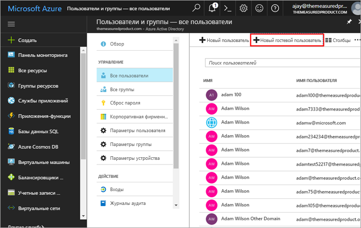
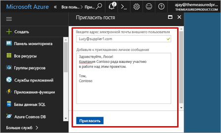
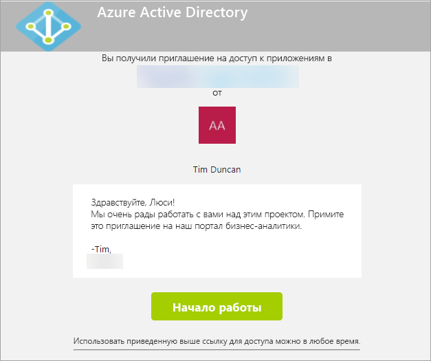
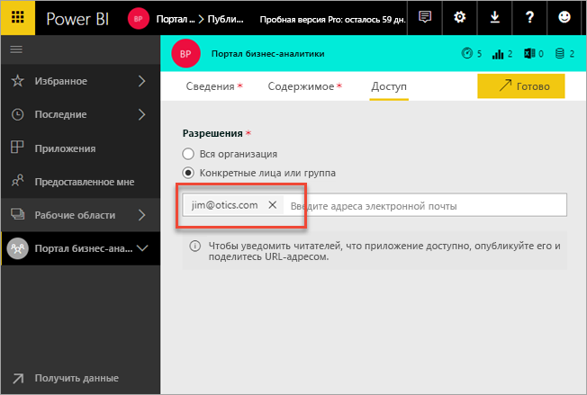
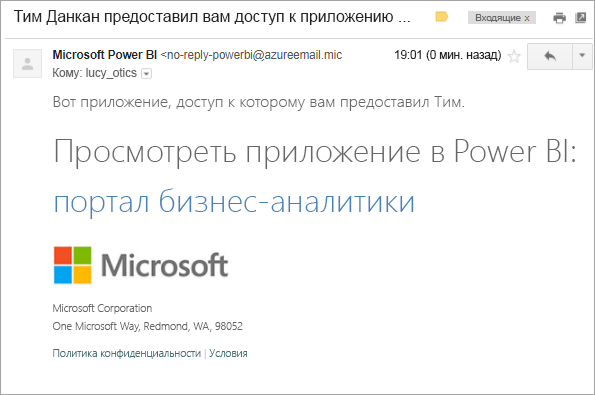

# Предоставление содержимого Power BI внешним гостевым пользователям с помощью Azure AD B2B

Power BI интегрируется с Azure Active Directory "бизнес — бизнес" (Azure AD B2B), чтобы обеспечить безопасное распространение содержимого Power BI для гостевых пользователей за пределами организации и сохранить контроль над внутренними данными.

> [!VIDEO https://www.youtube.com/embed/xxQWEQ1NnlY]

> [!NOTE]
> Этот компонент сейчас недоступен в мобильных приложениях Power BI. На мобильных устройствах содержимое Power BI можно просматривать, используя Azure AD B2B в браузере. 

## Приглашение гостевых пользователей

Существует два способа приглашения гостевых пользователей в клиент Power BI: плановые или специализированные приглашения. Приглашения нужны только при первом добавлении внешнего пользователя для вашей организации.

### Плановые приглашения

Плановое приглашение выполняется на портале Microsoft Azure в Azure AD или с помощью PowerShell. Этот вариант следует использовать для известных пользователей. 

**Только администратор клиента может создать гостевых пользователей на портале Azure AD.**

1. Перейдите на [портал Azure](https://portal.azure.com) и выберите **Azure Active Directory**.

2. Выберите **Пользователи и группы** > **Все пользователи** > **Новый гостевой пользователь**.

    

3. Введите **адрес электронной почты** и **личное сообщение**.

    

4. Выберите **Пригласить**.

Чтобы пригласить несколько гостевых пользователей, воспользуйтесь PowerShell. Дополнительные сведения см. в статье [Примеры кода и команд PowerShell для службы совместной работы Azure Active Directory B2B](https://docs.microsoft.com/azure/active-directory/active-directory-b2b-code-samples).

В полученном электронном письме с приглашением гостевому пользователю нужно выбрать **Get Started** (Приступить к работе). Затем гостевой пользователь добавляется к клиенту.

### Специализированные приглашения

Чтобы отправить приглашение в любое время, добавьте внешнего пользователя в список доступа к приложению при его публикации.

Гостевой пользователь получит электронное сообщение о предоставлении общего доступа к приложению.

Гостевой пользователь должен войти с использованием организационного адреса электронной почты. После входа будет предложено принять приглашение и гостевой пользователь будет перенаправлен к содержимому приложения. Чтобы вернуться в приложение, добавьте ссылку в закладки или сохраните электронное сообщение.

## Лицензирование

Для просмотра общедоступного приложения гостевому пользователю понадобится соответствующая лицензия. У вас есть три варианта.

### Использование Power BI Premium

Если назначить рабочую область приложения для емкости Power BI Premium, гостевой пользователь сможет работать с приложением без лицензии Power BI Pro. Power BI Premium также позволяет воспользоваться и другими возможностями для приложений, такими как частые обновления, выделенные ресурсы и крупные модели.

### Назначение гостевому пользователю лицензии Power BI Pro

Назначенная в клиенте лицензия Power BI Pro позволит гостевому пользователю просматривать содержимое.

> [!NOTE]
> Лицензия Power BI Pro из вашего клиента применяется для гостевых пользователей только при обращении к содержимому в клиенте.

### Применение лицензии Power BI Pro гостевого пользователя

Гостевому пользователю уже назначена лицензия Power BI Pro в клиенте.

## Ограничения

* Внешние гостевые пользователи B2B могут только использовать содержимое. Они имеют право просматривать приложения, панели мониторинга, отчеты, экспортировать данные и создавать подписки на панели мониторинга и отчеты по электронной почте. Они не могут использовать рабочие области и публиковать собственное содержимое.
* Этот компонент сейчас недоступен в мобильных приложениях Power BI. На мобильных устройствах содержимое Power BI можно просматривать, используя Azure AD B2B в браузере.
* Функция гостевых пользователей в Power BI в независимых облаках (для государственных организаций) не поддерживается.

## Дальнейшие действия

Дополнительные сведения, включая сведения о безопасности на уровне строк, см. в [техническом документе](https://aka.ms/powerbi-b2b-whitepaper).

Сведения об Azure Active Directory B2B см. в статье [Что такое служба совместной работы Azure AD B2B](https://docs.microsoft.com/azure/active-directory/active-directory-b2b-what-is-azure-ad-b2b)