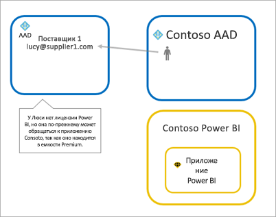
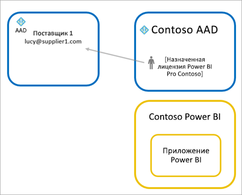
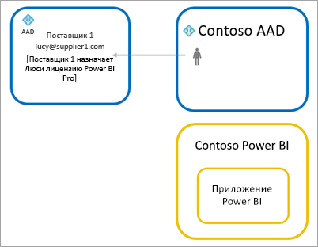

# Предоставление содержимого Power BI внешним гостевым пользователям с помощью Azure AD B2B

Power BI интегрируется с Azure Active Directory B2B (Azure AD B2B), чтобы обеспечить безопасное распространение содержимого Power BI для гостевых пользователей за пределами организации и сохранить контроль над внутренними данными.  

Кроме того вы можете разрешить гостевым пользователям за пределами вашей организации редактировать содержимое в вашей организации и управлять им.

## Предоставление доступа

Прежде чем приглашать гостевых пользователей, обязательно включите функцию [Предоставление внешним пользователям общего доступа к содержимому](service-admin-portal.md#export-and-sharing-settings) на портале администрирования Power BI.

Также можно использовать функцию [Разрешение внешним гостям отслеживать и изменять содержимое в организации](service-admin-portal.md#allow-external-guest-users-to-edit-and-manage-content-in-the-organization). Она позволяет указать, какой гостевой пользователь может просматривать и создавать содержимое в рабочих областях, включая просмотр данных Power BI в вашей организации.

## Кого вы можете пригласить?

Вы можете приглашать гостевых пользователей, использующих любой адрес электронной почты, включая личные учетные записи gmail.com, outlook.com, hotmail.com и т. д. В Azure AD B2B такие адреса называются *удостоверениями социальных сетей*.

## Приглашение гостевых пользователей

Гостевым пользователям требуется приглашение только в первый раз. Пригласить пользователей можно двумя способами: с использованием плановых и специализированных приглашений.

### Плановые приглашения

Используйте плановое приглашение, если знаете, каких пользователей нужно пригласить. Вы можете отправлять приглашения с помощью портала Azure или PowerShell. Для этого вам потребуются права администратора клиента.

Чтобы отправить приглашение на портале Azure, выполните следующие действия.

1. На [портале Azure](https://portal.azure.com)выберите **Azure Active Directory**.

1. В разделе **Управление** выберите **Пользователи** > **Все пользователи** > **Новый гостевой пользователь**.

    

1. Введите **адрес электронной почты** и **личное сообщение**.

    

1. Выберите **Пригласить**.

Чтобы пригласить несколько гостевых пользователей, воспользуйтесь PowerShell. Дополнительные сведения см. в статье [Примеры кода и команд PowerShell для службы совместной работы Azure Active Directory B2B](/azure/active-directory/b2b/code-samples/).

В полученном электронном письме с приглашением гостевому пользователю нужно выбрать **Get Started** (Приступить к работе). Затем гостевой пользователь добавляется к клиенту.

### Несистематические приглашения

Чтобы пригласить внешнего пользователя, в добавьте его на панель мониторинга или в отчет через пользовательский интерфейс общего доступа или в приложение через страницу доступа. Ниже приведен пример того, что нужно сделать, чтобы пригласить внешнего пользователя для работы с приложением.

Гостевой пользователь получит электронное сообщение о том, что вы предоставили ему общий доступ к приложению.

Гостевой пользователь должен войти с использованием организационного адреса электронной почты. После входа он увидит предложение принять приглашение. В случае согласия для гостевого пользователя откроется приложение. Чтобы вернуться в приложение, пользователь может добавить ссылку в закладки или сохранить письмо.

## Лицензирование

Для просмотра содержимого, к которому предоставлен общий доступ, гостевому пользователю понадобится соответствующая лицензия. Существует три варианта предоставить ему нужную лицензию: использовать Power BI Premium, назначить лицензию Power BI Pro или использовать лицензию Power BI Pro гостевого пользователя.

При использовании функции [Разрешение внешним гостям отслеживать и изменять содержимое в организации](service-admin-portal.md#allow-external-guest-users-to-edit-and-manage-content-in-the-organization) гостевым пользователям, которые вносят содержимое в рабочие области или делятся им с другими пользователями, нужна лицензия Power BI Pro.

### Использование Power BI Premium

Если вы назначите для рабочей области [емкость Power BI Premium](service-premium-what-is.md), гостевой пользователь сможет работать с приложением без отдельной лицензии Power BI Pro. Power BI Premium также позволяет воспользоваться и другими возможностями для приложений, такими как частые обновления, выделенные емкости и крупные модели.

### Назначение гостевому пользователю лицензии Power BI Pro

Назначив гостевому пользователю лицензию Power BI Pro в клиенту, вы разрешите ему просматривать содержимое в клиенте.

### Применение лицензии Power BI Pro гостевого пользователя

Гостевому пользователю уже назначена лицензия Power BI Pro в клиенте.

## Гостевые пользователи, которые могут редактировать содержимое и управлять им 

При использовании параметра [Разрешение внешним гостям отслеживать и изменять содержимое в организации](service-admin-portal.md#allow-external-guest-users-to-edit-and-manage-content-in-the-organization) указанные гостевые пользователи получают доступ к Power BI вашей организации. Они смогут просматривать любое содержимое, доступ к которому для них разрешен. Они могут открывать главную страницу, просматривать рабочие области, устанавливать приложения при условии включения в список доступа, а также вносить содержимое в рабочие области. Они могут создавать или администрировать рабочие области, использующие новые возможности взаимодействия. Применяются некоторые ограничения. Они перечислены в разделе "Рекомендации и ограничения".
 
Чтобы помочь таким пользователям войти в Power BI, предоставьте им URL-адрес клиента. Чтобы найти URL-адрес клиента, выполните указанные ниже действия.

1. В службе Power BI в верхнем меню выберите справку ( **?** ) и **О Power BI**.

2. Найдите значение рядом с полем **URL-адрес клиента**. Это URL-адрес клиента, которым вы можете поделиться с гостевыми пользователями.

    

## Рекомендации и ограничения

* По умолчанию внешние гостевые пользователи Azure AD B2B могут только использовать содержимое. Внешние гостевые пользователи Azure AD B2B могут просматривать приложения, панели мониторинга и отчеты, экспортировать данные, а также создавать подписки по электронной почте на панели мониторинга и отчеты. Они не могут использовать рабочие области и публиковать собственное содержимое. Но эти ограничения не применяются к гостевым пользователям, которым предоставлен доступ с помощью параметра [Разрешение внешним гостям отслеживать и изменять содержимое в организации](service-admin-portal.md#allow-external-guest-users-to-edit-and-manage-content-in-the-organization).

* Гостевым пользователям, которым предоставлен доступ с помощью параметра [Разрешение внешним гостям отслеживать и изменять содержимое в организации](service-admin-portal.md#allow-external-guest-users-to-edit-and-manage-content-in-the-organization), некоторые возможности недоступны. Чтобы изменять или публиковать отчеты, им нужно использовать пользовательский веб-интерфейс службы Power BI, включая функцию "Получить данные" для отправки файлов Power BI Desktop.  Следующие возможности не поддерживаются:
    * Прямая публикация из Power BI Desktop в службу Power BI.
    * Гостевые пользователи не могут использовать Power BI Desktop для подключения к наборам данных службы в службе Power BI.
    * Классические рабочие области привязаны к Группам Office 365:
        * Гостевой пользователь не может создавать или администрировать эти рабочие области.
        * Гостевой пользователь может быть их членом.
    * Отправка специализированных приглашений не поддерживается для списков доступа к рабочей области.
    * Power BI Publisher для Excel не поддерживается для гостевых пользователей.
    * Гостевые пользователи не могут устанавливать Power BI Gateway и подключать его к вашей организации.
    * Гостевые пользователи не могут устанавливать приложения с публикацией для всей организации.
    * Гостевые пользователи не могут использовать, создавать, изменять или устанавливать пакеты содержимого организации.
    * Гостевые пользователи не могут использовать анализ в Excel.
    * Гостевые пользователи не могут упоминаться в комментариях (@mentioned).
    * Гостевые пользователи не могут использовать подписки.
    * Гостевые пользователи, использующие эту возможность, должны иметь рабочую или учебную учетную запись. Для гостевых пользователей с личными учетными записями действуют дополнительные ограничения, связанные со входом.

* Этот компонент сейчас недоступен в веб-части отчетов SharePoint Online в Power BI.

* Существуют параметры Active Directory, позволяющие ограничивать деятельность внешних гостевых пользователей в рамках всей организации. Это применимо и к вашей среде Power BI. Эти параметры описаны в следующей документации:
    * [Управление параметрами внешнего взаимодействия](/azure/active-directory/b2b/delegate-invitations#configure-b2b-external-collaboration-settings)
    * [Разрешение или запрет приглашений для пользователей B2B из определенных организаций](https://docs.microsoft.com/azure/active-directory/b2b/allow-deny-list)  

## Дальнейшие действия

Дополнительные сведения, включая сведения о безопасности на уровне строк, см. в техническом документе о [предоставлении содержимого Power BI внешним гостевым пользователям с помощью Azure AD B2B](https://aka.ms/powerbi-b2b-whitepaper)

Сведения об Azure AD B2B см. в статье [Что представляет собой гостевой доступ в службе совместной работы Azure Active Directory B2B?](/azure/active-directory/active-directory-b2b-what-is-azure-ad-b2b/)
