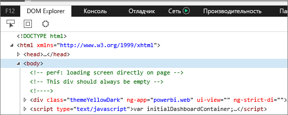
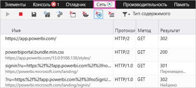
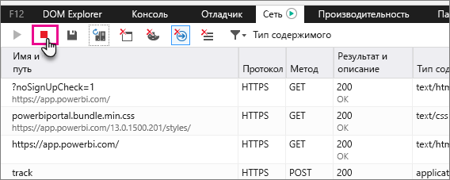

# Запись дополнительных диагностических сведений
## Запись дополнительных диагностических сведений для Power BI
Эти инструкции предоставляют два возможных варианта ручного сбора дополнительных диагностических сведений из веб-клиента Power BI.  Необходимо следовать только одному из этих вариантов.

## Сбор по сети — Microsoft Edge и Internet Explorer
1. Откройте [Power BI](https://app.powerbi.com) в браузере Microsoft Edge или Internet Explorer.
2. Запустите средства разработчика Microsoft Edge, нажав клавишу F12.
3. Откроется окно средств разработчика: 
   
   
4. Откройте вкладку "Сеть". Здесь указан уже зафиксированный трафик. 
   
   
5. Вы можете перемещаться по этому окну и пытаться воспроизвести возникшие у вас проблемы. Чтобы скрыть или восстановить окно средств разработчика в любой момент во время работы, нажмите клавишу F12.
6. Чтобы остановить сбор данных, нажмите на значок красного квадрата на вкладке "Сеть" в области средств разработчика.
   
   
7. Выберите значок дискеты, чтобы **экспортировать данные в формате HAR**.
   
   
8. Укажите имя HAR-файла и сохраните его.
   
    HAR-файл будет содержать все сведения о сетевых запросах между окном браузера и Power BI.  Эти сведения будут включать идентификаторы действий для каждого запроса, точные метки времени для каждого запроса, а также сведения об ошибках, возвращенных клиенту.  Эта трассировка также будет содержать данные, используемые для заполнения визуальных элементов, отображаемых на экране.
9. HAR-файл можно передать на анализ службе поддержки.

Появились дополнительные вопросы? [Попробуйте задать вопрос в сообществе Power BI.](http://community.powerbi.com/)

